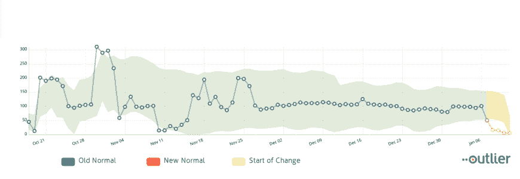

# 数据如何在危机中帮助决策

> 原文：<https://towardsdatascience.com/how-data-can-help-decision-making-during-a-crisis-b07c62878c2b?source=collection_archive---------71----------------------->

## 将数据作为对抗冠状病毒经济的强大武器

*照片由* [*克里斯阿蒙*](https://unsplash.com/@krysamon?utm_source=unsplash&utm_medium=referral&utm_content=creditCopyText) *上* [*下*](https://unsplash.com/s/photos/samurai?utm_source=unsplash&utm_medium=referral&utm_content=creditCopyText)

当事情按预期进行时，很容易思考业务，因为你有时间思考正在发生的一切及其原因。在危机中，所有这些都会改变。事情开始发生在你身上，而不是等着你采取行动，而且发生的速度比你能够处理的还要快。这很快淹没了你的标准操作程序，使它更难操作。

目前由冠状病毒引起的全球局势是一场以各种方式打击所有国家所有企业的危机。在几周的时间里，这种病毒以及遏制它的必要措施已经改变了消费者购买、资本投资，并直接制约了整个行业。

在危机中，你必须开始以不同的方式工作。不幸的是，危机的高度压力使得人们很难清晰地思考并做出理性的决定，这也是许多公司开始犯错的原因。使用数据对于保持专注和理性思考至关重要，但危机的本质使数据更难使用，因为一切都在变化。所有关于你的企业的历史数据可能根本无助于预测危机将如何展开！就在你需要更多数据的时候，它变得更难使用。

即便如此，也有可能将数据作为强大的武器，不仅可以度过危机，还可以将其转化为机遇。在本文中，我将介绍实现这一点的各种方法和途径，您可以立即使用它们来收回控制权。

具体来说:

1.  如何快速甄别哪些是你可以信任的
2.  确定复苏的早期指标
3.  发现新机会的萌芽

# 你信任谁？

根据定义，数据是过去的记录。当你处于危机之中时，过去可能不是现在的可靠指标。通常在危机期间，指标的性质变化如此之大，以至于与早期数据几乎没有相似之处。不仅数据的数量有很大不同，在危机期间，数据的波动性也要大得多。

你的许多(如果不是全部)指标将遵循类似的路径，这意味着你不能再相信你在危机开始前的所有假设。你可能在危机前建立的预测、预期和模型需要扔掉，因为它们不再适用。

不信任任何东西就不可能做决定，所以你要做的第一件事就是确定你能信任什么。

这是危机管理中最难的部分，因为没有办法知道变化的程度，但这里有一些地方可以开始寻找立足点:

**1。什么没有变？**

很可能你的业务的某些部分没有改变，如果你能识别它们，它们是一个很好的起点。

*   即使你的客户越来越少，一些客户群是否保持一致？
*   即使你的流量少了，转化率也一样吗？
*   即使你的伴侣在挣扎，他们中的任何一个人还在做出贡献吗？

这些没有改变的东西是你事业的基础，也是你可以建立复苏的基础。除此之外，这些才是未来增长的核心引擎。

**2。什么还在工作？**

即使业务的一部分发生了变化，它仍然可能在工作(尽管没有以前那么好)。识别这些工作片段很重要，因为它们可以强烈地表明机会可能隐藏在哪里。例如，如果整体交易量下降，确定哪些客户群仍在购买，哪些已经完全停止购买。下降很少是一致的，因此将完全不起作用的和仍然起作用的分离开来是一个重要的开始。

**3。测试，测试，测试**

因为所有的规则都变了，你不能依赖你的旧剧本。在相信你的年度促销会在危机中取得成功之前，先进行一次规模较小但类似的促销，并衡量结果。人们可能会有不同的反应，提前了解将避免在由于危机的动态而从一开始就不会成功的计划上浪费时间和精力。你测试得越多，你就越知道该相信什么，你就能依赖更多的构件。

这些立足点只是构建块，但是它们是可靠的块，您的恢复策略可以使用它们立即开始。你不想等到一切都解决了再建立新的战略，而建立在假设和猜测上的战略是危险的。这些块是您可以用来开始恢复的可靠部分。

# 早期指标

没有什么危机会永远持续下去，最先发现复苏迹象的公司最有可能利用由此带来的市场增长。你越早投入资本并做好准备，你就越有可能在复苏的浪潮中成为行业的领导者。

然而，过早投资于复苏的成本很高，因为危机会给你的财务状况带来全面的巨大压力。如果你过早投资，你可能会在复苏实现之前耗尽资本。如果复苏的时间比你预期的要长，你可能还没来得及利用你早期的行动就耗尽了资本。

那么，你如何确定复苏可能何时开始？

最重要的是确定早期指标。有许多类型的早期指标和寻找它们的地方，下面是一些例子:

*   **客户行为指标。**客户引领任何市场，因此观察客户行为变化的迹象是市场变化的最强有力的早期指标。顾客购买之旅的最后一部分是购买，所以不要依赖购买，因为它们是这些变化的跟踪指标。广告转化的转变、活动的增加和客户支持请求的激增都表明客户行为开始转变。如果可能的话，观察所有的客户群，因为你永远不知道哪一个会给你你需要的早期提示。
*   **市场指标。**虽然单个客户群和产品购买可能过于嘈杂，无法辨别迹象，但整体市场表现可以将这些较小的信号融合成较大的信号。问题是，小的变化需要累积成大的变化来移动市场指标，这意味着当市场指标改变时，指示可能会滞后。即便如此，在整体市场表现中寻找哪怕是微小的变化，也可能是一个重要的提示，让我们更深入地寻找隐藏在表面之下的其他指标。
*   **竞争指标。**观察你的竞争对手可能是变化的最重要的早期指标之一。例如，如果你的竞争对手正在大规模裁员，他们可能正在挣扎，他们的客户对你来说是脆弱的。更有可能的是，如果你看到你的竞争对手通过特定的促销活动来追求特定的客户群，他们很可能已经发现了你也可以利用的机会。学习别人的发现并没有什么坏处，如果你看到许多竞争对手都在追求同样的策略，这可能是一个强烈的信号。然而，要小心跟随人群，因为他们可能会作为一个群体撞到墙上，所以要确保你确信他们的行为背后有原因。

即使是最好的早期指标也会误导你，很容易将这些信号误认为是危机中正常波动的复苏。为了避免让你对复苏的渴望影响你的决定，在查看数据之前设定一个标准是很重要的。你的早期指标必须显示什么才能让你相信复苏正在进行？需要看到什么样的门槛或者趋势？一定要写下这些标准，并经常参考它们，因为即使情绪高涨，它也会提供重要的客观性。

如果你勤奋并以数据为导向，你可以通过比其他公司更早、更有效地利用复苏浪潮，将危机转化为竞争优势。

# 绿芽

森林火灾具有巨大的破坏力，但即使是最严重的森林火灾，紧接着也会有新芽形式的植物生长。这些新的生长物是未来森林和灾后重建的希望。

商业也是如此，每次灾难都会带来未来发展的新机遇。在冠状病毒危机中，受打击最大的行业之一是邮轮业，受到旅行限制和对船上感染的担忧的打击。然而，即使在如此严重的危机中，邮轮业仍有复苏的迹象。世界上最大的邮轮公司之一，在危机的早期，他们发现有一些客户群仍然在购买，事实上，根据他们的促销活动，他们购买了更多的邮轮船票。

由于危机期间市场变化剧烈，这些萌芽可能会出现在意想不到的地方。几乎不可能知道它们可能会在哪里出现，所以你能做的最重要的事情是准备好寻找它们，并迅速找到它们，这样你就能帮助它们成长为主要的业务驱动力。

你如何发现绿芽？以下是一些方法:

1.  调查你所有的数据。既然绿芽会出现在意想不到的地方，你就不能靠直觉知道去哪里找。调查你的全部数据是至关重要的，因为你撒的网越大，你就越有可能抓住它们。例如，客户增长的一些最好的萌芽可能来自客户支持请求，因为任何参与帮助您的产品的人仍然在参与。这可以告诉你应该瞄准什么类型的新客户。找到一种自动快速洞察客户数据的方法。在这种新常态下，您的资源必须集中于为您的业务带来最佳结果。
2.  **换个角度思考。**在危机中，你可以做出的最重要的心理转变之一就是将问题视为机遇。如果你开始以不同的方式运作，现在正在损害你的业务的一些东西可能是一个机会。例如，如果客户不购买您的产品，但现有客户仍在升级他们的帐户，您可能希望开始提供产品的免费版本，并依靠升级来获得新的收入。
3.  **与你的顾客交谈。**定量数据很重要，但来自客户的定性反馈可以揭示表面上不明显的东西。例如，如果一些客户在危机期间仍然购买你的产品，他们可能会以一种全新的、意想不到的方式使用产品，这对你来说可能是一个新的市场机会。要获得这种反馈，你需要做的不仅仅是提供调查和礼品卡，你需要将顾客讨论融入你的购买体验。虽然摩擦在某些情况下会降低销售额，但你收集的新信息将在未来带来巨大的回报。

绿芽最大的好处是它们是未来竞争优势的燃料。如果你在竞争之前发现了新芽，你就可以在市场复苏中领先一步，并在他们仍在努力让他们的旧业务方法发挥作用时，为未来打造增长引擎。虽然这通常是个好建议，但在危机期间，它会变成一个秘密武器。

# 结论

危机是艰难的时刻，你的第一反应可能是放弃数据，依靠直觉做出重要决定。然而，这种策略类似于在黑暗中穿过一片森林，因为你遇到什么只是时间问题！你需要在危机管理和决策中利用数据，从确定哪些数据可以信任开始，一直到发现复苏的早期迹象。

危机管理并不容易，但每一次危机都有复苏，只要你专注于逻辑的、数据驱动的方法，你不仅能度过危机。你可以茁壮成长。