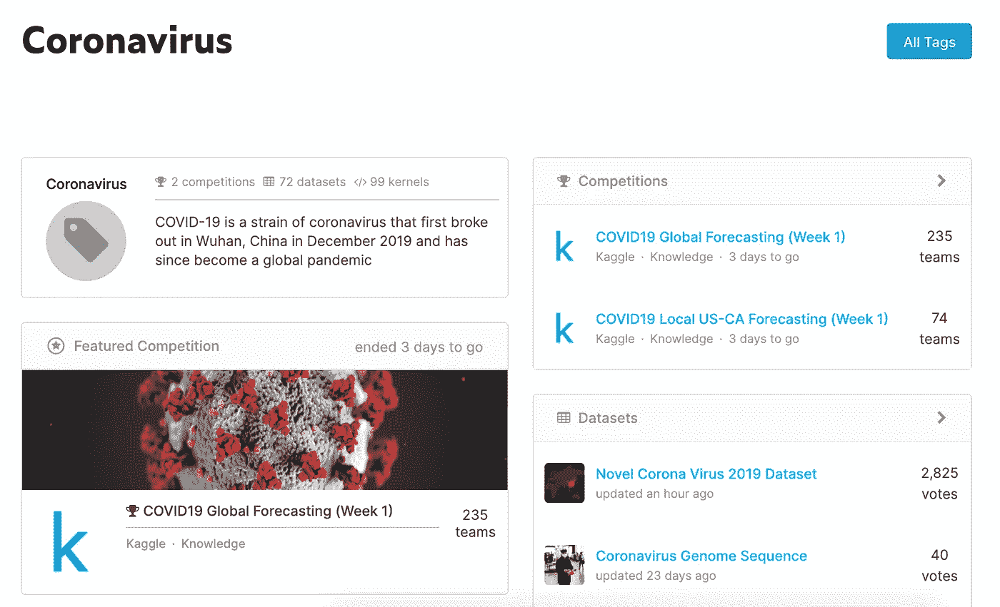
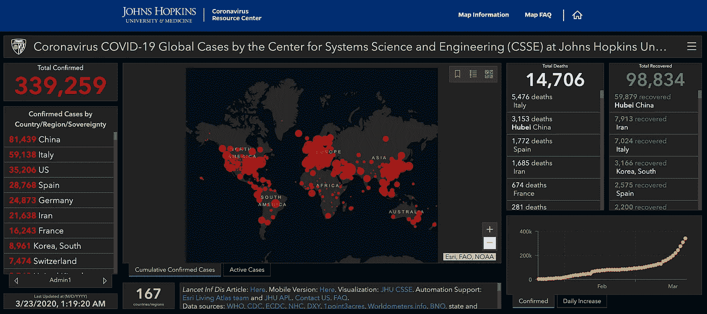

# 数据是如何与新冠肺炎交织在一起的！

> 原文：<https://towardsdatascience.com/how-data-intertwines-with-covid-19-add8415b206e?source=collection_archive---------42----------------------->

## 数据、仪表板和下一步行动

[疾控中心](https://unsplash.com/@cdc?utm_source=medium&utm_medium=referral)在 [Unsplash](https://unsplash.com?utm_source=medium&utm_medium=referral) 拍摄的照片

乍一想，有人能够预测到这样的疫情或者今天的数据如何在未来使用，这似乎很荒谬，但大多数人没有意识到的是，虽然**新冠肺炎是新的，但冠状病毒本身并不是新的**(它以前发生过，也可能再次发生)。冠状病毒很久以前就被发现了，我们今天所听到的新冠肺炎病毒只是它的另一种变体(通俗地说)。

本文基于对截至 2020 年 3 月 23 日的可用数据的推断。我将列出一些数据源和仪表板。此外，我将对这些信息以及您或任何人可以做些什么来进一步探索和利用这些数据进行评论。

# 冠状病毒爆发

迪米特里·卡拉斯泰列夫在 [Unsplash](https://unsplash.com?utm_source=medium&utm_medium=referral) 上的照片

也就是说，自 2000 年以来，发生了三次不同的疫情。第一次爆发是在 2002 年，来自 17 个国家的 8000 多个病例。下一次爆发是 2012 年的*中东呼吸综合征*，21 个国家超过 2500 例。最近爆发的显然是*新冠肺炎(新型冠状病毒)*这是一种最危险和传播最广的冠状病毒。每天我们都在见证新的病例，世界卫生组织已经宣布它为疫情。

最近 Tedx Talks 在他们的 Youtube 频道上发布了一个让我大开眼界的关于冠状病毒的演讲，名为“冠状病毒是未来”，作者是岚娜·谢赫[2]。老实说，虽然标题看起来令人担忧，但内容描述了冠状病毒是多么新鲜。

# 当前情景

谷歌搜索页面统计(2020 年 3 月 23 日凌晨 1:52)

每天，我们都在目睹全球范围内报告的电晕病例数量激增。在谷歌上简单地搜索“冠状病毒”就会发现一系列新的文章、信息来源以及统计数据。如果你环顾四周或者只是查看一下你的电子邮件，你会发现不同的公司都在展示他们是如何解决疫情问题的，同时还能确保为客户提供不间断的服务。这真的很感谢一些公司和组织，他们正在教育、传播信息以及促进更健康的生活方式，以遏制这种将我们锁在房子里的疫情。

看一下世界卫生组织(世卫组织)[3]的最新报告，显示**中国已经有了明显的复苏**，而**义大利和美国(尤其是纽约州)的病例数仍在上升**。这并不意味着确诊病例的数量会突然增加(很有可能是这样)，但也可能表明这样一个事实，与以前相比，现在有更多的人接受检测，因此导致了突然增加。

# 数据

Kaggle 上的冠状病毒标签

现在有几个可用的数据来源，但我发现一些可靠的来源包括:

1.  **世界卫生组织:**世卫组织正在以 PDF 报告的形式为全球所有国家提供每日情况报告，其中包括确诊病例总数、自前一天以来新发现的确诊病例以及其他相关信息[3]。
2.  Kaggle 上有比赛和数据集，因此数据科学家和机器学习实践者可以使用他们的知识和技能来得出有意义的见解[4]。
3.  **Google Datasets:**Google Datasets 托管着互联网上各种数据源的链接，可以根据需要使用[5],但要警惕你使用的数据集的质量。

这很好，但我们以前已经见过冠状病毒。如果我们能够获得这些数据，这将为我们了解新冠肺炎病毒和其他类似病毒提供一个很好的起点。最好的起点是**世界卫生组织，它根据定期生成的报告托管 SARS** 的数据。但是，这些数据是以 HTML 页面的形式提供的，如果需要的话，必须使用抓取来检索。

# 新冠肺炎仪表板

新冠肺炎仪表板

今天，分析全球冠状病毒现状的最简单方法是找到一个你看起来正确的仪表板，并坚持下去。*个人、组织和公司已经开发了仪表板*来反映病毒的当前状态，以便于监控和信息传播。我遇到的一些仪表板是:

1.  **约翰·霍普斯金:**仪表板在一个仪表板中包含所有国家的数据。它包括一张世界地图，地图上用圆点描述了病例数，地图周围是新冠肺炎的统计信息[7]。
2.  **1Point3Acres:** 该仪表板包含美国和加拿大的 COVID 病例数，包括州和县级别的病例分布[8]。
3.  **Tableau:** 如果你熟悉 Tableau 的特性，可以查看他们开发的交互式仪表盘【9】。
4.  基于 R Shiny 的仪表板:一个开源仪表板，由 Christoph schnenberger[10]利用 R Shiny 的强大功能开发。

在观察了几个仪表盘之后，我了解到向用户描述信息有很多方式。你可以选择特定的国家进行深入研究，或者选择整个世界作为你的画布。在医疗保健信息的情况下，选择高质量的数据源变得很重要。柱状图、地理图、表格、线图等。所有这些都可以根据您想要显示信息的方式来使用。此外，由于拥有如此广泛的用户基础，还必须考虑此类仪表板的可访问性，以便每个人都可以访问和使用它们。

# 下一步:去探索

由 [KOBU 机构](https://unsplash.com/@kobuagency?utm_source=medium&utm_medium=referral)在 [Unsplash](https://unsplash.com?utm_source=medium&utm_medium=referral) 上拍摄的照片

虽然我们身边到处都是新冠肺炎 spread 仪表盘，而且制作非常精细，但我们的目标是更进一步。正如你所想象的，新冠肺炎在很多方面影响着我们的生活。客流量是否明显减少？这是否减少了污染物的排放？贸易是否已经完全停止，还是基本交易仍在进行？像 Amazon prime 这样的服务正在经历一次提升吗？还有更多…

看看你的生活，看看你想发现什么。我过去经常去健身房保持活跃，但现在它关闭了，我不能经常出去，我不得不在房子里工作。我不得不订购一些运动器材，我的朋友也是如此。这让我想到了一个问题:健身器材的需求是否增加了？人们买的只是一根跳绳还是一整架重物？供应商是否能够满足日益增长的需求？这些问题的答案可能并不直截了当，需要一些挖掘，但这将是我个人感兴趣的事情，也可能引起其他人的兴趣。

## 参考

[1][https://www . lab manager . com/lab-health-and-safety/新冠肺炎冠状病毒史-22021](https://www.labmanager.com/lab-health-and-safety/covid-19-a-history-of-coronavirus-22021)

[2][https://www.youtube.com/watch?v=Fqw-9yMV0sI&t = 4s](https://www.youtube.com/watch?v=Fqw-9yMV0sI&t=4s)

[3][https://www . who . int/emergencies/diseases/novel-coronavirus-2019/situation-reports](https://www.who.int/emergencies/diseases/novel-coronavirus-2019/situation-reports)

[4]https://www.kaggle.com/tags/covid19

[https://datasetsearch.research.google.com/search?[5]query =冠状病毒&docid = 4 ub 5 VJ 0 wgmyfkgr 5 aaaaaa % 3D % 3D](https://datasetsearch.research.google.com/search?query=coronavirus&docid=4uB5vj0WgMyfkgr5AAAAAA%3D%3D)

[https://www.who.int/csr/sars/country/en/](https://www.who.int/csr/sars/country/en/)

[https://coronavirus.jhu.edu/map.html](https://coronavirus.jhu.edu/map.html)

[https://coronavirus.1point3acres.com/en](https://coronavirus.1point3acres.com/en)

[9][https://public . tableau . com/profile/covid . 19 . data . resource . hub #！/viz home/COVID-19 cases _ 15840488375320/COVID-19 cases](https://public.tableau.com/profile/covid.19.data.resource.hub#!/vizhome/COVID-19Cases_15840488375320/COVID-19Cases)

[https://chschoenenberger.shinyapps.io/covid19_dashboard/](https://chschoenenberger.shinyapps.io/covid19_dashboard/)

请在下面的评论中分享你的想法、观点和建议。如果你喜欢你读到的东西，可以考虑在 Medium 上关注我，在 LinkedIn 上联系我:[https://www.linkedin.com/in/bhanotkaran22/](https://www.linkedin.com/in/bhanotkaran22/)。