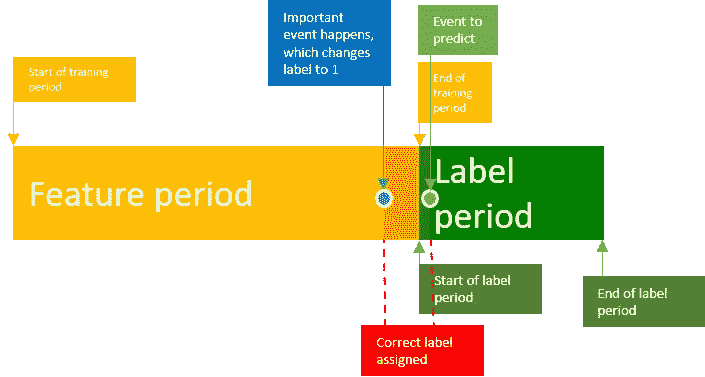

# 数据泄露如何在实践中影响机器学习模型

> 原文：<https://towardsdatascience.com/how-data-leakage-affects-machine-learning-models-in-practice-f448be6080d0?source=collection_archive---------27----------------------->

## 为什么机器学习模型在生产中经常失败

实践中的数据泄漏是机器学习中被广泛低估的影响，尤其是在涉及大量特征工程的情况下。数据泄露甚至发生在 [Kaggle](https://www.kaggle.com/c/santander-value-prediction-challenge/overview) 比赛中，获胜者利用了数据中的这些系统缺陷。这篇文章是关于为什么发现数据泄漏如此困难，以及为什么从不同的角度深入理解这些特性对于克服数据泄漏非常重要。

# 数据泄露，什么？

数据泄露这个术语在机器学习中并不像它应该的那样突出。许多人大致知道这个概念，但不知道这个术语，有时数据泄漏也称为目标泄漏，标签只是泄漏到训练数据中。然而，数据泄漏不仅仅意味着在训练和测试数据集之间存在一对一的“泄漏”。它通常更复杂，尤其是在机器学习模型中，其中涉及到时态数据。一般来说，数据泄露与相关性和因果性有关。

# 简单的

数据泄漏的直接例子是数据集，其中训练数据仅包含与标签高度相关但没有因果关系的特征。例如，您的标签是员工的年薪，而您有一个包含月薪的要素，在这种情况下，年薪只是月薪的函数。另一个例子是，每一行被分配到一个组(例如，用户)，这从测试集中泄漏了标签，其中存在相同的组(例如，用户)。然而，这些例子通常很容易通过标签重要性和相关性分析发现。

# 复制

更难发现的是数据集中的重复样本。考虑一个数据集，其中有 20%是重复的。当您将数据分为训练和测试时，您已经有了 20%的准确性优势，这仅仅是因为重复。你的分类器可以简单地记住这些例子。

在数据中找出重复项并不像你想象的那么简单。实际上，它们可能不是 100%匹配。例如，您有一个重复的点击事件，其中包括一个时间略有不同的时间戳。然而，重复通常是数据采集管道中的一个缺陷，可以在那里消除。

# 时间依赖性

如果您的数据包含与时间相关的数据，就会出现最危险的数据泄漏问题。IMHO 这是最被低估的数据泄露问题，也是很多机器学习项目在实践中失败的原因，尽管它们以前看起来很棒。

# 实践中的数据泄漏—一个例子

您从 SQL 表创建了一个快照，其中强大的 SQL 语句从您的网站收集了所有要素和标签来预测信用标签。您的数据包含依赖于时间的事件的集合，假设其中一个特性是向客户发送了多少个付款提醒。

你训练你的 ml 模型和工程特征；分数看起来很高，你向你的老板报告了成功。该模型投入使用，因为你在一家数据驱动的公司工作，在那里你实际衡量事情的表现，你会收到一封电子邮件，称在一些测试后，你被告知你的模型根本没有提高信用评分。发生了什么事？

# 动态数据

你刚刚错过了一个非常重要的数据事实。从数据库中获取数据时，快照是好的，但它不代表进行预测时的数据。您的推断数据与训练数据不匹配。

在这个例子中，支付提醒的数量在预测时间大约为零，并且随着时间的推移而增加。当用户不付费，但游戏已经输了的时候，标签就会改变，在标签改变之前，就已经做出了关于风险的决定。你只是建立了一个 ml 模型，预测已经决定的事情，一个自我实现的预言。

这里的问题是，您无法通过查看数据集本身来发现问题。在非玩具数据集中，你没有完美的干净数据，你可以通过相关性找到这样的问题。您必须确切知道数据集要素的创建位置和时间。为了避免聚合时态数据的这种缺陷，您可以使用与时间序列预测相同的技术，使用滚动窗口方法。不要包含任何在预测时不可用的数据。

顺便说一下，这就是为什么数据科学家应该知道管道是如何建立的，以及数据详细来自哪里。CSV 文件永远不会成为任何 ML 项目的起点，其目的是在实践中进行预测分析。

## 时间数列预测法

在时间序列预测中，也有很多例子，作者只是应用了训练测试分割或交叉验证，并以很高的准确度预测了股票市场(至少在他们的漏洞设置中)，声称他们是一台内置的提款机。

问题是人们倾向于像对待非时间序列数据集一样分割数据集。显然，这是你应该避免的事情，因为你有效地通过未来预测过去，通过未来预测未来，这非常有效。:)在时间序列预测中，使用滑动窗口非常重要，这里提到的[方法是](https://machinelearningmastery.com/backtest-machine-learning-models-time-series-forecasting/)。但是还有更多事情要考虑。

## 预测事件时预测的有用性

在[我关于基于点击的意向预测的帖子](http://digital-thinking.de/deep-learning-clickstream-based-user-intent-prediction-with-anns/)中，我展示了如何基于点击事件预测客户行为，还提到如果不加以考虑，数据泄露可能是一个巨大的问题。如果我们想更深入地了解会发生什么，这里有一个使用滑动窗口的示例数据点的可视化。

您可以看到一个时间段用于收集用作特征的事件，一个时间段用于查看我们的事件以进行预测，这两个时间段是严格分开的。

它可能发生，有一个重要的事件，发生在标签期开始之前。在这种情况下，我们只有一个非常有限的时间窗口，其中标签被正确分配，但我们的预测将被认为是正确的这个样本。为了克服这个问题，重要的是在每一个时间步长上滑动窗口，并为所有样本训练分类器。

这是首次发表在我的博客[这里](http://digital-thinking.de/how-data-leakage-affects-machine-learning-models-in-practice/)。

阅读更多关于数据泄漏的实践:

【https://www.datarobot.com/wiki/target-leakage/ 

[https://www.kaggle.com/dansbecker/data-leakage](https://www.kaggle.com/dansbecker/data-leakage)

 [## 避免机器学习中的数据泄漏

### 为了正确评估机器学习模型，必须将可用数据分成训练和测试子集。数据…

conlanscientific.com](https://conlanscientific.com/posts/category/blog/post/avoiding-data-leakage-machine-learning/) 

[https://mlinproduction.com/data-leakage/](https://mlinproduction.com/data-leakage/)