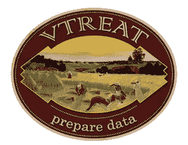

# 数据准备包如何给 ML 建模带来风险

> 原文：<https://towardsdatascience.com/how-data-prep-packages-can-introduce-risk-to-your-ml-modeling-66024b39bba7?source=collection_archive---------38----------------------->

## “vtreat”案例研究，一个自动化变量处理包(Python)


Stephanie Harvey 在 [Unsplash](https://unsplash.com?utm_source=medium&utm_medium=referral) 上拍摄的照片

真实世界的数据通常是“脏的”或“乱的”构建机器学习(ML)模型的数据科学家会经常遇到数据质量问题，例如“坏”数值(例如`None`、`NaN`或`NA`)、缺失值和高基数分类特征(例如邮政编码)。

任何拥有如此肮脏和混乱的数据集的数据科学家，想要利用他们的 ML 包(如`scikit-learn`或`xgboost`)来构建最具性能的模型，都必须繁琐地清理数据集并估算缺失值，以获得这些强大包所需的理想格式。

幸运的是，有方便的数据准备(也称为数据准备)包来自动化和简化数据清理和数据质量处理。这些包为数据科学工作流的平滑 UX 提供了很好的 API。然而，尽管某些包似乎为数据准备问题提供了很好的“一行程序”解决方案，但正如俗话所说，天下没有免费的午餐。在数据准备的某些边缘情况下，实际上，您可能会给模型带来新的风险，例如过度拟合或目标泄漏(也称为数据泄漏)。

以下是 Win Vector LLC 的 John Mount 博士和 Nina Zumel 博士创建的一个名为`vtreat` [1]的数据准备包的简要案例研究。`vtreat`除了有研究出版物[3]之外，还有 R 和 Python 版本。本文将关注 Python 包[4]。



[*v creat*logo](https://raw.githubusercontent.com/WinVector/vtreat/master/tools/vtreat.png)by[Win Vector LLC](https://win-vector.com/)

# vtreat 是做什么的，我应该如何使用它？

正如作者所描述的，`vtreat`是一个“数据框架处理器/调节器，它以统计上合理的方式为预测建模准备真实世界的数据。”`vtreat`的高层次目标是“忠实可靠地将数据转换成完全是数字的、没有丢失值的现成 ML 数据帧。”`vtreat`包含的具体数据质量处理方法有:

*   修复错误/丢失的数值
*   将分类级别编码为指标
*   管理高基数分类变量(也称为“影响编码”)

“影响编码”的最后一种方法(Kagglers 可能称之为“目标编码”)可能特别有用，因为它将具有许多级别的分类变量转换为信息性的数字特征。简而言之，它是通过首先获得所有行的目标变量的全局平均值(因此称为“目标编码”)来计算的，然后根据该全局平均值检查给定分类变量的目标值，从而得到分类变量的“数字影响值”。这保留了来自原始变量的大量预测信息，同时计算效率高。因此，让我们来看看如何**正确地**使用“影响编码”。

熟悉相关 ML 包中的`.fit()`和`.transform()`方法的数据科学家可以通过以下方式使用`vtreat`创建准备好的数据帧，然后用于建模:

```
import vtreat
transform = vtreat.BinomialOutcomeTreatment(outcome_target=’y’)
df_prepared = transform.fit(df_train, df[‘y’]).transform(df_train)
```

小心点。这是`vtreat`的**幼稚**用法，因为影响编码需要***知道结果是什么*** 才能生成“影响值”。拟合到该准备好的数据框架的结果模型可能导致**不期望的模型偏差**，基本上模型过度拟合到影响编码变量。

为了避免这一点，正如`vtreat`的作者在他们的文档中仔细描述的那样，留出完整数据集的一个分区(即维持/校准集)用于影响编码非常重要，然后在训练分区上运行“校准的影响编码器”以准备数据，接着将模型拟合到最终准备的数据帧。下图说明了如何正确使用带有维持/校准设置的`vtreat`:

```
import vtreat
transform = vtreat.BinomialOutcomeTreatment(outcome_target='y')
df_prepared = transform.fit(df_train_holdout, df['y']) \
                       .transform(df_train_model)
```

此外，作者通过利用他们称为“交叉框架”[5](即交叉验证的训练框架)的新技术，确保使用正确的交叉验证方法。最后，作者推荐使用`vtreat`为 ML 建模准备数据时，使用内置护栏方法`.fit_transform()`的调用模式如下:

```
import vtreat
transform = vtreat.BinomialOutcomeTreatment(outcome_target='y')
df_prepared = transform.fit_transform(df, df['y'])
```

产生的数据帧完全是数字的，同时尽可能多地保留来自训练变量的相关建模信息。这使得数据科学家可以使用任何现成的 ML 包，并快速构建可能比仅使用原始数据集更精确的模型。

# 你信任你的数据准备吗？

毕竟，`vtreat`通过自动准备用于建模的结构化纯数字数据框架，帮助数据科学家节省了大量时间和精力。让我们在一个示例数据集上对此进行测试，其中要预测的目标变量是制造商机器的销售价格。

已经精选的信息特征的原始数据集有 57 列。在通过`vtreat`运行数据集并指定`NumericOutcomeTreatment()` 方法之后，准备好的 dataframe 最终拥有超过 **230** 列。我构建了两个 AutoML 项目，一个使用原始数据集，另一个使用`vtreat` -prepped 数据集；前者导致 R2 拒绝得分约为 0.91，而后者导致 R2 拒绝得分约为 0.86。也就是说，对于这个特定的示例数据集，**准备的数据集给出了较差的模型拟合分数。**

> 鸣谢:使用的 AutoML 工具是 DataRobot 平台，它带有内置的预处理和特征工程。

准备好的数据集以更差的模型拟合分数结束的一些原因可能是由于对影响编码变量的一些可能的过度拟合(尽管使用了内置的`.fit_transform()`方法)、从现有泄漏中新引入的目标泄漏或冗余生成的特征。

总之，作者和我都强烈建议数据科学家们不要轻易动手，不仅要调查底层的原始数据，还要调查来自数据准备包的准备好的数据。您必须始终注意数据的上下文，包括数据来源和预测数据的应用方式，尤其是在模型将用于现实世界的情况下。

# 参考

1.  [https://github.com/WinVector/vtreat](https://github.com/WinVector/vtreat)
2.  [https://win-vector.com/](https://win-vector.com/)
3.  新泽西州祖梅尔和新泽西州芒特(2016 年)。vtreat:用于预测建模的数据帧处理器。 *arXiv:应用*。([https://arxiv.org/abs/1611.09477](https://arxiv.org/abs/1611.09477))
4.  [https://pypi.org/project/vtreat/](https://pypi.org/project/vtreat/)
5.  [https://cran . r-project . org/web/packages/vtreat/vignettes/vtreat crossframes . html](https://cran.r-project.org/web/packages/vtreat/vignettes/vtreatCrossFrames.html)