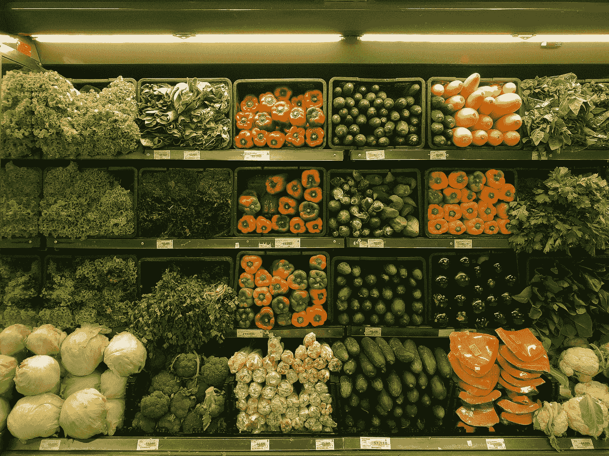
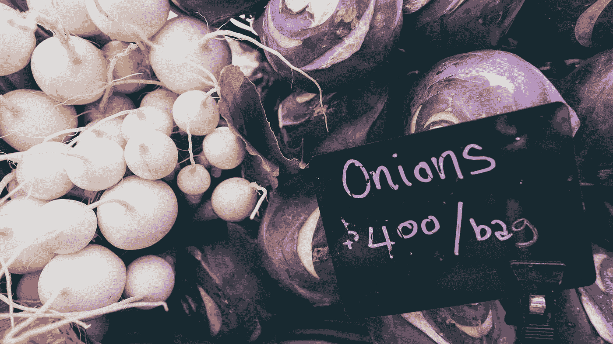
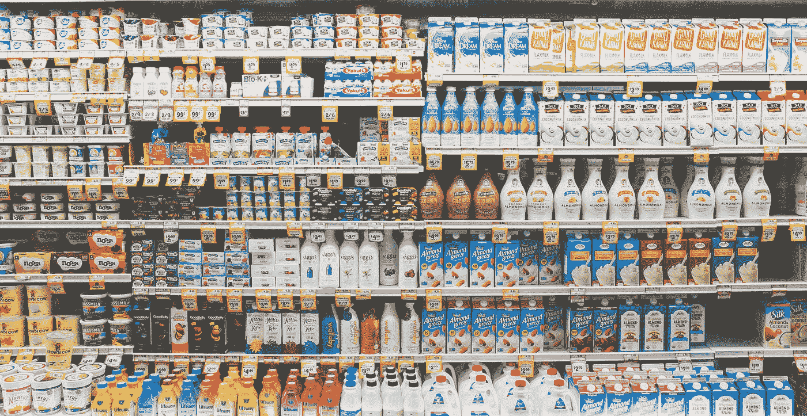
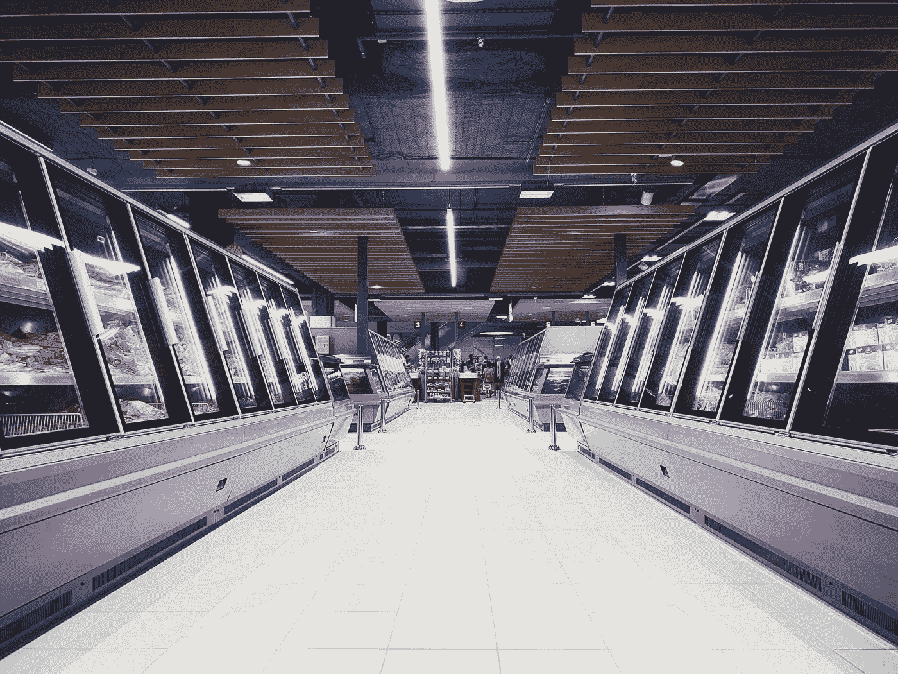

# 数据科学和人工智能如何改变超市购物

> 原文：<https://towardsdatascience.com/how-data-science-and-ai-are-changing-supermarket-shopping-e47f63f4b53f?source=collection_archive---------22----------------------->

## 大零售+大数据

超市是大企业，他们大规模使用数据。超市起源于 20 世纪 30 年代的美国，后来逐渐占据了零售和杂货市场越来越大的份额。像沃尔玛、阿尔迪和家乐福这样的巨头是世界上最大的零售商，收入接近数千亿美元。因此，许多人在大数据上投入了大量资金，分析和数据科学成为他们决策的核心部分。

照片由 [nrd](https://unsplash.com/@nicotitto?utm_source=medium&utm_medium=referral) 在 [Unsplash](https://unsplash.com?utm_source=medium&utm_medium=referral) 上拍摄

购买的每件产品及其价格都被记录在庞大的数据库中，其中的表格超过了数千亿行。忠诚度计划允许公司将客户的整个交易历史缝合在一起，获得比孤立地查看购物篮更多的洞察力。在忠诚度计划中，客户通过每次购买扫描他们的会员卡来积累积分。这些数据的丰富性为整个组织提供了多方面的价值，下面将介绍几个例子。

## 排列

超市货架是抢手货。每个通道的每一平方英寸每年都可能价值数千美元，超市竭尽全力确保不会浪费在性能不佳的产品上。但是“表现良好”并不像挑选销量最高或利润最高的产品那样简单。如果是的话，整个商店就只有牛奶和香蕉了。你必须迎合所有来到你店里的不同顾客，以及驱使他们进门的不同餐点和“任务”。

例如，一种特定的调味品可能不是超级畅销品，但如果它对老年人群很重要，那么把它从货架上撤下来可能会迫使他们去别处购物。另外，想象一下有人打算今晚做墨西哥卷饼。如果他们能买到你店里的大部分原料，但你不卖玉米饼，他们可能会把所有的潜在收入留给竞争对手。

照片由[彼得·邦德](https://unsplash.com/@pvsbond?utm_source=medium&utm_medium=referral)在 [Unsplash](https://unsplash.com?utm_source=medium&utm_medium=referral) 上拍摄

与此同时，多样化的产品系列需要花钱。除了上述货架不动产，还有管理大量不同产品的复杂物流。你必须能够将产品从供应商处运送到配送中心，再到超市，再到过道，“及时”到达，这样货架上的可用库存既不会溢出，也不会用完。更多的产品意味着需要管理更多的供应线，而作为缓冲的库存更少。每个产品系列也增加了超市和供应商之间昂贵的合同谈判的工作量，比如价格、促销、供应水平和广告支出。

如果你去过像 Aldi 这样的廉价超市，你会注意到他们通常对每种产品类型的选择较少，但在商店里保持较高的库存水平。这恰恰是为了削减上述成本，在降低质量之前，以牺牲选择为代价降低价格。

这一切构成了一个非常复杂的优化问题，数据科学在其中扮演着关键角色。我们会定期根据一些标准对产品进行评估，例如销售额、盈利能力、购买产品的客户数量以及这些客户在产品不促销时对产品的忠诚度。根据产品系列变化的过去示例训练的机器学习模型可用于预测客户未来将如何对提议的变化做出反应。通过考虑商店特征，如规模、当地人口统计数据和与竞争对手的接近程度，可以逐个商店地优化产品系列。

例如，想象一罐不起眼的金枪鱼罐头。它和许多其他金枪鱼罐头一起放在架子上，有不同的味道、品牌、价位和包装尺寸。如果你把它从商店里拿走，大多数寻找它的人可能会简单地转向另一种罐装金枪鱼产品。一小部分人可能会推迟购买或去别处购买。对于拥有高度忠诚客户群的产品，比如罐装可口可乐，这种情况会有所不同。

所有这些数据分析和建模有助于商场品类经理定期评估其产品系列的有效性，优化效率，同时努力让顾客满意。

## 定价

价格弹性是对产品需求相对于价格变化的一种度量。简单地说，东西越便宜，人们就会越想买它[(有些例外)](https://en.wikipedia.org/wiki/Veblen_good)。给产品定价好意味着通过平衡每包产品的利润和售出的数量，找到弹性曲线上能带来最大利润的点。

当你在等式中引入竞争产品时，事情变得有点复杂。如果你降低可口可乐的价格，它的销量会上升，但也会对百事可乐的销量产生负面影响。这引入了交叉价格弹性的概念，它在一个价格“景观”内模拟消费者的选择。必须在产品类别的背景下有效地校准价格，既要最大化整体利润，又要给客户一个清晰的价值描述。金凤花定价法，即有一个好的选择，一个更好的选择和一个最好的选择，是非常常见的，通过仔细的建模来确定产品之间的精确价格差距。

[米尔科维](https://unsplash.com/@milkovi?utm_source=medium&utm_medium=referral)在 [Unsplash](https://unsplash.com?utm_source=medium&utm_medium=referral) 上的照片

对于新鲜农产品，这个等式有点不同。水果和蔬菜提前几个月种植，不能按订单收割。庄稼是根据一年的时间和天气来采摘的。一旦它们离开农民的田地，在它们离开之前把它们放到货架上并通过收银台是一场与时间的赛跑。对于超市来说，这意味着预测该周的最佳销售价格，同时实现利润最大化。如果本周从葡萄藤上摘下 200 万个西红柿，那么我们需要卖出 200 万个西红柿。定价太低，就会错失良机，随之而来的就是空架子。定价太高，你最终会得到一堆烂番茄(或者至少你会在周末大打折扣，抹去你所有的利润)。

照片由 [NeONBRAND](https://unsplash.com/@neonbrand?utm_source=medium&utm_medium=referral) 在 [Unsplash](https://unsplash.com?utm_source=medium&utm_medium=referral) 上拍摄

## 促销

通常有三种主要的促销方式:

*   X%折扣—通常旨在鼓励人们尝试新事物或转向通常更昂贵的产品。这在短期内推动了销售，但人们希望这些客户中的一些人能够在长期内改变他们的行为，使他们成为更有价值的客户。
*   3 两个价格(或 X 代表 Y 美元)——“多次购买”旨在增加产品/类别的篮子大小和现有客户的价值。通过给顾客送去更多的库存，你试图提前潜在的未来购买量，并潜在地提高顾客的消费率。例如，如果一位顾客两周买一次 3 美元的巧克力，但利用了“两块 5 美元”的促销活动。他们可能会在下一次购买前等待四周(食品储藏室的存货)，但他们也可能会吃两倍的巧克力，从而改变他们的行为，并随着时间的推移潜在地变得更有价值。
*   天天低价——旨在与竞争超市的价格进行比较，从而吸引人们进入商店。例如，如果尿布在你的超市里总是比较便宜，那么许多年幼儿童的父母会在你的商店里做他们的整个商店，带来数百美元的相关收入。

在选择策略时，可以使用参照历史促销的交叉价格弹性模型，并为我们预期的促销效果设定基准。这也可以告知促销的深度、频率以及哪些产品不应该一起促销。

根据促销的最初目标来衡量促销的效果是很重要的，以确保你不只是把钱给了那些无论如何都会购买这些产品的人。

## 个性化

几年前，促销活动仅通过广播媒体或每周目录做广告。这两种策略既昂贵又笼统——尽管进店的顾客千差万别，但你只能传达一种信息。数据科学通过向用户收件箱发送个性化信息改变了这一切。

照片由[汉尼斯·约翰逊](https://unsplash.com/@hannes?utm_source=medium&utm_medium=referral)在 [Unsplash](https://unsplash.com?utm_source=medium&utm_medium=referral) 上拍摄

澳大利亚的 Woolworths 每周向其数百万忠诚卡会员发送营销电子邮件。每一款都基于一个庞大的模型进行个性化定制，该模型包含每位顾客的数百万项功能。该模型不仅会突出显示该周最大的促销活动，还会考虑客户之前的购买行为，包括他们购买特定商品的时间长度。这意味着信息不仅与顾客的口味相关，而且它的建议很可能与他们本周用完的东西有关。通过提供这种个性化的信息，顾客关注并进入商店购物的可能性大大增加。

## 新产品

决定如何给已经上市多年的产品定价、促销和定位已经够困难的了，但是当一个产品是新产品时，挑战就更大了。新产品需要在 R&D、测试、认证、生产能力和营销方面进行大量前期投资。如果它们卖得好，将会得到数倍的回报。如果他们失败了，那就是一大笔钱打水漂了。

了解市场并试图找到差距是市场研究的范围。通过调查和焦点小组收集的定性数据与来自其他市场的定量数据相结合，以确定潜在的新产品并估计(通过一些广泛的假设)机会的大小。来自超市本身的数据可以用来填充图片，通过查看客户对竞争对手产品的忠诚度，该类别对促销的敏感程度以及新产品发布在过去的表现。一旦产品投放市场，它就以其他新产品的进展为基准，根据自己的特殊属性和促销时间表进行调整。这有助于供应商和超市更早地决定是继续生产还是减少损失。

## 未来？

虽然超市已经是数据科学和人工智能的大用户，但有许多有趣的概念可能在未来几年变得更加主流。

ilja Freiberg 在 [Unsplash](https://unsplash.com?utm_source=medium&utm_medium=referral) 上拍摄的照片

目前形式的客户跟踪并不完美。使用忠诚卡来识别顾客会让你的“已识别顾客”偏向那些更节俭的人。使用信用卡信息在某种程度上增加了这一点，但即使这样，人们经常使用多张卡，并可能使用他们的合作伙伴的卡。还有一个问题是，如果有人进入商店，但没有购买就离开，他们的访问是没有记录的(这在服装零售商而不是超市中更是一个问题)。面部识别技术和蓝牙信标试图填补这些空白，甚至提供人们如何在商店走动的数据。拥有关于一个人走过什么、在什么地方停留以及在商店逗留多长时间的数据，将进一步改善商店的布局和店内促销的有效性。显然，这项技术存在重大的伦理问题，尽管这可能会减缓其推广，至少在西方是如此。

自从几年前第一家 Amazon Go 在西雅图开业以来，免费结账商店一直是一个主要的话题。顾客只需从货架上拿走他们想要的商品，然后走出门去。商品在离开货架时会被 RFID 跟踪，付款会通过客户手机上的应用程序自动进行。减少购物时间可以以更低的运营成本实现更频繁、更冲动的购物。

定制定价/促销也是一种有趣的可能性。不同的客户有不同的预算，对产品有不同的评价。能够在特定的产品上给特定的顾客打折，使得超市能够非常有效地促销产品，而不是简单地把钱给那些无论如何都会购买的人。一些超市已经这样做了，但他们不是用钱来奖励顾客，而是用忠诚度积分来奖励他们。这有双重好处，给顾客打折，但确保他们在超市的忠诚度生态系统内消费他们“节省”的钱。

## 结构干净，但实际上很乱

与许多其他来源的数据相比，使用超市数据简直是做梦。这是一个令人难以置信的高容量，每周有数千到数百万笔交易，因此您可以测量非常小的影响，并且具有高度的统计显著性。大多数超市都有数据工程师团队来完成所有的技术整合工作，所以当它到达数据科学家手中时，它是干净、简洁和全面的。

照片由[伊莫·威格曼](https://unsplash.com/@macroman?utm_source=medium&utm_medium=referral)在 [Unsplash](https://unsplash.com?utm_source=medium&utm_medium=referral) 上拍摄

但是，研究一个数据集的复杂性可能会令人难以承受，这个数据集涉及数百家商店中数以万计的产品，被数百万计的客户购买了数十亿次。没有两个星期是完全相同的——想想复活节(每年都要搬家)、圣诞节是星期几、公共假日、产品系列的变化、产品短缺、季节性、天气和更广泛的经济条件。更别提全球流行病了！尽管如此，超市数据是了解整个社会人们生活的丰富多样的窗口，也是我非常喜欢使用的东西。上面的列表远非详尽，不同的零售商或多或少地使用数据。但在 21 世纪，精通数据是超市竞争的关键。