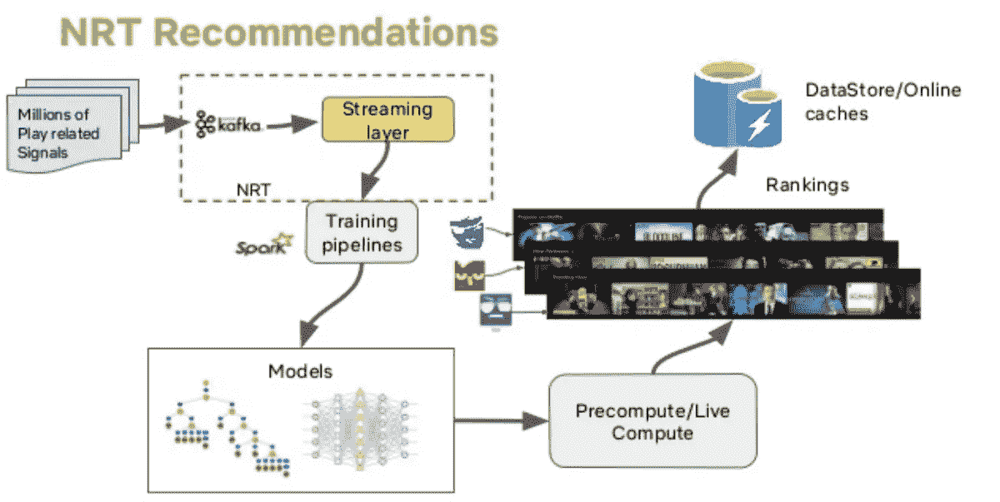
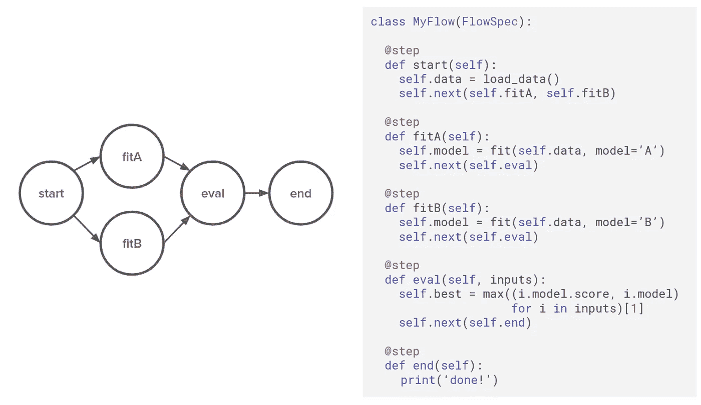

# 数据科学如何助推网飞

> 原文：<https://towardsdatascience.com/how-data-science-is-boosting-netflix-785a1cba7e45?source=collection_archive---------4----------------------->

## 当有效使用时，数据可以神奇的方式改变您的业务，并将它带到新的高度。

[自由股票](https://unsplash.com/@freestocks?utm_source=unsplash&utm_medium=referral&utm_content=creditCopyText)在 [Unsplash](https://unsplash.com/s/photos/watching-tv?utm_source=unsplash&utm_medium=referral&utm_content=creditCopyText) 上的照片

> “如果星巴克的秘密是当你拿到拿铁咖啡时的一个微笑…我们的秘密是网站适应了个人的口味。”
> 
> - [**【雷德·哈斯汀斯】**](https://www.thyquotes.com/reed-hastings/) **(网飞 CEO)**

在过去的几年里，网飞已经成为那些想要疯狂观看电影和电视节目的观众事实上的目的地。

去年，网飞宣布在全球范围内签约了 1 . 35 亿付费用户。仅在 2019 年，网飞就通过在观众方便的时候提供一些顶级内容，比**多赚了一点点 ***。*****

**从最初的一个 ***DVD 租赁平台*** 开始，这个超级媒体提供商巨头成功的主要因素之一是其对大数据的底层**使用**。**

**网飞的 ***成功背后的技术是大数据*** ，它能够处理非常大的数据集，这是有意义的，因为网飞不仅处理内容，还处理大量相关的元数据。**

# **数据科学的重要性**

> **“哪里有数据硝烟，哪里就有生意火。”
> —托马斯·莱德曼**

**数据科学在大多数在线服务中扮演着如此重要的角色，不仅有助于吸引更多客户，还能让现有客户满意。**

**原因在于，有了数据科学，你就能以图形和图表的形式更真实地了解你的**消费者的喜好**，这些图形和图表不仅仅是一个指标，而是几个指标。**

**这一重要信息有助于你以一种独特的方式塑造你的产品和服务，吸引客户来到你的平台。**

> **数据真正推动了我们所做的一切。杰夫·韦纳**

**像网飞这样拥有海量数据的公司，充分利用这些数据总是明智的决定。通过整合**数据分析**、**机器学习**、**统计和深度学习**等概念，数据科学不仅可以帮助网飞，还可以帮助任何行业的任何企业实现指数级增长。**

# **网飞商业模式**

> **“我创立了网飞。我已经稳步发展了 12 年，首先是 DVD 在 2002 年开始盈利，这是一场与 Blockbuster 的激烈竞争，并使公司朝着流媒体方向发展。”**
> 
> ****——雷德·哈斯汀斯****

**从表面上看，网飞的商业模式似乎非常简单。你购买订阅，网飞会给你大量无广告的高质量内容供你尽情享用。**

**但并不总是这样。早在 1998 年 ***【网飞】开始的时候*** 他们就出租甚至 ***出售内容*** 的 DVD 拷贝邮寄过来。**

****后来在**上，他们又包括了 ***蓝光光盘随车 DVD* s** ，不过是在 **2010** 那一年他们跳进了 ***数字流媒体场景*** ，从 ***加拿大*** *开始。***

****从那以后**，网飞一直处于为一系列设备管理、传输甚至制作媒体的最前沿。像任何其他公司一样，网飞多年来一直专注于通过举办竞赛和黑客日来优化其效率，以寻求绩效的提高。**

> ***每个有手机的人都有一个屏幕，可以上网。这是我们的目标市场。世界的品味，世界的时间，是我们所追求的。***
> 
> ****——雷德·哈斯汀斯****

# **一些关于网飞的有趣事实**

*   **尽管竞争更加激烈，网飞在 2020 年仍然拥有最多的用户**
*   **6000 万美国成年人订阅了网飞**
*   **该公司比大多数用户意识到的要老**
*   **由于密码和账户共享，41%的网飞用户可以免费观看**
*   **网飞是首批在不同设备上作为应用程序提供的流媒体服务之一**

> **《网飞之美》将于 10 月 28 日上映。他们按下一个按钮，这部电影将同时在 190 个国家以 17 种语言上映。**

# **网飞如何使用大数据**

**考虑到网飞从事流媒体业务的时间，它已经积累了大量关于其观众的数据，例如他们的**年龄**、**性别**、**地点**、**对媒体的品味**等等。**

**通过收集每一次客户互动的信息，网飞可以直接进入观众的大脑，甚至在他们完成一个节目或电影之前，就知道他们接下来想看什么。**

> ***我们有数据表明，根据星期几、时间、设备，有时甚至是位置的不同，会有不同的观看行为。***
> 
> ****——雷德·哈斯汀斯****

****网飞拥有超过 1.4 亿用户的庞大用户群。以下是网飞追踪的一些衡量标准，让每个人都有自己的品味****

*   **你哪天看内容**
*   **你什么时候看内容**
*   **观看内容的设备**
*   **内容的性质如何**
*   **平台上的搜索**
*   **被重新观看的部分内容**
*   **内容是否暂停、倒带或快进**
*   **用户位置数据**
*   **当你离开内容**
*   **用户给出的评级**
*   **浏览和滚动行为**

****随着时间的推移**，网飞已经部署了**几种算法和机制**，它们利用这些数据并产生关键的见解，帮助公司朝着正确的方向前进。这些工具和功能包括:**

## **● **近实时推荐引擎****

****有了海量的用户**，每个用户每天都会根据他们观看、搜索和添加到他们的观察列表中的内容生成数百个评级，这些数据最终会成为大数据的一部分。网飞存储了所有这些信息，并使用关键的机器学习算法，建立了一个表明观众口味的模式。这种模式可能永远不会与另一个观众匹配，因为每个人的品味都是独一无二的。**

> **根据收视率，网飞对其媒体进行分类，并向观众建议**推荐系统认为他们接下来可能喜欢看的节目。****

**海绵宝宝的电视爆米花 GIF([来源](http://www.spongebob.com))**

> **网飞会知道一切。当一个人停止看电视时，网飞会知道的。他们有自己的算法，知道这个人看了五分钟的节目，然后就停下来了。根据他们的历史，他们可以通过行为和一天中的时间来判断他们会回来。**
> 
> ****——米切尔·胡尔韦兹****

****

****近实时推荐引擎(** [**来源**](https://www.linkedin.com/pulse/how-netflix-uses-ai-data-conquer-world-mario-gavira/) **)****

**● **艺术品&图像选择****

> **有没有想过为什么网飞会为一部电视剧或电影展示多件艺术品？**

**这背后的工具被称为 **AVA** ，它本质上是一种算法，选择什么艺术品和图像给谁看。**美学视觉分析**的缩写，AVA 筛选每一个可用的视频，并确定最适合用作艺术品的帧。**

**AVA 在最终确定图像之前会考虑很多指标，比如演员的面部表情、场景照明、感兴趣的区域、主题在屏幕上的位置。它甚至对艺术品进行分类和排序，以展示给分成几个口味组的用户。**

> **我关注网飞。**
> 
> ****——法米克·詹森****

# **● **生产计划****

**当创作者想出一个关于新节目或电影的想法时，数据发挥了不可或缺的作用。在任何东西写在纸上之前，都要进行大量的头脑风暴，这就是数据的来源。**

**凭借之前创建新内容和原创内容的经验以及关于观众如何看待之前内容的大量数据，大数据有助于为规划阶段面临的许多挑战提供可能的解决方案。**

**这些挑战可能包括确定**拍摄地点**、**拍摄时间和日期**等等。即使使用简单的预测模型，网飞也可以节省大量的规划工作，从而进一步降低费用。**

> **网飞正在委托原创内容，因为它比人们先知道他们想要什么。**
> 
> **-《纽约时报》**

****

**[David Sager](https://unsplash.com/@dcsager?utm_source=unsplash&utm_medium=referral&utm_content=creditCopyText) 在 [Unsplash](https://unsplash.com/?utm_source=unsplash&utm_medium=referral&utm_content=creditCopyText) 上拍摄的照片**

# **● **元流****

> **网飞有开源的 Metaflow，这是他们的云原生的、以人为中心的框架，旨在提高数据科学家的生产力。**

**Metaflow 背后的想法是将数据科学家的关注点从担心模型的基础设施转移到解决问题上。Metaflow 通过提供一组微调功能，让他们可以自由地试验自己的想法，这几乎让 Metaflow 感觉像一个即插即用的框架。元流的几个值得注意的特性是:**

**●能够在分布式计算平台上工作**

**●为版本控制和试验拍摄代码和数据快照的选项**

**●高速高性能 S3 客户端**

**●支持大多数机器学习框架**

****

**元流——一个简单的 Python 库( [source](https://netflixtechblog.com/open-sourcing-metaflow-a-human-centric-framework-for-data-science-fa72e04a5d9) )**

# **● Polynote**

****由网飞**开发并开源，Polynote 是一个**多语言笔记本**，具有**对 Scala** 和其他各种特性的支持。对于数据科学家和机器学习研究人员来说，Polynote 允许基于 JVM 的机器学习平台与 Python 的平滑集成。这款笔记本的几个亮点是:**

**●深入了解内核状态和执行中的任务**

**●提供简单的依赖性和配置管理**

**●提供类似 IDE 的功能，如自动完成、错误突出显示、再现性、编辑、改进、可见性、数据可视化等。**

# **● M **etacat****

**网飞运营的巨大数据池分布在多个平台上**，比如亚马逊 S3** 、**德鲁伊、红移和 MySql** 等等。为了维护这些数据存储之间的无缝互操作性，网飞需要一种服务。**

**对简单性的需求催生了 Metacat，它的唯一目的是为所有数据存储提供集中的元数据访问。网飞创建元流的目的是服务于以下核心目标:**

**●统一并提供元数据系统的集中视图**

**●为平台数据集元数据提供单一 API**

**●为数据集的业务和用户元数据存储提供解决方案**

# **● **德鲁伊****

> **“Apache Druid 是一个高性能的实时分析数据库。它专为快速查询和接收非常重要的工作流而设计。Druid 擅长即时数据可见性、即席查询、运营分析和处理高并发性。”**
> 
> ****—德鲁伊.伊奥****

**网飞使用**阿帕奇德鲁伊来确保**它的用户每次都能获得**高质量的用户体验**。每次都提供顶级的用户体验不是一件简单的事情。它需要对几个事件进行持续的分析，收集必要的数据并进行分析。这些数据可以是任何东西，从回放信息到设备信息，到测量平台性能等等。所有这些事件度量使原始数据变得复杂，这就是 Druid 发挥作用的地方。**

**Druid 的任务是提供对数据库的实时分析，在这些数据库中，查询在不确定的时间段定期执行。它具有高度可扩展性，可为任何给定的工作负载提供出色的性能。**

# **●**Python 的使用****

**网飞喜欢 Python，因为它非常强大，当与库结合时，它变得非常优秀，更不用说它与其他平台的集成是多么流畅。网飞使用 Python 来管理其一系列关键任务，例如:**

**●管理 CDN 基础设施的应用**

**●分析运营数据、交通分布和运营效率**

**●原型可视化工具**

**●通过统计工具、数据探索和清理获得洞察力**

**●用于维护信息安全**

**●使用 Jupyter 笔记本电脑管理多个核心任务**

**●对于使用 A/B 测试的实验**

# **结论**

**大数据不仅在决定网飞的运转方面发挥着关键作用，还为他们提供了新的发展机遇。新技术通常会带来一些问题，但在网飞，他们一直在通过听取社区意见来正面解决这些问题。通过向社区开源几个库和框架，网飞的目标不仅仅是改善自己，也是改善其他公司。最后，说网飞基于大数据洞察力做出所有决策是不正确的，因为他们仍然依赖于许多人的人工输入。**

# **更多有趣的阅读—**

**我希望这篇文章对你有用！以下是一些有趣的读物，希望你也喜欢**

** [## 面向所有人的顶级谷歌人工智能工具

### 使用谷歌人工智能中心将想法变为现实

towardsdatascience.com](/top-google-ai-tools-for-everyone-60346ab7e08)  [## 2020 年人工智能工程师的顶级编程语言

### 从几种编程语言中，人工智能工程师和科学家可以挑选出适合他们需要的语言

towardsdatascience.com](/top-programming-languages-for-ai-engineers-in-2020-33a9f16a80b0)  [## 机器学习和深度学习的最佳 Python 库

### 现代机器学习模型和项目的 Python 库

towardsdatascience.com](/best-python-libraries-for-machine-learning-and-deep-learning-b0bd40c7e8c)  [## 选择 PyTorch 进行深度学习的理由

### PyTorch 可以为深度学习程序员提供很多东西

towardsdatascience.com](/reasons-to-choose-pytorch-for-deep-learning-c087e031eaca)  [## 数据科学家的最佳数据科学工具

### 数据科学工具，使任务可以实现

towardsdatascience.com](/best-data-science-tools-for-data-scientists-75be64144a88) 

> **关于作者**
> 
> **克莱尔 D** 。是[**Digitalogy**](https://www.digitalogy.co/)**—**的内容制作者和营销人员，这是一个技术采购和定制匹配市场，根据全球各地的特定需求，将人们与预先筛选的&顶尖开发人员和设计师联系起来。在[**Linkedin**](https://www.linkedin.com/company/digitalogy)[**Twitter**](https://twitter.com/DigitalogyCorp)[**insta gram**](https://www.instagram.com/digitalogycorp)上连接 **Digitalogy** 。**