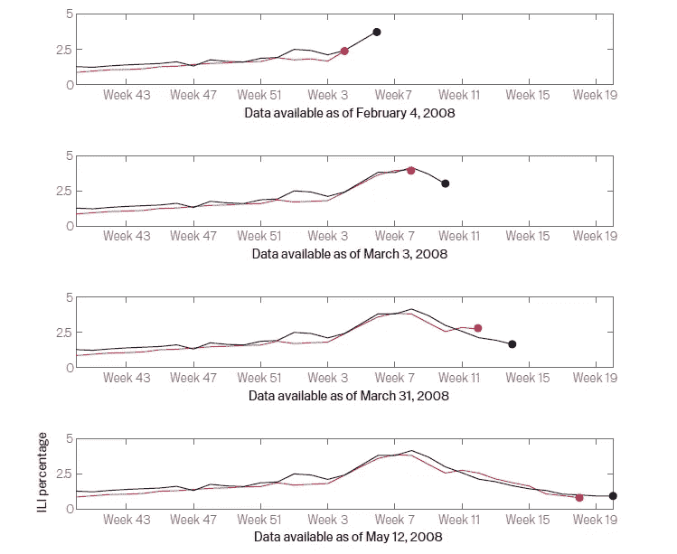

# 数据科学如何改造疾病监测系统

> 原文：<https://towardsdatascience.com/how-data-science-is-impacting-healthcare-resilience-48c5a6b07063?source=collection_archive---------43----------------------->

在意大利电晕关闭期间，大多数商店和所有学校仍然关闭。(图片:Getty Images)

数据科学技术，如人工智能，或者更具体地说，机器学习，已经推动了一系列行业的显著转变。在广泛探索使用 ML 的许多领域中，由于患者数据可用性的爆炸式增长，其在医疗保健领域的应用正在见证革命性的发展。虽然没有算法可以取代人类触摸的温暖和强调医患关系的同情，但有前途的数据科学技术肯定可以通过提供对诊断和治疗过程的见解来补充医疗和保健人员的努力，从而有助于改善结果和增强患者护理。从微软利用计算机视觉进行医学图像诊断工具的 InnerEye 到 Alexa 进军家庭患者慢性病护理，我们一定会见证从诊断-治疗模式到预测-预防模式的决定性转变，这将减少成本和患者痛苦。因此，ReportLinker 预测“医疗保健人工智能”市场规模将从 2018 年的 21 亿美元飙升至 2025 年的 361 亿美元，CAGR 将达到 50.2%，这一预测并不令人惊讶。

虽然数据科学在许多方面都在帮助从业者、患者和决策者，但这篇文章将特别深入探讨我们如何应对和防御流行病(和大流行！)可以使用数据支持的工具来预测/临近预报疾病动态。

# 疾病传播的监测、建模和预测

在我们日益缩小的世界中，由于全球旅行、城市化和气候变化的增加，传染病的威胁比以往任何时候都更加严重。传染病每年夺去 1700 多万人的生命。但是，疾病传播快，知识传播更快！使用数据科学工具，可以利用现代技术的巨大数据生成能力来深入了解实时疾病监测，从而预测疾病传播。跟踪和预测传染病爆发的动态对于关于医疗资源分配的决策以及关于选择和实施适当干预以最小化发病率和死亡率的公共政策是非常有用的。

## 方法

我们在这里处理的基本上是一种特定疾病在一段时间内的趋势或“时间序列数据”。我们*在疫情表现出显著活跃的历史时期对*疫情进行建模，并*对当前或未来潜在死灰复燃的时期对*疫情进行监控。其实时预测(对实时发生的病例数的估计)或预测估计有助于公共政策的重要指标包括:

1.每日/每周案例计数

2.峰值计时

3.(代表病例数的曲线的)峰高

4.爆发持续时间和规模

此外，我们的目标变量(每小时/每天/每周/每月)的粒度将取决于可用输入数据的粒度。例如，如果我们有每月的数据点，我们的目标预测就不能是更低的粒度，比如每周。然而，需要注意的一点是，数据越精细，我们对其分析和解释的控制就越强，从而可以更好地了解疫情的动态。

一些模型试图将空间数据与时间数据结合起来。这主要是通过根据地理区域划分数据来实现的，从城市和地区到国家或纬度范围。这是有道理的，特别是在大流行的情况下，因为不同地区和居住在那里的人口的特殊性可能在疫情的动态中发挥重要作用。在空间-时间分析的情况下，上述目标参数也是为每个区域单独估计的，有时是通过用特定地理部分的数据对模型进行微调。

## 数据

传统的监测系统使用从全国数百个医疗保健提供者收集的病毒学和临床数据来发布流行病报告，通常是每周一次。虽然可靠，但这种方法昂贵且缓慢。这些报告中的数据有 1 到 2 周的滞后。为了提供对疫情的实时监测，正在从监测流感活动间接信号的创新监测系统中获取数据。

1.  ***网页搜索查询和社交网站数据***

大约 80%的互联网用户在网上搜索有关他们所面临的医疗问题的信息，这使得网络搜索查询成为有关健康趋势的唯一有价值的信息来源。不足为奇的是，人们发现，寻求健康的网络搜索行为与同期测量的患者出现相应疾病症状的医生就诊比例高度相关。季节性流感样疾病尤其如此(ILI)。

通过基于搜索查询日志的模型预测 ILI 病例(黑色)与实际 ILI 病例数(红色)

当然，某些搜索查询比其他查询更高度相关。此外，应当监控其搜索频率并在临近预报/预测疾病活动的模型中使用的术语或短语的集合可能随时间和跨不同区域而变化。因此，有一些工具采用机器学习和统计模型来自动发现在给定地区的给定时期内针对特定疾病的最具指示性的查询集。

许多研究还证明了使用社交网站(SNS)对流行病的流行情况进行实时分析的成功。许多人广泛使用社交网络来分享想法甚至健康状况。因此，除了作为一种交流和传播预防流行病和大流行意识的良好方式外，它们还为疾病监测提供了一种有效的资源。SNS 用户可以用作传感器，提供数据进行分析，用于早期趋势检测和预测。Twitter 是一个特别成熟的资源，因为它的帖子频率高，可以进行每分钟的分析，而且它的用户群体多样化，从年轻人到精通技术的老年人，可以产生跨越所有年龄组的数据点。此外，与搜索引擎日志相比，Twitter 帖子更具描述性，通过发帖人的用户资料对其人口统计数据进行更深入的分析可以提供更深入的见解。

***2。*气象与环境数据**

气候变化是影响疾病传播动态的一个已知因素，特别是季节性流行病。例如，研究发现降雨量对流行性疟疾的年际变化有显著影响，这表明将降雨量作为一个输入变量纳入预测疟疾暴发的模型。因此，诸如降雨量、温度变化和湿度等气象数据提供了重要的数据点，可用于预测与疾病相关的目标参数的模型中。

其他环境因素，如植被指数、人口密度(是的，人是我们环境的一部分)、空气质量也可以纳入模型，这取决于它们与特定疾病传播的关系。

***3。临床监测数据***

当我们处理时间序列时，传统的监测数据，如历史病人数、历史疾病持续时间和峰值都发挥了作用。例如，过去 2 周的疾病活动可以指示其未来 1 周的趋势。这些数据点在构建预测模型时特别有用，这些模型需要经过训练以从历史趋势或捕捉滞后关系的趋势中学习模式。

另一种提供近实时患者信息的临床数据是电子健康记录(EHR)。电子病历提供了大量关于患者的信息，如他/她的人口统计和病史，这些信息可以对情况进行更细致的分析。此外，来自 EHRs 的数据可以被整合，以提供显示症状的患者数量与实际患病的患者数量的统计计数。

***4。*其他数据**

暗示疫情规模的其他间接数据包括非处方药销售，这在 ILIs 病例中最常见。一些研究甚至使用基于历史证据的(伪随机)事件模拟。

## 模型

以下是文献中分析流行病时间序列数据时遇到的一些最常见的模型:

***1。ARIMA:***

ARIMA(自回归综合移动平均)及其变体是时间序列数据建模的一些最有效的方法。事实上，这也是用于传染病时间序列数据建模的最常用方法。由于 ARIMA 模型假设未来值可以根据过去的观察结果进行预测，因此它可以很好地处理上述临床监测数据点，捕捉定期收集的数据中通常存在的滞后关系。

然而，ARIMA 模型在处理 ILI 等不同季节不一致的疾病时，或者在预测淡季发生的流行病时，可能会受到限制。此外，ARIMA 不能很好地处理非结构化数据，如搜索查询日志和来自社交网络的数据，这些数据在疾病的临近预报中发挥着越来越重要的作用。

***2。回归模型:***

多元线性回归是最常见的回归分析形式，已应用于疫情预测研究。模型捕捉各种数据点，包括自回归和季节参数以及(滞后的)天气协变量。通常，回归模型针对不同的人口在更精细的空间粒度上进行微调，例如针对一个国家内的每个城市或州。

***3。神经网络***

考虑到可用的输入数据特征的多样性，如果有大量数据可用于训练神经网络，那么使用神经网络是一个不错的选择。神经网络需要有限的特征工程，在分析多模态复杂数据集时成为热门话题，例如使用多种类型的数据集进行疫情预测。

***4。其他方法***

除了上面提到的方法，还使用了其他各种特定于数据的方法和模型。例如，与主题模型或图形数据挖掘相结合的文本挖掘，用于从搜索查询和 SNS 数据中提取和分析特征。此外，可以使用不同方法和模型的组合来组合若干特征数据类型，以为此目的构建健壮的系统。

多种方法正在涌现，试图利用我们拥有的强大工具:数据，随机应变，帮助我们应对疾病爆发。其中最成功的已经在更大范围内实施，并正在协助政府和公共政策加强防御。只有当我们开始信任这些(太早？)警告和*采取必要的措施，即使它们看起来反应过度，*我们才能真正收获它们的好处。