# 数据科学家如何在现实生活中建立机器学习模型

> 原文：<https://towardsdatascience.com/how-data-scientists-build-machine-learning-models-in-real-life-f1f333022fb7?source=collection_archive---------27----------------------->

## 成功完成预测模型的步骤

摄影爱好在 [Unsplash](https://unsplash.com/s/photos/robot-hand?utm_source=unsplash&utm_medium=referral&utm_content=creditCopyText) 上

如今，网络上已经充斥着数据科学和机器学习相关的资源。有许多博客、网站、YouTube 视频和论坛都在提供关于数据科学相关主题的有用信息。现在，为任何数据科学探索选择正确的材料已经变得很乏味。

几年前，当我开始我的数据科学之旅时，我面临着同样的困境。但有一点我注意到，在这些资源中，大部分都不完整。你必须遍历大量的资源来获得详尽的信息。

此外，我看到关于机器学习模型的文章缺乏现实生活的视角。所以我想到写一篇关于为现实生活中的任何用例构建机器学习模型的整体图片的帖子。

要执行任何数据科学项目，数据科学家都需要经历几个步骤。概括地说，这些步骤可以表示为:

1.  从给定的业务问题中制定数据科学问题

2.数据源探索和数据收集

3.变量探索(EDA)

4.模型结构

5.模型评估

6.模型部署

步骤 1 和 2 取决于问题的背景。步骤 6 更多地依赖于业务需求和可用的基础设施。步骤 2、3、4 和 5 是数据科学家的唯一职责。

在这篇文章中，我将讨论如何建立一个端到端的分类模型。我将带你经历一个数据科学家在任何需要建立分类模型的项目中的整个旅程。我将试着组织这篇文章，以便它可以很容易地适应类似的情况。

我使用了一个随机 Forst 模型来描述这些方法。即使您使用任何其他分类器，执行过程也会非常相似。

# 1.从一个给定的商业问题中形成一个科学问题

通常，数据科学问题源于业务需求。业务主管在产品销售、利润率、客户忠诚度、采购决策、市场份额和许多其他领域面临着各种挑战。

这些业务问题会以一些业务问题的形式出现在你面前，或者以业务主管的一些观察结果的形式出现在你面前，这些观察结果是他们想要验证的。

作为一名数据科学家，您有责任将这些业务问题转化为数据科学问题，并提供有意义的答案。

在这篇文章中，我将考虑一个简单的社交网络广告问题。数据集提供了一些表明客户概况的变量。此外，它还表示购买了该产品的客户。

这项任务的目的是根据客户信息，预测未来谁会购买该产品。

因此，作为一名数据科学家，您需要理解这是一个分为两类的分类问题——已购买和未购买。

# 2.数据源探索和数据收集

在现实生活中，数据源探索和数据收集并不是一项简单的任务。在任何组织中，您都很难找到可以找到所有所需数据的单一来源。通常，您会发现多个不相连的数据源，其中一些由于基础设施相关问题或访问受限而难以访问。

由于成本问题和技术挑战，从外部来源收集数据也很棘手。

在这篇文章中，我只能有限地展示这些问题。讨论“社交网络广告”的数据集从[这里](https://www.kaggle.com/rakeshrau/social-network-ads)下载。

# 3.变量探索(EDA)

在开始探索性数据分析(EDA)之前，你应该先看看数据。您应该检查一些东西—数据量、来自不同来源的不同数据的性质、数据集的兼容性、它们之间的映射、数据质量、数据一致性—最重要的是每个变量的含义及其业务含义。

现在是时候使用“社交网络广告”数据来使用 python 代码了。因为我使用了单一数据集来保持讨论的简单，所以我的范围有限，无法说明我在这里提到的第一次查看数据的所有方面。

整个代码可以在 jupyter 笔记本或您选择的任何其他 python IDE 中执行。我们将需要几个 python 库来完成这个分类练习。我将首先提到我们需要的所有包装。

检查您当前的工作目录总是一个好主意。如果需要，将其更改为您喜欢的。

## 先看数据

先看看将用于构建模型的数据。你会知道你在处理多少变量，以及这些变量代表什么。

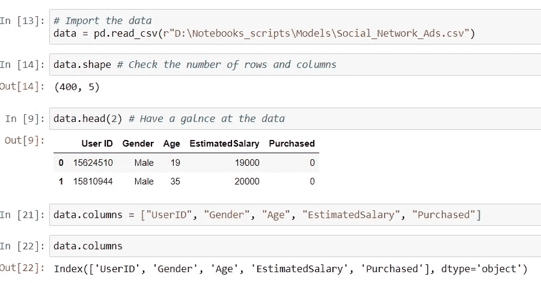

这是一个只有四百个观察值和五个变量的小数据集。其中，“用户 ID”对模型开发没有贡献。

您应该检查变量名中的空格。如果您发现任何这样的情况，请更改变量名。变量名中的空格会导致脚本出现问题。在这个数据中，“用户 ID”有一个空格，我把它改成了“User ID”。

## 变量的数据类型

检查您正在处理的每个变量的数据类型。任何数据中最常见的问题是日期变量。我看到大多数时候日期变量变成了“对象”数据类型。请确保您已经将其转换为日期格式。我的当前数据不包含任何日期变量。此外，当数值变量的某些值包含字符或者某些值缺失时，数值变量有时会变成“对象”类型。

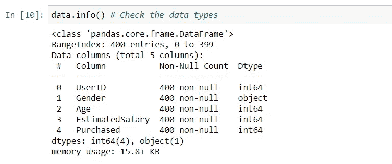

## 将数据分为训练集、验证集和测试集

在处理数据之前，将其分为训练集、验证集和测试集。您的模型应该只看到设置为自我训练的火车。验证集应该只用于通过检查模型在验证集上的性能来调整模型的参数。测试集用于检查模型对未知数据的性能。

您将用于处理训练集的所有统计技术都应该用于处理验证和测试集。此外，您从训练集估计的统计值应该用于验证集和测试集。

例如，如果已经通过均值***【m】****和标准差 ***s*** *，*归一化了训练集的变量 X，则应该使用相同的值来归一化验证集和测试集中的 X。*

*现在，训练、验证和测试集的大小取决于可用的数据量。当数据集不大时，80–10–10 或 70–20–10 是分割训练、验证和测试集的常用百分比。但是，如果你有足够的数据，比如数百万，那么保持 2%或 1%甚至 0.5%的数据对于验证或测试集来说就足够了。*

**

*从这些数据中，我通过提取 80%的数据创建了一个训练集。为验证集保留 15%，为测试集保留 5%。*

## *变量的分布*

*现在是时候探索列车组并理解手头的变量了。*

*变量的汇总统计将有助于理解它们的性质。你会对他们的分布有一个粗略的概念，比如范围，他们是否在本质上是偏斜的，频繁出现的类别，等等。*

*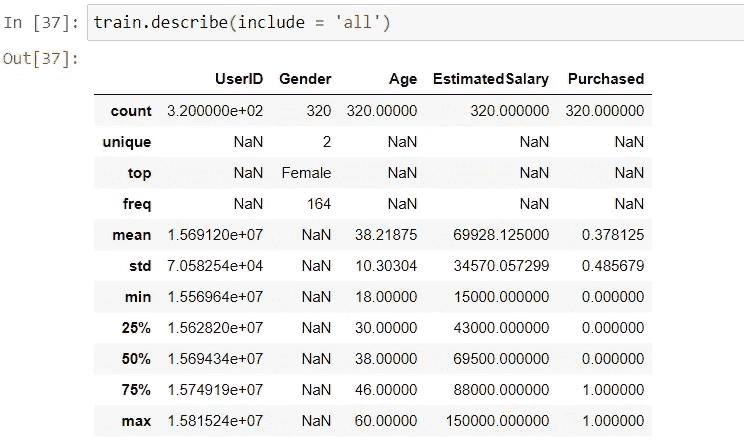*

*在该数据中，性别分布以女性为主。顾客的年龄从 18 岁到 60 岁不等，平均为 38 岁。*

*可视化总是有助于更深入地理解变量。*

*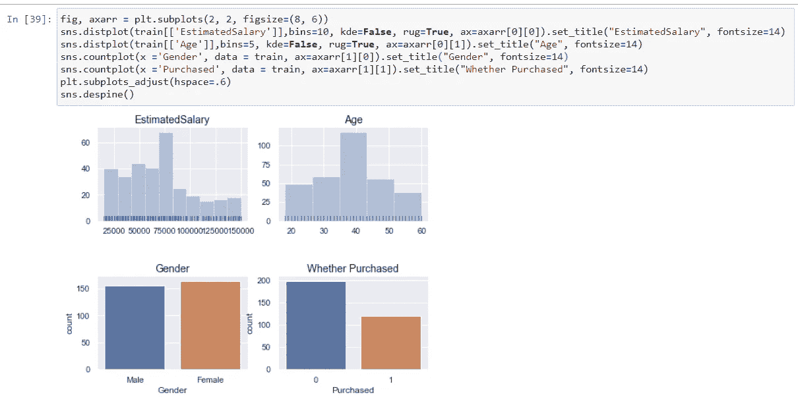*

*相当多的顾客年龄在 40 岁左右。很大一部分顾客属于低薪阶层。不出所料，购买的顾客数量远低于总顾客数量。*

*对于分类问题，检查类别不平衡的程度总是一个好主意。*

**

*在列车组中，已购买与未购买的比例为 38:62。所以，阶级不平衡在这里并不重要。*

## *缺失值和异常值*

*在真实文件数据中，缺失值是一种确定(几乎)的现象。处理缺失数据有多种技术——数值变量的均值或中值插补、分类变量的模式插补、K 近邻法(KNN)、回归法等。它们中的每一个都依赖于环境。*

*在当前的行业场景中，如果数据中存在某个变量，可能会有两种情况。要么变量有足够的值，要么没有值。我几乎看不到介于两者之间的情景。*

*这是有原因的。组织了解构建流程和基础架构来存储来自不同业务运营的数据的重要性。如果他们发现一些信息至关重要，并且有记录的方法，他们会妥善保存。你会得到足够的信息。但是有时由于人类的偏见或技术上的挑战，记录某种特定的信息变得很困难。在这种情况下，你几乎得不到任何信息。*

*所以，如果我有足够的数据，我个人会尝试删除缺失值。如果某个变量有大量缺失值，那么删除该变量可能是个好主意。我只在绝对必要时才尝试插补技术。*

*现实生活数据的另一个常见特征是异常值的存在。您可以使用上下胡须来确定异常值。有时，人们会将较低的 2.5%和较高的 2.5%的数据视为异常值。在对它们采取任何行动之前，您需要检查它们是否真的是异常值。*

*您可以用变量的一些估计上限和下限来限制异常值。*

**

*在这个数据集中，没有丢失的值。由于该数据中的响应变量本质上是分类变量，因此异常值的概念在这里不适用。*

## *特征创建*

*对于大多数机器学习问题，特征创建是一项强制性的练习。有时，可用于建模的数据不包含足够的变量。可用变量可能没有足够的解释力来提高模型的能力。我们正在处理的数据只有三个变量——年龄、工资和性别。*

*根据这三个变量，很难建立一个具有足够预测能力的模型。可能存在某些影响购买决策的其他因素。现在，由于我们没有关于客户的其他信息，我们可以明智地使用这些变量来提取最大可能的解释力。为此，我们需要从现有的变量中创建新的变量(特性)。*

*可能存在另一种情况，我们有足够的变量，但没有一个变量显示出足够的解释力。在这种情况下，我们需要从原始变量中创建额外的特性。此外，我们可能需要智能地组合一些变量来创建新的变量。*

***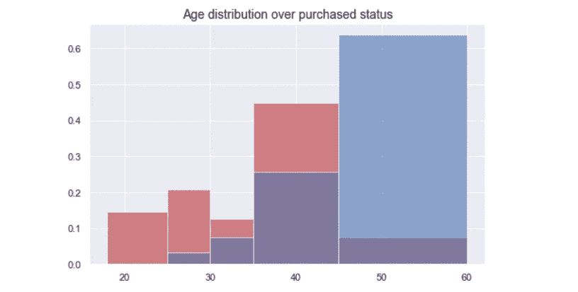*

*这里的顾客年龄在 18 到 60 岁之间。如果我们不使用年龄作为变量，而是能够识别客户具有不同购买模式的年龄段，那么在决定客户是否购买时，它将具有更大的解释力。一旦我们确定了年龄桶，我们就可以为这些桶形成虚拟变量，并将它们用作特征。*

*在这个柱状图中，我们可以看到已经购买的客户和没有购买的客户的年龄分布不同。红色矩形代表已经购买的客户数量，在中低年龄段中较高。但是蓝色矩形对于高年龄组来说更高，这表明高年龄组不购买的可能性更大。*

*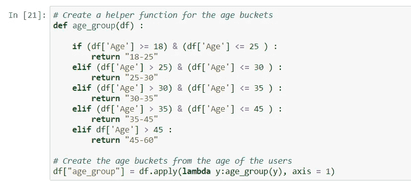*

*从上面的直方图的理解导致生成一个新的变量“age_group ”,它包含年龄桶而不是实际的变量值。这将帮助我们为每个年龄阶段建立新的虚拟变量。*

*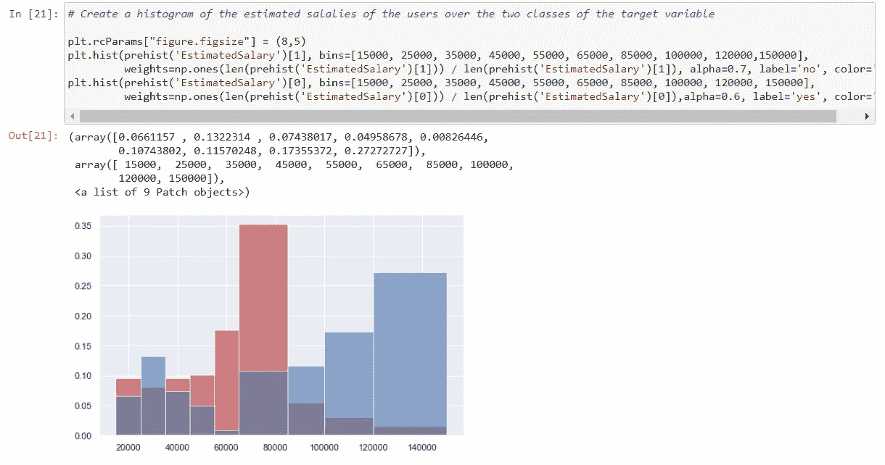*

*这同样适用于变量“EstimatedSalary”。顾客的工资从 15000 英镑到 150000 英镑不等。我把这个系列分成九个桶。在这里，你可能需要试验你应该形成多少个桶。目标是产生足够数量的桶，以区分购买和未购买客户之间的工资分配。*

*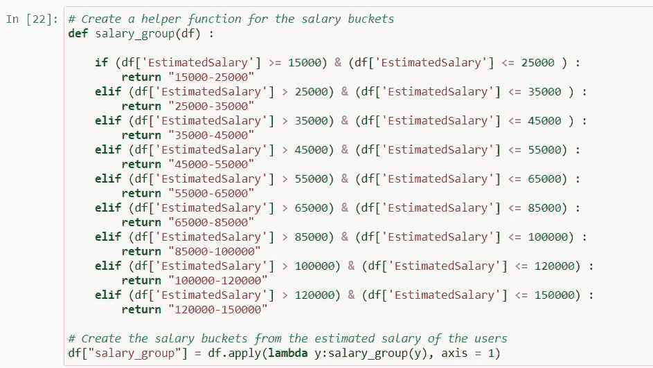*

*变量“salary_group”是基于直方图中观察到的模式形成的。*

*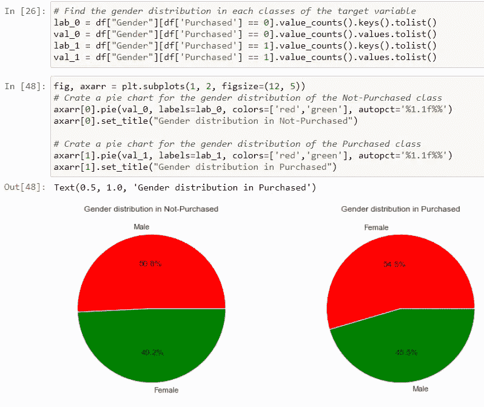*

*顾客购买状态的性别分布没有显著差异。你一定注意到女性顾客更倾向于购买这些产品。*

*一旦我们研究了数据集中的所有变量，就该最终确定分类模型的特征了。您将为训练集创建的特征必须为验证集和测试集完全重复。*

**

*因此，我们已经为模型创建了所有的特征和虚拟变量。我去掉了原始变量，只保留了虚拟变量。在创建虚拟变量时，我从每组中删除了一个虚拟变量，以避免虚拟变量陷阱。*

*当我们为任何分类变量创建虚拟变量时，每个分类都会创建一个虚拟变量。变量中所有哑元的线性组合总是 1。因此，它们将与模型的截距完美相关。这被称为虚拟变量陷阱。我们通过为每个分类变量丢弃一个哑元来避免这种情况。*

****

*检查变量的相关结构总是一个好主意。多重共线性使得很难理解模型中要素的重要性。*

*在我们的例子中，创建的特征之间的相关性似乎不是很强。*

**

*火车组终于准备好模型制作了。*

# *4.模型结构*

*在我们训练模型之前，我们需要验证数据为模型验证做好准备。我们需要将用于训练集的相同方法应用于验证集。*

*同时，我们也可以准备测试数据，并保留它以备将来使用。*

*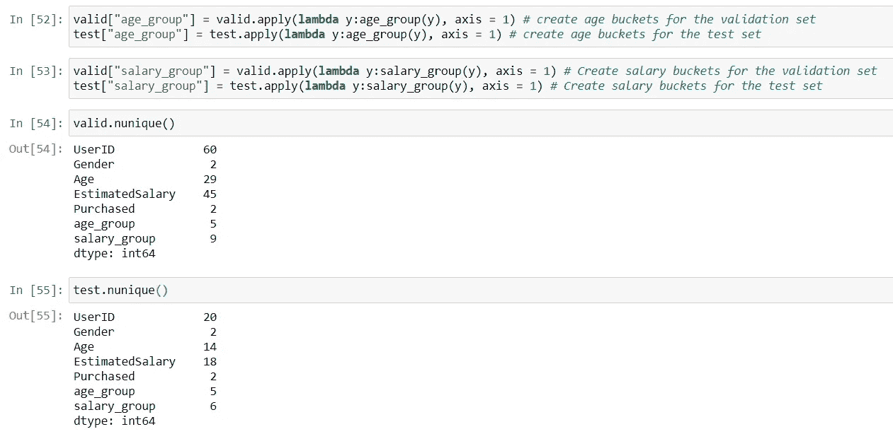*

*我们创建了与培训集相似的年龄存储桶和工资存储桶。有一点你必须检查目标变量的所有类都应该出现在验证集中。如果没有，重复训练-验证-测试分离。*

**

*我们为验证集和测试集创建了相同的特性。*

*有几种处理分类问题的算法。事先知道哪个型号性能会更好，不是很方便。我们总是尝试几种型号，比较它们的性能。在现实场景中，性能参数可以是预测准确性、执行时间和资源消耗。*

*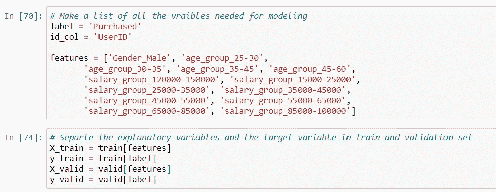*

*这里我使用了一个随机森林模型作为分类器。随机森林通过从训练集中采样特征来构建几个决策树。这些树中的每一个都对观察结果进行分类。随机森林结合这些决定，并提取最有可能的一个。这种方法叫做装袋。*

**

*我已经使用默认参数来建立模型。您可以使用参数进一步优化分类器，如— *n_estimators、max_depth、min_samples_split、* min_samples_leaf 等。*

*将您的模型保存为 pickle 文件以供将来使用。您应该用正确的版本名称保存模型，这样当您再次访问它们时就可以区分它们。*

**

*我将模型保存在我的工作目录中，然后再次加载它，因为我使用的是一个笔记本。*

# *5.模型评估*

*我们到了必须回答几个问题的地步，比如——这个模型有多好？它符合我们的期望吗？如果没有，怎么办？*

**

*为了检查模型，我使用了验证数据集。已经预测了验证集的目标类。为了判断模型有多好，我们需要使用一些判断指标。*

*混淆矩阵是表示模型性能的好方法。它显示实际数据和预测结果中的正类和负类的计数。这里的正类是指标签为“已购买”的类，用 1 表示。*

***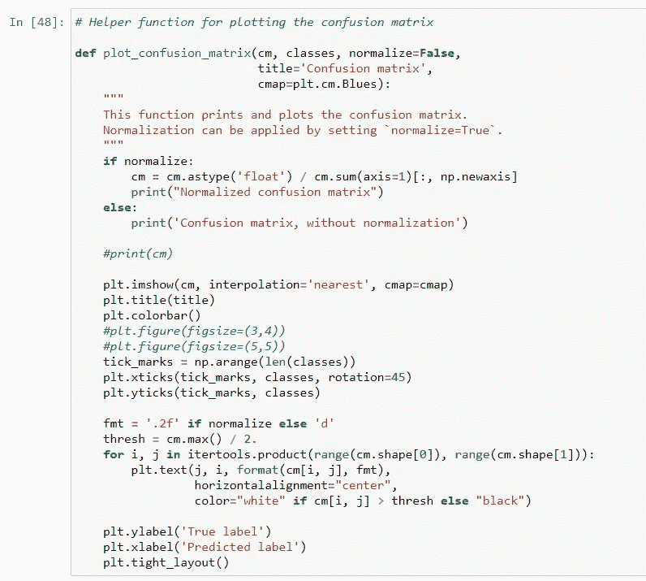*

*上面的函数提供了一种用漂亮的可视化来表示混淆矩阵的方法。该函数可以显示标准化(百分比)或未标准化(计数)的混淆矩阵。*

*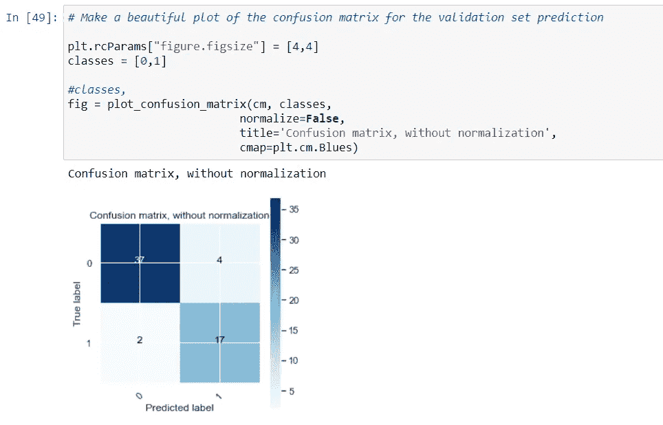*

*该矩阵表示真实标签和预测标签及其计数。对于 19 个观察值中的 17 个，类别 1 的真实和预测标签是相同的。这意味着，购买了该模型的 19 个客户中有 17 个可以预测。41 个班级中有 37 个没有购买。*

*为了使它更简洁，我们有一些度量标准，比如——精确度、召回率、F1 分数、准确度等。对于类别不均衡(类别分布不均匀)的分类模型，精度和召回率是我们依赖的度量标准。度量值越高，模型越好。*

*精度是通过两个值的比值来计算的。模型预测为“已购买”的客户数。以及实际购买了该产品的客户数量。*

*回忆表示—在实际购买的客户中，有多少被模型正确识别。*

*现在，很难做到最大化的精准和一起回忆。F1-Score 是一种将我们从这种情况中拯救出来的方法。这是精确和回忆的调和平均值。这有助于我们在它们之间保持平衡。*

**

*模型算法不直接提供目标类。它提供了属于每个类的概率。如果肯定类别的概率大于 0.5，则标记为 1，否则标记为 0。*

*这个概率阈值可以被优化。我们可以在所有阈值中检查哪一个提供了最好的分类结果。这可以通过精确召回曲线来实现。*

**

*因此，我没有直接预测类别，而是从模型中提取了验证集的每个观察值的概率。利用查准率-查全率曲线，发现最佳概率阈值为 0.332714。*

*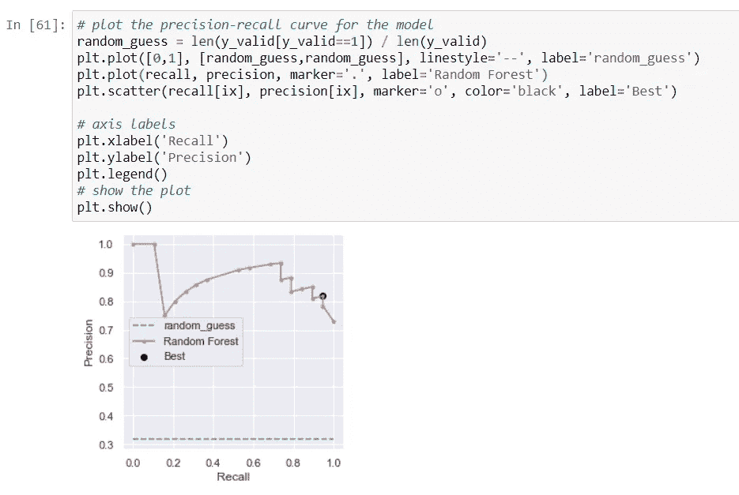*

*该图显示了精确度-召回曲线中的最佳阈值。它优化了预测的精确度和召回率。*

*还有其他几种模型评估和参数调整的方法。为了使讨论简单，我无法一一介绍。*

*模型训练和评估是递归过程。你需要多次重温培训和评估，以达到令人满意的水平。如果评估过程没有显示令人满意的结果，每次都需要调整模型的参数。我在这篇文章中避开了这一部分。*

*现在，是时候检查模型在看不见的测试数据上的表现了。如果将模型部署到现实生活中的应用程序中，它将类似于模型将如何执行。*

## *测试集上的模型评估*

*在对测试集使用模型进行预测之前，必须检查测试集的形状。确保测试集中的特征数量等于训练集中的特征数量。*

*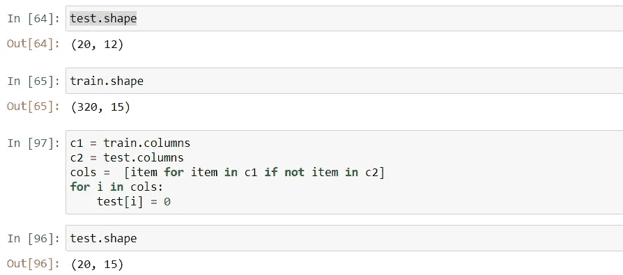*

*在我们的例子中，测试集中缺少三个特性。这些是从估计工资中创建的虚拟变量。因为那些工资桶在测试集中不存在，所以我为它们插入了带有零的虚拟桶。*

****

*我使用验证集中估计的阈值概率来预测测试集中的观察结果。*

*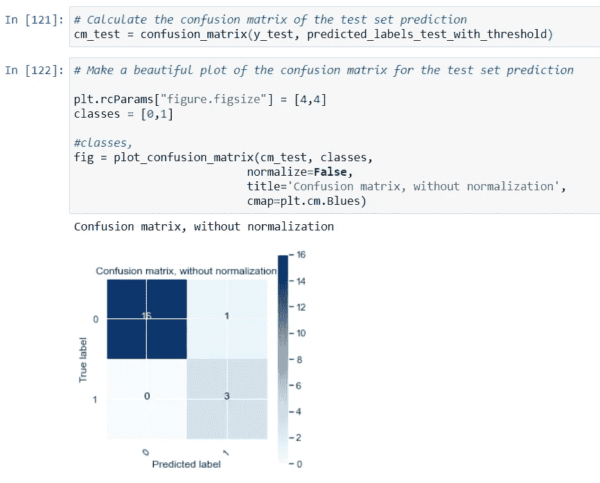*

*混淆矩阵显示，所有带有“已购买”标签的客户都被正确预测。所以，召回值是 1。*

**

*该组的 F1 分数为 0.85。我想说这个模型为我们提供了一个不错的表现。我们用一种非常简单明了的方法做到了这一点。*

*在许多情况下，85%的 F1 分数可能是优秀的表现。然而，模型所需的精度取决于各种因素。*

# *6.模型部署*

*一旦你对你的模型表现感到满意，你应该和业务主管一起检查。您需要详细讨论您的结果的含义，以及它是否符合业务理解。*

*此外，您需要与业务主管确认期望的准确性水平。必须对部署策略、模型修订的频率、交付输出的模式等做出决策。*

*您的模型输出可能会被其他应用程序使用，甚至可能以 CSV 文件的形式提供给业务人员。*

*我在本文中表示代码的方式更像是一种离散的方式。在现实生活中，我们更喜欢将脚本分成不同的块，并使用类和函数来组织它们。*

*此外，需要为模型的推断准备单独的脚本模块。该脚本将从特定的数据存储中获取数据，对数据进行推断，并将输出保存在指定的输出位置。*

*您将需要一个计划程序，让模型在特定的时间间隔后运行。如果其他应用程序依赖于这个模型的输出，您需要以正确的顺序同步它们。*

*在一篇文章中介绍机器学习项目的所有方面真的很难。我尽力覆盖了大部分。我可能遗漏了一些事实。但是我相信我已经能够把整个旅程的总结带到你面前。*

*数据科学是一个新兴领域。许多有志者加入数据科学行业，追求成为一名数据科学家。我希望这篇文章能帮助他们对数据科学项目涉及的步骤有一个公平的认识。*

***你可以从** [**这里**](https://github.com/rahuldeb-das/classification-model/blob/master/Classification_model_example.ipynb) **下载笔记本。***

***参考文献:***

1.  *[https://machine learning mastery . com/roc-curves-and-precision-recall-curves-for-unbalanced-class ification/](https://machinelearningmastery.com/roc-curves-and-precision-recall-curves-for-imbalanced-classification/)*

*2.[https://stack overflow . com/questions/19233771/sk learn-plot-confusion-matrix-with-labels/48018785](https://stackoverflow.com/questions/19233771/sklearn-plot-confusion-matrix-with-labels/48018785)*

*感谢您阅读我的文章。如果你喜欢这篇文章，你可能会喜欢我的其他文章。以下是其中的一些。*

* [## 没有书籍和教程如何学习新的编程语言

### 经过检验的快速学习方法

medium.com](https://medium.com/swlh/how-to-learn-new-programming-language-with-no-books-and-tutorials-862e8cf77d8f)  [## 如何为对象检测模型设置您的系统

### 你应该从头开始，第一次尝试就把它做好

towardsdatascience.com](/how-to-set-up-your-system-for-object-detection-models-2e0726212c4e)*