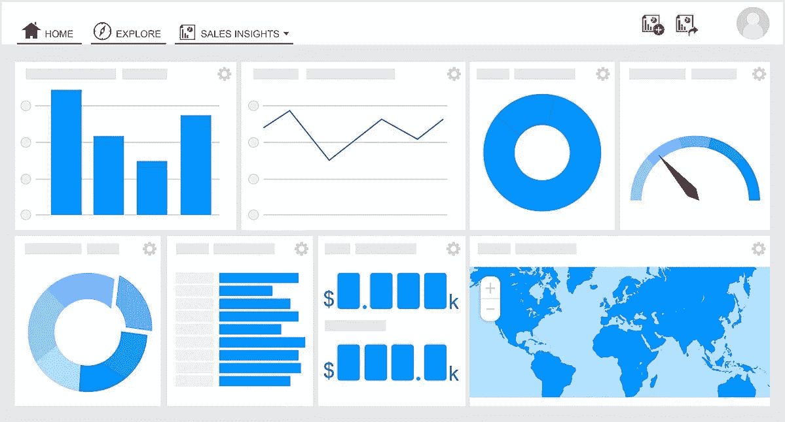
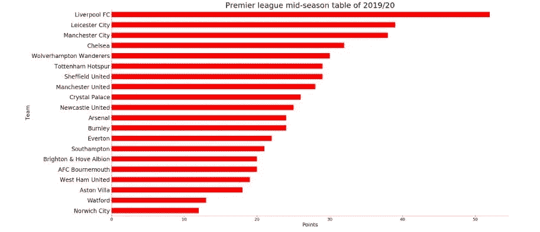
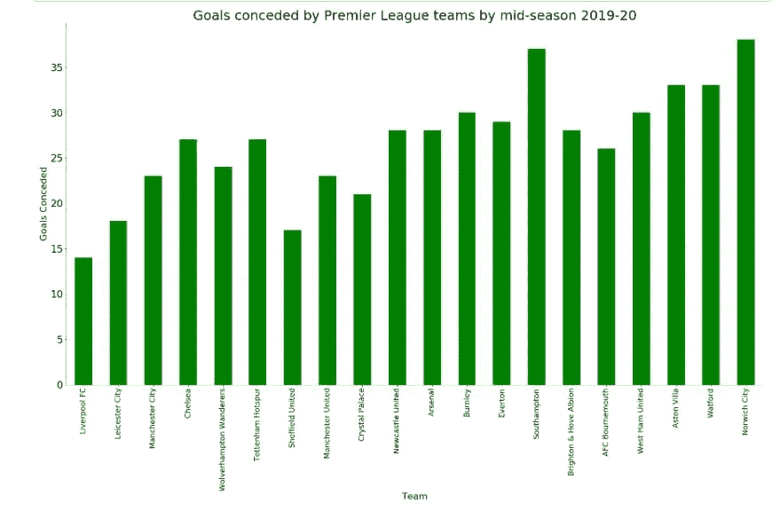
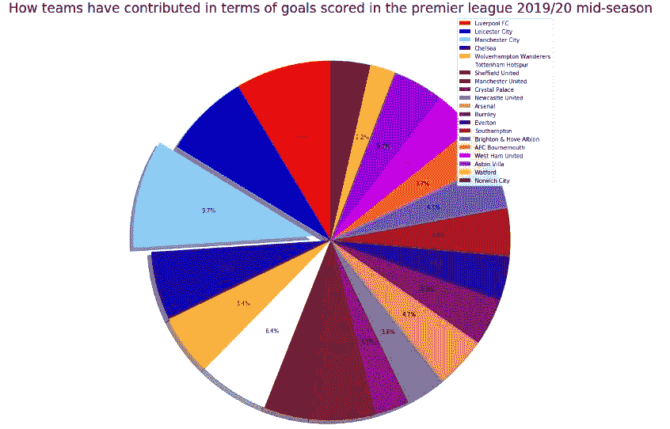
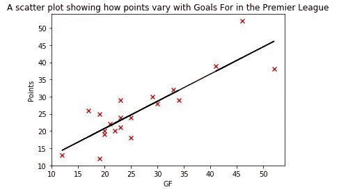
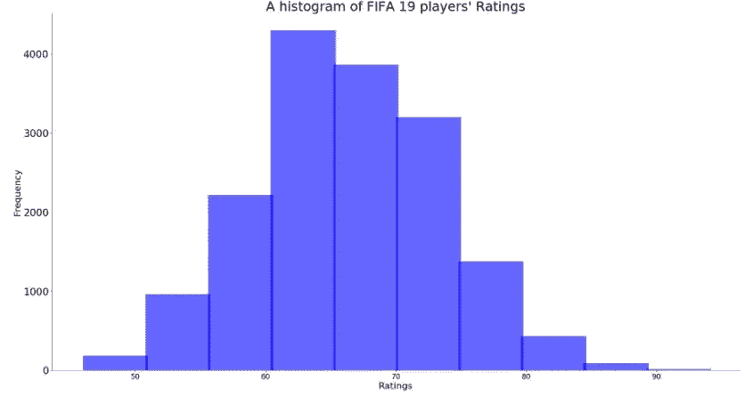
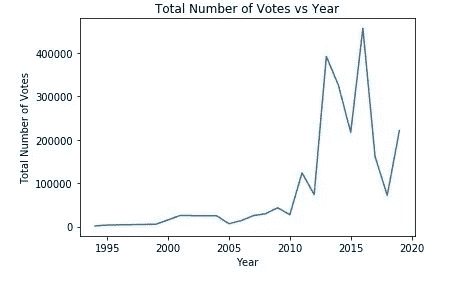

# 数据可视化是如何工作的！

> 原文：<https://towardsdatascience.com/how-data-visualization-works-12c6a4543d52?source=collection_archive---------18----------------------->

## 如何有效地将告知人们的数据可视化？

[照片致谢](https://commons.wikimedia.org/wiki/File:Infruid%27s_Self-Service_BI_Tool_Dashboard.jpg)

戴帽子那天，我简直不敢相信我所看到的。令我惊讶的是，比特币的价格创下历史新高，价值 19783 美元。我很难抑制这种兴奋的感觉。这种感觉并非源于我对比特币价格之高感到多么惊讶，而是因为折线图完美地描述了比特币是如何快速增长的。每当我看到一张完美地描述数字的图表时，我都会有同样的感觉。

每天，我都会遇到以视觉上吸引人的格式呈现的数据，这些数据解释了这些数字的含义，并给了我如何处理这些信息的见解。我对这些图形/图表越感兴趣，就越被数据可视化所吸引。数据可视化是处理捕获数据的研究领域，目的是有效地显示数据，以便任何人都可以很容易地对数据集进行推断。

数据可视化是数据科学的主要支柱之一。它使用形状、线条和其他形象化的方法来描绘数字。有多种技术可用于根据可用的数据类型来呈现数据。本文将重点介绍其中的五种:条形图、饼图、散点图、直方图和折线图。

# 条形图

条形图是数据可视化的一个方面，它将分类数据的数值显示为条形，以便对数据点进行相互比较。这是通过根据数字的大小来增加或减少条形的大小来实现的。条形图有两种类型:水平条形图和垂直条形图。

显示赛季中期英超联赛积分最高的球队的横道图。

显示球队在赛季中失球情况的垂直条形图。

水平条形图更擅长以升序或降序显示数据。垂直条形图在不使用连续数字顺序的情况下更擅长呈现数据，尤其是当只有一个数据点重要时。

# 圆形分格统计图表

饼图是一种比较不同数据点对整体贡献大小的图表。每个数据点都有一个百分比，可以表示为一片饼图，加起来就是一个完整的饼图。这就是为什么它被称为饼图。百分比越大，份额越大，反之亦然。所有的百分比加起来是 100%。

一个关于英超球队如何在英超 2019/20 赛季中期进球方面做出贡献的饼图，同时突出显示最高的。

在上面的饼图中，有一个圆圈，所有百分比加起来是 100%。在它的右边，有一个所有切片标签的图例。

# 散点图

散点图是比较两个变量的两组数值的图。它将其中一个变量的数字放在横轴(x 轴)上，另一个放在纵轴(y 轴)上。然后，它将数据点绘制为符号，其中数据点的数值在图形上相交。

绘制这些符号后，可以进行进一步的计算来测量两个变量之间的关系强度。这是使用相关系数来完成的。相关系数范围从-1 到+1。负值表示它们具有相反的关系，即 x 增加，y 减少，反之亦然。正值表示它们有直接关系，即随着 x 的增加，y 也增加。相关系数越接近|1|越完美。

散点图的另一个有用功能是创建回归线。通过创建一个使用 x 轴上的自变量来预测 y 轴上的因变量的方程，可以建立一条回归线。

一个散点图显示了 2019/20 赛季中期英超球队累积的积分如何随着进球而变化

# 柱状图

直方图是一种图形机制，用于计算一个数值在给定数据集中出现的次数。它通过在特定数字的固定宽度内将数值分组为不同的组来实现这一点。它计算每组中的数值出现的次数，并利用一个条形来表示其频率。组中的数值越频繁，条形越大。

FIFA 19 球员评分直方图。

上图是一个正常的倾斜数据，因为大部分数据位于正中间。这表明均值=中位数=众数。如果大部分数据位于图表的左侧，则称之为正偏态，意味着 mode <median if="" most="" of="" the="" data="" are="" on="" right="" side="" graph="" it="" is="" called="" negatively="" skewed="" implying="" that="" mode="">median>mean。最大的条形被称为众数，因为它由出现频率最高的数值组成。</median>

# 折线图

折线图是一种图表，主要用于显示某个变量在一段时间内的变化情况。这是通过在 x 轴上绘制时间，在 y 轴上绘制变量来实现的。它使用线条将前面的数据点与后面的数据点连接起来。

显示 IMDb 年度投票总数多年来变化的线形图

# 结论

数据可视化的力量在当今世界显而易见。政治家、体育专家、记者、工程师和会计师使用数据可视化技术向人们传达全面的重要信息，让他们更好地了解正在发生的事情。