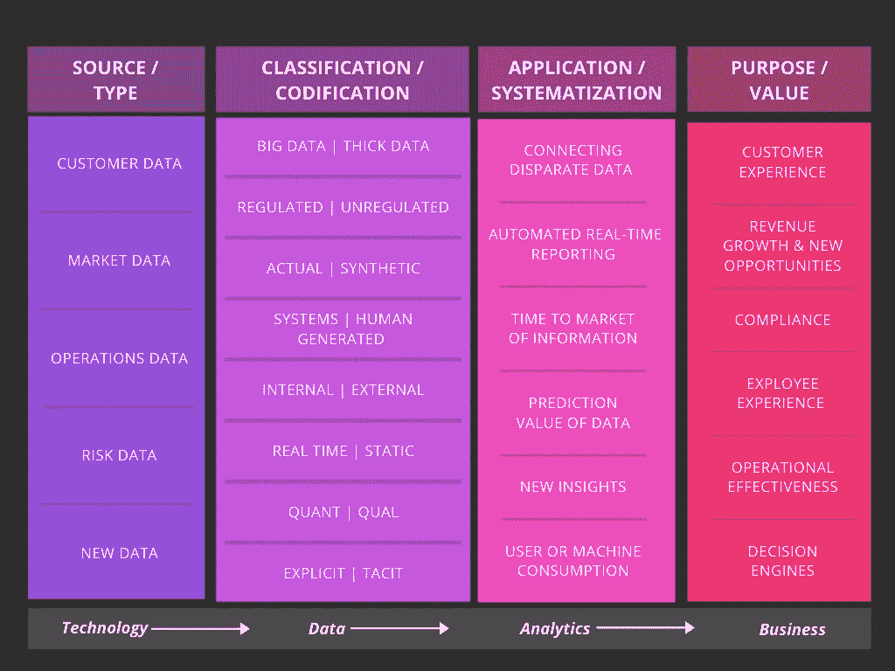
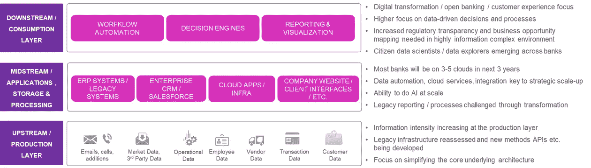
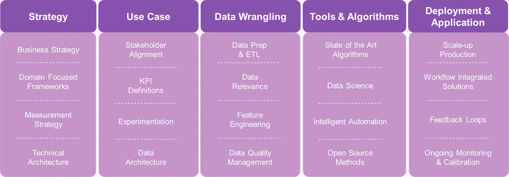

# “数据化”如何重塑金融服务

> 原文：<https://towardsdatascience.com/how-datafication-is-reshaping-financial-services-8295eab56fca?source=collection_archive---------42----------------------->

弗兰基·查马基在 [Unsplash](https://unsplash.com?utm_source=medium&utm_medium=referral) 上拍摄的照片

自近 500 年前成立以来，金融服务业一直是最具活力的行业之一，并已转变为全球经济的支柱。然而，30 年前，现代金融业开始见证多种形式的重大结构变化——监管压力、客户动态、新进入者、整合、金融科技和数字。虽然这些变化并没有对这个行业(比如店面零售)构成生存威胁，但它们挑战了现状，从而创造了加速变革的需求(点击这里阅读我的背景故事[)。新冠肺炎造成的大规模混乱很可能会进一步加速变革的需要。](/kinetic-knowledge-for-financial-innovation-in-the-20s-f137f46ba383)

*发生的变化&数据化的作用*

如果我们从历史角度来看金融机构提供的核心服务和价值主张，似乎*核心服务*在很长一段时间内保持了相对的相似性和弹性。这些包括:1)存款、贷款&交易 2)信贷管理和服务 3)金融咨询&投资 4)公司融资 5)风险管理。随着经济的增长和全球化，这些服务的复杂性和规模都在增长，但核心服务基本保持不变。另一方面，*价值主张*(专业知识、经验、规模、关系管理和交易流动性)虽然随着时间的推移在主题上保持一致，但随着结构性变化&技术进步而发展更快。考虑存款或贷款产品。与 50 年前相比，今天的基础产品可以说非常相似，然而，我们今天通过应用程序申请、获取和管理资金的方式却非常不同。

*数据化是一种更近的趋势，被定义为将我们生活的许多方面转化为数据的技术趋势，这些数据随后被转化为信息，实现为一种新的价值形式。金融行业是跨产品和流程的数据密集度最高的行业之一，因此，由于*数据化，它很可能是最受干扰的行业之一。* *考虑到历史，它更有可能从几个方面影响银行提供的价值主张，甚至有可能扰乱核心服务产品。**

这当然不是小事，因为多年来银行已经变得非常复杂。例如，最受尊敬的银行之一 JP 摩根就建立在近 1200 家前身机构的基础上。然而，金融机构正开始突破噪音和复杂性，设计清晰的战略，利用*数据化*为自己谋利(见下文)。*在这方面做得好的金融机构将获得增量收益，而在这方面做得非常好的机构，最终将实现指数级转型！*

金融机构从数据到资产的旅程，作者 Amit Shanker

*数据是新的石油，是老生常谈，但最适用于金融机构*

总的来说，信息对这个行业来说并不新鲜，因为它一直依靠快速、全面和准确的数据和知识来赚钱。然而，为了更广泛、更深入地受益于*数据化*，金融机构不得不审视其整个数据价值链，并“疏通”以推动战略变革。石油的类比在此最为恰当，以下描述了价值链中正在实施的一些关键变化:

重新评估银行生态系统中的数据价值链，作者 Amit Shanker

*系统化&基于用例的编码以产生最大价值！*

人工智能、机器学习、云计算和工程正在以显著的速度向前发展，许多甚至在 5 年前不可能的事情现在已经成为“开箱即用”的可能性。这是成功/不成功的金融机构在设计其数据化战略、路线图和执行计划时真正与众不同的地方。在用例级别，这大致映射到 4 个类别。数据使用情形将影响:

1.  学习速度—自动化和自主化较低复杂性和可重复的任务，以专注于更高形式的思考和执行
2.  可扩展性比率—工业化并连接数据生态系统，以开发更深入的机构知识
3.  外化率——尽可能编纂和扩展隐性知识
4.  创新速度—发现和策划新的见解以推动业务绩效

一个用例的旅程(策略→执行→管理)需要几个参与者和系统化的方法(如下所示)来产生期望的价值:

多学科用例之旅，作者 Amit Shanker

对于大多数金融机构来说，这一旅程仅在几年前才开始，然而，随着*数据化*将明显与绩效和价值主张挂钩，未来十年将会看到更高的关注度。难怪像高盛和 JPM 这样的公司一直称自己为科技公司而不是银行！