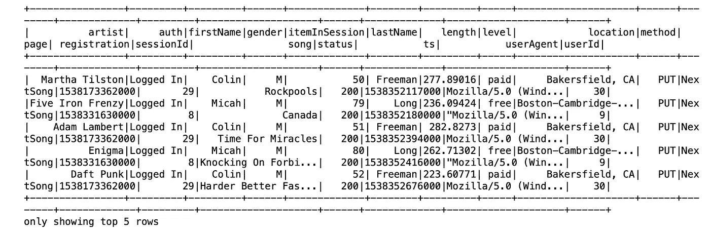
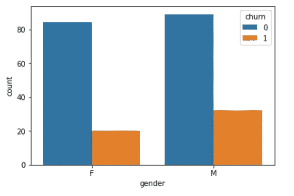
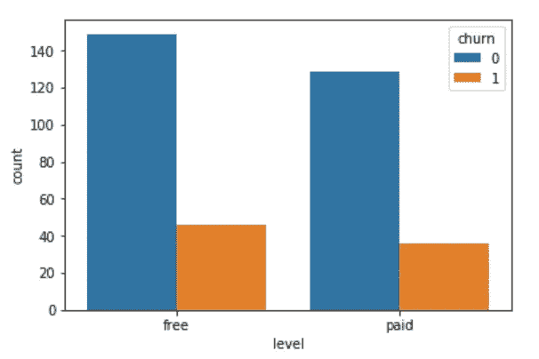
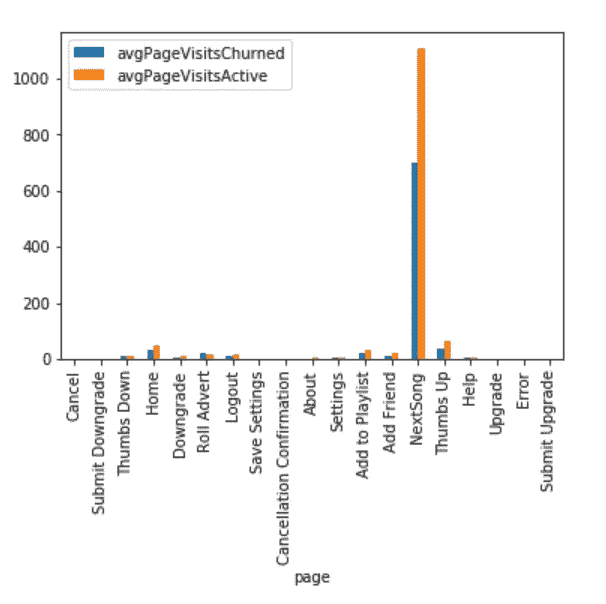
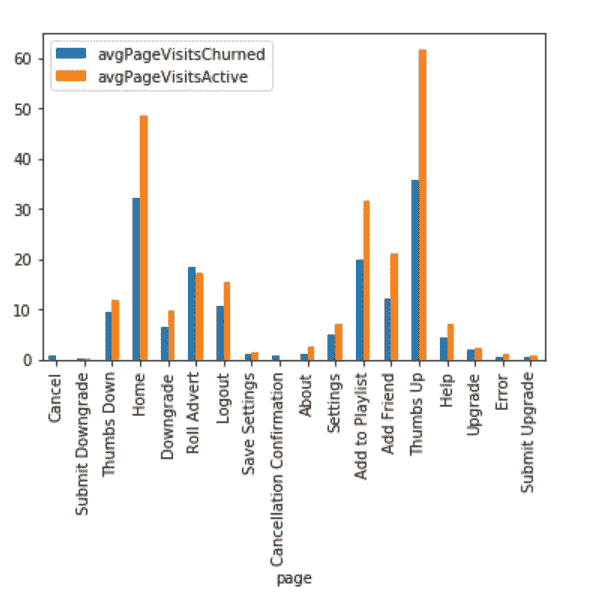
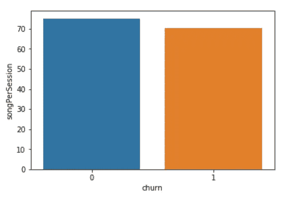
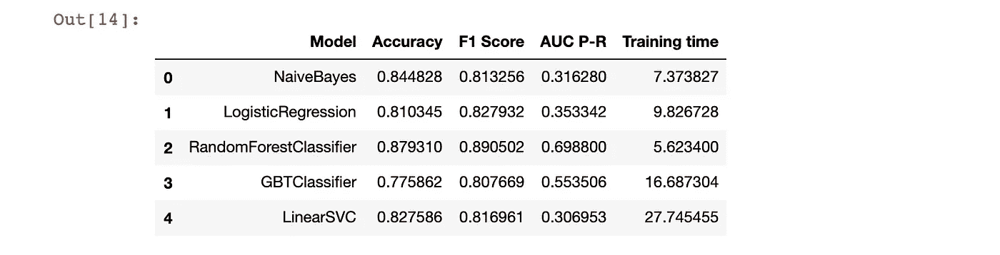
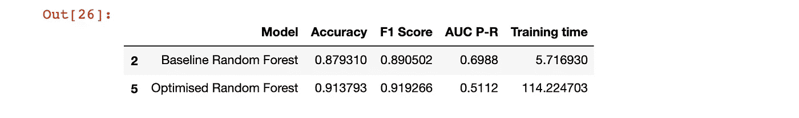
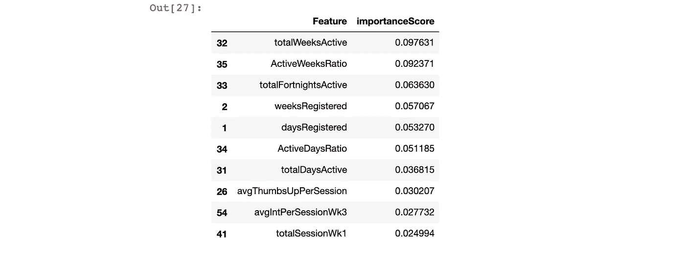

# 他们的爱有多深？

> 原文：<https://towardsdatascience.com/how-deep-is-their-love-749bc9913c66?source=collection_archive---------68----------------------->

## 机器学习的最大成功:预测客户流失(专长。PySpark)


亚历山大·辛恩在 [Unsplash](https://unsplash.com?utm_source=medium&utm_medium=referral) 上的照片

我们说的是客户流失。不，不是那种会威胁到你的腰带或给你的动脉涂上美味黄油的那种。然而，如果任其发展，这种类型的流失*会威胁到许多企业的生命。*

客户流失，也称为客户流失，是指在一段固定时间内停止使用公司产品或服务的客户数量。失去客户就意味着失去收入。在可以避免的客户流失方面，英国企业每年损失 250 亿英镑。如果一个企业能够正确识别可能离开的客户，那么他们可以提供折扣或激励来减轻这种情况。通常情况下，谁会离开*的线索就在客户交易数据库中，如果你只是跟踪大数据中的面包屑…*

在本帖中，我们将为一家虚构的公司开发一个简单的客户流失预测模型，这家公司提供一种想象中叫做 Sparkify 的音乐流媒体服务。他们的商业模式与(几乎)同名的 Spotify 相同。用户可以选择两种订阅类型:

*   免费等级计划的功能有限，并且会中断带有广告的音乐流
*   付费等级计划，包含所有可用功能和无广告音乐流。

用户不受任何会员类型的限制，不仅有机会随时升级或降级他们的订阅级别，还可以直接取消订阅。这种灵活性自然伴随着巨大的风险:如果用户对服务不满意，他们可以也愿意用脚投票。

# 问我，问我，问我(解决你的业务问题)

Sparkify 管理层担心流失率，并希望预测哪些客户有取消帐户的风险。我们有事件日志的样本数据集、jupyter 笔记本、Apache Spark 的 [PySpark API](https://spark.apache.org/docs/latest/api/python/index.html) 和 [PySpark ML 包](https://spark.apache.org/docs/2.2.0/api/python/pyspark.ml.html)的工作知识。一个女孩还想要什么？

# 臭名昭著的 B.I.G .(数据)

在 Sparkify 上执行的每个活动都被记录在事件日志中。

是的，这个也是。GIF via [Giphy](https://giphy.com/gifs/90s-music-video-vanilla-ice-Jale8dlFc4ASs)

一直在重复播放《心痛如碎》吗？那会被记录下来。在旅途中获得最佳蓝色播放列表？我们就能跟踪那里的创造。任何行动，无论多么可信或尴尬，都不会被遗漏。

我们得到了一个. json 文件，其中包含 2018 年 10 月至 12 月的事件日志数据。它由 286，500 行和 18 列组成，详细描述了客户的特征和正在执行的操作的性质。



不错的选择蠢朋克的歌有科林

在一些简单的数据检查和由此产生的数据清理(删除属于用户 ID 的行)之后，我们剩下 225 个客户的 278，154 行事件数据。他们一定很忙！

# 定义(-可能)

要建立一个预测模型，我们必须要有可以预测的东西。当且仅当客户访问了“取消确认”页面时，我们将客户定义为**被搅动的**。我们使用这个定义来创建一个二进制标志，它将成为我们开发的分类模型的目标变量。

请注意，在我们的定义中，有一个案例将访问“提交降级”页面的客户包括在内。然而，这些客户在那次页面事件后仍然很活跃。免费用户仍然通过广告赚 Sparkify 的钱。因此，这些客户对公司收入的威胁不如那些取消订单的客户大。

***注意:*** 只有 52 个客户翻腾:我们的数据不平衡。因此，我们必须明智地选择用于评估基于这些数据的模型性能的指标。

# 你的照片(r 数据)

配备了一个目标变量，我们询问数据的预测特征，以输入到机器学习算法中。



按客户流失划分的性别(左)和订阅级别(右)

*   性别:从上图可以明显看出，男性比女性更有可能取消约会。(在我的约会历史中也是如此)
*   **订阅水平:**我们可以推断，付费订阅的客户比免费会员更不容易离开。(哦，那么也许我应该让他们在约会的时候付晚餐的钱？)



按流失划分的平均页面浏览量:包括“下一首歌”(左)，不包括“下一首歌”(右)

*   **页面浏览量:**以上数字显示了用户查看某一特定页面的平均次数。在整个数据集中，大部分活动都归因于播放下一首歌曲。其他页面上的趋势与左边的相比相形见绌，因此我们提供的数据也删除了“下一首歌”的浏览量。请注意，在“主页”、“添加朋友”、“添加到播放列表”、“下一首歌”、“竖起大拇指”和“注销”方面，活跃客户与不活跃客户之间存在显著差异



按流失划分的每个会话的平均歌曲数量(左)；按流失划分的注册周数分布(右)

*   **每次播放的歌曲:**平均而言，顾客每次播放的歌曲较少。
*   **注册周:**活跃客户比不活跃客户的注册时间更长。

我们看到的上述一些特征并没有明确地包含在数据中。相反，我们操纵数据来创建更具预测性的客户级特征。

# 不要停止，直到你得到足够的(功能)

在这种情况下，我们从数据集中的现有要素为创建新要素。我总共构建了 65 个特性。这些可以大致分为:

65 功能是一个*很多*的能量来处理；GIF via [Giphy](https://giphy.com/gifs/cute-aww-eyebleach-322FvxfciE8UsYvILG)

*   自注册以来的时间和最近的活动
*   订阅级别
*   会话/交互计数
*   主页/添加朋友/添加到播放列表/下一首歌/竖起大拇指/注销页面浏览量
*   日/周/夜活动和活动比率
*   最近一次活动前 1、2、3、4 周的会议/互动/现场时间
*   与前两周相比，最后两周的活动比率。

我不会详细介绍这个特性工程是如何完成的。你可以在这篇文章附带的 [GitHub repo](https://github.com/bev-o-neill/DSND-p7-Sparkify) 中找到这些乐趣。然而，有必要强调一下与 PySpark 争论数据的几个关键技巧:

*   **用户自定义函数** (UDF)允许您定义新的基于列的函数。
*   **窗口函数**允许您在一组特定的行子集上定义新的基于行的函数。

以下是如何在特征工程中使用这些技术的快速入门:

```
#Number of days since registration
#Create window function
w1 = Window.partitionBy(‘userId’)#Create udf for calculating the difference in weeks of two timestamps
diffWeeks = udf(lambda x, y: (x-y)/604800000)#Earliest and latest timestamp variables
dfTimeStamps=withChurn.withColumn(‘tsMin’, min(‘ts’).over(w1))
dfTimeStamps=withChurn.withColumn(‘tsMax’, max(‘ts’).over(w1))#Weeks user is registered
weeksRegistered=dfTimeStamps.select(“userId”,”tsMax”,”registration”,”churn”).dropDuplicates()\
 .withColumn(“weeksRegistered”, diffWeeks(col(“tsMax”),col(“registration”)).cast(“float”))
```

***小心*** : [谨防加入！因为他们很敏感，容易发怒。在经历了太多内存不足的错误之后，我只能求助于限制连接，除非完全有必要。](/the-art-of-joining-in-spark-dcbd33d693c)

在我们为建模做好准备之前，我们还有几个最后的步骤来整理我们的数据:

*   将对应于性别和订阅级别的两个分类变量转换为数字变量。
*   删除多余的功能。

# 模型

好吧，不是这种类型的建模；GIF via [Giphy](https://giphy.com/gifs/black-and-white-music-video-madonna-iqdvmjxie4Zby)

PySpark ML 包有许多二进制分类器模型供我们选择。我们将训练五种不同的算法，找出性能最好的一种，然后运行超参数调整来进一步增强它。

我们将数据集分为训练(70%)和测试(30%)，并创建一个训练管道(通过 **pyspark.ml.** 管道 **)** ，它执行以下操作:

*   收集向量列中的所有要素(使用 **pyspark.ml.feature** 中的 VectorAssembler 类)。因此，我们有两列:一列对应于功能，另一列对应于标签(即流失结果标志)。
*   通过最小-最大缩放来缩放所有要素(使用 **pyspark.ml.feature** 中的 MinMaxScaler 类)。请注意，这意味着数据仍然保持其分布，而不是标准化。
*   使用默认参数训练指定的分类器。
*   计算精确度、F1 分数、精确度-回忆曲线下的面积和总训练时间。

```
#Create assembler and scaler for our pipeline
    #Transform features into features vector column
    assembler = VectorAssembler(inputCols=feature_cols,outputCol="featuresVector")#Scale the features    
    minmaxscaler = MinMaxScaler(inputCol="featuresVector", outputCol="scaledFeatures")#Performance metrics 
    evaluatorAcc =    MulticlassClassificationEvaluator(labelCol='churn', predictionCol='prediction', metricName='accuracy')
    evaluatorF1 = MulticlassClassificationEvaluator(labelCol='churn', predictionCol='prediction', metricName='f1')
    evaluatorAUPR = BinaryClassificationEvaluator(labelCol='churn', metricName='areaUnderPR')

#Pipeline for classifier using default parameters
    pipeline = Pipeline(stages=[assembler, minmaxscaler, learner])
```

下表给出了我们收集的结果:



初始模型结果

**度量混乱**:当目标变量的类别平衡时，你就可以兴致勃勃地使用准确度和基尼系数。[当数据不平衡时不如此](https://machinelearningmastery.com/failure-of-accuracy-for-imbalanced-class-distributions/)。在这种情况下，它们可能被夸大和误导。别害怕，我们的超级英雄来了！

**引入 F1 得分和精确回忆曲线下面积(AUC P-R):** 将这些视为不平衡人口的准确度和基尼系数[等价物。](https://machinelearningmastery.com/roc-curves-and-precision-recall-curves-for-imbalanced-classification/)

初步结果表显示，随机森林是最好的全能:F1 得分第一，AUC P-R 第一，跑得最快。毫无疑问，这个模型是我们应该继续进行超参数调整的，看看我们是否可以进一步改进它。

# 走开

通过 **pyspark.ml.tuning** 中的 ParamGridBuilder 类和 **pyspark.ml.tuning** 中的 CrossValidator 类，我们优化了随机森林，使用三重交叉验证来划分训练数据集，并对以下所有组合执行网格搜索迭代

*   *杂质*(熵，基尼系数)
*   *最大深度* (3，4，5)
*   最大箱数(5，10，15)

```
#Create assembler and scaler for our pipeline
#Transform features into features vector column
assembler = VectorAssembler(inputCols=feature_cols,outputCol="featuresVector")#Scale the features    
minmaxscaler = MinMaxScaler(inputCol="featuresVector", outputCol="scaledFeatures")#Performance metrics 
evaluatorAcc = MulticlassClassificationEvaluator(labelCol='churn', predictionCol='prediction', metricName='accuracy')
evaluatorF1 = MulticlassClassificationEvaluator(labelCol='churn', predictionCol='prediction', metricName='f1')
evaluatorAUPR = BinaryClassificationEvaluator(labelCol='churn', metricName='areaUnderPR')

#Pipeline for classifier using default parameters
pipeline = Pipeline(stages=[assembler, minmaxscaler, RF])paramGrid = ParamGridBuilder().addGrid(RF.impurity,['entropy', 'gini']) \
                              .addGrid(RF.maxDepth,[3,4,5])\
                              .addGrid(RF.maxBins,[5,10,15])\
                              .build()cv = CrossValidator(estimator=pipeline,
                    estimatorParamMaps = paramGrid, 
                    evaluator = evaluatorAUPR,
                    numFolds=3,seed = 97)
```

下表给出了我们收集的结果:



基线与优化的随机森林

我们设法提高了 F1 分数，但降低了 AUC P-r。F1 分数是在特定阈值*下计算的精确度和召回率的调和平均值*。精确度-召回率曲线是精确度和召回率在*所有阈值*之间相互作用的图形表示。我们得出的结论是，与基线随机森林相比，优化模型对于特定阈值更好，但实际上对于所有阈值都更差:它是较差的分类器！

那么，在我们的优化模型中，什么特征最具预测性呢？随机森林算法对此进行计算，并提供一个 *feature_importances* 属性，可以访问该属性来检索每个输入要素的相对重要性分数。下表显示了优化模型的前十名得分:



优化模型的 10 大特性

大体上，这些变量对应于以下内容:

*   用户在数据集内活动的天数/周数
*   用户活动天数/周数的比例
*   用户注册了多长时间
*   每次会话的平均赞数
*   活动最后一周的平均互动次数
*   最终活动前第三周的会议总数

经过思考，我们可以看到其中许多是高度相关的，注册的周数( *weeksRegistered* )和注册的天数( *daysRegistered* )。这些功能应该在模型开发之前就已经删除了。这让我们深入了解了构建一个好模型的迭代过程！

# 如果我能让时间倒流

正如我们所看到的，我们可以对我们的模型构建过程进行一些调整，将它从一个普通的 B 端轨道变成最受欢迎的专辑。

*   探索更多行为改变特征。目前，我们有一个变量，看起来是最近两周与前两周相比的活动比率。也许在特定时间段内查看歌曲播放比率或会话计数比率有更强的预测特征。
*   不要用厨房水槽的方法来处理模型特征。通过把所有东西都扔进模型，我们让自己暴露在异常值面前，扭曲了我们的模型。
*   调整并再次调整:尝试更多的超参数，并绘制不同参数值下 F1 的差异。这将为您提供模型何时开始过度拟合以及最佳范围在哪里的指示。一旦你找到了那个信息，你就在那个范围内调谐。
*   把它带到云上:我们使用的数据只是 AWS 或 IBM Watson 上的 12GB 大数据集中的 124MB。通过在 Spark 中编写所有内容，我们确保了它的可扩展性。我们可以轻松地将代码转移到 Spark 集群上运行，对于这些集群来说，大数据不是什么挑战。

那么，谁准备好复出巡演了？

*如果你喜欢在这个模型构建的引擎盖下修修补补，那么请查看我在 GitHub 上的知识库:*[*https://github.com/bev-o-neill/DSND-p7-Sparkify*](https://github.com/bev-o-neill/DSND-p7-Sparkify)

*感谢乐队成员 Udacity，他们提供了数据集供我们使用。*