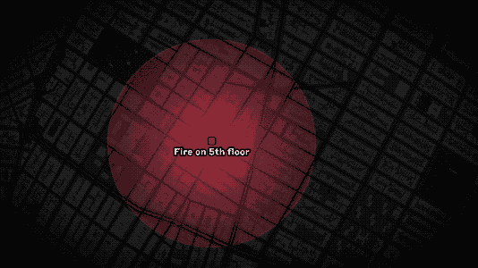
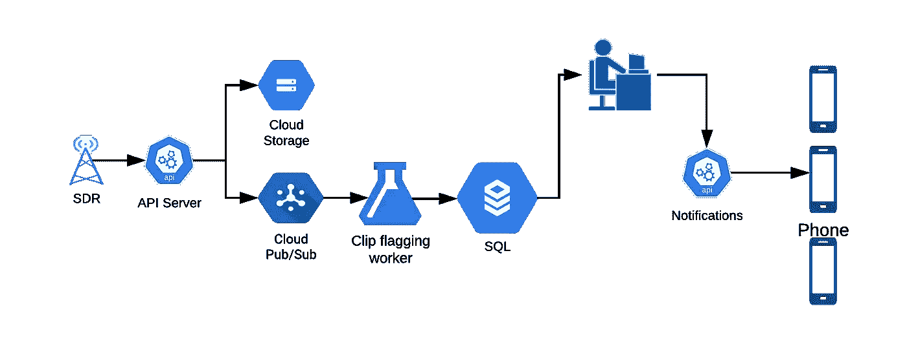
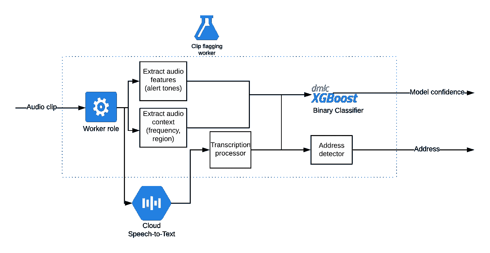
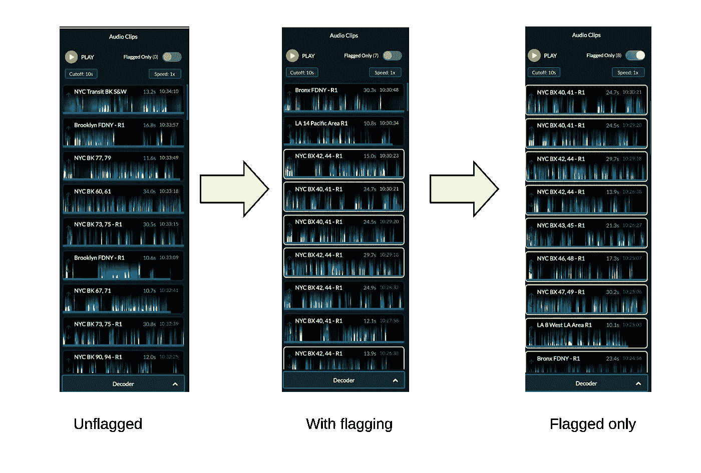
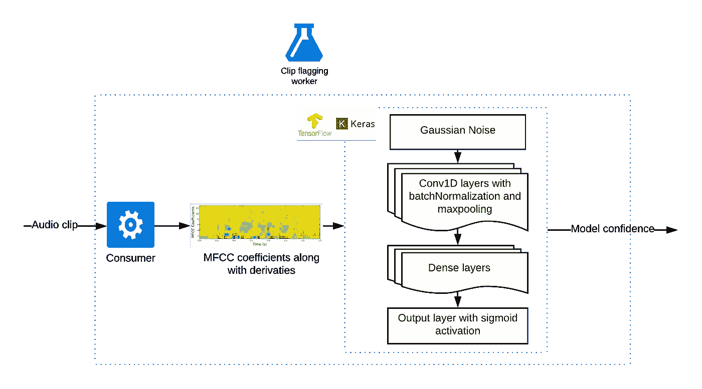
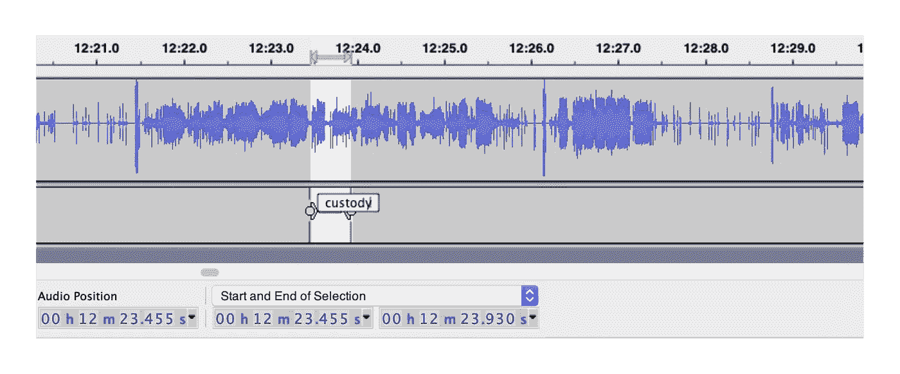

# 深度学习如何通过实时犯罪警报保护您的安全

> 原文：<https://towardsdatascience.com/how-deep-learning-can-keep-you-safe-with-real-time-crime-alerts-95778aca5e8a?source=collection_archive---------41----------------------->

## [变更数据](https://towardsdatascience.com/tagged/data-for-change)

## 使用卷积神经网络打开 911 系统

图片来自[市民](http://citizen.com/mission)，经允许转贴

[公民](https://citizen.com/)在美国各大城市全天 24 小时扫描数千个公共急救无线电频率。收集的信息用于向超过 500 万用户提供关于火灾、抢劫和失踪人员等事件的实时安全警报。让人们每天听 1000 多个小时的音频使公司推出新的城市非常具有挑战性。为了继续扩大规模，我们建立了能够从音频中发现关键安全事件的 ML 模型。

我们的定制软件定义无线电(SDR)可捕捉大量射频(RF ),并创建优化的音频剪辑，发送至 ML 模型以标记相关剪辑。标记的片段被发送给运营分析师，以在应用程序中创建事件，最后，事件附近的用户会收到通知。

图一。安全警报工作流程(图片由作者提供)

# 使公共语音转文本引擎适应我们的问题领域

图二。使用公共语音转文本引擎的剪辑分类器(图片由作者提供)

我们从基于单词错误率(WER)的最高性能的语音到文本引擎开始。有很多警察使用的特殊代码不是普通方言的一部分。例如，一名 NYPD 军官通过发送“信号 13”请求增援部队。我们使用[语音上下文](https://cloud.google.com/speech-to-text/docs/context-strength)为我们的领域定制了词汇表。

我们还[增加了](https://cloud.google.com/speech-to-text/docs/boost)一些词来适应我们的领域，例如，“攻击”不是口语中使用的，但在我们的用例中很常见。我们必须使我们的模型偏向于检测“攻击”而不是“盐”。

> 调整参数后，我们能够在一些城市获得合理的转录准确度。下一步是使用音频剪辑的转录数据，并找出哪些与公民相关。

# 基于转录和音频特征的二元分类器

我们建立了一个二元分类问题的模型，将转录作为输入，置信度作为输出。 [XGBoost](https://xgboost.readthedocs.io/en/latest/) 在我们的数据集上给了我们最好的性能。

我们从一位曾在执法部门工作过的人那里了解到，在一些城市，关于重大事件的无线电广播之前会有[特殊警报声](http://brics.butlersheriff.org/help/radio/tones-on-brics/)，以引起当地警察的注意。这个额外的特性有助于使我们的模型更加可靠，尤其是在抄写错误的情况下。我们发现的其他一些有用的特性是警察频道和传输 id。

我们在运营工作流程中 A/B 测试了 ML 模型。在运行测试几天后，我们注意到仅使用模型标记剪辑的分析师创建的事件没有降级。

> 我们在几个城市推出了这种模式。现在，一名分析师可以同时处理多个城市，这在以前是不可能的！有了新的运营闲置产能，我们能够启动多个新城市。

图 3。模型推出导致分析师的音频显著减少(图片由作者提供)

# 超越公共语音转文本引擎

这个模型并不是解决我们所有问题的灵丹妙药。我们只能在几个音频质量好的城市使用它。公共语音转文本引擎在[手机型号](https://cloud.google.com/speech-to-text/docs/basics#select-model)上进行训练，其声学特性与收音机不同；结果，转录质量有时不可靠。旧的模拟系统噪音很大，转录完全不能用。

> 我们尝试了来自多个提供商的多个模型，但没有一个模型是在类似于我们数据集的声学配置文件上训练的，并且不能处理嘈杂的音频。

我们探索了用根据我们的数据训练的引擎替换语音转文本引擎，同时保持管道的其余部分不变。然而，我们需要[几百个小时的转录数据](https://arxiv.org/abs/1412.5567)来制作我们的音频，这非常缓慢而且昂贵。我们可以选择优化这个过程，只转录我们的词汇表中定义的“重要”单词，并为不相关的单词添加空格——但这仍然只是工作量的逐渐减少。

> 最终，我们决定为我们的问题域构建一个定制的语音处理管道。

# 用于关键词识别的卷积神经网络

> 由于我们只关心关键词的存在，我们不需要找到正确的单词顺序，可以将我们的问题简化为[关键词识别](https://en.wikipedia.org/wiki/Keyword_spotting)。这是一个更容易解决的问题！我们决定使用在我们的数据集上训练的卷积神经网络(CNN)来这样做。

在递归神经网络(RNNs)或长短期记忆(LSTM)模型上使用 CNN 意味着我们可以更快地训练和更快地迭代。我们还使用 [Transformer model](https://arxiv.org/abs/1706.03762) 进行了评估，它是大规模并行的，但需要大量硬件来运行。由于我们只是寻找音频片段之间的短期依赖性来检测单词，计算简单的 CNN 似乎是比 Transformers 更好的选择，它释放了硬件，使我们能够更积极地进行超参数调谐。

图 4。使用 CNN 进行关键词识别的剪辑标记模型(图片由作者提供)

我们将音频片段分成固定时长的子片段。如果一个词汇出现，我们给一个子片段一个肯定的标签。然后，如果在一个音频剪辑中发现任何这样的子剪辑，我们就将它标记为有用的。在训练过程中，我们尝试了改变子片段的持续时间如何影响我们的收敛性能。长剪辑使得模型更难判断剪辑的哪个部分是有用的，也更难调试。短剪辑意味着单词部分出现在多个剪辑中，这使得模型更难识别它们。我们能够调整这个超参数并找到一个合理的持续时间。

对于每个子片段，我们将音频转换成 [MFCC](https://en.wikipedia.org/wiki/Mel-frequency_cepstrum#:~:text=Mel%2Dfrequency%20cepstral%20coefficients%20(MFCCs,%2Da%2Dspectrum%22).) 系数，并添加一阶和二阶导数。这些特征是以 25 毫秒的帧大小和 10 毫秒的步距生成的。这些特征然后被输入到一个基于 [Keras 序列](https://www.tensorflow.org/api_docs/python/tf/keras/Sequential)模型的神经网络中，该模型使用 Tensorflow 后端。第一层是高斯噪声，这使得该模型对于不同无线电信道之间的噪声差异更加鲁棒。我们尝试了一种替代方法，即人为地将真实噪声叠加到剪辑上，但这显著地减慢了训练时间，并且没有有意义的性能增益。

然后我们添加了 Conv1D、BatchNormalization 和 MaxPooling1D 的后续层。批量标准化有助于模型收敛，最大池有助于使模型对语音中的微小变化以及信道噪声更加鲁棒。此外，我们尝试添加 dropout 层，但这些并没有有意义地改善模型。最后，我们添加了一个密集连接的神经网络层，它通过 sigmoid 激活馈入单个输出密集层。

# 生成标记数据

图 5。音频剪辑的标记过程(图片由作者提供)

> 为了标记训练数据，我们为注释者提供了我们领域的关键字列表，并要求他们标记剪辑中的开始和结束位置，以及单词标签(如果有任何词汇出现的话)。

为了确保注释的可靠性，我们在注释器之间有 10%的重叠，并计算它们在重叠的剪辑上的表现。一旦我们有了大约 50 个小时的标记数据，我们就开始训练过程。我们在迭代训练过程的同时不断收集更多的数据。

由于我们的词汇中有些词比其他词更常见，我们的模型在常见词上有合理的表现，但在例子较少的罕见词上有困难。我们试图通过在其他剪辑中叠加单词“话语”来创建这些单词的人工示例。然而，性能的提高与实际获得这些词的标记数据并不相称。最终，随着我们的模型在常用词方面的改进，我们在未标记的音频片段上运行它，并排除了模型发现这些词的片段。这有助于我们减少未来标签中的冗余单词。

# 模型发布

经过几次数据收集和超参数调整的迭代，我们能够训练一个对我们的词汇具有高召回率和合理精确度的模型。高召回率对于捕捉关键安全警报非常重要。有标记的剪辑总是在发送警报之前被收听，所以误报不是一个大问题。

> 我们在纽约市的一些区测试了这个模型。该型号能够将音量降低 50–75%(取决于频道)。它也明显优于我们在公共语音到文本引擎上训练的模型，因为纽约市由于模拟系统而具有非常嘈杂的音频。

有点令人惊讶的是，我们随后发现该模型可以很好地转换到来自芝加哥的音频，即使该模型是根据纽约市的数据训练的。在收集了几个小时的芝加哥片段后，我们能够从纽约模式中转移学习，以在芝加哥获得合理的表现。

# 结论

我们带有定制深度神经网络的语音处理管道广泛适用于美国主要城市的警察音频。它从音频中发现关键的安全事件，允许 [Citizen](https://citizen.com/) 迅速扩展到全国各地的城市，并为维护社区安全的使命服务。

选择计算简单的 CNN 架构而不是 RNN、LSTM 或 Transformer，并简化我们的标记过程是重大突破，使我们能够在很短的时间内和有限的资源下胜过公共语音到文本模型。