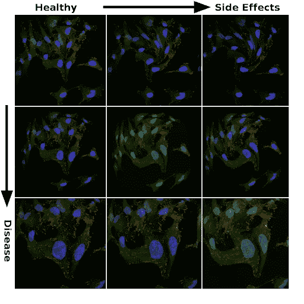
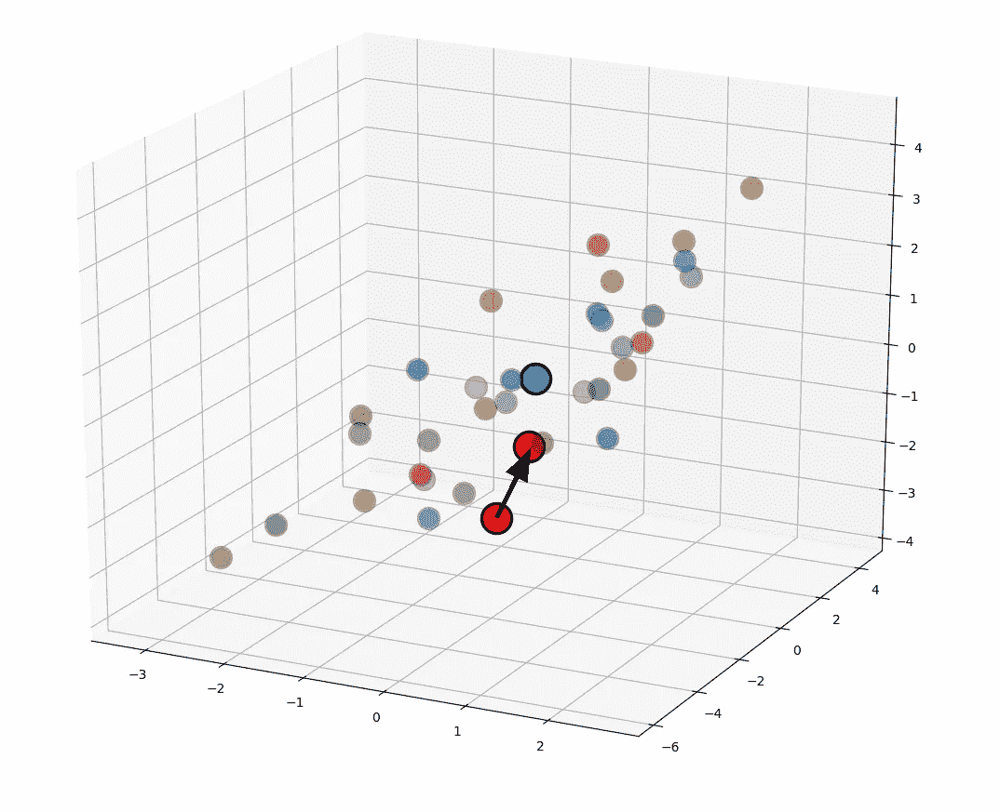
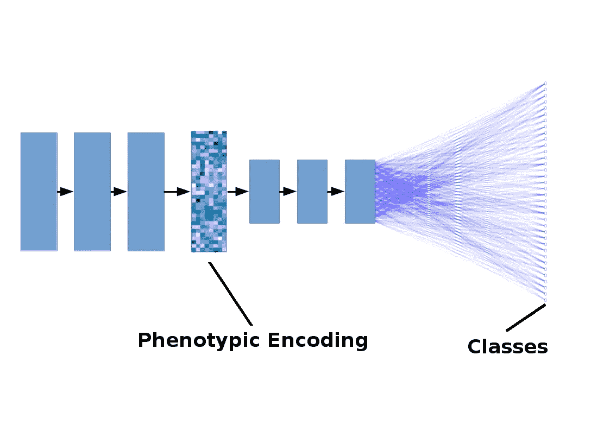

# 深度学习如何加速制药业的药物发现

> 原文：<https://towardsdatascience.com/how-deep-learning-is-accelerating-drug-discovery-in-pharmaceuticals-83182277d0cc?source=collection_archive---------23----------------------->

# 深度学习为人工智能药物发现方法提供动力

在长期失望的人中有一个常见的重复，它有点像这样:“如果这是未来，我的喷气背包在哪里？”将这种对复古未来的渴望与无处不在的计算世界、[可编程细胞](https://en.wikipedia.org/wiki/Cas9)和复兴的[太空探索](https://www.nasa.gov/mission_pages/newhorizons/main/index.html)相提并论，粗略一查就会发现这种抱怨听起来不合时宜。对一些人来说，这种错位的怀旧未来主义可能会非常持久。这导致了一种倾向，即坚持那些事后看来古怪的预测，而忽略了无人能预测的惊人现实。然而，随着[深度学习](https://blog.exxactcorp.com/category/deep-learning/)用于药物发现，我们现在能够预测更多！这在制药工业中非常重要。

应用于人工智能，具有这种行为方式的人可能会按照“AlexNet 已经过去近 8 年了，我的自动驾驶汽车/人工智能介导的乌托邦/压抑的人工智能霸主在哪里？”看起来 2010 年中期的期望确实没有实现，对下一个人工智能冬天的预测在悲观主义者中越来越流行。本文的目标是讨论在药物发现的现实世界应用中有意义的机器学习进展。我希望说服你考虑另一个古老的格言，这个来自人工智能研究人员，稍微解释一下:“人工智能只是人工智能，直到它工作，之后它只是软件。”我们将看到，几年前机器学习中的前沿基础研究，现在通常被命名为“仅仅”数据科学(甚至是分析)，并在扰乱制药行业方面取得了真正的进展。药物发现的深度学习方法甚至有很大的机会改变生活，更好地为世界做有意义的好事。

# 生物医学成像中的计算机视觉和深度学习

几乎是科学家一接触到计算机，就有可能将图像上传到计算机上，而且几乎是在那之后，人们就开始努力对这些图像进行数字化处理。这项工作的大部分过去和现在都专注于处理生物医学图像，如 X 射线、超声波和 MRI 数据。在“优秀的老式人工智能”时代，这通常意味着对边缘和亮度等简单特征的手工逻辑陈述。在 20 世纪 80 年代，有一个向整合监督学习算法的转变，但这些仍然依赖于手工设计的功能。简单的监督学习模型(例如线性回归或多项式拟合)将对通过诸如 SIFT(尺度不变特征变换)和 HOG(梯度方向直方图)等算法提取的特征进行训练。但是，几十年前就已经调查了将导致实用深度学习的发展，这应该不足为奇。卷积神经网络首次应用于生物医学图像是在 1995 年，当时 [Lo *等人*](https://www.semanticscholar.org/paper/Artificial-convolution-neural-network-techniques-Lo-Lou/04cc4ec565415a5cdedb884239b11a50720b3fc7) 推出了一种用于检测肺部 X 射线中癌结节的模型。他们的方法与我们今天已经习惯的方法略有不同，推理需要大约 15 秒，但概念本质上是相同的，通过反向传播一直到卷积核来完成训练。罗*等人*使用的模型有两个隐藏层，而当今流行的深度网络架构通常有一百个或更多。

快进到 2012 年:随着 AlexNet 的出现，conv 网大受欢迎，在现在著名的 ImageNet 数据集上产生了性能上的重大飞跃。AlexNet 是一个 conv 网络，具有 5 个卷积层和 3 个在游戏 GPU 上训练的密集连接层，它的成功在机器学习领域非常有名，以至于人们谈论 ML 和 AI 的不同利基的“ImageNet moments”。比如，“随着 2018 年超大型变压器模型的发展，自然语言处理可能已经有了它的 ImageNet 时刻”，或者“强化学习仍在等待它的 ImageNet 时刻。”自 AlexNet 开发以来已经过去了近十年，我们在深度学习计算机视觉模型方面已经有了大量的增量改进。除了分类之外，应用已经扩展到通常包括分割、深度估计和场景重建以及许多其他用途。围绕生物医学图像分析的深度学习的热潮的一个副作用是噪音不可避免的增加。2019 年发表的~ 17000 篇深度学习论文[并不是每一篇都值得一读。许多结果可能会过度拟合他们的小数据集，并且没有多少对正在研究的基础科学或机器学习做出实质性贡献。但是，之前对机器学习毫无兴趣的学术研究人员对深度学习的狂热揭示了一个重要的现实。深度学习可以做经典计算机视觉算法可以做的任何事情(参见 Cybenko 和 Hornik 的](https://scholar.google.com/scholar?as_ylo=2019&q=deep+learning+biomedical+imaging)[通用逼近定理](https://en.wikipedia.org/wiki/Universal_approximation_theorem))，它通常可以更快更好地做到这一点，同时减少与每个新应用相关的繁琐的人工工程工作。

# 抗击被忽视疾病的难得机会

这就把我们带到了今天的话题——药物研发，一个需要大换血的行业。制药公司和他们雇佣的人很快提醒我们将一种新药推向市场的巨大成本。这些成本很大程度上是由于许多药物进入了研发管道，并在被丢弃前停留了一段时间。行业估计开发一种新药的成本可能高达 25 亿美元或更多，尽管这个数字可能在很大程度上受到行业报告高成本的激励的影响，以证明其产品的溢价。在任何情况下，由于这种高成本和相对较低的回报率，像[抗生素类药物的基本工作被降低了优先级](https://www.forbes.com/sites/quora/2017/08/18/why-pharmaceutical-companies-arent-in-a-rush-to-address-increasing-antibiotic-resistance/)。

这也意味着被恰当命名为被忽视疾病类别的疾病，包括不成比例的被认为治疗无利可图的热带疾病和发病率低的罕见疾病。尽管患每种疾病的人数相对较少，但患这种或那种罕见疾病的总人数却相当高。据估计，全世界患有罕见疾病的人数约为 3 亿。但是，由于令人沮丧的预测，即使这个数字也可能是低的:大约 30%患有罕见疾病的人永远活不到五岁。

罕见疾病的[【长尾】](https://en.wikipedia.org/wiki/Long_tail)代表着改善大量生命的实质性机会，机器学习和大数据工程很乐意介入。制药行业对这些罕见疾病的盲点，特别是没有 FDA 批准的治疗方法的孤儿疾病，为生物学家和机器学习开发者的创新小团队提供了立足之地。考虑到大型制药公司雇佣的数据科学家的数量，用一个小团队建立真正新颖的东西需要找到一个阴影点，以更好地避免更多规避风险的既定实体的饥饿的眼睛。

犹他州盐湖城的一家这样的初创公司正在尝试这样做。 [Recursion Pharmaceuticals](https://www.recursionpharma.com/) 将缺乏针对被忽视疾病的有意义药物开发视为制药行业的空白，以推动全新工作流程的发展。基于自动化高通量显微镜和机器学习，他们通过机器人显微镜和液体处理产生大量新数据。深度神经网络的泛化和灵活性利用产生的海量数据在实验噪音中揭示疾病/治疗表型。截至 2019 年底，他们已经从[的数千次实验](https://www.linkedin.com/pulse/how-recursion-built-high-throughput-screening-lab-capable-ben-miller/)中产生了超过 4pb 的数据。他们打包了他们为 NeurIps 2019 竞赛赛道制作的一小部分数据，你可以从[的 RxRx 网站](https://www.rxrx.ai/)下载(46 GB)数据集来自己玩。

本文描述的工作流程很大程度上是基于 Recursion Pharmaceuticals 的白皮书[【pdf】](https://www.recursionpharma.com/wp-content/uploads/2017/09/AI-Enabled_Pheno-9_25_2017v24.pdf)中的信息，但这种方法没有理由不能作为传统制药公司未能取得进展的其他领域的灵感。事实上，这一领域的其他初创公司包括专注于[衰老相关疾病](https://bioagelabs.com/index.html)的 Bioage 实验室、致力于癌症的著名实验室[，以及专注于](https://notablelabs.com/)[各种缺乏治疗选择的疾病](https://www.twoxar.com/pipeline)的 TwoXAR。这些公司往往是年轻的初创公司，拥有新生的数据管道，他们在其感兴趣的领域采用各种各样的机器学习技术，除了或取代我们今天将讨论的计算机视觉深度学习。

我们将主要关注递归领导的方法，因为他们非常依赖图像模型，他们自 2013 年以来一直存在，他们已经发布了大量关于他们方法的信息，并且他们已经开始产生有希望的结果。我将描述图像分析过程，以及深度学习如何从高层次融入罕见疾病药物发现的工作流程，这些经验教训可以应用于药物发现的其他各种领域。例如，该工作流程可以很容易地通过对肿瘤细胞形态的影响来筛选癌症药物，甚至可以确定单个患者的细胞对一组药物选项的反应。该方法借鉴了[非线性 PCA](http://www.nlpca.org/) 、语义哈希[【pdf】](https://www.cs.cmu.edu/~rsalakhu/papers/sdarticle.pdf)和传统的 conv 网络图像分类的概念。

# 噪声形态学分类

生物很乱。这在高通量、高含量的显微镜检查中显而易见，也是细胞生物学家经常遇到的难题。任何给定实验产生的图像可能会因批次不同而有很大差异。温度、暴露时间、试剂批次等的波动都可能产生与所研究的表型或候选药物化合物的效果无关的误导性变化。实验室的气候控制在夏天和冬天表现不同吗？有人在午餐时将含有细胞的 96 孔板放在外面，然后放在显微镜上吗？有人换了一种培养基成分的供应商吗？供应商是否更换了自己的供应商？可能导致实验差异的变量数量是巨大的。在数据驱动的药物发现中，跟踪和分离非实验性扰动(也称为非预期噪声)的影响是一个主要挑战。

从一个实验到下一个实验，显微镜图像可能会有很大的不同。图像亮度、细胞形状、细胞器形状和许多其他特征会由于相关的生理效应或随机实验噪声而变化。本文顶部面板中的图像均来自斯科特·威尔金森和亚当·马库斯拍摄的转移性癌细胞的同一张[公共域显微照片](https://visualsonline.cancer.gov/details.cfm?imageid=10591)。强度和形态的变化代表了实验噪声，并且是使用图像处理扭曲创建的。这些是人们可能用来在分类任务中正则化深度神经网络的相同类型的增强，因此毫不奇怪，给定大数据集的大模型的泛化能力是在噪音海洋中揭示生理上有意义的差异的逻辑选择。

*噪声强度变化中代表治疗效果和副作用的变化。*

罕见疾病的潜在原因通常是基因突变。为了建立模型来发现这些疾病的治疗方法，了解大范围突变的影响以及由此产生的表型的相关性是有帮助的。比较特定罕见疾病的候选治疗方法受益于对数千种不同突变的库的训练，这些突变可以通过使用[小干扰 RNA](https://en.wikipedia.org/wiki/Small_interfering_RNA) (siRNA)敲低基因表达来模仿。这有点像初学走路的孩子抓住你的脚踝:即使你能跑得很快，如果你的侄女或侄子每条腿都挂着，你的效率会低得多。siRNA 的工作方式非常相似，干扰 RNA 的小序列粘附在特定基因的信使 RNA 的匹配片段上，阻止这些基因完全表达。

通过对成千上万的突变而不是特定疾病的单一细胞模型进行训练，神经网络可以学习在高维潜在空间中对表型进行编码。由此产生的代码允许评估药物使疾病表型更接近健康表型的能力，每个表型由一组多维坐标表示。同样，药物副作用可以嵌入编码的表型表示中，并且不仅可以根据减少疾病症状，还可以根据有害副作用的最小化来评估药物。

*表示对疾病细胞模型(用红点表示)治疗效果的图表，将编码的表型向健康表型(蓝点)靠拢。这是一个多维潜在空间中表型编码的简化三维表示。*

用于此工作流的深度学习模型将与其他大型数据集的分类任务非常相似，尽管如果您习惯于处理少量类别，如 CIFAR-10 和 CIFAR-100 数据集，数以千计的不同分类标签将需要一些时间来适应。除此之外，这种基于图像的药物发现将很好地与具有大约一百层的相同类型的基于深度 DenseNet 或 ResNet 的架构一起工作，这可能在像 ImageNet 这样的数据集上获得最先进的性能。通过将这些层之一的激活值作为表型的高维编码，可以通过在编码空间中的位移来分析疾病病理以及治疗、副作用和其他痛苦之间的关系。这种表型编码可以进行定制的正则化(例如最小化不同激活的协方差)以减少编码相关性或用于其他需要的目的。下图是一个简化的示例模型，黑色箭头表示卷积+池化操作，蓝色线条表示密集连接，为了清晰起见，减少了层数(没有显示剩余连接)。

*用于药物发现的深度学习模型的简化图示*

# 深度学习在药物研发和制药行业的未来

将一种新药推向市场的巨大成本导致制药公司忽视了对严重疾病所需药物的发现和开发，而青睐畅销药物。初创公司中规模较小、精通数据的团队更有能力在这一领域开发新的创新，而被忽视和罕见的疾病提供了一个机会，可以借此获得一只脚，并在数据驱动的管道中展示机器学习的价值。这种方法的价值证明体现在实质性进展和已经进入第一阶段临床试验的几种药物上，这些成就是由 Recursion Pharmaceuticals 等公司的数百名科学家和工程师团队取得的。其他初创公司紧随其后:TwoXAR 有几种候选药物正在通过其他疾病类别的临床前试验。

可以预计，用于药物开发的深度学习计算机视觉方法将对大型制药公司和医疗保健产生重大影响。我们应该很快就会在针对普遍疾病(包括像心脏病和糖尿病这样的现代生活方式疾病)的新疗法的开发中看到这种影响，以及在治疗迄今为止被搁置一旁的疾病方面急需的进展。