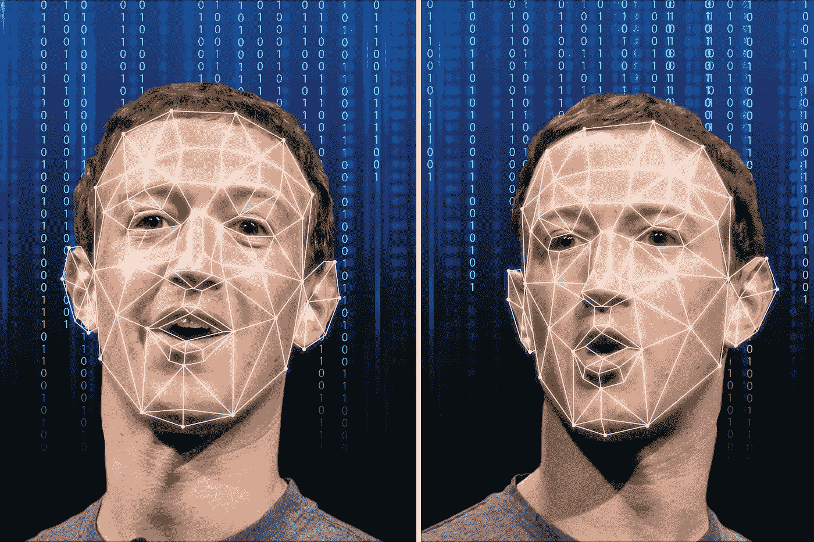

# 假技术会变得比核武器更危险

> 原文：<https://towardsdatascience.com/how-deepfake-technology-can-become-more-dangerous-than-a-nuclear-weapon-9d9e6723ea13?source=collection_archive---------25----------------------->

## 以及为什么我们应该认真对待这项技术

[https://images.app.goo.gl/mBRyJxxBq1bHFooN7](https://images.app.goo.gl/mBRyJxxBq1bHFooN7)

> “当权者不必再压制信息。他们现在可以向我们灌输太多，没有办法知道什么是真实的，什么不是。随着深度造假技术的发展，成为知情公众的能力只会越来越差。”安德鲁·施雷克

我们都听过唐纳德·特朗普把一些电视台称为“假新闻”，我们不应该听他们的。一半人相信他，另一半人不相信。

事实是，我们真的不知道该相信我们在电视或互联网上看到的东西。界限已经变得模糊，每个人都有自己的议程，他们希望观众看到什么。

如果你看了一段视频或看到一张照片，上面是你所爱的和信任的人，比如某个名人或竞选美国总统的人做了或说了一些可怕的事情，会怎么样？

你对这个人的看法会改变吗？你打赌你的屁股会。

现在你不知道这是一个假视频，也不知道这个人真的没有做任何事情。但是你的眼睛欺骗了你，你相信你所看到的。

该视频是由某人使用 deepfake 技术创建的，在该技术中，视频被操纵以对该人造成伤害。

那么，deepfake 到底是什么？让我们来看看。

# 什么是 Deepfake？

Deepfake 是人们利用神经网络创建看起来和听起来像真东西的假视频或音频记录的技术。他们制作这些视频是为了开玩笑，让名人陷入尴尬的境地，比如有一张名人拍色情照片，或者有政客说一些他们通常不会说的话。

这开始于 1997 年左右的视频重写项目中的计算机视觉领域的学术研究。它修改了一个人说话的现有视频片段，描述了在不同的音轨中说话的嘴。该项目使用机器学习技术在受试者发出的声音和受试者面部形状之间建立联系。

Reddit 的业余用户发现了这一点，开始制作名人头像出现在其他人身上的搞笑视频。deepfake 一词是由 Reddit 上的一个同名社区创造的，该社区互相交换幽默图片和视频。

既然你知道 deepfake 是什么，让我们来看看它是如何工作的。

# 它是如何工作的？

这项技术使用了生成式对抗网络(GANs)，其中两个机器学习模型一决雌雄。第一个模型在数据集上训练，然后创建视频伪造，而另一个模型试图检测伪造。这样继续下去，直到第二个模型不能检测到第一个模型中的假货。训练数据集越大，就越容易创建一个非常可信的 deepfake 来愚弄人们。

来自斯坦福大学、普林斯顿大学、马克斯·普朗克信息学研究所和 Adobe Research 的研究人员进行了一些测试，以显示操纵和编辑这些视频和图片是多么容易。科学家们结合了多种技术来制作视频赝品，并测试其简单程度。

首先，他们扫描目标视频，分离出构成受试者说话的声音。然后他们将这些声音与伴随每个声音的面部表情相匹配。最后，他们创建了受试者脸部下半部分的 3D 模型。

当其中一名科学家编辑视频的文本时，该软件将上述三个步骤中收集的所有信息结合起来，构建新的镜头，以匹配输入的文本。然后将其复制到源视频上，以创建最终结果。

我们正处于这项技术的早期阶段，该软件的功能还存在一些限制。但是有一些网站运行他们自己版本的软件，公众可以使用和玩。

# 在有人受伤之前，这总是有趣的游戏

这是我母亲过去经常对我说的话，我会和朋友们一起胡闹，我们中的一个开始变得疯狂。这是乐趣变得咄咄逼人和脾气爆发的地方。

任何新技术在开始时都是有趣和令人愉快的，当每个人都在用它逗别人笑的时候。但迟早，错误的人会试图找出一种方法来使用这个闪亮的新玩具来执行不良行为。历史告诉我们，这是不可避免的。

Deepfake 是新出现的，仍处于起步阶段，更多的是人们的爱好。但在未来几年，当更好的技术出现，有人发现如何制造这种邪恶时，它可能对我们所有人都具有潜在的破坏性。

你能想象有人发布一个深度伪造的视频，描述美国总统说一场大规模的核攻击正在进行中，或者一种不可阻挡的计算机病毒抢走了我们所有的钱，或者一种不治之症的爆发威胁着毁灭人类吗？

整个国家都会陷入巨大的恐慌，我们也不知道该怎么办。当人们试图逃离这个国家寻找安全避难所时，骚乱和抢劫就会发生。

# 结论

到目前为止，deepfakes 是一个有趣的新玩具，供人们玩，也是一个令人讨厌的东西。他们可以把布拉德·皮特的头像贴在一个拍摄色情片的演员身上，或者贴在乔·拜登说了一些不利于他竞选的话上。这些视频很容易被发现，并告诉他们是假的。

但是随着这项技术的成熟，如果错误的人掌握了它，后果可能是灾难性的。参议员马尔科·卢比奥称之为现代版，他说:“在过去，如果你想威胁美国，你需要 10 艘航空母舰、核导弹和远程导弹。今天，你只需要进入我们的互联网系统，我们的银行系统，我们的电网和基础设施，而且越来越多地，你需要的是制作一个非常逼真的假视频的能力，这可能会破坏我们的选举，这可能会使我们的国家陷入巨大的内部危机，并深深削弱我们。”

无论 deepfake 视频会有什么样的结果，我们都应该对它在未来的应用保持警惕。这项技术可能对我们美国人造成的潜在灾难是我们可能永远也不会看到的。