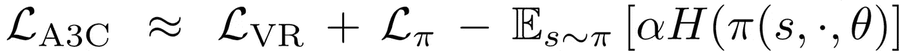
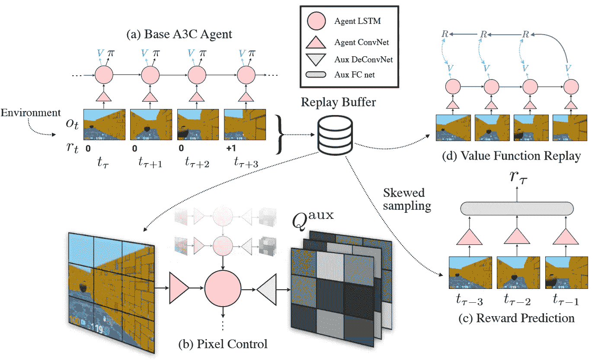
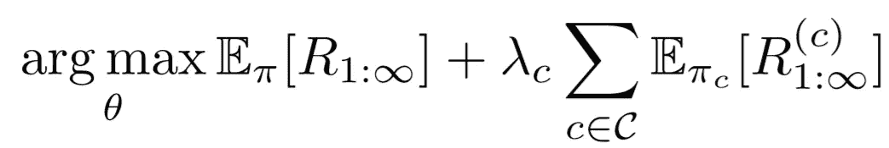
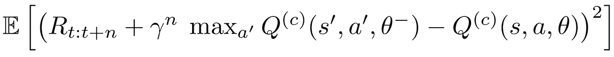
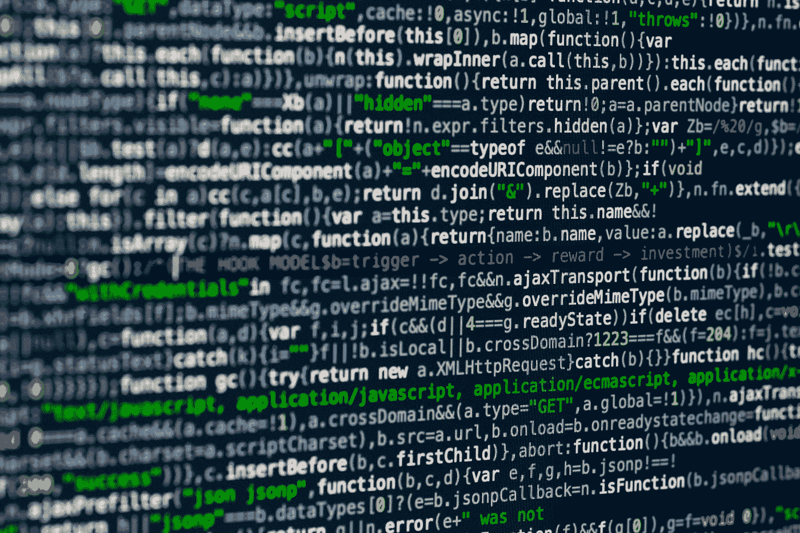
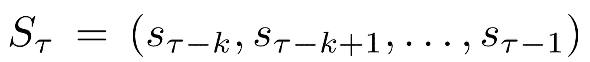
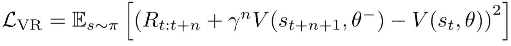
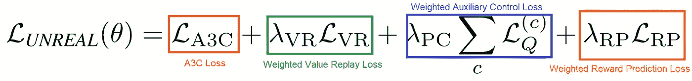
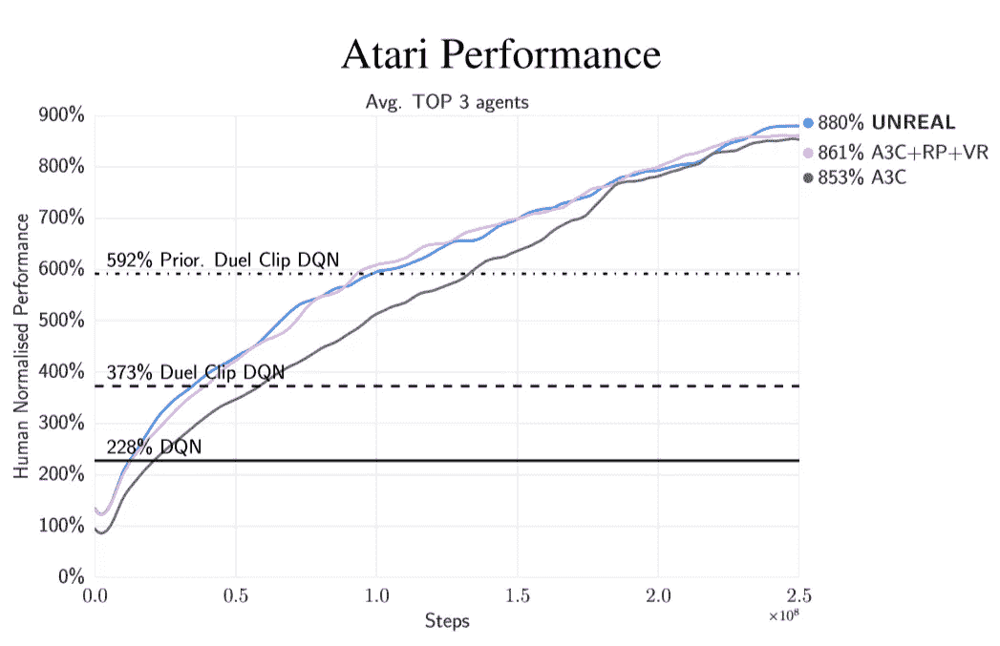
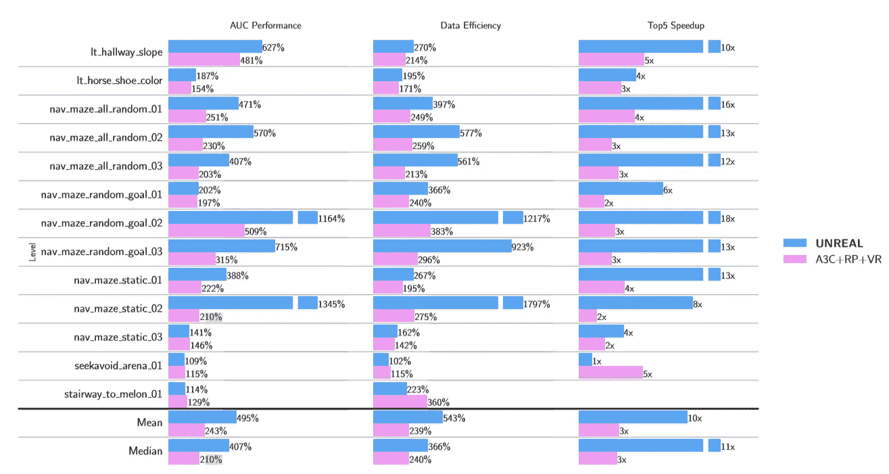

# DeepMind 的虚幻算法解释

> 原文：<https://towardsdatascience.com/how-deepminds-unreal-agent-performed-9-times-better-than-experts-on-atari-9c6ee538404e?source=collection_archive---------44----------------------->

## 最佳深度强化学习

凯文·Ku 在 [Unsplash](https://unsplash.com?utm_source=medium&utm_medium=referral) 上的照片

# 概观

深度学习和强化学习的结合为人工智能带来了大量机会。然而，稀疏的奖励环境一直是强化学习研究者长期研究的挑战。更新无信息奖励信号的参数通常会使学习收敛到次优策略。

[DeepMind 的](https://deepmind.com/)无监督强化和辅助学习(UNREAL)代理采取了一种独特的方法来解决这个问题。它使用辅助任务和伪奖励来自主选择环境中与实现其目标最相关的特征。

在这里，我们概述了 DeepMind 的新虚幻代理及其与其他最先进的算法相比的性能。

# 虚幻是如何工作的？

## 使用 A3C

虚幻的核心代理使用异步优势行动者-批评家(A3C)来优化其策略和价值函数。快速回顾一下 A3C， [Arthur Juliani](https://medium.com/u/18dfe63fa7f0?source=post_page-----9c6ee538404e--------------------------------) 在这里有一段精彩的介绍:

 [## 使用 Tensorflow 的简单强化学习第 8 部分:异步行动者-批评家代理(A3C)

### 在本文中，我想提供一个教程，介绍如何在…

medium.com](https://medium.com/emergent-future/simple-reinforcement-learning-with-tensorflow-part-8-asynchronous-actor-critic-agents-a3c-c88f72a5e9f2) 

我们可以将 A3C 损失定义如下:

A3C 损失:价值损失，政策损失，熵正则化

## 建筑

虚幻建筑(贾德伯格，2016)

我们将逐步了解虚幻建筑的不同部分:

1.  **基础 A3C 代理:**使用 A3C 的*策略上的*训练来更新代理的策略和值函数的组件
2.  **辅助控制任务:**用户预设的额外任务，针对特定行为给予代理人伪奖励
3.  **辅助奖励任务:**帮助从环境中提取相关特征的附加奖励预测任务
4.  **价值函数回放:**价值函数附加*非政策*培训

输入是传入卷积层并输入 LSTM 的图像。需要注意的一件重要事情是，四个组件中的每一个都使用相同的 T21 卷积网络和 LSTM 层。例如，名为“像素控制”的辅助控制任务与“基础 A3C 代理”共享这两个层

> 通过让这些任务与主 A3C 策略共享参数，代理能够从环境中提取有意义的信息，而无需直接向其目标优化。

这种直觉在以后会很有用！

因为我们假设之前了解 A3C，所以让我们深入到架构的后三个部分。请记住，**当架构的其他部分同时被训练时，** A3C 仍然在后台使用策略更新(跨环境的几个实例)来优化它的策略和值功能。

在 [Unsplash](https://unsplash.com?utm_source=medium&utm_medium=referral) 上[科学高清](https://unsplash.com/@scienceinhd?utm_source=medium&utm_medium=referral)摄影

# 辅助控制任务

我们可以将辅助任务视为“支线任务”虽然他们不直接*帮助实现总体目标，但他们帮助代理了解环境动态并提取相关信息。反过来，这有助于代理了解如何实现所需的整体最终状态。我们也可以把它们看作是代理交互的额外的伪回报函数。*

总的来说，目标是最大化两项之和:

1.  预期累积*外在*奖励
2.  *辅助*奖励的预期累计金额

总体最大化目标

其中上标 c 表示辅助控制任务奖励。以下是 UNREAL 使用的两个控制任务:

*   **像素变化(像素控制):**代理试图最大化像素值的变化，因为这些变化通常对应于重要事件。
*   **网络特征(特征控制):**代理试图最大化激活给定层中的所有单元。这可以迫使策略和价值网络提取更多与任务相关的高级信息。

关于如何定义和学习这些任务的更多细节，请随意浏览本文[1]。现在，只需要知道代理试图找到精确的 Q 值函数来最好地完成这些辅助任务，使用用户定义的辅助奖励。

好的，太好了！现在我们只需将外部和辅助奖励相加，然后使用总和作为新定义的奖励来运行 A3C！对吗？

## 聪明有多不真实

实际上，虚幻做了一些不同的事情。它不是训练一个*单一策略* 来优化这个奖励，而是在基础 A3C 策略 **之上为每个任务训练*一个策略。虽然所有辅助任务策略与基础 A3C 代理共享一些网络组件，但是它们每个也添加单独的组件来定义单独的策略。***

例如，“像素控制”任务在共享卷积网络和 LSTM 之后有一个解卷积网络。输出定义了像素控制策略的 Q 值。(有关实现的详细信息，请浏览[1])

每个策略都优化了 n 步 Q 学习损失:

使用 N 步 Q 的辅助控制损失

更令人惊讶的是，**我们从来没有明确地使用这些辅助控制任务策略。**即使我们发现哪些动作优化了每个辅助任务，我们也只在环境中使用基础 A3C 代理的动作。那么，你可能会想，所有这些辅助训练都是徒劳的！

不完全是。关键是 A3C 代理和辅助控制任务之间有架构的**共享部分**！当我们优化辅助任务的策略时，我们会更改基本代理也使用的参数。我喜欢称之为“推动效应”

> 更新共享组件不仅有助于学习辅助任务，还能更好地装备代理，通过从环境中提取相关信息来解决整体问题。

换句话说，与不使用辅助任务相比，我们从环境中获得了更多的信息。

照片由[马库斯·斯皮斯克](https://unsplash.com/@markusspiske?utm_source=medium&utm_medium=referral)在 [Unsplash](https://unsplash.com?utm_source=medium&utm_medium=referral) 拍摄

# 辅助奖励任务

就像任何 RL 问题一样，一个代理人必须识别导致更高回报的状态。当然，这就是我们的价值函数的目的，对吗？

这是它变得毛茸茸的地方。我们有两个问题:

*   奖励稀少的环境使得价值函数训练变得困难，因为代理人提取有价值信息的能力降低
*   我们不能简单地过度采样高回报重播过渡，因为这将使我们的价值网络过饱和

于是，虚幻使用了一个叫做**奖励预测**的辅助奖励任务。给定代理先前观察到的一系列状态，代理试图预测*即时*奖励。

用于预测奖励的状态序列

但是，类似于辅助控制策略，**我们在任何地方都不显式使用这些预测奖励！**注意奖励预测模块如何使用与基础 A3C 代理相同的卷积网络。然后，该输入被连接并通过完全连接的层。在实践中，UNREAL 通过将预测分为三类来使用交叉熵损失:负面、零和正面。

> 代理只学习奖励预测来形成用于特征选择的基本 A3C 参数。

随着代理学会正确预测这些奖励，它会自然地挑选出对预期未来奖励重要的特征。这有助于基础 A3C 代理学习。

此外，当训练奖励预测时，我们可以**将采样从经验回放倾斜到具有高奖励的过渡，而不会使价值网络过饱和。**在实践中，不真实的样本使得非零回报的概率为 50%。

结果，我们有效地解决了上面的两个障碍:

*   我们可以高回报地对过渡进行过采样，而不会受到之前的影响
*   不管环境有多稀疏，我们都可以从环境中提取信息

最后，我们注意到 LSTM 是如何不被用于奖励预测的。相反，我们只使用原始卷积网络输出。想法？我们只想要即时的信息来估计即时的回报。我们不会看过去太远，也不会看未来太远。

由[李·坎贝尔](https://unsplash.com/@leecampbell?utm_source=medium&utm_medium=referral)在 [Unsplash](https://unsplash.com?utm_source=medium&utm_medium=referral) 上拍摄的照片

# 体验回放？但是……为什么呢？

我们已经使用经验重放进行辅助奖励任务更新，但是我们能在其他地方应用经验重放抽样吗？LSTM 让这变得困难。当我们有一个隐藏状态时，在更新网络参数后，存储该隐藏状态变得无关紧要。

有趣的是，UNREAL 在其价值网络的 A3C 政策学习之上进行政策外学习**。对于这种偏离策略的学习，我们忽略使用存储的隐藏状态，并假设连续样本中的第一个状态开始一个情节。这提高了鲁棒性，因为这改变了我们的代理人遇到的体验。**

n 步值重放损失

但是，我们为什么要这样做呢？

我们可以把 RNN 想象成一个随时间推移的滑动窗口。它考虑到了某一段时间和观察结果。然而，如果我们将代理放入一个没有先前观察的任意起始状态，它可以**完全利用奖励预测任务**发现的新特征，而不是利用隐藏状态中的过去观察。

# 把所有的放在一起

整体优化损失如下所示:

为虚幻代理优化的总损失

其中每个损失被加权。

# 有希望的结果

虚幻击败了许多强有力的竞争者，包括 A3C 和优先决斗 DQN。在 57 场 Atari 游戏后，它的表现比人类的正常表现好 880%。

虚幻的，带有回报预测和价值重放的 A3C，A3C(贾德伯格，2016)

虚幻也在迷宫中与这些代理人对抗。事实证明，它比其他方法更具数据效率。事实上，在其中一个环境中，虚幻代理使用了大约 **10%的数据来达到 A3C 性能。这是一个*显著的*减少。**

迷宫结果比较(贾德伯格，2016 年)

当然，这篇论文[1]发表于 2016 年。因此，几乎可以保证，更多最先进的算法比虚幻的算法表现得更好。然而，特别是这个代理，为奖励稀少的环境中的深度强化学习代理开辟了一条奇妙的途径。

# 就是这样！

这就结束了对 DeepMind 的虚幻代理的概述，以及为什么它是一种解决 RL 问题的令人难以置信的健壮方法。有关该算法的更详细的概述，请随意查看下面的论文或查看 DeepMind 的官方网站:

 [## 无监督辅助任务的强化学习

### 我们在 DeepMind 的主要任务是推动人工智能的边界，开发可以学习解决任何问题的程序…

deepmind.com](https://deepmind.com/blog/article/reinforcement-learning-unsupervised-auxiliary-tasks) 

# 参考

[1] M. Jaderberg，V. Mnih，W. Czarnecki，T. Schaul，j .雷博，D. Silver，K. Kavukkcuoglu，[无监督辅助任务的强化学习](https://arxiv.org/pdf/1611.05397.pdf) (2016)。

> 从经典到最新，这里有讨论多代理和单代理强化学习的相关文章:

 [## OpenAI 的 MADDPG 算法

### 多主体 RL 问题的行动者批评方法

towardsdatascience.com](/openais-multi-agent-deep-deterministic-policy-gradients-maddpg-9d2dad34c82)  [## 分层强化学习:封建网络

### 让电脑看到更大的画面

towardsdatascience.co](/hierarchical-reinforcement-learning-feudal-networks-44e2657526d7)