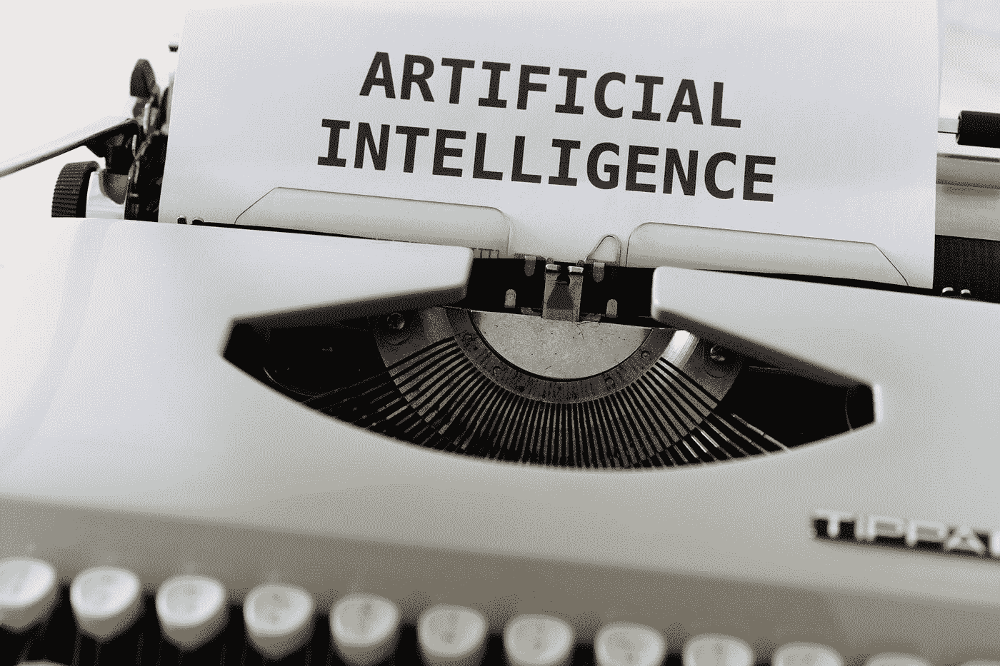
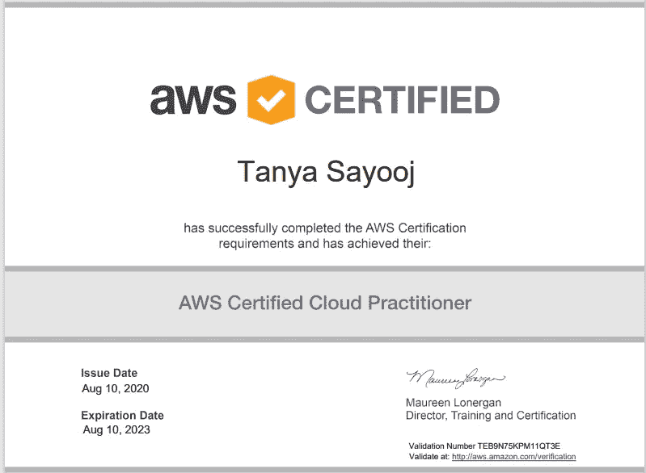

# 我如何通过 AWS 云从业者考试

> 原文：<https://towardsdatascience.com/how-did-a-15-year-old-pass-the-aws-cloud-practioner-exam-6317ce6e609f?source=collection_archive---------18----------------------->

# **一个 15 岁的孩子为什么要写这个考试？**

亚马逊网络服务云从业者考试是一项面向“具备有效展示对 AWS 云的整体理解所必需的知识和技能的个人的考试，独立于其他 AWS 认证所涉及的特定技术角色。”对我来说，最初，我对隔离感到厌倦，想接受挑战。我一直热爱技术和机器学习，所以这是一个完美的目标。但除此之外，我想获得这个认证，因为我想为我的未来积累经验，我发现它很迷人。各种各样的服务和每种服务都有许多独特的用例，它们相互交织在一起，创建了这个庞大的系统，能够完成一些令人震惊的事情。

由[马库斯·温克勒](https://unsplash.com/@markuswinkler?utm_source=medium&utm_medium=referral)在 [Unsplash](https://unsplash.com?utm_source=medium&utm_medium=referral) 上拍摄

# **我用来学习的资源**

网上有很多很好的资源，你可以用来为这次考试做准备，但我会提供一些我认为最有用、最有帮助的课程。一、[《AWS 认证云从业者考试培训 2020》](https://www.udemy.com/course/aws-certified-cloud-practitioner-training-course/)由 Neal Davis 在 Udemy 上完美总结了你需要知道的一切。但我喜欢这门课的是戴维斯如何用极其简单的术语解释一切。然而，虽然它很简单，但仍然足够深入，涵盖了您需要了解的所有内容。作为一个之前没有 AWS 经验的青少年，当他以直截了当的方式极其详细地解释一切时，我发现这非常有益和方便。完成这个课程后，我在 Udemy 上参加了 Neal Davis 的[“AWS 认证云从业者 500 练习试题”](https://www.udemy.com/course/aws-certified-cloud-practitioner-practice-exams-c/)。我想说，这门特定的课程及其练习题是帮助我通过考试的最重要的事情之一，因为这 500 套练习题中出现的许多问题也会出现在实际考试中，这无疑使考试变得容易得多！在意识到尼尔·戴维斯的课程最适合我之前，我经常从一门课程跳到另一门课程，这实际上非常有益，因为有时戴维斯解释事情的方式对我来说没有意义，所以我会看看其他讲师会如何解释。因此，如果需要的话，下面是几门值得简要浏览的课程。

*   [AWS 认证云从业者 2020](https://www.udemy.com/course/aws-certified-cloud-practitioner/) 由 Zeal Vora 在 Udemy 上发布

 [## AWS 认证云从业者 2020(认证课程)

### Zeal 是 Udemy 著名的高级讲师之一。Zeal 主要作为云安全顾问工作，并帮助…

www.udemy.com](https://www.udemy.com/course/aws-certified-cloud-practitioner/) 

*   [终极 AWS 认证云从业者— 2020 年](https://www.udemy.com/course/aws-certified-cloud-practitioner-new/)夏羽·马瑞克在 Udemy 上发表

 [## [新]终极 AWS 认证云从业者- 2020 年

### 夏羽是一名解决方案架构师、顾问和软件开发人员，他对所有事物都有特殊的兴趣…

www.udemy.com](https://www.udemy.com/course/aws-certified-cloud-practitioner-new/) 

*   [AWS 云实践者—CLF-C01(LA)](https://linuxacademy.com/cp/modules/view/id/376?redirect_uri=https://app.linuxacademy.com/search?query=aws%20cloud%20practioner%20exam)—Tia Willams 在 Linux Academy 上的文章—每个单元结束时的测验都非常有用，是很好的练习

除了这些课程之外，我还使用了多个 YouTube 视频和媒体文章来更深入地理解某个主题。我肯定会推荐一本名为[“令人敬畏的云”](https://medium.com/awesome-cloud)的书，就在 medium 上。

 [## 令人敬畏的云

### 了解云计算更多信息的地方

medium.com](https://medium.com/awesome-cloud) 

他们有几十篇比较服务的内容丰富的文章，因为我经常很难找到一些类似服务之间的差异，然而这份出版物从未能消除我所有的疑虑。此外，我也强烈推荐[云专家的](https://read.acloud.guru/)出版物，其中有大量深入介绍所有服务和主题的文章。

 [## 云专家

### 来自我们云计算社区的故事

read.acloud.guru](https://read.acloud.guru) 

最后，一个常见但确实非常有效的建议是， [AWS 白皮书和指南](https://aws.amazon.com/whitepapers/?whitepapers-main.sort-by=item.additionalFields.sortDate&whitepapers-main.sort-order=desc)，如果有什么的话，我建议你至少看一下 AWS 提供的[自由练习题](https://d1.awsstatic.com/training-and-certification/docs-cloud-practitioner/AWS-Certified-Cloud-Practitioner_Sample-Questions.pdf)，因为它是与你将得到的实际测试相似的问题的最接近的表示。如果没有别的，一定要看看下面我附上的一些白皮书，我认为它们是最有益的。

**所有服务概述—**

 [## 亚马逊网络服务概述

### AWS 云提供广泛的基础设施服务，如计算能力、存储选项、网络…

docs.aws.amazon.com](https://docs.aws.amazon.com/whitepapers/latest/aws-overview/introduction.html?did=wp_card&trk=wp_card) 

**Aws 定价信息—**

 [## AWS 定价的工作原理

### 亚马逊网络服务(AWS)帮助您更快地行动，降低 IT 成本，并通过广泛的全球…

docs.aws.amazon.com](https://docs.aws.amazon.com/whitepapers/latest/how-aws-pricing-works/welcome.html?did=wp_card&trk=wp_card) 

**架构良好的框架—**

 [## AWS 架构良好的框架

### AWS 架构良好的框架有助于您理解在构建系统时所做决策的利弊…

docs.aws.amazon.com](https://docs.aws.amazon.com/wellarchitected/latest/framework/welcome.html?did=wp_card&trk=wp_card) 

# **我学习了多长时间/学习计划**

如前所述，我接受了挑战，在六月初的检疫期间学习并通过了这个考试，并有一个目标是在八月获得认证，这样我就有两个月的时间来学习。虽然看起来时间很长，但不要忘记还有很多服务需要深入了解。总的来说，我每天学习大约 2-3 个小时，然而，我经常短暂休息，让我的大脑从吸收如此多的知识中得到休息。从个人经验来说，有些时候，坐着听完讲座/视频可能会觉得非常无聊和乏味，所以我的建议是跳过这一步，根本不要考虑 AWS。把你的热情和时间留到你感觉有动力并准备好沉浸在呈现给你的大量信息中的那一天。

# **提示和技巧**

现在，对于大多数人来说，作为一个 15 岁就获得认证的人，我有什么通过考试的秘诀吗？

*   嗯，首先，作为一名高中学生，盲目地记忆信息，并在我的大脑中将一条信息与另一条信息联系起来，时间只够通过考试，这是我的专长，我相信大多数学生都有同感。然而，对于具体的考试，我会建议你做完全相反的事情，而不是仅仅播放讲座，听老师像背景音乐一样说话，积极参与到课程中。
*   当我说如果你选择盲目地观看视频而不做笔记或练习测验，你将记不住老师刚才说的任何东西时，我可能是也可能不是从个人经验来说的。通过这次考试，你真正理解所有的服务和它们的真实使用情况是非常重要的，因为这次考试不是简单地检查你是否知道每个服务做什么，而是你是否知道在什么情况下什么服务最适合。
*   虽然我个人在学习时没有做笔记，但我确实写下了我在观看视频时的任何问题，我后来会通过 YouTube 视频和文章找到这些问题的答案。然而，如果我能回到过去，改变我准备这次考试的方式，那就是记笔记。因为虽然通过考试不是完全强制性的，但在考试前的最后几天，拥有一份所有信息都以有组织的方式整齐汇编的文档将会非常有利，因为你会简要地复习你所知道的一切。
*   另一个有益的提示是，也许没有多少人想这么做，那就是把你学到的东西重新教给另一个家庭成员或朋友。举个例子，如果我刚学了某个题目，以为自己真的懂了，我就把家人召集起来，像导师一样给他们讲解我学的东西，把它真正灌输到我的记忆里。通常，在这样做的过程中，他们会问一些后续的问题，我会意识到也许我对此还不够了解，这将促使我回去真正地完全了解它。这种通过教学学习的技巧被称为“被保护人效应”，许多研究表明，

> “花时间教授他们所学知识的学生比只花相同时间重新学习的学生表现出更好的理解和知识记忆”。([克里斯蒂安·贾勒特](http://www.psychologywriter.org.uk/)

# 结论

总之，我当然会建议不管你的年龄，都要写这个考试。我认为拥有这个证书对未来是非常有益的，你将会学到大量有趣的信息。使用我上面提供的技巧、窍门、链接和资源将会极大地帮助你在准备考试的时候更加自信。对于像我一样年轻的人来说，请记住，一个人可以参加这个考试的最小年龄是 13 岁，这表明年龄只不过是一个数字，当你专心做某事时，你能够拥有和获得的知识是无限的。不要让你的年龄成为成就非凡的障碍，年龄只是一个心态问题。我希望这个博客能帮助你通过 AWS 云从业者考试，如果你有任何问题或需要帮助，请不要犹豫，通过 [Linkedin](https://www.linkedin.com/in/tanya-s-3aa70a1b4) 联系我或在下面留下评论！

**我的认证—**

