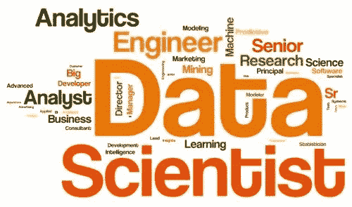

# 我是如何找到一份高薪的数据工作的？

> 原文：<https://towardsdatascience.com/how-did-i-manage-to-get-a-high-paying-job-in-data-bf3f82fd7752?source=collection_archive---------19----------------------->

## 我从金融到数据科学和分析(DSA)的旅程

[图像来源](https://stock.adobe.com/)

就是这样。我已经做到了。我转向并重新调整了自己的技能(从金融到数据)。现在看着我。我是如此重要，以至于我工作的公司为我提供早餐、午餐和小吃。这太棒了。

我接下来的直接挑战是——如果新冠肺炎愿意的话:1/避免被解雇，2/继续提升技能。

**数据人短缺**

*[*数据科学与分析(DSA)坐上技能荒*](https://www.apec.org/-/media/APEC/Publications/2017/11/Data-Science-and-Analytics-Skills-Shortage/217_HRD_Data-Science-and-Analytics-Skills-Shortage.pdf) *的头把交椅。**

**“*[*数据科学家、现场可靠性工程师和企业客户主管是 2019 年*](https://www.linkedin.com/feed/news/the-most-promising-jobs-of-2019-4957866/) *最有前途的工作”。**

*这是你在网上经常能看到的标题类型。在电视上。但是谁还看电视呢？！*

*哦，我可以看到你眼睛里的美元符号和头上的灯泡。只要学会基础知识，你就会找到工作。轻松点。毕竟，当你真的需要水而又没有现成的斐济瓶时，你会买下一个最好的东西(依云)或现有的东西(达萨尼——因为你真的真的需要水)。*

*是的。但是没有！*

***超级英雄短缺***

*有这么多漫威和 DC 漫画电影，我们怎么能缺少超级英雄呢？！首先，黑寡妇和钢铁侠已经死了……然后，因为公司真正需要的是超级高技能的数据人员。不是大三。*

*拥有计算机科学、工程、计量经济学/数学和商业教育/经验的人(是的，所有这些加在一起)。不是大三。*

*能够使用和说大量工具和语言的人。(仅举几个:MongoDB，PostgreSQL，MySQL，Hive，Spark，AWS S3，C#，Scala，Tableau，Python，Matlab，Stata 等等。).不是大三。*

*深刻理解商业模式和商业逻辑的人。拥有工具固然很好，但知道为什么以及何时需要它们也同样重要。*

*他们基本上需要有大约 7/10 年经验的终身学习者大学毕业生。不是大三。*

**

***漫漫长路***

*说了这么多，显然不会轻松。不容易不代表不可能。我一生中完成的事情没有一件是不可能的。你也可以的！*

*那么怎么做呢？我没有一个通用的答案。我只是有亲身经历。因为我没有东西可以卖，所以我可以告诉你真相。*

*这需要时间。不要相信训练营和其他专家，他们告诉你 3 到 6 个月后你就可以工作了(谈论重新转换——计算机专业毕业生或有计算机专业经验的人最终可以)。它就是不能切断它。你需要更多的时间和练习才能真正有用。*

***学习和练习***

*有大量免费的在线资源可供学习(如果你需要，我可以推荐几个)。从他们开始学习基础知识，直到中级到高级概念。然后，你可以考虑付费项目——通过变得更高级，你将能够更深入，并从你的投资中获得更多价值。*

*我想我的简历上没有 DS 或 CS 的正式教育经历，这让我很痛苦。但那只是一种感觉。当心训练营——很少有人真正取得好成绩。*

*然后练习。我再怎么强调练习的重要性也不为过。我犯了一个错误，在通过项目应用这些概念之前，我完成了一门又一门课程。我的理由是，在能够使用这些工具之前，我需要了解更多的知识。我错了。通过做项目，你实际上会学到更多(实际经验)并保留更多(感谢经历实际过程的痛苦——在很大程度上，这是谷歌如何做你想做的事情并适应它)。*

***做有价值的项目***

*我犯的另一个错误是做一些我认为很酷的项目，而不是那些实际上证明我可以胜任的项目。例如，[我开发了一款增强现实游戏](https://medium.com/@Enooooooormous/how-to-become-the-next-c-ronaldo-using-computer-vision-266aec1e1720)。很酷，但是绝对没用。我不会得到一份机器学习工程师的工作(要得到这份工作，你需要成为一名优秀的软件工程师，具备中到高级的数学/统计知识和强大的领域专业知识)。*

*你需要的是获取和处理数据、分析和可视化数据的项目。你基本上把数据转化为洞察力。比如报废电影数据来评估网飞和迪士尼+之间哪个是最好的流媒体平台([想知道答案就点这里](https://medium.com/@Enooooooormous/how-to-navigate-the-streaming-wars-part-2-45624fccf9a3))。*

***拥有领域专长***

*有趣的是，让我得到这份工作的不是我的技术技能，而是我的专业领域——尽管这还是一个有根据的猜测，而不是已知的事实。*

*是的，我测试了 Python 和 SQL。掌握最新的技术技能也很重要。但我不认为我是艺术大师。另外，你不能真正自学和练习 ETL、数据流、SQL 等。为此，你实际上需要工作经验。咬着尾巴的蛇。*

*我(认为我)击败它的地方是在专业领域。我在投资银行工作多年，剖析商业模式，识别业务流程，理解价值创造。这(对我)极其有用。为什么？因为在(无数次)测试和面试中，我能够确定该看什么问题，如何看问题。公司有(很多)内部资源来教/帮你回答这些问题。它们在帮助你思考、理解和识别业务问题方面的作用要小得多。*

***结论***

*尽管由于那次隔离，你很可能已经无聊到了极点，但我还是要强调一下我刚才说的话，这样你就可以直奔主题(我知道，你希望从一开始就知道这是一个选项):*

*1/数据人员的短缺与你无关。公司缺少通过高学历和长期经验相结合而获得强大技术和商业技能的人，而不是初级员工；*

*2/使用免费的在线资源来学习技术技能，并小心训练营。你需要时间才能做好工作准备；*

*3/尽快做项目。甚至在第一道菜之后。这会很难，但这是迄今为止你能做的最好的真正学习的事情。做重要的项目 vs 酷的项目(你在这个领域的第一份工作不会是机器学习工程师)；*

*4/拥有深厚的领域专业知识。面试者不止一次告诉我:“我们更喜欢商业意识强于技术技能，因为你可以在工作中很快学会 SQL*

*5/不要把第四条看得太重，你仍然需要那些技能来通过简历筛选并得到这份工作。*

*我非常兴奋能够开始这份新工作([分析项目经理](https://www.glassdoor.com/Job-Descriptions/Analytics-Manager.htm))。我不打算撒谎，我花了很长时间和很多努力才到达那里。现在，我知道我将继续学习大量的知识——在“数据科学”中你可以学到无穷无尽的东西。最棒的是，我会在尽可能好的条件下做这件事(拥有杰出人才和资源的非常成功的创业公司)。令人难以置信的是，我因此得到了丰厚的报酬！*