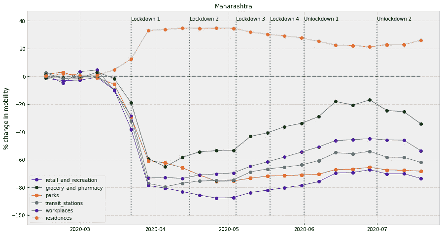
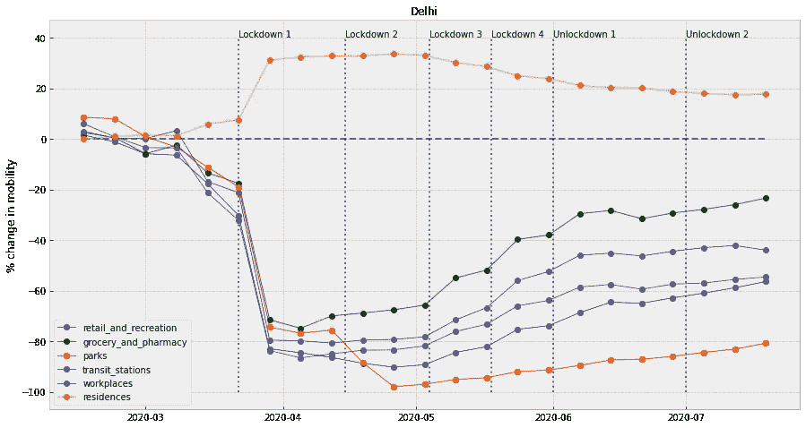
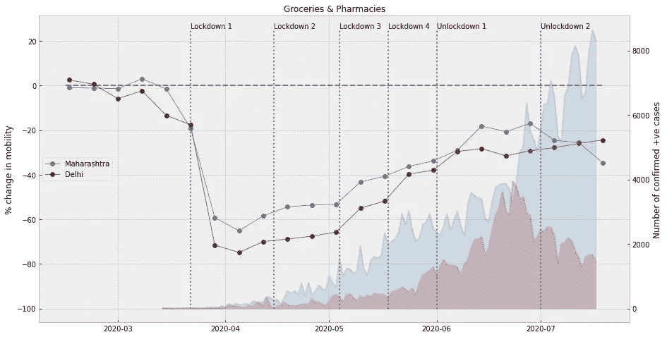
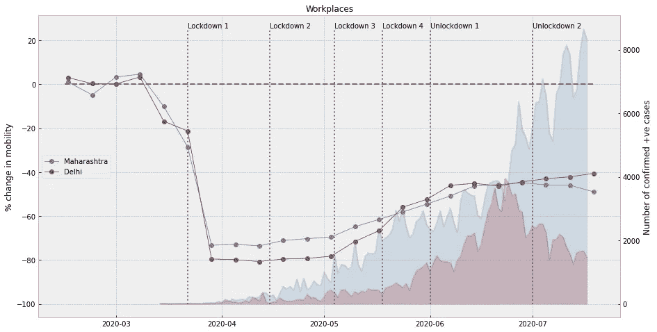
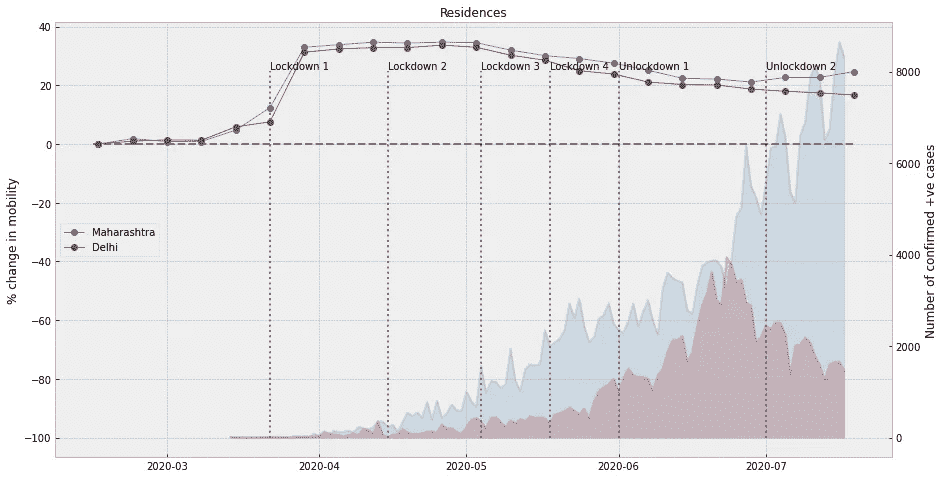

# 封锁对我们的日常活动有什么影响？

> 原文：<https://towardsdatascience.com/how-did-lockdown-impact-our-daily-movement-f9da2ed264d7?source=collection_archive---------35----------------------->

塔伦·阿南德·吉里在 [Unsplash](https://unsplash.com?utm_source=medium&utm_medium=referral) 上的照片

## 使用谷歌的社区移动性数据，在全国范围的封锁期间，看看印度的社区移动性

# 前言

新冠肺炎·疫情给全世界人民的日常生活带来了灾难。为了应对这一公共健康威胁，各国实施了全面的全国封锁措施，让生活嘎然而止。曾经由不同灵魂组成的连续流动的实体，现在变成了一堆紧张和不确定的静态物质。随着时间的推移，随着这些措施在一些国家的放松，人们走出家门时会更加自信，甚至会考虑去他们最喜欢的咖啡馆。

> “滚石不生苔”

这句谚语让我思考，在这个艰难的时代，是否有某种方法可以观察到这个运动，或者说是缺乏这个运动的社区。

两周前偶然读到一篇[的文章](https://www.livemint.com/news/india/google-mobility-trends-indicate-indian-economy-hobbling-back-to-normalcy-11594183432318.html)，我看到了谷歌的[社区移动性](https://www.google.com/covid19/mobility/)报告。这是一款帮助用户了解不同地点访客变化的产品。

谷歌免费为许多国家提供了这些数据，目的是为公共卫生官员提供应对疫情的有用见解。要了解谷歌如何收集、汇总和匿名这些数据，请访问他们的[帮助页面](https://support.google.com/covid19-mobility?hl=en#topic=9822927)。

# 动机

在这篇文章中，我探索了这个数据集，以获得一些关于最近在我的国家——印度——实施的封锁措施如何影响马哈拉施特拉邦和德里社区的定期例行活动的个人见解，这两个邦有超过 100，000 例确诊阳性病例。

# 项目工作流程

像往常一样，我使用一个简单的工作流程来组织我的查询。完整的代码和数据集可以在我的 [GitHub](https://github.com/ani-rudra-chan/India-Mobility-Project.git) 存储库中找到。

## 1.数据采集

社区移动数据集以. csv 文件的形式从这里的[下载并读入数据框。我还使用了来自这个众包](https://www.google.com/covid19/mobility/)[数据库](https://api.covid19india.org/)的印度不同邦的每日新冠肺炎病例数。API 的详细文档可以在[这里](https://api.covid19india.org/documentation/)找到。

## 2.数据预处理

这两个数据集在上传之前已经清除了虚假的高/低值/错误的数据格式/缺失值。

从全球社区移动性数据集中，我提取了马哈拉施特拉邦和德里的数据，并保留了那些感兴趣的要素—‘零售和娱乐场所’、‘杂货店和药店’、‘公园’*、‘中转站’*、‘工作场所’、‘住宅’*。我还创建了一个附加功能，在 *锁定*期间，将每日数据标记为“ *pre* ”和“*”。**

*从新冠肺炎的数据集中，我提取了马哈拉施特拉邦和德里的数据，只保留了每日确诊的阳性病例数。*

*(注:这些封锁措施是在全国范围内下令实施的，每个州都有权根据自己的案件数量继续实施自己的封锁措施。)*

## *3.探索性数据分析*

> ***一、基本情况***

*在印度，3 月 22 日下令实施全国范围的第一阶段封锁，快速查看移动数据显示，从 2 月 15 日到 7 月 17 日，每个邦有 154 天的移动数据。*

*新冠肺炎的数据包括从 3 月 14 日开始的病例计数。尽管早在 1 月 28 日就发现了印度的首例病例，但众包数据仅始于 3 月 14 日。截至 7 月 24 日，马哈拉施特拉邦和德里数据集分别有 133 天的病例计数数据。*

> ***二。汇总统计数据***

*均值(平均值)和分布(四分位数间距)的测量将提供一些关于连续封锁措施对马哈拉施特拉邦和德里社区流动性变化的影响的汇总信息。*

**

*小提琴图给人一种数据扩散的感觉，或者换句话说，流动性变化的变化。小提琴图中较大的分布意味着较大的变化，这可以解释为锁定措施对流动性的较大影响。*

*很明显，在封锁前和封锁期间，人们的流动性有很大的不同。*

*可以看出，公园、零售店和娱乐场所的传播最小，这可以解释为在多次封锁期间，没有多少人访问过这些地方，因为它们仍处于 60-80%的较低下降率。*

*在工作场所、食品杂货店和药店，流动性的传播更加明显。这可能被解释为连续的封锁对访问这些地方的人产生了更大的影响。这种影响的性质将在下一节中展示。*

**

*从每个地点类别的平均变化来看，这两个州的零售和娱乐场所、中转站、工作场所和住宅的游客数量都出现了类似的平均下降。*

*在德里，公园的游客数量下降幅度最大(下降 98%)，而在马哈拉施特拉邦，封锁期间，零售和娱乐场所的游客数量下降幅度最大(下降 89%)。*

*因为封锁要求我们长时间呆在家里，所以在封锁前的几个月(1 月到 2 月)，住在家里的人数增加了近 10 倍。*

*在封锁期间，只有食品杂货和药房等基本服务才被允许参观，因此这两个州的游客平均降幅远低于其他位置类别。*

*这些汇总统计数据提供了一些有用的见解，可以回答一些关于锁定措施有效性的问题。*

## ***4。趋势分析***

> ***一.多次封锁对人员流动的总体影响是什么？***

*在印度，从 3 月 22 日到 5 月 31 日分四个阶段下令封锁，之后从 6 月 1 日到今天分两个阶段下令“解除封锁”。封锁的每个阶段都伴随着一系列措施，以防止人群聚集，限制非必要的行动，并保持社交距离。我绘制了访客/人数的每周平均百分比变化，以观察趋势。*

****

*在马哈拉施特拉邦和德里，随着社区限制随着连续封锁而放松，走出家门前往不同地点的人逐渐增多，长期留在住所的人的百分比呈下降趋势也证实了这一点。*

> ***二世。封锁如何影响零售店和娱乐设施的客流量？***

**

*随着连续的封锁，零售和娱乐场所的游客稳步增加。在中央政府宣布解除封锁后，德里人向零售和娱乐场所的流动增加了，超过了马哈拉施特拉邦。德里确诊新冠肺炎病例的上升和明显下降，以及 6 月份马哈拉施特拉邦病例的持续上升，也可能影响了这种趋势上的差异。*

> ***二。马哈拉施特拉邦的人们去杂货店和药店的频率比德里高吗？***

**

*与其他地方相比，杂货店和药店在多次封锁期间流动性增加最多，因为它们被视为基本服务。这两个邦的趋势没有明显差别，但马哈拉施特拉邦的百分比增长似乎高于德里。*

> ***三世。人们去公园的次数比封锁前多吗***

**

*由于行动限制，去公园的人明显减少了。德里的下降幅度比马哈拉施特拉邦更大，尤其是在 4 月的第二周之后。本周，每日病例的增加促使德里政府采取更严格的措施禁止人员流动。然而，随着时间的推移和限制的放松，德里公园的游客有所增加，而马哈拉施特拉邦没有任何明显的变化。*

> ***四世。封锁期间火车站的客流量是多了还是少了？***

**

*在 3 月 22 日宣布第一次封锁后，过境站的游客略有增加，可能是为了返回家乡和城市。这在日间图中是可见的，而不是每周平均时间序列。此后，随着时间的推移和限制的减少，过境站的游客逐渐增加。5 月 1 日后，名为“[什拉米克列车](https://economictimes.indiatimes.com/industry/transportation/railways/no-more-demand-for-shramik-special-trains-says-railways/articleshow/76692989.cms)的专列开始运送全国各地的农民工。这也可能是 5 月流动性增加的一个原因。这两个国家的趋势似乎没有显著差异。*

> *尽管有旅行限制和工厂关闭，人们还是被要求去工作吗？*

**

*在前两次封锁期间(约 45 天)，积极鼓励人们在家工作。私营和政府机构试图适应这种新的文化，这反映在工作场所的访客人数大幅下降。然而，在一级防范禁闭 3 之后，当旅行限制被部分取消时，两个州访问工作场所的人数都增加了。人们现在被要求以分级的方式工作，以减少在办公场所的聚集。*

> ***六。我们一直呆在家里吗？***

**

*与封锁前的日子相比，我们呆在家里的时间更长了。直到一级防范禁闭 3 号，没有太多人走出家门。在一级防范禁闭 3 之后，长时间呆在家里的人逐渐减少。然而，在马哈拉施特拉邦，由于持续的部分封锁，与德里相比，人们甚至在 7 月份也继续呆在室内。*

# *结论*

*通过分析这些社区流动数据，我可以证实我之前的一些怀疑。*

*   *总体而言，连续封锁中限制的放松对人们前往典型的名胜地点产生了积极影响。*
*   *公园、零售和娱乐场所的游客数量下降幅度最大，而杂货店和药店的游客数量上升幅度最大。*
*   *我们被迫长时间呆在室内，比以前长得多，这在数据中有所反映。*
*   *在第三阶段封锁后，不同地点的流动性增加了。*
*   *马哈拉施特拉邦病例的上升和持续的部分封锁使人们的流动性低于德里，德里的病例最近有所下降，社区的流动性迅速上升。*

*确诊病例的数量肯定会影响封锁的实施或解除，而在不受限制的行动的经济效益和感染减少的公共卫生影响之间进行权衡是一项难以管理的任务。*

*免责声明:此处呈现的观点和观察纯属个人观点。*

**就是这样，伙计们！我希望你喜欢这篇文章。这是一个有趣的项目，让我对身边发生的事情有所了解，我会很快发布更多有趣的内容。**

**再见！**