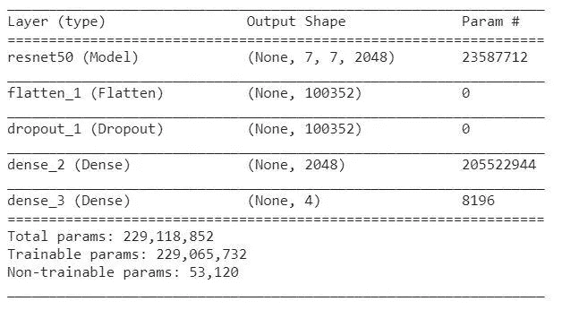
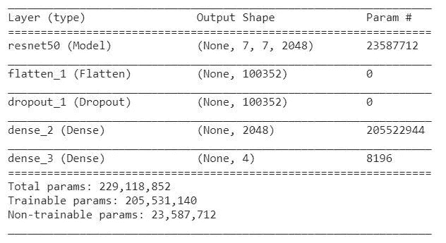
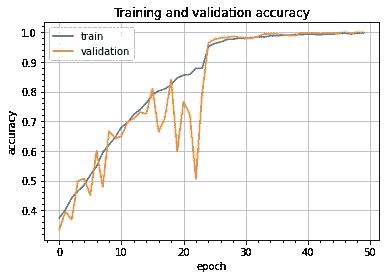
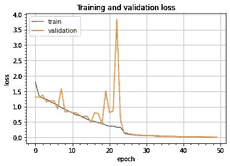
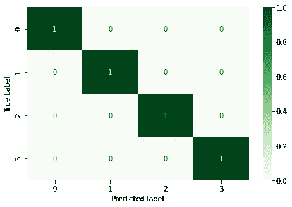

# 深度学习模型是如何做到 100%准确率的？

> 原文：<https://towardsdatascience.com/how-did-the-deep-learning-model-achieve-100-accuracy-6f455283c534?source=collection_archive---------29----------------------->

在解决深度学习问题之前，浏览数据集是很重要的。本文将带您经历一个场景，其中测试集和验证集包含与训练集相同的数据。你有没有想过这种情况会不会发生？嗯，数据集可能会有偏差，这篇文章是我个人经历的一个这样的问题的结果。

## **简介**

这里使用的数据集是 [food-101](https://www.tensorflow.org/datasets/catalog/food101) 数据集的子集，可以在 TensorFlow 数据集中找到。我的目标是将图片分为四类‘咖喱鸡、汉堡、煎蛋和华夫饼’。数据集由属于四个类别的 8345 个图像组成，并且以如下方式划分:
训练集:属于四个类别的 4000 个图像
验证集:属于四个类别的 2217 个图像
测试集:属于四个类别的 2128 个图像

有了这个问题的知识，我们开始吧。

## **ResNet50 预训练 CNN**

这是一个[深度剩余网络](https://arxiv.org/abs/1512.03385)，数字‘50’指的是网络的深度，意味着网络有 50 层深。它属于卷积神经网络的一个子类。该网络有超过 2300 万个可训练参数。ResNet-50 的出现是为了解决渐变消失的问题。ResNet-50 使用跳过连接，将输入添加到原始块的输出，这减轻了渐变消失的问题。更多详情也可以参考[原研究论文](https://arxiv.org/abs/1512.03385)。如果你选择了使用 ResNet 实现深度学习解决方案，我假设你了解这个架构。ResNet-50 模型包括 5 个阶段，每个阶段具有一个卷积和一个单位块，其中每个卷积块具有三个卷积层，每个单位块也具有三个卷积层。ResNet-50 型号如下所示:

[ResNet-50 架构](/understanding-and-coding-a-resnet-in-keras-446d7ff84d33)

## **迁移学习**

这是一种训练数据的方法，其中模型已经在大型数据集上进行了训练，并且已经用于对大量类别进行分类。ResNet-50 已经在由数百万幅图像组成的 ImageNet 数据库上进行训练，并且保存了权重。这些权重可以在实施迁移学习方法时使用。有两种使用迁移学习的方法，特征提取和微调。这里设计问题的解决方案集中在微调方法上。在微调方法中，在预训练的 ResNet-50 基础模型的顶部添加完全连接的层。整个预训练模型被冻结，这意味着权重没有被更新，并且学习过程被停止。在 ResNet-50 基础之上添加的全连接层被训练少量的历元，然后通过解冻相关层将 ResNet-50 预训练模型的 **5c** 块设置为可训练。未冻结的层连同所添加的完全连接的层被训练并用于训练数据以获得分类结果。卷积神经网络的初始层学习低级特征，并且随着网络深入，学习更高级的特征。因此，较高层被解冻并进一步用于训练过程。ResNet-50 型号的尺寸要求为(224，224，3)。因此，在馈入预训练模型之前，所有图像都被转换或调整到这个维度。

理解了图像分类的基于微调的迁移学习方法的概念后，我将进入本文的核心。

## **探索性数据分析**

我认为这是本文最重要的部分。在开始该模型的训练过程时，我惊讶地发现在训练的初始阶段，精确度非常高。网络和图像似乎并没有一切正常。我开始窥视网络，并没有发现任何罪恶，也就是当我试图窥视数据集时，我惊讶地发现，测试和验证集中的所有图像在训练集中都是可用的。这对我来说似乎很奇怪，因为验证和测试集应该包含那些不属于训练集的图像。我们应该根据训练数据训练模型，并用验证和测试集评估模型的性能。然而，在这种情况下，由于验证和测试集的所有图像都已经存在于训练集中，所以我们使用相同的图像来训练模型并评估模型的性能。这不是使用卷积神经网络或任何深度学习模型的常规过程。因此，我编写了一个脚本来显示测试和训练集以及验证和训练集中的文件(图像)彼此匹配。请参考 [**谷歌合作笔记本**](https://github.com/japeshmethuku17/food_101_4class) 中的 python 脚本，我已经明确地比较了给定数据集中找到的匹配。

探索性数据分析的结果

## **卷积神经网络的设计和模型训练**

如前所述，我已经对预训练的 ResNet-50 模型进行了微调，并在顶部添加了一个完全连接的层来对图像进行分类。CNN 模型的架构如下所示:

在 ResNet-50 上添加完全连接的层

我添加了 Flatten()图层，然后是百分比为 40 的 Dropout。所以在训练过程中随机排除了 40%的神经元。Dropout 是一种正则化方法，用于避免模型过度拟合。实现 CNN 模型时有一些经验法则，您可以让模型过度拟合数据，如果模型过度拟合数据，则稍后实现正则化方法。我特意加入了 Dropout，让模型的训练过程更加艰苦，这使得模型比预期晚跳接近 100%的准确率。密集层包括 2048 个神经元，以“relu”作为激活函数，最后一层也是具有 4 个神经元的密集层，因为这里的目的是对四个不同类别的图像进行分类。因为这个问题是一个多类分类问题，所以使用了“Softmax”分类器。整个 ResNet-50 基础冻结时的架构如下所示:

基于冻结 ResNet-50 的 CNN 架构

注意当整个基础冻结时不可训练参数的数量。图层冻结时，权重不会更新。当最后一个块解冻并与完全连接的层组合时，架构如下所示:

微调 CNN 模型的体系结构

正如提到的关于给定数据集的特殊性，模型的性能对于所有训练集、验证集和测试集都记录为 100%。我使用 RMSprop 作为优化器，学习率为 1e^-4.我可以注意到，一旦学习率下降到 1e^-5.，训练和验证的准确率就开始向 100%靠拢学习曲线和混淆矩阵如下所示:

训练和验证准确性的学习曲线

培训和验证损失的学习曲线

验证数据的混淆矩阵

测试数据的混淆矩阵

回调:我使用了 ReduceLROnPlateau。如果 val_loss 在运行五个时期后没有减少，则将学习率减少 0.1 倍。我尝试使用 EarlyStopping 回调，但我注意到，即使在验证指标停止时，训练精度和损失也在不断提高。所以，我觉得让这个系统运行整个 50 个时代是有好处的。但是如果历元的数量增加很多，比如 200，训练损失变得接近 0，那么当获得必要的损失时，可以使用该回调来停止训练。CNN 模型的性能指标见 [**谷歌合作笔记本**](https://github.com/japeshmethuku17/food_101_4class) 。

## **总结**

我向您介绍了探索性数据分析、模型训练的过程，并展示了模型微调后的架构。ResNet-50 被用作大多数图像分类问题的分类器。其跳跃连接技术解决了卷积神经网络中的梯度消失问题。您可以自己实现 ResNet-50 模型，也可以实现迁移学习方法。现在，您应该能够理解探索性数据分析的重要性，并将其应用到您的深度学习模型中。

希望这篇文章对你有用。你可以访问我的 [GitHub 库](https://github.com/japeshmethuku17/food_101_4class)来全面了解实现。colab 笔记本已经做了很好的记录，它将帮助您进一步理解实现。

## **参考文献:**

[1] 'food101 | TensorFlow Datasets '， *TensorFlow* 。[https://www.tensorflow.org/datasets/catalog/food101](https://www.tensorflow.org/datasets/catalog/food101)

[2]何国光，张，任，孙，“深度残差学习在图像识别中的应用”， *ArXiv151203385 Cs* ，2015 年 12 月，
可用:[，](http://arxiv.org/abs/1512.03385.)

[3] P. Dwivedi，《在 Keras 中理解和编码一个 ResNet》， *Medium* ，2019 年 3 月 27 日。[https://towards data science . com/understanding-and-coding-a-resnet-in-keras-446 D7 ff 84d 33](/understanding-and-coding-a-resnet-in-keras-446d7ff84d33)

[4] T. Shermin，M. Murshed，G. Lu，S. W. Teng，“使用 CNN 的分类层特征进行迁移学习”，ArXiv181107459 Cs，2019 年 3 月，可用:

[5]《图像网》。[http://www.image-net.org/](http://www.image-net.org/)

[6][*japeshmethuku 17/food _ 101 _ 4 class*](https://github.com/japeshmethuku17/food_101_4class)