# Twitter 如何应对冠状病毒疫情？

> 原文：<https://towardsdatascience.com/how-did-twitter-react-to-the-coronavirus-pandemic-2857592b449a?source=collection_archive---------24----------------------->

## 《在 R》中新冠肺炎·疫情的探索性和情感分析

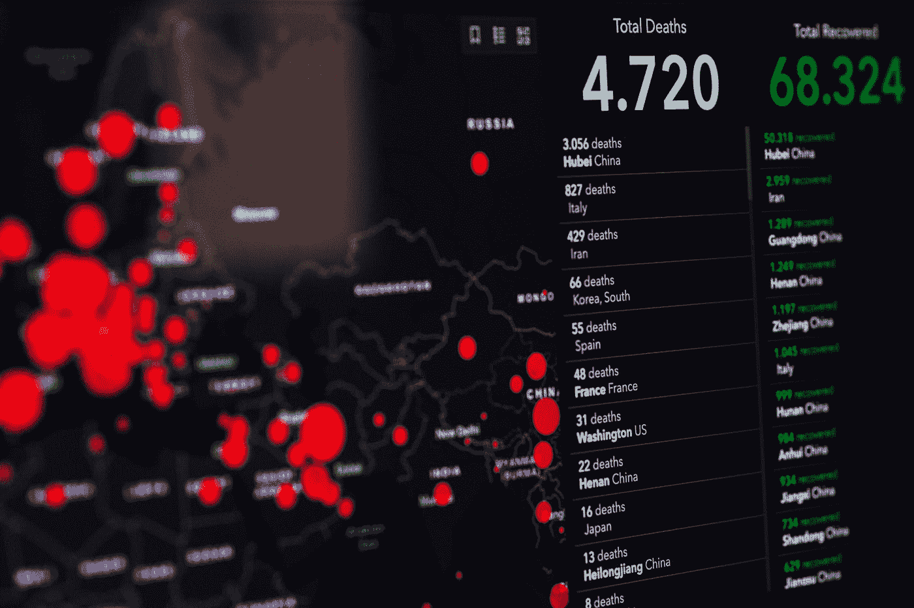

马库斯·斯皮斯克在 [Unsplash](https://unsplash.com?utm_source=medium&utm_medium=referral) 上的照片

最近爆发的冠状病毒/COVID 19 最近被宣布为全球紧急情况。随着我们开始练习社交距离，在家工作来控制病毒传播，我决定利用我的业余时间去调查一下人们在网上谈论疫情的事情。

对于这篇文章，提取了 2020 年 1 月 30 日至 3 月 15 日之间的 15000 条带有#冠状病毒和#COVID19 的推文进行分析。

## 将推文提取到 R

有许多 R 包允许您将 tweets 提取成可用的数据类型进行分析。在使用 R 中的包之前，确保您在 twitter 上有一个 API 帐户，允许您提取 tweets。下面的代码块提取了 2020 年 1 月 30 日到 3 月 15 日之间推特上#Coronavirus 和#COVID19 的所有文本。

```
**#Extract tweets** library("twitteR")consumer_key <- '*your consumer_key*'
consumer_secret <- '*your consumer_secret*'
access_token <- '*your access_token*'
access_secret <- '*your access_secret*'setup_twitter_oauth(consumer_key, consumer_secret, access_token, access_secret)
2virus <- searchTwitter('#COVID-19 + #Coronavirus', n = 15000, since = '2020-01-30', retryOnRateLimit = 1e3)
virus_df = twListToDF(virus)**#Write dataframe into an Excel file for analysis** library(xlsx)write.xlsx(dataFrame, "filePath", sheetName="Sheet1", col.names=TRUE, row.names=TRUE, append=FALSE)
```

## 首先，一些有趣的发现

在我们开始挖掘推文之前，让我们来看看几条最受欢迎和转发的文本:

```
**#most favorited tweets**
virus_fav <- virus_df %>%
  arrange(desc(favoriteCount))**#most retweeted**
virus_retweet <- virus_df %>%
  arrange(desc(retweetCount)) %>%
  distinct(text, .keep_all = TRUE)virus_retweet_extracted <- virus_retweet[-c(2:11)]
```

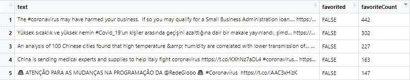

2020 年 3 月 17 日:在提取的 15，000 条推文中，前 5 条最受欢迎的推文

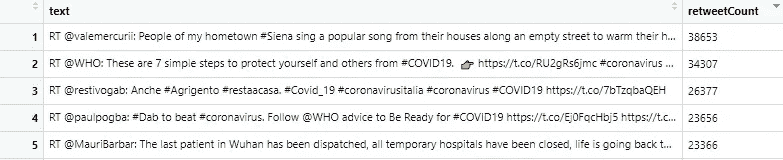

2020 年 3 月 17 日:在提取的 15，000 条推文中，转发量最高的 5 条文本

## 然后…一些数据清理和令牌化

首先，将数据集转换为语料库，即 r 中识别的文档(数据类型)的集合。然后，对语料库进行预处理，使所有字符都变成小写，删除所有标点符号、空格和常用词(停用词)。

在对语料进行预处理之后，我使用了标记化的方法来抓取单词组合。如果您不熟悉标记化，这种方法可以帮助提取有用的短语，从而获得一些额外的见解。

```
**# Import text data**
data <- read.csv("*filePath.csv*", stringsAsFactors = FALSE)**#Change dataset into a corpus**
data_corp <- VCorpus(VectorSource(data))**#Data pre-processing**
data_corp <- tm_map(data_corp, tolower)
data_corp <- tm_map(data_corp, PlainTextDocument)
data_corp <- tm_map(data_corp, removePunctuation)for (i in seq(data_corp)) {
  data_corp[[i]] <- gsub('[^a-zA-Z|[:blank:]]', "", data_corp[[i]])
}**#Remove stop words**
new_stops <-c("covid","iphone","coronavirus","hrefhttptwittercomdownloadandroid","relnofollowtwitter","androida","hrefhttptwittercomdownloadiphone","relnofollowtwitter","iphonea","web","rt","chuonlinenews","hrefhttpsmobiletwittercom","hrefhttptwittercomdownloadipad","bharianmy","lebih","berbanding","dijangkiti","kumpulan","mudah","terdedah","covidhttpstcoigdxdtmvrg","hrefhttpsabouttwittercomproductstweetdeck", "darah")data_corp <- tm_map(data_corp, removeWords, words = c(stopwords("English"), new_stops))
data_corp <- tm_map(data_corp, stripWhitespace)
data_corp <- tm_map(data_corp, PlainTextDocument)**#Tokenize tweets texts into words**
tokenizer <- function(x) {
  NGramTokenizer(x, Weka_control(min = 1, max = 1))
}data_cleaned_tdm <- TermDocumentMatrix(
  data_corp,
  control = list(tokenize = tokenizer)
)data_cleaned_tdm_m <- as.matrix(data_cleaned_tdm)
data_cleaned_freq <- rowSums(data_cleaned_tdm_m)
```

## 词频分析

探索数据最简单的方法之一是频率分析。虽然不难，但在情感分析中，这种简单的方法会令人惊讶地具有启发性。

```
**#Create a uni-gram (1-word) word cloud**
pal <- brewer.pal(9,"Set1")
wordcloud(names(data_cleaned_freq), data_cleaned_freq, min.freq=50,max.words = 50, random.order=TRUE,random.color = TRUE, rot.per=.15, colors = pal,scale = c(3,1))
```

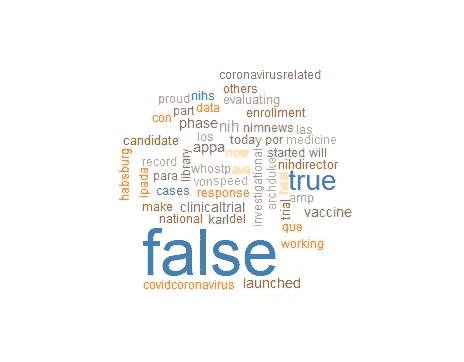

单字单词云

## 出现频率最高的前三个词:

*   False (45459 次)
*   真(14557 次)
*   国立卫生研究院(3820 次)

二元语法(2 个单词)和三元语法(3 个单词)的词频可以让我们从我们正在分析的数据集获得更好的见解。只需将 tokenizer 函数的最小值和最大值更新为您想要研究的词元数，即可获得以下结果:

```
**#change the 1s into the number of word-grams you would like to analyze**tokenizer <- function(x) {
  NGramTokenizer(x, Weka_control(min = 1, max = 1))
}
```

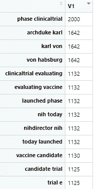

词频最高的二元模型列表

基于二元和三元模型列表，我们知道人们在谈论:

*   冠状病毒疫苗的临床试验
*   国家健康研究所
*   卡尔·冯·哈布斯堡大公(首位冠状病毒检测呈阳性的皇室成员)

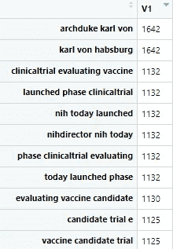

词频最高的三元模型列表

# 情感分析

情感分析帮助我们理解人们对特定主题的感受。这是通过识别、分类观点并将文字转化为可操作的见解来完成的。

## 首先，数据预处理…再次！

首先，我们需要一个 tibble(数据类型)来将 tweets 的句子分解成单词，以便进一步分析。

```
**#Transform sentences into words**
data_tibble <- data %>%
  unnest_tokens(output = "words", input = text, token = "words")**#Remove stop words from tibble**
virus_tibble_clean <- data_tibble %>%
  anti_join(stop_words, by=c("words"="word")
```

## 用数字可视化情感:极性评分

极性得分帮助我们对一些文本的感觉做出定量的判断。简而言之，我们将推文中的单词分为积极和消极两种类型，并给它们打分进行分析。

极性得分告诉我们一段文字是消极的、中性的还是积极的。如果分数接近或等于 1，我们会认为正文是正面的，反之亦然。

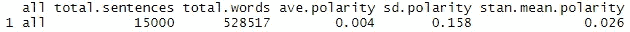

15，000 条提取的推文的总体极性得分

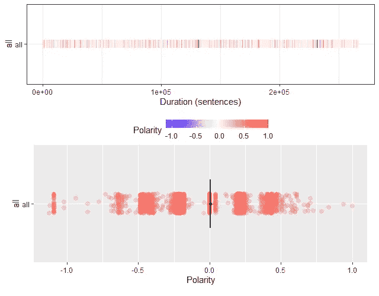

提取的推文的整体极性

## 情感词频

接下来，我们还可以使用极性得分对单词进行分类，将单词放入“积极”或“消极”的篮子中。首先，我们给提取的推文中的每个单词分配一个极性分数。然后，我们过滤数据集，只得到极性得分为 80 或更高的单词。

```
data_tidy_sentiment <- virus_tibble_clean %>% 
  **# Inner join to bing lexicon by term = word**
  inner_join(get_sentiments("bing"), by = c("words" = "word")) %>% 
  **# Count by term and sentiment, weighted by count**
  count(words, sentiment) %>%
  **# Spread sentiment, using n as values**
  spread(sentiment, n, fill = 0) %>%
 ** # Mutate to add a polarity column**
  mutate(polarity = positive - negative)summary(data_tidy_sentiment)
data_tidy_pol <- data_tidy_sentiment %>% 
 ** # Filter for absolute polarity at least 80** 
  filter(abs(polarity) >= 80) %>% 
 ** # Add positive/negative status**
  mutate(
    pos_or_neg = ifelse(polarity > 0, "positive", "negative")
  )**# Plot polarity vs. (term reordered by polarity), filled by pos_or_neg**
ggplot(data_tidy_pol, aes(reorder(words, polarity), polarity, fill = pos_or_neg)) +
  geom_col() + 
  ggtitle("Coronavirus related tweets: Sentiment Word Frequency") + 
  **# Rotate text and vertically justify**
  theme(axis.text.x = element_text(angle = 45, vjust = 0.5, size = 10))+
  xlab("Word")
```

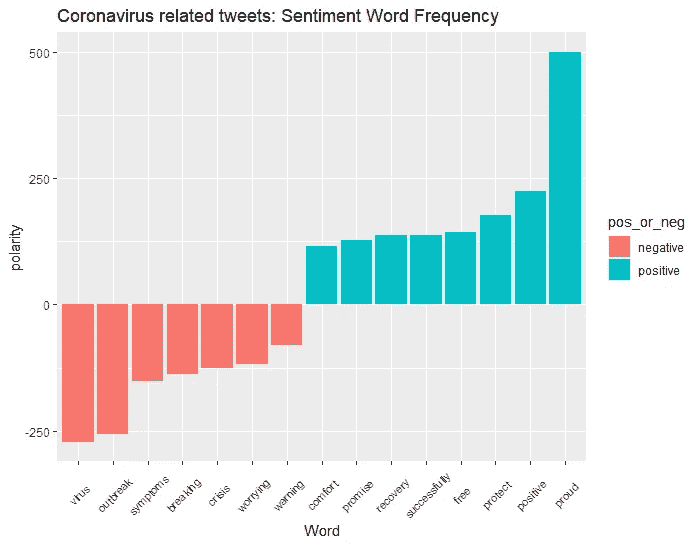

## 在提取的推文中使用的最积极和消极的词

为了更全面地了解积极和消极词汇的使用情况，我使用“必应”词典给这些词分配了一种情绪，并做了一个简单的统计，以生成提取的推文中使用的前 10 个最常见的积极和消极词汇。

```
word_counts <- virus_tibble_clean %>%
  **# Implement sentiment analysis using the "bing" lexicon**
  inner_join(get_sentiments("bing"), by = c("words" = "word")) %>%
 ** # Count by word and sentiment**
  count(words, sentiment)top_words <- word_counts %>%
  **# Group by sentiment**
  group_by(sentiment) %>%
  **# Take the top 10 for each sentiment**
  top_n(10) %>%
  ungroup() %>%
  **# Make word a factor in order of n**
  mutate(words = reorder(words, n))**# Use aes() to put words on the x-axis and n on the y-axis**
ggplot(top_words, aes(words, n, fill = sentiment)) +
 **# Make a bar chart with geom_col()**
  geom_col(show.legend = FALSE) +
  geom_text(aes(label = n, hjust=1), size = 3.5, color = "black") +
  facet_wrap(~sentiment, scales = "free") +  
  coord_flip() +
  ggtitle("Most common positive and negative words")
```

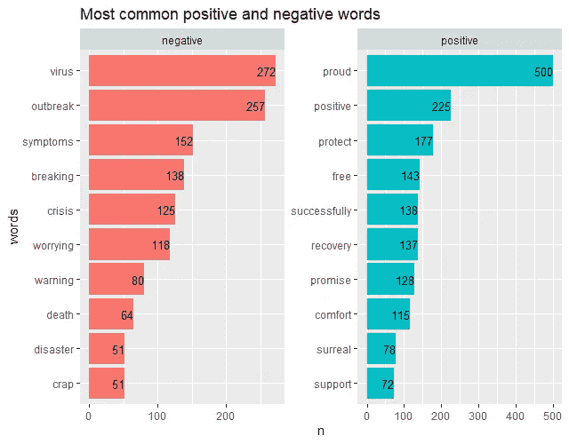

## 情话云

将这些词分为不同类型的情绪也有助于我们了解人们对一个主题的感受，在这种情况下，这个主题就是冠状病毒疫情。

```
data_tidy <- virus_tibble_clean %>%
 **# Inner join to nrc lexicon**
  inner_join(get_sentiments("nrc"), by = c("words" = "word")) %>% 
 ** # Drop positive or negative**
  filter(!grepl("positive|negative", sentiment)) %>% 
  **# Count by sentiment and term**
  count(sentiment, words) %>% 
  **# Spread sentiment, using n for values**
  spread(sentiment, n, fill = 0)  %>% 
 ** # Convert to data.frame, making term the row names**
  data.frame(row.names = "words")**# Plot comparison cloud**
comparison.cloud(data_tidy, max.words = 130, title.size = 1)
```

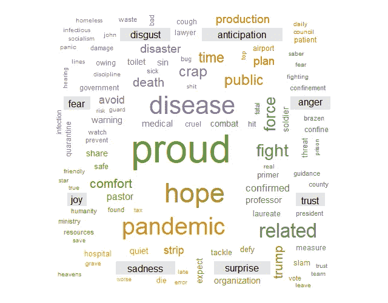

带有冠状病毒标签的推特上的情绪词云

## 将情绪分为十种类型

除了将单词分为两类(积极和消极)，我们还可以将单词分为多种情绪状态。在本节中，我们将单词分成十组，并在每组中选出前 10 个最常用的单词。

```
data_sentiment %>%
  **# Count by word and sentiment**
  count(words, sentiment) %>%
  **# Group by sentiment**
  group_by(sentiment) %>%
  **# Take the top 10 words for each sentiment**
  top_n(10) %>%
  ungroup() %>%
  mutate(word = reorder(words, n)) %>%
  **# Set up the plot with aes()**
  ggplot(aes(words, n, fill = sentiment)) +
  geom_col(show.legend = FALSE) +
  facet_wrap(~ sentiment, scales = "free") +
  coord_flip()
```

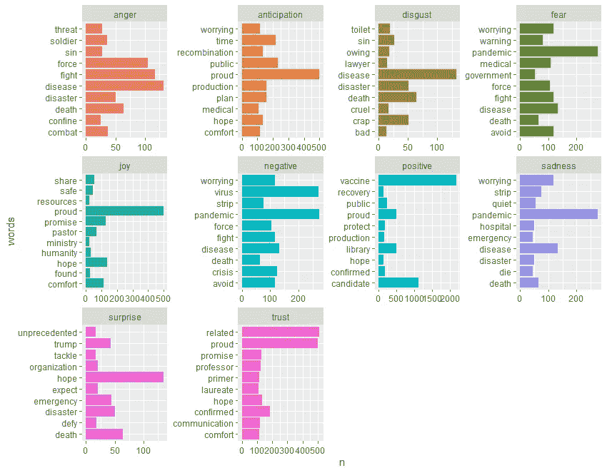

推文分为十种情绪状态

## 结论:从分析中得到一些有趣的见解

*   总体而言，这些推文传达了一种战胜冠状病毒的乐观情绪(使用“自豪”和“希望”等词的频率很高)。
*   当查看 unigram frequency 时,“false”这个词在其他词中脱颖而出，这表明 twitter 上有故意误导读者的新闻或故事。
*   出现频率最高的词与美国国立卫生研究院(National Institutes of Health)冠状病毒疫苗的临床试验有关，这表明人们更关心找到疫情的治愈方法。
*   如果你仔细观察情绪状态分析图表，你会发现与其他情绪状态标签相比，带有快乐或积极标签的单词出现频率较低。

注意安全，保重！

***编者按:*** [*走向数据科学*](http://towardsdatascience.com/) *是一份以数据科学和机器学习研究为主的中型刊物。我们不是健康专家或流行病学家，本文的观点不应被解释为专业建议。想了解更多关于疫情冠状病毒的信息，可以点击* [*这里*](https://www.who.int/emergencies/diseases/novel-coronavirus-2019/situation-reports) *。*