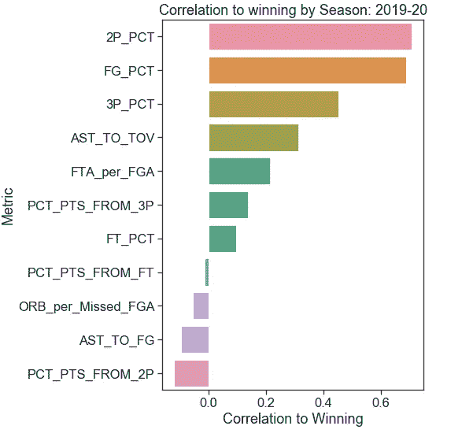
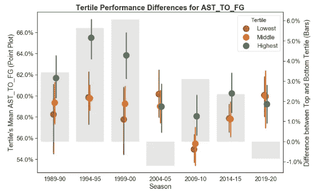
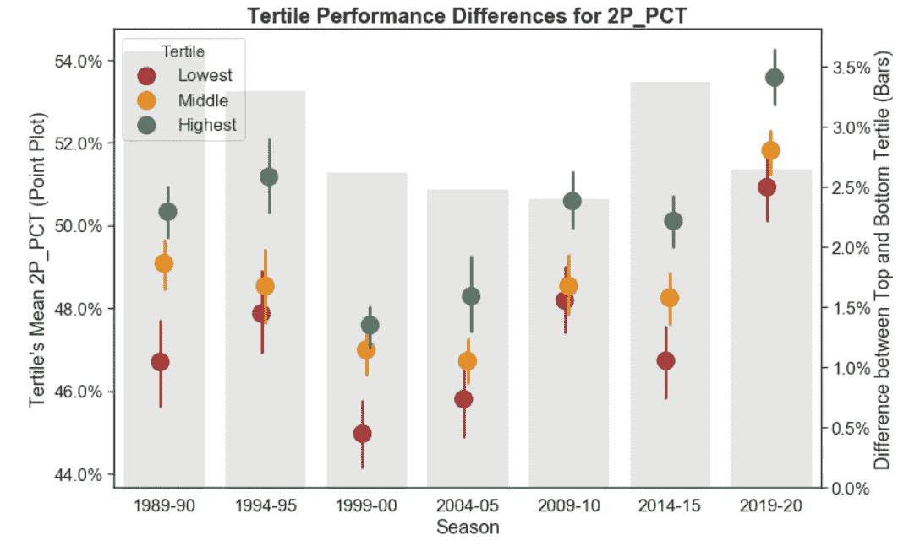
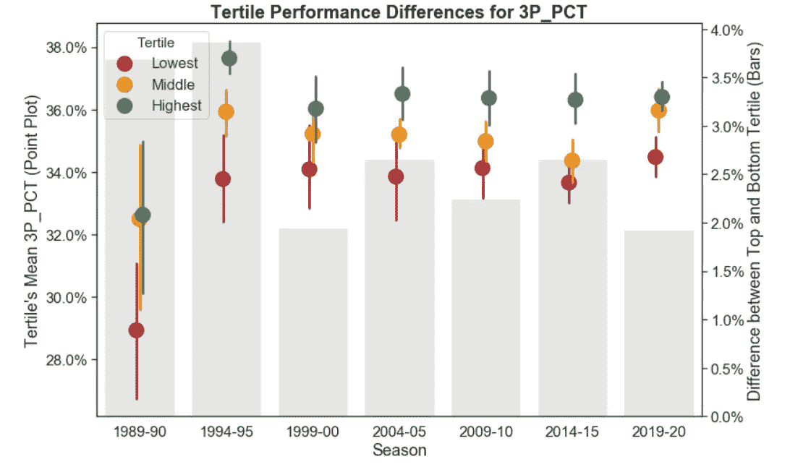
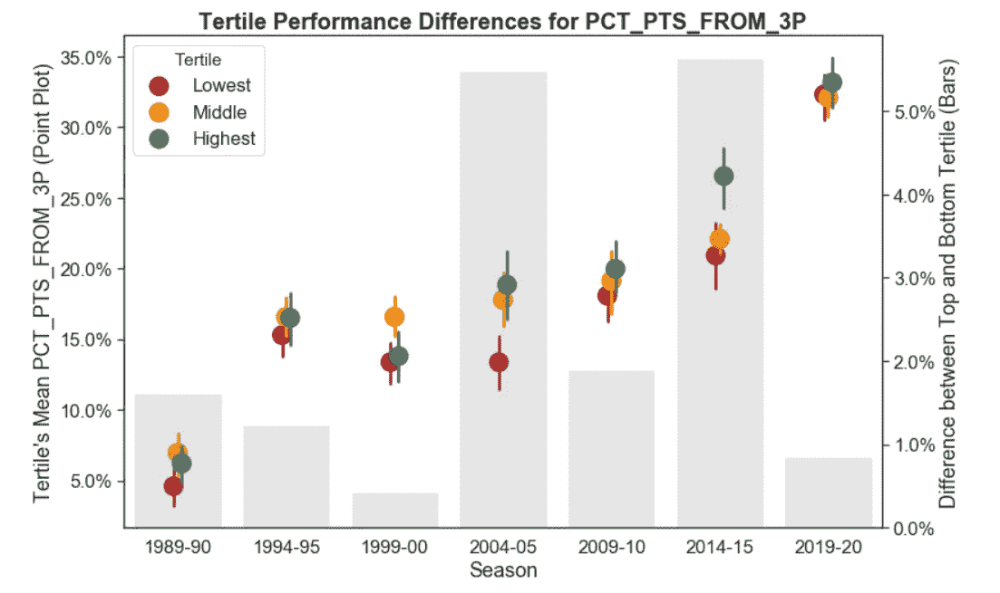
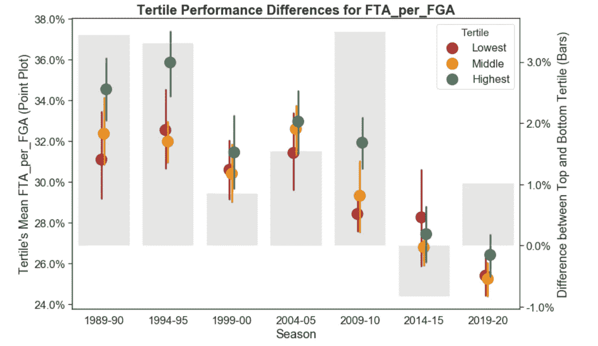
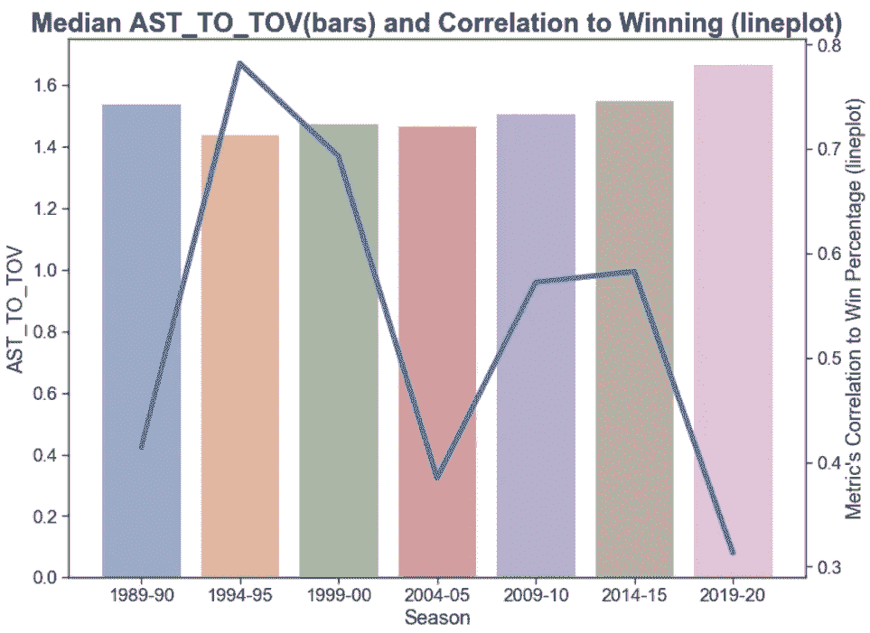
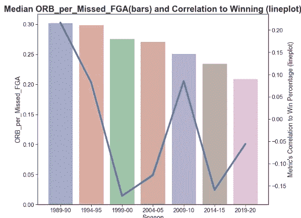

# 30 年来，不同的衡量标准如何与 NBA 的胜利相关联

> 原文：<https://towardsdatascience.com/how-different-metrics-correlate-with-winning-in-the-nba-over-30-years-57219d3d1c8?source=collection_archive---------36----------------------->

哪些指标导致 NBA 篮球队获胜？在过去的 30 年里，衡量指标与成功的相关性发生了怎样的变化？

在过去的几十年里，甚至在过去的几个赛季里，这项运动发生了巨大的变化。这项运动已经趋向于分析驱动的篮球，强调远距离投篮和更快的节奏。

这是我的新系列的第一篇文章，*在 NBA 获胜，*，它将从联盟、球队和球员的层面深入到几个变量和角度，看看是什么影响了篮球的胜利。第一篇文章分析了一系列球队层面的赛季总比率指标，如投篮命中率、助攻失误率和进攻篮板率，以了解这些指标在高表现和低表现球队之间的差异，并衡量每个指标与球队记录的相关性。

你可以在 [GitHub](https://github.com/dwpeterson49/data-journalism/tree/master/NBA) 上下载 [Jupyter 笔记本，上面有我的互动图表](https://github.com/dwpeterson49/data-journalism/blob/master/WinPctvsMetrics.ipynb)和重新格式化的[篮球参考](https://www.basketball-reference.com/)数据集。

**团队的得分指标与当前赛季获胜的相关性**

在当前赛季(2019-2020)，两分投篮命中率是与获胜相关性最高的指标(. 71)。这意味着两分球命中率越来越高的球队往往会有越来越高的获胜记录。尽管来自三分球的投篮比例有所增加，但三分球命中率滞后于赢球的相关性(. 45)。紧随其后的是助攻失误率(. 31)，罚球命中率(. 21)，三分球命中率(. 13)。一些指标与成功呈负相关，例如 2 分制范围内的分数百分比(-.12)。这意味着在弧线内得分比例较高的球队往往胜率较低。其他与胜利负相关的指标包括助攻与投篮命中率高的球队和进攻篮板率高的球队。

**过去 30 年的指标趋势**

让我们看看这些指标的重要性是如何随着时间的推移而变化的。在下面的一组图表中，数据查看了从 1989-90 年到目前暂停的 2019-20 赛季的每五个赛季。

为了表明获胜的篮球队最常拥有的指标，每个赛季的球队根据他们的胜率被分成三个大小相等的组:

-*‘顶级’三分位数*:胜率为 0 . 593(或在 82 场比赛的赛季中 49 胜)或更高的球队

-*‘中’三分位数*:胜率在 0.370 到 0.593 之间的球队(每 82 场赛季 30-48 胜)

- *“垫底”三分之一*:胜率低于 0 . 370 的球队(82 场比赛的赛季胜率不超过 29 场)

*双轴图表图例:*

-点图代表每个获胜百分比三分位数的平均团队绩效(绿色=最高获胜百分比三分位数，黄色=中间三分位数，红色=最低获胜百分比三分位数)

-条形图代表每个赛季最高三分位数(记录最好的球队)和最低三分位数(胜率最低的球队)之间的差异。

**助攻进球**

在 90 年代上升后，最好和最差球队之间的助攻数差距已经逆转。1999 年，顶级球队领先最差球队 6 个百分点，但在当前赛季，不仅对投篮命中率的助攻减少了 8 个百分点(从 67%到 59%)，而且 2020 年最低胜率的球队比最佳球队的比例更高。

**两分球投篮命中率**

越来越多的球队正在采取专注于短两分或三分球的进攻策略，消除中距离投篮，这是一种命中率较低的投篮。因此，所有三分位数的平均投篮命中率都有所提高。在本赛季，这种转变很大程度上可能是因为联盟领头羊(雄鹿和湖人)的三分球命中率都低于平均水平。在 2014-2015 赛季，三支赢球最多的球队(勇士、老鹰和快船)也有三个最高的 3 分投篮记录。

**三分球命中率**

对于三分球来说，过去三十年中最好的球队一直在以最高的精确度进行远距离投篮，但联盟中的其他球队正在迎头赶上。1990 年，胜率最高的球队比最差的球队投篮高出 3.7 分，到 2020 年，这一差距缩小到 1.9 个百分点。

**三分投篮命中率**

在过去的三十年里，深球在进攻中的重要性已经大大增加了。在 2014-15 赛季，顶部和底部三分位数之间的差距超过了 5 个百分点，但五年后，在球队遵循勇士队推广的模式后，差距不到一个百分点。

**每场罚球次数**

随着球队在弧外投篮的比例越来越高，每个投篮尝试的犯规次数(和罚球次数)在所有三个部分都在减少。1995 年，获胜的球队每场罚球次数为 0.36 次，到 2020 年，这一比例下降到 0.26 次。

**比较联盟的指标表现与指标与获胜的相关性**

在下面的两个双轴图表中，条形图代表该赛季中球队的平均表现，而折线图代表该指标与获胜的相关性。

**助攻失误率**

助攻失误率从 2004-05 赛季的 1.47 次助攻/失误持续上升到本赛季的 1.67 次。然而，这一指标与成功的相关性继续下降。在 1995 年达到 0.78 的高点后，与获胜的相关性在本赛季下降到了 0.31。

**进攻篮板率**

一支球队的进攻篮板能力看起来也在下降。自 1990 年以来，每场投篮失误的进攻篮板数一直在稳步上升，与赢球的相关性已经降到了零以下，这意味着进攻篮板率较高的球队往往会有更差的赢球记录。

*感谢您阅读我最新的数据帖子。你可能有兴趣阅读我之前关于* [*大都市地区各行业就业增长趋势*](/employment-growth-trends-by-industry-and-city-a-data-study-5002bf20692) *的帖子。作为一名产品营销和数据分析专业人士，我对数据支持的讲故事充满热情。这些数据新闻帖子是我将真实数据与我个人的不同兴趣整合起来的方式，这些兴趣包括从旅行和娱乐到经济和社会问题的任何事情。
如果您有任何评论、故事想法或预期的数据项目，请随时发送电子邮件至 dwpwriting <邮箱至> gmail < dot > com 或通过*[*LinkedIn*](https://www.linkedin.com/in/davidwpeterson/)*联系我。*

图片来自 Pexels.com