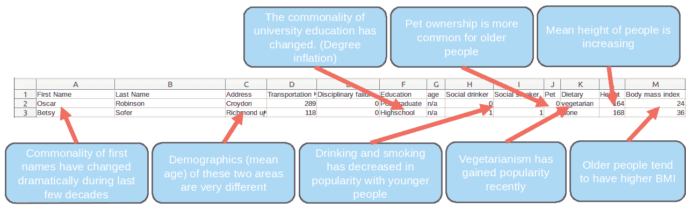

# 数据分析和机器学习中的歧视是如何发生的:代理变量

> 原文：<https://towardsdatascience.com/how-discrimination-occurs-in-data-analytics-and-machine-learning-proxy-variables-7c22ff20792?source=collection_archive---------26----------------------->

泰勒·维克在 [Unsplash](https://unsplash.com?utm_source=medium&utm_medium=referral) 上的照片

数据分析[DA]和机器学习[ML]是结构化的、定量的方法来回答关于数据集的困难问题。DA 和 ML 的承诺是，获得的关于世界的洞见可以比人类发现的洞见复杂得多，而且这些洞见将不受人类偏见的影响。本文将集中讨论第二个承诺，DA/ML 的完全客观性。人们早就认识到，数据分析/计量的结果可能会因方法的选择而有很大差异，这已经对客观性的说法造成了打击。然而，最近出现了一个更基本的问题——用于 DA/ML 的数据通常包含人为偏差，对这些数据执行的 DA/ML 会复制这些偏差。

数据的主观性质可能比方法选择的主观性质更麻烦，不同的方法可以很容易地相互比较，但很难检测和处理数据集中的主观性。例如，当使用 DA/ML 技术评估个人偿还贷款的能力时，我们很可能会使用一个数据集，该数据集由历史上人们做出的此类判断组成。不幸的是，其中一些人可能偏向某些人群，而对其他人有偏见。因此，DA/ML 分析的结果将与数据集相符，并复制这种偏差。这种可悲的现象在许多不同的特征(如种族、性别、年龄)和领域(如借贷、雇佣、刑事司法、医疗诊断)中都有记载。当你只有一份获得贷款的人的名单时，你如何发现这样一个数据集中的主观性？

例如，有大量文献表明，非洲裔美国人更难获得贷款，即使他们的还款能力与获得贷款的白人完全相同[1]。这是种族主义的明显例子。当执行 DA/ML 时，我们训练我们的模型根据我们提供的数据执行任务。如果我们使用来自种族主义贷方的数据集，我们将发现我们执行的 DA/ML 将复制这种种族主义，因为这是它在学习期间接收的数据。当我们分析种族主义的判断时，我们会得出种族主义的结论，这不足为奇。

一个更微妙和复杂的例子是，当我们不训练估计人类的判断(例如，是否给予贷款)，而是真实世界的结果(例如，贷款偿还/违约)。与直觉相反，这种情况也会导致歧视。这种歧视通过“恶性反馈循环”发生[2]。例如，当一个人被判断为风险更高的借款人时，他们的利息将被设置为更高的水平。在一定时间内，这增加了他们必须偿还的金额，因此使他们更有可能拖欠贷款。这作为 DA/ML 模型的正反馈，即使同一个人可能没有违约，如果他们在第一时间被判断为风险较低，并相应地设定了他们的利息。基于种族、性别或邮政编码等特征，此人可能被判断为更具风险。因此，即使用于训练模型的数据是客观测量的结果，而不是可能有偏见的人的主观决定，DA/ML 也不能避免偏见。

已经设计了许多方法来解决这些问题。在这里，我将重点关注最受欢迎的一种方法，这种方法在解决偏见方面也是最差的。这种方法包括简单地删除包含我们不希望 DA/ML 的结果有偏见的特征的数据列。这种方法行不通的原因很简单:关于一个人的任何特征的信息在某种程度上都包含在这个人的其他特征中。例如，亚马逊的实验性招聘算法无法获得申请人的性别信息，学会了拒绝某些女子大学的申请人[3]。同样的事情最近也发生在苹果卡上，当它被发现提供给女性的信用额度比背景相似的男性要少。让我们来看一个更详细的例子。

在本例中，我们将重点关注年龄歧视，这种歧视是在分析哪些员工缺勤较多时出现的。这个例子是基于我们最近在 illumr 进行的分析，详情请见原始报告[5]。当您尝试使用包含年龄相关信息的数据集创建员工缺勤模型时，DA/ML 的结果将是一个几乎完全依赖年龄来确定员工缺勤次数的模型。根据欧盟人权公约和美国平等法案，年龄是受保护的特征之一，以这种方式在招聘中使用年龄作为标准显然是非法的。

当你把年龄从数据集中去掉，做同样的练习，你会得到几乎完全相同的结果。发生这种情况是因为您的模型隐式地识别了员工的年龄，尽管它从未见过。这样做的原因是，关于个人年龄的信息包含在雇主掌握的其他信息中。这种信息没有明确地保存，而是有一些弱指标，也称为代理变量。在下面的(完全虚构的)例子中，你可以看到所有的名字、地址、教育程度、吸烟和饮酒习惯、养宠物、饮食、身高和身体质量指数都是年龄的代理变量。

个人的许多特征提供了他们年龄的微弱指示，称为代理变量。机器学习和数据分析能够将这些弱指标结合成与个人年龄密切相关的强指标。因此，即使数据中没有明确包括年龄，也可能存在年龄歧视。这同样适用于个人的任何其他特征，如种族或性别。

在本例中，DA/ML 将推断每个人的年龄，然后将其用作缺勤次数的有力指标，而无需模型明确使用年龄。代理变量可能很复杂，因此很难发现，那么解决方案是什么呢？

一种解决方案是在模型的输出中明确寻找歧视，然后进行事后纠正。然而，这有许多问题(我在我的论文[6]中深入讨论了这些问题)。最值得注意的是，没有定量定义和普遍接受的歧视概念，有些定义甚至是相互排斥的[7]。在 illumr，我们开发了一个名为 Rosa 的解决方案，它采用了另一种方法。Rosa 获取您的数据集并查找代理变量，然后根据需要尽可能少地更改它们，以删除有关受保护特征的信息。当您对 Rosa 处理的数据使用 DA/ML 时，没有代理变量，因此您的模型不可能进行区分。你可以在[www.illumr.com/rosa](http://www.illumr.com/rosa)免费试用 Rosa(有一些最低限度的限制)。

# 参考资料:

[1]玛吉·奥斯汀·特纳。抵押贷款歧视:对现有证据的重新审视。1999.凯茜·奥尼尔,《数学毁灭武器:大数据如何加剧不平等并威胁民主》。百老汇图书，2016。
【3】[https://www . Reuters . com/article/us-Amazon-com-jobs-automation-insight/Amazon-scraps-secret-ai-recruiting-tool-that-show-bias-against-women-iduskcn 1 MK 08g，](https://www.reuters.com/article/us-amazon-com-jobs-automation-insight/amazon-scraps-secret-ai-recruiting-tool-that-showed-bias-against-women-idUSKCN1MK08G)检索 2020 年 2 月 1 日。
【4】[https://www . wired . com/story/the-apple-card-not-see-gender and-that-the-the-problem/，【2020 年 2 月 1 日检索。
【5】](https://www.wired.com/story/the-apple-card-didnt-see-genderand-thats-the-problem/)[www.cevora.xyz/RosaExamples.pdf](http://www.cevora.xyz/RosaExamples.pdf)[，](https://www.wired.com/story/the-apple-card-didnt-see-genderand-thats-the-problem/)检索于 2020 年 2 月 1 日。
【6】[www.cevora.xyz/FANs.pdf](http://www.cevora.xyz/FANs.pdf)[，](https://www.wired.com/story/the-apple-card-didnt-see-genderand-thats-the-problem/)检索于 2020 年 2 月 1 日。
【7】亚历山德拉·乔尔德乔娃。具有不同影响的公平预测:对累犯预测工具偏差的研究。大数据，5(2):153–163，2017。