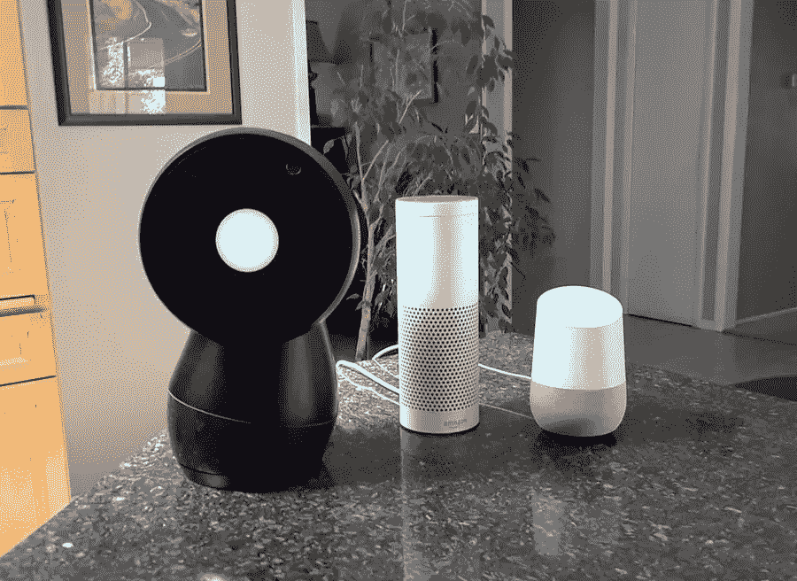
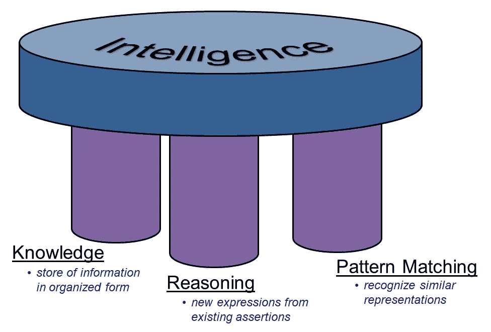
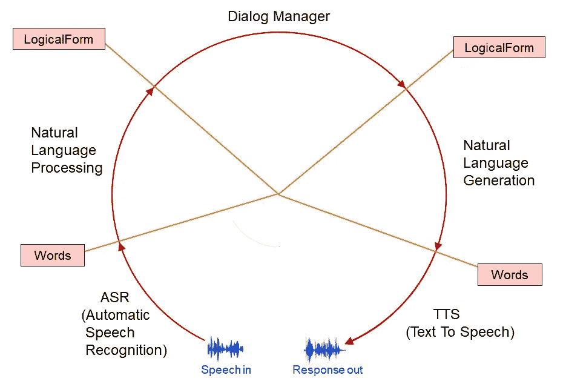
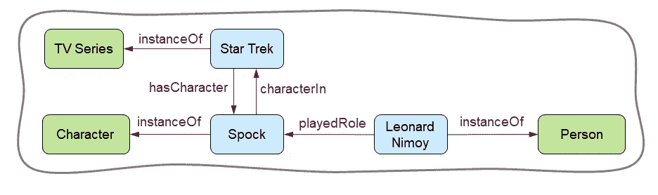
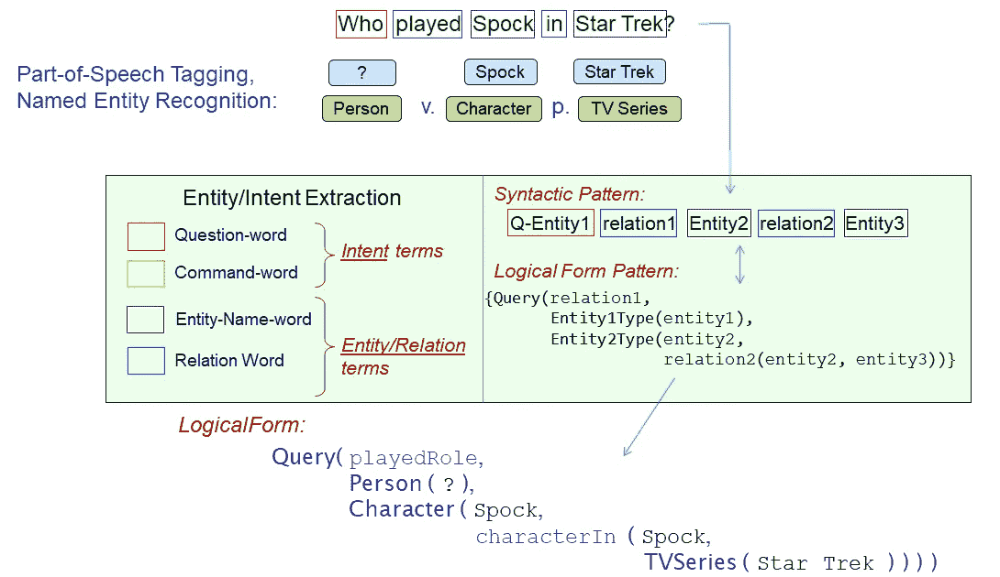
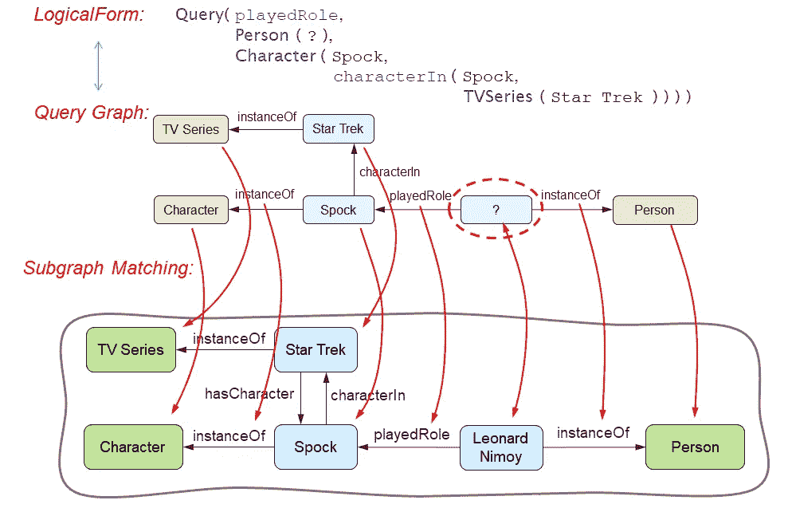

# 对话式代理如何回答问题？

> 原文：<https://towardsdatascience.com/how-do-conversational-agents-answer-questions-d504d37ef1cc?source=collection_archive---------25----------------------->

## 自然语言处理、知识图表和智能的三大支柱

Jibo，Echo/Alexa，Google Home

## 智力的三大支柱

对亚马逊来说，其语音代理 Alexa 受到的欢迎是一个巨大的惊喜。苹果的 Siri 已经把语音输入放到了智能手机上。但是现在有了一种新的设备，你可以隔着厨房对着它大喊大叫来设置定时器，播放音乐，或者在网上查找事实。这种文化以雪崩般的[笑话](https://www.youtube.com/watch?v=YvT_gqs5ETk)和迷因接纳了 Alexa。谷歌很快推出了自己的智能音箱 Google Home。初创公司 Jibo 通过自己的人工智能技术和第三方数据源的整合提供了类似的技能，但包装了一个有趣的角色，具有独特的旋转身体形式。

这些对话代理来自数百万美元的投资和数百名学术界和工业界最聪明的研究人员和开发人员的劳动。它们代表了人类在努力创造人造人以增强和扩大我们的智力方面的科学和工程成就的顶峰。这篇文章解释了这些设备如何解释问题和访问大量的知识来源。然而，知识只是智力的一个组成部分。因此，虽然对话式人工智能代理在某些方面非常聪明，但在其他方面它们仍然非常愚蠢。

我们可以问，“**谁赢得了 1934 年的世界大赛？在 1934 年的世界职业棒球大赛中，圣路易红雀队以 4 比 3 击败了底特律老虎队。如果你足够幸运，住在图书馆附近，你会花半个小时去那里找一本包含这个事实的参考书。如果图书馆开放的话。无论从哪方面来看，这都是非凡的、明智的行为，而且非常有用。**

然而，智力不是单一的东西。一方面，我们认识到人们有不同的智力，语言的，视觉空间的，音乐的，情感的，社会的。但在认知科学和人工智能领域，智能以不同的方式分解。

我们可以称之为智力的三大支柱。

智力的三大支柱

*   **知识**泛指事实、数据、技能、程序和信念，它们以这样的方式组织起来，在需要时可以被查找和访问。人工智能和认知科学的一个主要研究领域叫做*知识表示*。这是关于计算机数据结构中知识的组织和表达，以及对它们起作用的计算操作。虽然我们通俗地根据真假来区分*知识*和*信念*，但在计算智能领域，正确和不正确的断言都被视为同一标题下的“知识”支持和反对的证据、置信度以及与外部世界的基础事实的关系都被认为是附加到知识表示中的附加属性。
*   **模式匹配**是对特定线索和数据实例进行归纳。当我们考虑视觉场景或口语时，模式匹配的重要性是最明显的。在像素的详细信号级别，我们的眼睛永远不会两次看到完全相同的场景。总有一些东西是不一样的，也许是灯光，视角，我们眼睛的焦点。同样，在声音波形层面，我们永远不会听到*完全相同的*音频信号两次。即使我们一遍又一遍地播放一段录音，也会有一些东西发生变化，比如我们的头相对于扬声器的位置，远处微弱的汽车喇叭声，枕头的摆放都会稍微改变房间的音响效果。我们的大脑被设计成分离不相关的差异并提取共性，因此我们实际上可以在不同的时间识别相同的视觉场景或口语句子——就物体和单词而言。这个原则也延伸到更抽象的概念和想法。即使不同的音乐历史学家用不同的语言表达，我们也能识别出同样的列举出的关于为什么甲壳虫乐队是历史上最伟大的乐队的论点。
*   **推理**是获取一些明确陈述的断言和知识，并推导出新的断言的能力。逻辑推理和演绎的共同概念是推理的重要方面。但是概念更广。推理还延伸到通过应用不同的工作流程步骤来探索替代结果，例如，考虑最有效的运动序列来卸载洗碗机。人类推理的非凡之处在于，它会在需要的时候自动发挥作用。想想看:“一个装满牛奶的杯子被打翻了，洒在了地板上。”所以，玻璃里全是锯屑吗？不要！当然不是。我刚说是满满一杯牛奶。如果没有人提出，你甚至不会考虑那个无关紧要的锯屑提议，但是当它被提出时，答案立刻浮现在脑海中——不！锯屑一点也不像牛奶。

人工智能研究的思路往往专注于三大支柱中的一个或另一个，有时还会在它们之间架起桥梁。最近，最引人注目的突破发生在模式识别领域。[深度学习](https://en.wikipedia.org/wiki/Deep_learning)是一种所谓的[人工神经网络](https://en.wikipedia.org/wiki/Artificial_neural_network)技术，它显著地变革了计算机视觉、语音识别和自然语言处理领域。此外，人工神经网络方法通过带来“软”或“模糊”表示来影响知识支柱，这是通过跨特征属性向量分布数值来实现的。

然而，人工智能还不能在一个总体的认知架构下统一三大智能支柱。根据需要，人类的大脑毫不费力地调用每一个智力支柱，并与其他支柱相协调。当我说，“满满一杯牛奶洒了”，你的大脑会自动将这个单词序列与知识联系起来——也许是一杯牛奶的视觉图像。推理步骤以心理模拟玻璃杯倾倒的形式触发，因此其中包含的液体流过边缘。在你自己的推理过程中，模式匹配的工具和知识都有所贡献。你知道牛奶和奶油是类似的东西，因此它们以同样的方式溢出。相比之下，锯屑和糖不是液体，而是颗粒性质相似；当倾倒时，它们以不同的方式流动和降落，彼此之间比任何液体都更相似。哪张纸巾合适，哪把扫帚合适？对你来说，液体和颗粒的区别是显而易见的。今天没有人工智能可以做到这一点。

## 对话代理的体系结构

缺乏这种深度，今天的对话代理仍然显示出非凡的能力来回答甚至是模糊的问题。这是由于智能、知识和模式匹配这两大支柱之间特别设计的伙伴关系。我们将重点关注称为知识图的知识表示，以及称为实体/意图识别的模式识别组件。

对话代理的架构如下所示。

对话代理的架构形成了一个感知/动作循环

对话代理的问答和其他类型的对话通过*感知/动作循环*架构进行。在其基本形式中，这是一系列的五个计算步骤。起点是当用户说出一个问题或命令时由麦克风拾取的声波。

1.  一个叫做*自动语音识别* (ASR)的计算模块将波形信号转换成单词的表示。
2.  自然语言处理模块将单词翻译成内部计算机“语言”，称为*逻辑形式*。逻辑形式以统一的方式表示问题的含义，跨越人们可能用来问同一件事的不同可能的措辞。
3.  对话管理器模块负责接收逻辑表单并决定如何响应。在对话管理器中搜索问题的可能答案，并形成响应。输出本身通常是一种逻辑形式。
4.  自然语言生成将带有答案的逻辑形式转换回人类语言中的单词序列。
5.  文本到语音模块使用一些定义声音质量和语调的训练参数来合成声音信号。这导致输出波形被发送到扬声器。

几十年来，对话代理的一个巨大障碍在于自动语音识别模块。如果用户所说的单词被错误地传输到 NLP 模块，那么就没有希望给出正确的答案。在过去的 15 年里，由于机器学习算法、计算能力和用于训练算法的可用数据集的进步，ASR 取得了爆炸性的进步。

## 知识图谱

如今，智能对话代理的尖端存在于自然语言处理和对话管理器模块中。首先让我们考虑如何用一个叫做*知识图*的知识表示来表示大量的事实。然后，我们将看到自然语言处理如何从用户的查询中构造逻辑形式，以在知识图中查找答案。

大知识图的一小部分。

图由节点和连接节点的链接组成。在知识图中，节点代表世界上的事物，或称*实体*，链接代表实体之间的关系。实体可以是具体的也可以是抽象的。上图显示了一个大得多的图表的一小部分。这部分代表了这样一个事实:伦纳德·尼莫伊是一个**人**，他扮演了**斯波克**这个角色，在**星际迷航**中**斯波克**是一个**角色**，而**星际迷航**是一部**电视剧**。

知识图在使用节点和链接的方式上可以有不同的规则和设计参数。在一些知识图中，实体有两种类型，*类型的*实体(绿色)是事物的类别，而*标记的*实体(蓝色)是特殊的实例。这个**伦纳德·尼莫伊**节点是一个令牌，一个 **Person** 类型的实例。在一些知识图中，实体是分层组织的，因此，例如，**电视连续剧**可以是类别的子类型，**娱乐类型**。一些知识图定义了一组固定的链接/关系类型，而其他的是开放式的。

这些规则和设计参数就是知识图的*本体*。本体论的意思是，“存在的本质”，这个词来自哲学的一个分支，认识论，它研究知识的本质。抽象的知识与现实世界有什么关系？agents 如何获取知识，面对变化保持知识，并对其正确性投入信任？人工智能研究的历史已经揭示出，很大程度上取决于关于知识本体的设计决策。例如，如果一个知识图允许链接取任意标签，那么如何发现两个链接是等价的，或者是矛盾的？在纯粹的实践基础上，当涉及到设计知识本体时，坚定的技术工程师已经非常欣赏和尊重哲学家带来的智慧。

多年来，根据一系列或多或少受到严格约束的知识本体，已经构建了许多知识图。它们中的许多都非常大，并在今天被大量使用，包括为应用程序开发人员提供访问的 API(应用程序编程接口)。知识内容(实际的节点和链接)是通过从维基百科、报纸文章和其他在线资源中找到的文本的手动管理和自动获取的各种组合来添加的。

知识图表可以直接回答诸如“T2，谁在《星际迷航》中扮演了斯波克？“要回答这个问题，首先必须将其转换为能够处理实体和关系的逻辑形式表示。这项工作由 NLP 模块执行，它与 ASR 一起充当对话代理的模式匹配支柱。

自然语言处理是计算语言学的一个实际应用。这个领域还旨在实现自然语言*理解*这一更雄心勃勃的目标，但这个术语有些过头了，因为我们传统意义上的“理解”将知识、模式匹配和推理结合在一起，达到了今天的人工智能根本无法达到的程度。

自然语言处理的最初步骤包括根据单词的语法词性和已知的实体类型对单词进行分类。单词“who”是一个疑问代词，而“in”是一个介词，表示包含或成员关系。“Spock”和“Star Trek”被标记为在预先编译的实体名称列表中找到的已知实体名称。

实体/意图提取将自然语言问题转换成逻辑形式的查询。

给定单词的这种分类，称为实体/意图提取的处理步骤试图根据其目的(问题、命令、陈述等)对话语进行分类。)然后分配与该目的相关联的已知和未知实体。实体/意图提取分析话语的句法结构，这取决于词序。如今，机器学习方法在如何实现这一点的详细步骤中占据主导地位。每个句法模式都映射到一个逻辑表单模板。这个例子展示了一种写出逻辑形式的方法。如果你能读懂 computerese 的嵌套括号，那么你就能自己弄明白原来的问题是如何转换的。最后，原始单词序列中的实际实体和关系填充到模板中，从而产生最终的逻辑形式，它表示用户所要求的内容，但现在是高度结构化的格式。

方便的是，逻辑形式本身相当于一个图。这被称为*查询图*。示例查询图看起来很像知识图中关于**斯波克**和**星际旅行**的部分，除了**人物**实例节点有一个问号。那就是用户想知道的未知值。

子图匹配找到与查询一致的知识图的一部分。

从这里开始，应用计算机科学中的一个众所周知的方法，*子图匹配*。这仅仅意味着，找到与查询图的指定节点和链接一致的庞大知识图的一部分。未知的 **Person** 实例节点是一个通配符变量，它将匹配知识图中的任何内容。当子图匹配完成后，再找到这个节点与知识图中的**伦纳德·尼莫伊**节点对应，转眼间，就可以填写并返回一个答案。

逆过程将填充的查询图转换回自然语言的句子，这一次是作为语句而不是问题。通过文本到语音转换模块，代理自豪而愉快地展示了它的才华。好吧，这是一台计算机所能获得的机械的骄傲和快乐。工程师和他们的赞助商收获了荣誉。

知识图只是可用于存储自然语言查询信息的几种结构化数据表示中的一种。当大量数据项具有相同的属性集时，关系数据库是首选。但是像知识图一样，所有的数据组织都提供了通过逻辑形式查询访问的接口。

有了对对话代理如何执行问题回答的这种理解，人们就可以通过与他们交谈来探索他们的知识来源和自然语言能力。例如，我们可以追踪 Alexa 关于《星际迷航》和其他电视剧的知识实际上来自哪里。这是另一篇文章的主题。