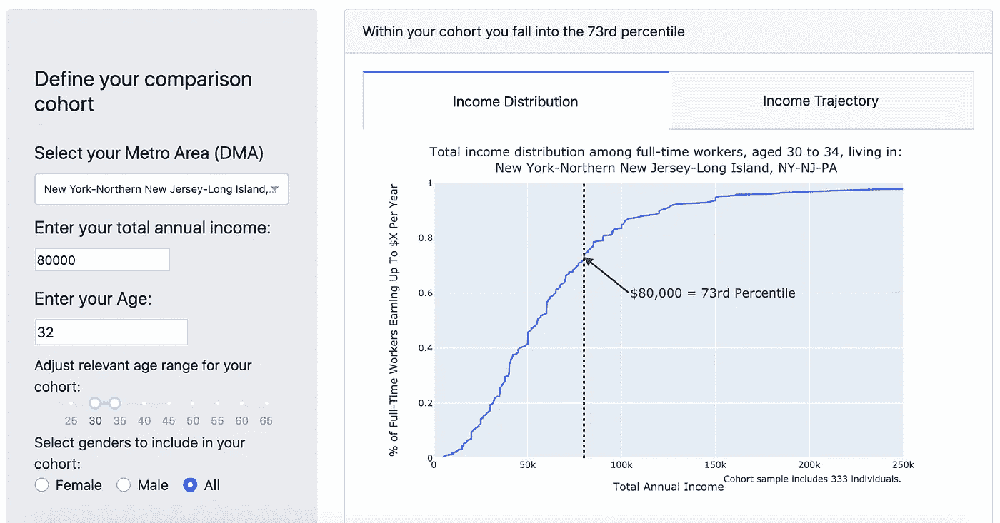
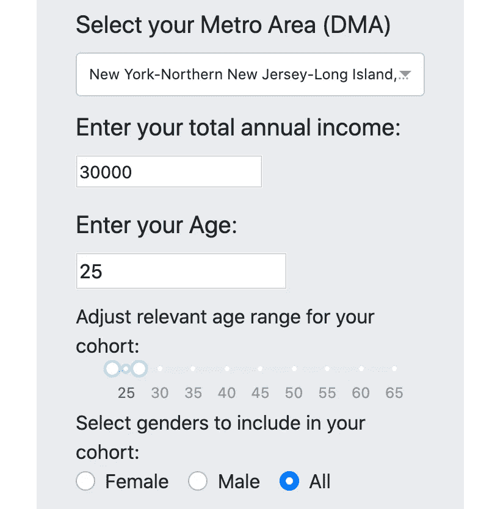
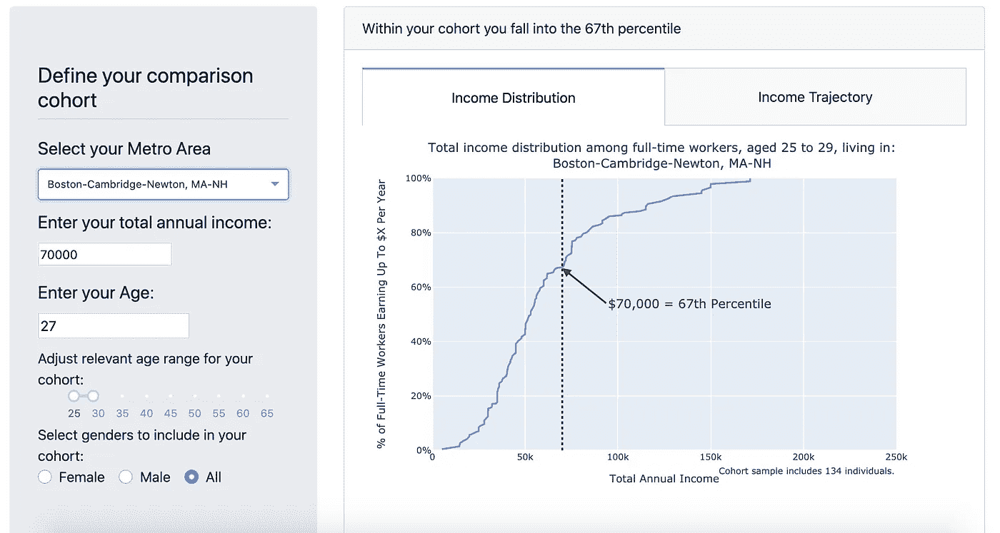
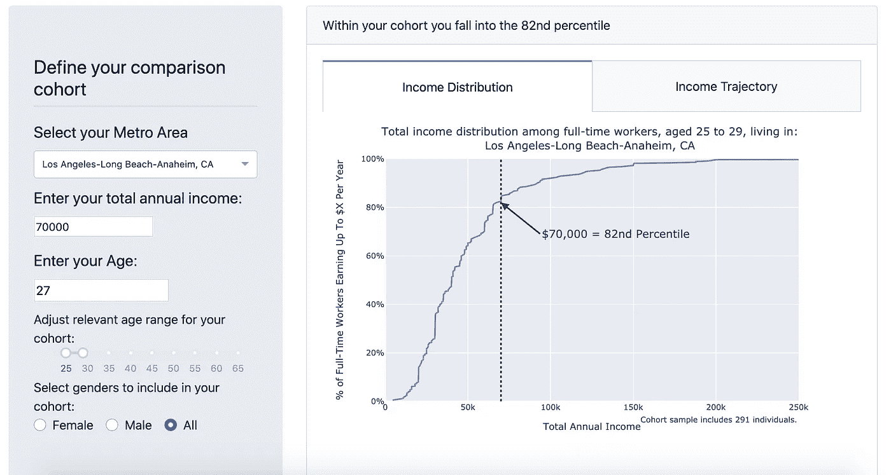
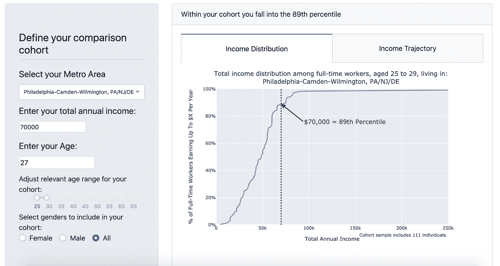
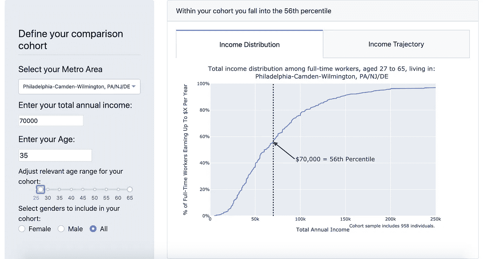

# 我的工资有多少？

> 原文：<https://towardsdatascience.com/how-do-i-stack-up-9e49a18ba60b?source=collection_archive---------75----------------------->

## 将你的工资与你的同事的工资进行对比

# 概观

这篇文章讨论了一种工具背后的方法和动机，这种工具可以帮助人们了解他们的收入与同龄人(同一个城市，同年龄组，可选地，性别)的收入相比如何。

要直接进入计算器，点击[此处](https://gameplan-app-21.herokuapp.com/apps/income-forecast)。



自己试试——[这里](https://gameplan-app-21.herokuapp.com/apps/income-forecast)

# 动机

研究表明，人们很难估计自己有多富裕。比如，在其 2015 年的[工作论文](https://www.nber.org/papers/w21174.pdf)中，金珀森和特里斯曼指出，个人对本国收入分配的信念揭示了“广泛传播的无知和误解……不管数据来源、可操作性和测量方法如何。”他们这样总结这种误解:

> 富人经常认为他们比实际上更穷，而穷人认为他们比实际上更富。两人都认为自己比实际情况更接近中间值。

这种误解可能会产生广泛的影响，既影响个人福祉——例如主观幸福感和压力水平——也影响政治观点——例如对再分配的看法( [Gimpelson 2015](https://www.nber.org/papers/w21174.pdf) ， [Hauser 2018](https://ore.exeter.ac.uk/repository/bitstream/handle/10871/33591/Hauser%20-%20Curr%20Opin%20Psych%20-%202017%20-%20Public%20Preprint.pdf?sequence=1&isAllowed=y) )。

我希望这个工具可以帮助个人更好地将他们的相对“小康”联系起来，这样做:

*   *帮助告知一些关键的个人财务决策* —例如，与你所在城市的其他人相比，你的相对收入水平可以让你了解这个城市对你的负担能力。如果你是第 80 个百分之一的人，不知道你是否有能力在城市里抚养孩子，你可能有这个能力！79%的人在低收入的情况下工作！(我知道这 79%的人中并不是每个人都有孩子，但希望你明白我的意思)
*   *让一个人更加意识到自己的经济特权(或缺乏经济特权)*——如果个人普遍倾向于高估自己的中产阶级程度，纠正这种误解可能会促进对那些不太富裕的人的更多同情。同理心越强，政治和社会利益就越大(这是我未被引用的观点，所以要有所保留)。
*   或许甚至可以缓解一些经济焦虑——人们很容易将自己与社交圈中最成功、最富裕的人进行比较。这可能会对一个人对自己和自己的财务状况产生负面偏见。希望从更广阔的角度看问题，将有助于纠正这种负面偏见。

# 方法学

## 数据汇编

为了获得按年龄、地理位置和性别划分的全职员工的收入数据，我使用了 [IPUMS CPS](https://cps.ipums.org/cps/) ，它“提供了跨越时间和空间的来自世界各地的人口普查和调查数据。”

提供此类信息的最新相关数据集是来自 2019 年 3 月的 [ASEC](https://www.census.gov/programs-surveys/saipe/guidance/model-input-data/cpsasec.html) (“当前人口调查的年度社会和经济补充”)数据，包含以下字段:

*   [INCTOT](https://cps.ipums.org/cps-action/variables/INCTOT#description_section) —“上一日历年所有来源的税前个人收入或损失总额”；
*   [wks work 1](https://cps.ipums.org/cps-action/variables/WKSWORK1#description_section)——“被调查人在上一个日历年中为盈利、有报酬或作为无报酬家庭工人工作的周数。”
*   [full part](https://cps.ipums.org/cps-action/variables/FULLPART#description_section)——“指出在上一个日历年被雇用的受访者是全职还是兼职。全职工作的定义是每周工作 35 小时或以上。”
*   [年龄](https://cps.ipums.org/cps-action/variables/AGE#description_section)——“某人最后一次生日时的年龄”
*   [METAREA](https://cps.ipums.org/cps-action/variables/METAREA#description_section)——“一个家庭所在的大都市地区。大都市区是以一个相当大的市区为中心的县或县群
*   [性](https://cps.ipums.org/cps-action/variables/SEX#description_section)
*   [as ecwt](https://cps.ipums.org/cps-action/variables/ASECWT#description_section)——“在分析个人层面 CPS 补充数据时应使用的个人层面权重。”

## 定义对比群组



一旦收集了数据，用户定义要比较的人群，输入:

*   **都会区**—一个人居住的地理区域；目前，该工具仅支持该国 10 个最大的城市地区，但如果有兴趣，请在下面添加评论，它应该很容易扩展
*   **总年收入**—这应该包括用户在过去 12 个月的所有收入(包括兼职、投资收入等。)
*   **年龄&相关年龄群组—** 默认情况下，计算器会将比较群组的年龄范围设置为用户的年龄+/- 2 岁(例如，照片中的用户为 25 岁，她的年龄将与所有 23 至 27 岁的人进行比较)。此设置可以使用滑块进行调整。
*   **性别**—默认情况下，比较群组被设置为包括所有性别，但对于那些对女性和男性全职员工之间的收入分配差异感兴趣的人，请切换此设置。

## 清理数据

为了获得最终数据集，我们:

1.  基于用户输入的子集
2.  筛选到每周工作 40 小时以上(WKSWORK1 ≥ 40)的全职员工(FULLPART == '全职')
3.  将 INCTOT 变量调整为≥ 0(原始数据允许负值)

给 IPUMS 数据添加标签并使其可读有点麻烦——你必须下载一个单独的文件并解析它——但如果你需要帮助，请联系我们。以下是我所做的要点(抱歉没有突出语法):

```
import pandas as pd
import untangledef get_data_labels(url):
    obj = untangle.parse(url)
    data = obj.codeBook.dataDscr.var
    labels = {
        x['ID']: {
            int(el.catValu.cdata): el.labl.cdata
            for el in x.catgry
        }
        for x in data
        if getattr(x, 'catgry', None)
    }
    return labelsdef get_working_population_data():
    url = ".../data_labels.xml"
    data_labels = get_data_labels(url)
    ipums = pd.read_csv(".../asec_data.csv") for k, v in data_labels.items():
        ipums[k.lower()] = ipums[k].replace(v)

    return working_pop
```

## 可视化分布

一旦我们有了相关的比较群组，我们就可以绘制该群组的收入分布图，使用我们数据集中的 [ASECWT](https://cps.ipums.org/cps-action/variables/ASECWT#description_section) 变量计算样本权重。

例如，让我们看看一个 27 岁的人，他在波士顿市区年收入为 70，000 美元:



我们看到，这个人的收入属于他们同代人中的第 67 个百分位数(那些生活在波士顿-剑桥-牛顿地区的人)。



在洛杉矶**地区，一个年龄相仿、收入相同的人会被认为更有意义地“富裕”，在那里，他们会属于收入分布的上分位数，即第 82 个百分位数**。



而一个 27 岁的人在费城**挣 7 万美元**，属于收入较高的阶层，在**第 89 百分位**。



正如地理位置会极大地影响一个人在同代人中的相对地位一样，一个人比较自己的年龄也会极大地影响他的相对“富裕程度”。

例如，我们 27 岁的费城人年收入 7 万美元，对于她的同龄人来说已经相当不错了，但如果考虑到所有 27 岁及以上的工人**，则更接近于**费城**的中等收入者(**第 56 百分位**)。**

# **自己试试吧！**

 **[## 收入分配计算器

### 一个可视化工具，用于显示你的同伴群体的收入分布以及你如何融入其中

gameplan-app-21.herokuapp.com](https://gameplan-app-21.herokuapp.com/apps/income-forecast)** 

# **结论**

**希望这个工具能帮助人们更好地理解他们同龄人的收入分配，以及他们如何融入其中。**

**我的下一篇文章将涵盖该工具中的“收入轨迹”标签，它利用了来自 [Fatih Guvenen](https://fatihguvenen.com/) 和 [Derek Tharp](https://www.kitces.com/blog/safe-savings-rates-real-earnings-growth-curve-cost-of-living-raises/) 的研究，来估计人们的收入在其一生中会如何增长。**

## **感谢阅读！如果您有任何想法或问题，请联系我们或留下您的评论！**