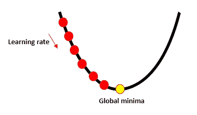
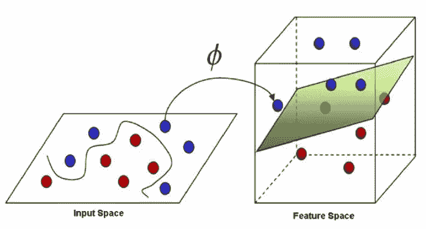
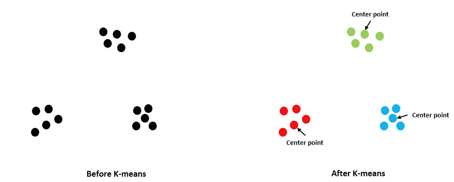
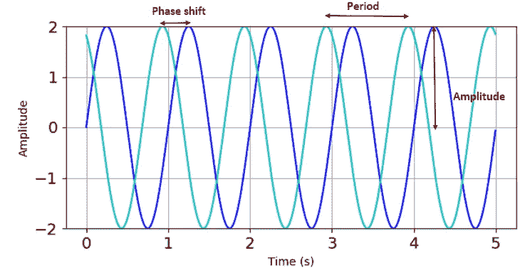
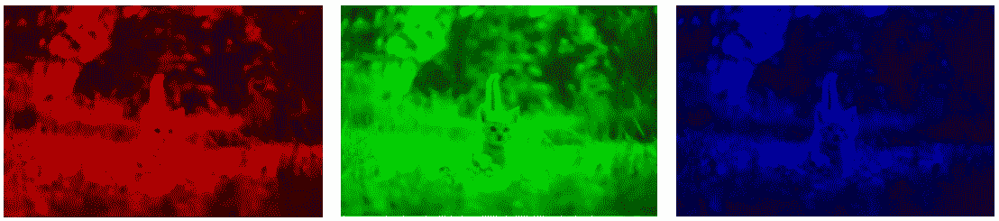
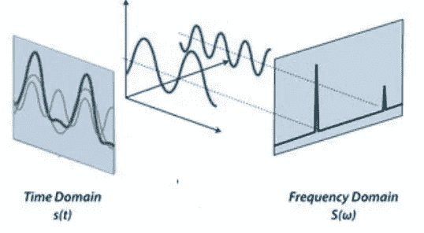

# 机器学习和信号处理如何融合？

> 原文：<https://towardsdatascience.com/how-do-machine-learning-and-signal-processing-blend-4f48afbb6dce?source=collection_archive---------33----------------------->

## IBM 在 Coursera 上的“高级机器学习和信号处理”概述


克里斯里德在 [Unsplash](https://unsplash.com?utm_source=medium&utm_medium=referral) 上的照片

作为一名设计工程师，我越来越多地接触到更复杂的工程挑战，其中一些挑战需要多学科专业知识的融合。高级机器学习和信号处理课程为我提供了了解机器学习和信号处理如何集成和应用在一起的窗口。

虽然这门课程的名字一开始听起来令人生畏，但它并不难理解。然而，先前的统计和微积分知识将在课程的后面部分派上用场。这门课程由 IBM 首席数据科学家[罗密欧·肯兹勒](https://www.linkedin.com/in/romeo-kienzler-089b4557/)和[尼古拉·曼切夫](https://www.linkedin.com/in/nikolaymanchev/)讲授，由 Coursera 提供，作为 4 门课程的 IBM [高级数据科学专业](https://www.coursera.org/specializations/advanced-data-science-ibm)的一部分。

该课程分为 4 周，第 1 周到第 3 周涵盖机器学习概念和算法。在第 4 周，涵盖了信号处理部分，并向我们展示了如何集成信号处理和机器学习。

# 第一周

本周为接下来的几周做准备，我们开始探索机器学习中使用的线性代数。我们首先介绍不同的数据对象:标量、向量、矩阵和张量；以及可以应用于它们的数学运算(点积、向量矩阵乘法)。

**数据对象** 标量是一维的，可以是任意整数，即:

```
1, 5, -18
```

向量是一组标量，并且只能包含一种数据类型，即:

```
(0,11,135)
```

元组类似于向量，但它可以包含多种数据类型，即:

```
(0,1,7.8) #notice the integer and float datatypes
```

矩阵是大小相等的向量的列表，张量是 3 维或更高维的矩阵。张量对于图像处理很有用(例如，一维用于宽度，另一维用于颜色，另一维用于高度)。

然后我们学习了更高维的向量空间，以及描绘和分割它们的直觉。

*   为了在一维空间中分裂，我们使用一个点。
*   为了分割成二维，我们用一条线。
*   为了在三维空间中分割，我们使用一个平面。
*   为了分割高于 3 维的空间，我们使用一个超平面。

机器学习有两种类型:

1.  **监督学习:**在带有输出标签的数据集上训练，即给数据点分配一个标志。该算法旨在通过预测当我们改变 *x* 时 *Y* 将会是什么来求解 *Y = f(x)* 方程。监督学习分为:

*   **分类** —预测离散值，即:“真/假”
*   **回归** —预测一个连续值，即:“未来手机价格”

2.**无监督学习:**在没有输出标签的数据集上训练。该算法通过将相似的数据分组在一起，尝试从输入数据中发现模式。无监督学习的一个例子是**聚类**，其中数据被分成簇(在第 3 周会有更多相关内容)。


由[玛丽亚·沙妮娜](https://unsplash.com/@mariashanina?utm_source=medium&utm_medium=referral)在 [Unsplash](https://unsplash.com?utm_source=medium&utm_medium=referral) 上拍摄的照片

PySpark 允许我们模块化数据管道。通过使用 StringIndexer、**、** VectorAssembler **、**和Normalizer 的 Spark 库，我们可以确保在 ML 模型发生之前，所有的预处理都完全对齐并得到处理。这个想法是将这些预处理部分浓缩到“管道”中，并利用这种灵活性在不同的训练参数之间快速切换，以优化最佳的机器学习模型。


ML 管道示例

```
from pyspark.ml import Pipeline
pipeline = Pipeline(stages = (string_indexer, encoder, vectorAssembler, normaliser))model = pipeline.fit(df)

prediction = model.transform(df)
```

所有的编码任务都在 IBM Watson Studio 中完成，本周的实践方法为建立和运行机器学习项目所需的步骤奠定了基础。

# **第二周**

本周将介绍常见的机器学习模型和概念，这些讲座是解释理论和演示如何使用 Apache SparkML 算法的混合体。课程主持人做了大量工作来解释以下概念，这些概念对于坚实的机器学习基础至关重要。

**线性回归和批量梯度下降**
线性回归模型是一种基于监督学习的模型，可由以下函数描述:

```
y = w₀ + w₁x₁ + w₂x₂ +w₃x₃...+wₙxₙ ; whereby w is the feature weight
```

它的主要功能是根据提供的自变量(x)预测因变量(y)。其对应的逻辑回归用于预测离散值。使用梯度下降策略来确定特征权重，批量梯度下降恰好是这些优化策略之一。



批量梯度下降法寻找全局最小值

如果有足够的时间并且学习速率不太高，批量梯度下降保证找到成本函数的全局最小值。(想象一下试图到达一个山谷的底部)。对于大型数据集来说，这是很慢的，因为模型仅在评估了数据集中每个样本的误差之后才更新。

然后，我们简要了解了如何将数据集分为训练数据集和验证数据集，以及评估预测结果是欠拟合还是过拟合的方法。

朴素贝叶斯定理
尽管这个话题很有挑战性，但 Nickolay 设法将其总结成一种易于理解但又深入的方式。我们看到了朴素贝叶斯定理背后的直觉和数学，例如:

*   求和规则和乘积规则—允许我们解决大多数概率问题
*   高斯分布，或更普遍地称为正态分布，即平均值对称分布的数据。
*   中心极限定理——一个足够大的样本的所有平均值最终都是高斯分布
*   贝叶斯干扰——假设的概率随着新证据的出现而更新

到目前为止，已经有很多关于第 2 周的信息了，但是我们还没有完成！

**支持向量机
支持向量机是线性分类器，为了将它们转换成非线性分类器，可以使用“内核”方法。这种方法，或者罗密欧称之为“技巧”，将训练数据转换到“特征”空间，并允许超平面清晰地分离数据点。这部分课程中的例子直观、对初学者友好，并且容易记忆。**



SVM 的核心方法

本周很好地总结了决策树、随机森林和梯度提升树。我们看到了取样的方法和每个模型的优缺点。还有一个编码练习，结合了我们在第 1 周和第 2 周学到的内容，演示了使用 SparkML 的 gbt 分类器的应用和预测准确性。

# 第三周

随着更高级主题的介绍，如**聚类**和**主成分分析**，我感到最紧张。我们学习无监督的机器学习，我们试图理解点云之间的距离。有多种方法来测量距离，即两点间相减；毕达哥拉斯定理、欧几里德距离和曼哈顿距离。

我们学习了使用 K-means 算法和层次算法进行聚类。K-means 的工作方式是，我们指定预期聚类的数量，然后算法将在 3D 空间中绘制一个超球体，并尝试根据最近的中心将点云中的每个数据点分组为聚类*。*



k 均值聚类

**维度的诅咒**
我们经常不得不在更快的计算时间和更多维度(特征)之间做出权衡，同时保持一定的准确性。随着维度的增加，样本数量变得越来越少，数据点之间的距离也失去了意义。为了解决这个问题，PCA 被用来减少维数，同时尽可能地保持原始数据点之间的距离。这些距离在分类中至关重要，因为它们允许我们将数据点预测到不同的类别中。

本周有几次测验，但它们足以测试我对材料的理解。与前几周相似，有一个编码练习来巩固到目前为止所学的内容。

# 第四周

我最期待的是本周，因为我们终于谈到了信号处理部分，这是一个我非常渴望探索的话题。

**信号**
描述一个信号有 3 个变量:
1。频率—信号
2 出现的次数。振幅—信号的强度
3。相移—信号从其原始位置移动的水平偏移量。



描述连续时间信号的变量

大多数信号可以用以下公式产生或描述:

```
y(t) = **A**sin(2*pi**ft* + **φ**) whereby, **A** = amplitude, *f* = frequency, *t* = time, **φ** = phase shift
```

**傅立叶变换** 傅立叶变换允许我们将复杂的信号——无论是音乐、语音还是图像——通过一系列正弦曲线分解成它们的组成信号。

就图像而言，我们可以将图像的颜色分解成它的 RGB 成分。


安德烈科·波迪尔尼克在 [Unsplash](https://unsplash.com?utm_source=medium&utm_medium=referral) 上拍摄的照片



图像的 RGB 分解

Nickolay 以钢琴和弦为例，使用傅立叶变换来识别单个音符。振动穿过介质时会产生声波。当我们有不同程度的振动时，我们将获得不同的波形振幅。这些振幅可以相加或叠加，以获得每个单独振幅的净响应。



我们可以研究两个域的波形——T4 时域和频域。傅立叶变换和傅立叶逆变换在这些域之间转换。(前者从时域到频域，后者从频域到时域)。

本章通过**小波**主题将信号处理和机器学习联系起来而结束。傅立叶变换适用于平稳信号，但在现实生活中，我们经常处理非平稳信号。傅立叶变换不能提供特定频率何时出现在这些信号中的信息。因此，小波变换需要使用[标度图](http://sciencewise.info/resource/Scaleogram/Scaleogram_by_Wikipedia)来克服这种限制，标度图是小波变换的直观表示。为了充分理解小波和傅立叶变换，Nickolay 解释了它们背后的数学原理。

最后的编程作业是关于如何使用机器学习对信号进行分类的练习。对于正在研究传感器数据和机器学习如何工作的人来说，本周的主题和练习确实令人着迷和有趣。

# **结论**

我发现我正在开发的产品变得越来越智能，安装了更多的传感器。通常，拥有多学科技能有利于交付项目。这门课程通过提供信号处理和机器学习的一些重要主题，对我来说“一举两得”。

交付速度很快，对于专业人员或好奇的业余学习者来说，解释也足够得体。对于教授的一些主题，尤其是贝叶斯定理、主成分分析和小波变换部分，进一步的学习和研究对于加深理解非常重要。

还有其他课程更深入地讲述了机器学习和信号处理，但我真正喜欢这门课程的是这两个相互关联的主题的联系和“融合”。

由于在本课程的作业中使用了 IBM Watson Studio，接触 IBM 的云工具和服务还有另外一个好处。这门课程似乎是让学习者自己选择作业的难度。通过作业并不具有挑战性，因为有很多指导和指导。但是对于初学者来说，总是有一个选项来真正理解显示的代码，这需要时间。

我期待着应用我从这个课程中学到的东西，我希望通过写这个总结，我巩固了我的学习，你也学到了一些东西。