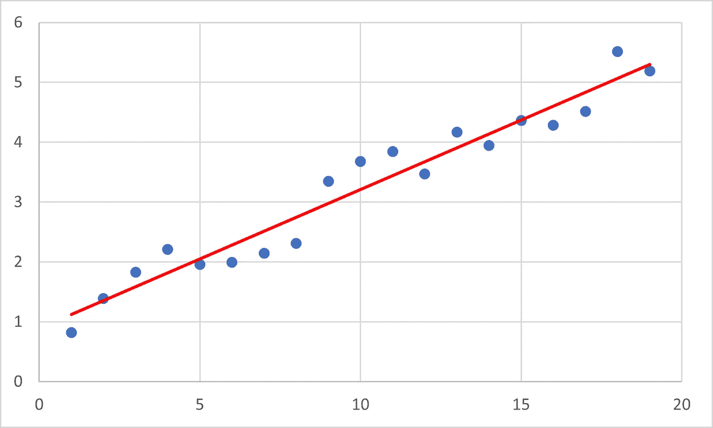
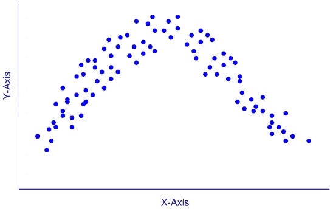

# 机器是如何学习的？

> 原文：<https://towardsdatascience.com/how-do-machines-learn-e3b023bfa28d?source=collection_archive---------25----------------------->

## 一个简单的介绍和示例代码！


由 [Kaboompics 拍摄的照片。com](https://www.pexels.com/@kaboompics?utm_content=attributionCopyText&utm_medium=referral&utm_source=pexels) 来自 [Pexels](https://www.pexels.com/photo/wooden-robot-6069/?utm_content=attributionCopyText&utm_medium=referral&utm_source=pexels)

# 人工智能

人工智能已经成为科技行业每个人都在谈论的时髦词汇，让外行人感到困惑和茫然。对于那些可能不熟悉人工智能和机器学习的人来说，这篇文章是对人工智能和机器学习的介绍。

让我们开始吧…

# 什么是数据科学，AI，机器学习？

人工智能的领域是广阔的，然而，也有某些细分领域缩小了它的应用范围。先来介绍一下当我们听到 AI、ML、数据科学这些词的时候是什么意思。每当这样的词出现时，一般来说，它们指的是过去或实时收集的数据被用来创建预测的过程。这些预测是 AI、ML 或一些其他统计模型在“看到”数据后的“最终结果”。为了更好地理解这一点，让我们看看机器学习的三种方式…

*   监督学习
*   无监督学习
*   强化学习

## 监督学习


来自[像素](https://www.pexels.com/photo/high-angle-photo-of-robot-2599244/?utm_content=attributionCopyText&utm_medium=referral&utm_source=pexels)的[亚历山大·奈特](https://www.pexels.com/@agk42?utm_content=attributionCopyText&utm_medium=referral&utm_source=pexels)的照片

当我们有一个大的数据集(简单地说是对某些属性的许多观察)时，比如说身高、体重、性别和鞋码，我们可以使用监督学习来预测某些属性*给定*其他属性。考虑上面的例子，如果我们有一个包含以下属性的数据集…

*   高度
*   重量
*   性
*   鞋码

…我们想要预测鞋号，我们可以使用数据集中每个人的身高、体重和性别来帮助预测鞋号(我们将在下面讨论这个过程是如何工作的)。

## 无监督学习


照片由[凯奎·罗查](https://www.pexels.com/@kaiquestr?utm_content=attributionCopyText&utm_medium=referral&utm_source=pexels)从 [Pexels](https://www.pexels.com/photo/architecture-buildings-business-car-331990/?utm_content=attributionCopyText&utm_medium=referral&utm_source=pexels) 拍摄

每当我们有一个数据集，我们试图识别未知的关系，我们使用无监督学习。这听起来几乎是一个矛盾的说法，不是吗？

> *了解未知关系*

考虑在商店观察到的具有以下属性的数据…

*   性
*   年龄
*   花的钱
*   一天中的时间

…如果我们想更好地了解谁是花钱最多的人呢？更重要的是，如果我们可以了解顶级消费者的关键特征，然后有针对性地进行营销，让他们进门，会怎么样？这正是无监督学习的目标。

## 强化学习


照片由来自[佩克斯](https://www.pexels.com/photo/round-robot-vacuum-844874/?utm_content=attributionCopyText&utm_medium=referral&utm_source=pexels)的[延斯·马赫克](https://www.pexels.com/@atomlaborblog?utm_content=attributionCopyText&utm_medium=referral&utm_source=pexels)拍摄

只要我们有一个可以学习规则的环境，我们就可以实施强化学习。这就是人工智能真正有趣的地方——无人驾驶汽车、人工智能的游戏能力等……在某种意义上，这直接来自心理学(事实上，大多数人工智能算法都是受人类生物学的启发),巴甫洛夫训练狗在听到铃声时分泌唾液，人工智能也被训练成根据状态-行动-奖励系统成功完成任务。

# 机器是如何学习的？

让我们从使用线性回归来解释线性模型的基本步骤开始。首先，让我们考虑一个具有以下任意属性的数据集…

```
X1 X2 X3 X4 X5 X6 X7 X8 Y1 Y2
```

在任何情况下，X 是给定的，而 Y 是八个 X 变量的结果(您可以将此视为前面的鞋码示例)。如果我们想根据 X 预测 Y，第一步是将数据分为因变量(Y)和自变量(X)。使用 python，这将看起来像…

数据现在被有效地分成了两个不同的集合…

*   **X** —一套 **X1，X2，X3，…，X8**
*   **Y** —一组 **Y1** 和 **Y2**

接下来，我们可以使用线性回归模型来帮助预测基于 X 的集合 Y…

这里发生了什么？嗯，线性回归模型只是一条通过数据的最佳拟合线。这意味着它是从所有点到线的距离最小的线(在 2d 中)。看起来像这样…



> 这就是机器“学习”的方式，它们只是将预测与观察结果的误差最小化

现在，线性回归模型有什么问题？线性回归模型的主要假设是，因变量和自变量之间存在线性关系。如果我们绘制的数据看起来更像这样…



…显然，这不是线性关系，而是非线性关系。这就是多项式回归、神经网络和所有其他有趣的东西发挥作用的地方。与线性回归不同，神经网络可以发现数据中的非线性关系。这就是为什么理解您正在处理的数据类型及其与您试图预测的变量的关系是至关重要的。

# 结论

在本文中，我讨论了不同类型的学习过程，并举例说明了机器如何使用线性回归模型进行学习。如果你想了解更多关于神经网络的功能以及如何建立自己的神经网络，请点击以下链接…

*   [线性回归 vs 神经网络](/linear-regression-v-s-neural-networks-cd03b29386d4)
*   [人工智能训练营](https://medium.com/swlh/artificial-intelligence-bootcamp-8745d61a9d25)
*   [遗传人工神经网络](https://medium.com/swlh/genetic-artificial-neural-networks-d6b85578ba99)