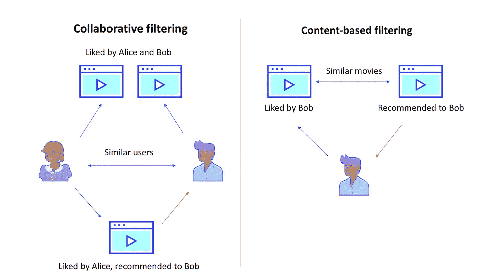
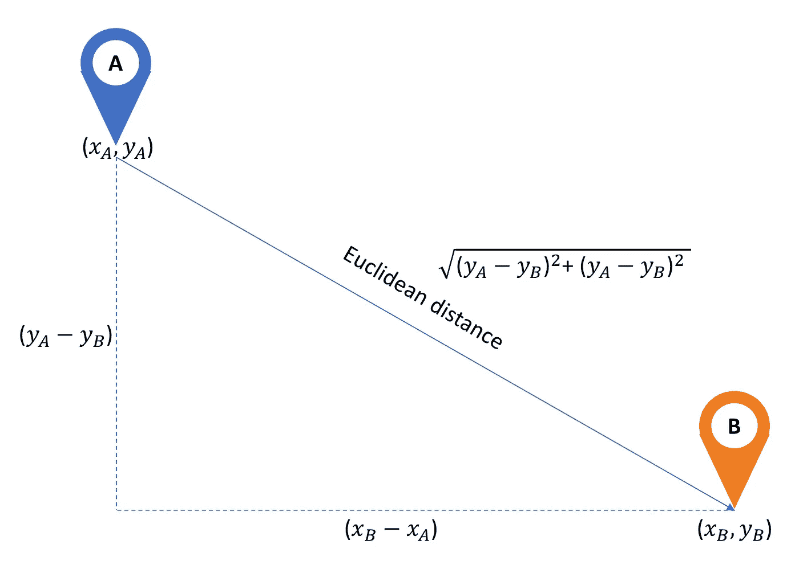

# 网飞和亚马逊怎么知道我想要什么？

> 原文：<https://towardsdatascience.com/how-do-netflix-and-amazon-know-what-i-want-852c480b67ac?source=collection_archive---------28----------------------->

[JESHOOTS.COM](https://unsplash.com/@jeshoots?utm_source=medium&utm_medium=referral)在 [Unsplash](https://unsplash.com?utm_source=medium&utm_medium=referral) 上拍照

## 或者说推荐系统是如何工作的？

每次谈到推荐系统，我们都把它称为“知道我们一切的算法”。我们每天都能看到他们的搜索结果，例如，当亚马逊向我们推荐有时非常适合我们的产品时，尽管我们以前从未搜索过它们。这通常会吓到一些人，尤其是因为没有多少人知道这些算法在实践中是如何工作的，所以我将在这里尝试总结一下基本知识。无论您是一名数据科学家，想要开始深入研究推荐系统，还是只是好奇想了解整个事情在现实生活中是如何发生的，这都是一个好的起点。

# 推荐系统如何工作——简短版

推荐算法可以分为两个不同的类别，这取决于它们的方法:协同过滤和基于内容的过滤。

## 协同过滤

协同过滤考虑到了口味的相似性，这意味着如果爱丽丝喜欢哈利波特，魔戒和纳尼亚传奇电影但讨厌变形金刚，鲍勃喜欢哈利波特和魔戒电影，我们假设他更有可能喜欢纳尼亚传奇而不是变形金刚。因此，它是基于用户之间的相似性，而不是产品。

## 基于内容的过滤

另一方面，基于内容的过滤通过查看特征本身来模拟喜欢某部电影的可能性。在上面的例子中，我们可以感觉到 Alice 和 Bob 都喜欢奇幻类型的电影，并向他们推荐《霍比特人》。在这个例子中，它是基于产品之间的相似性，而不是用户。

# 推荐系统如何工作——长篇版

为了做到以上任何一种方法，我们必须找到一种找到相似用户或相似产品的方法。更好的是，我们需要一种方法来衡量它们之间的相似性，这样我们就可以发现哪些产品/用户比其他产品/用户“更相似”。

## 类似

相似性可以通过测量距离来发现:两个元素越接近，它们就越相似。在数学中，测量距离的方法有很多种，但首先让我们了解一下在这个上下文中距离是什么意思。

在我们的日常生活中，两点之间的距离是使用这些点的空间坐标来测量的。例如，如果我知道我的确切空间坐标(经度和纬度)和我想去的地方，我可以使用我们称之为欧几里得距离来计算我到该点的距离:

当我们拥有年龄、性别或电影类型等特征而不是地理坐标时，我们该如何做到这一点呢？事实证明并没有什么不同，除了空间坐标有两个特征(X 和 Y)，在我们的例子中，我们有更多的特征和一个高维空间，很难在图中显示出来。这篇文章的目的并不是深入许多可用的距离度量的细节，但是如果你想了解更多，这里有一篇很好的文章。一旦我们能够计算元素(用户或产品)之间的相似性，我们就可以尝试不同的方法来推荐产品。

## 实践中的协同过滤

让我们在之前的 Alice 和 Bob 的例子中增加一些人。在纯粹的协作过滤方法中，我们将首先获取用户对我们电影的评分(1-5 ):

然后，我们可以通过推断 Bob 对他还没有看过的两部电影的评价来向他推荐一部电影。这样做的一种方式可以是取最接近他的 2 个用户(在这种情况下是 Alice 和 Carol)，并通过取他们对每部电影的平均评级来估计他的评级。对于纳尼亚传奇，我们估计是 4.5，而对于变形金刚，我们估计是 1(因为卡罗尔没有给它评分，所以我们不会考虑她的评分)。在实践中，我们可能会使用比 2 个用户多得多的用户，并且可能根据他们与 Bob 的距离来加权他们的评级，因此更多相似用户的评级被给予更大的权重。请注意，这种方法与他们的年龄或性别无关，也与实际的电影内容无关:它纯粹基于用户之间的评级和相似性。

## 基于内容的过滤

基于内容的过滤是基于产品之间的相似性。一种方法是使用产品特性。在我们的示例中，它可能是这样的:

给 Bob 推荐一部电影，我们可以根据上面展示的特征，看看哪些电影和他喜欢的电影更相似。他喜欢《哈利波特》和《指环王》，根据上表判断，这两部电影更接近《纳尼亚传奇》，而不是《变形金刚》。

# 现实生活中是怎么发生的？

大多数公司使用混合方法，这意味着他们结合了协作和基于内容的过滤，不仅考虑评级和类别，还考虑年龄和性别等人口统计数据，以及更高级的功能，例如书中的文本内容。特别是当你没有足够的特定用户的数据，如评分，来推断他们的偏好时，你可以使用人口统计学来估计。

如果你想了解更多关于推荐系统的知识，你可以查阅[这篇非常有用的文章](https://builtin.com/data-science/recommender-systems)，或者，如果你对数学和操作细节感兴趣，你可以查阅[这本书](https://www.amazon.com/Recommender-Systems-Textbook-Charu-Aggarwal/dp/3319296574/ref=sr_1_1?keywords=recommender+systems&qid=1584130871&sr=8-1)。