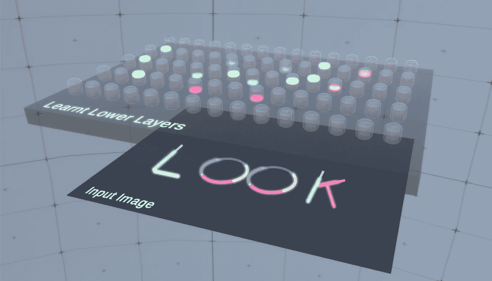
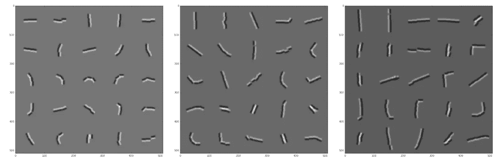

# rcn 如何学习？

> 原文：<https://towardsdatascience.com/how-do-rcns-learn-1b65561f2e38?source=collection_archive---------37----------------------->

## 皇家护理学院

## 用匹配追踪代替梯度下降

科学进步一次一个葬礼。马克斯·普朗克的这些话是杰弗里·辛顿在被要求评论反向传播在未来的作用时使用的话，反向传播是他共同发明的算法[1]。为了发展人工智能，检查人类大脑的灵感是很自然的，Vicarious 在他们的递归皮层网络(RCNs)工作中就是这样做的[2]。本专栏文章探讨了 rcn 的不同方面，在本文中，我们探讨了它们的学习机制。

*本文假设了解 ConvNets 和 RCNs 的结构，并倾向于了解 RCNs 的推理机制。可以从[2]或者我以前的文章(* [*结构*](https://medium.com/@iahmedmaher/understanding-rcns-structure-ec4b51b9c257) *，* [*推论*](https://medium.com/@iahmedmaher/understanding-the-inference-mechanism-of-rcns-ba1f00416b63) *)中了解 RCNs。*

在 rcn 中有两件事情需要学习，功能节点的通道以及它们到其下一层的布线，以及池层中的横向连接。

# 特征学习

## 特征到底是什么？

在我们深入研究特征学习机制之前，让我们回顾一下 rcn 甚至 ConvNets 中特征的用途。分层视觉模型中给定层上的特征仅仅是考虑到它们在空间中的排列而对其下一层中的特征进行分组。在 ConvNets 中，特征映射中的一个单元指示在该特定元素周围的局部窗口中存在多少特定的较低级特征分组。在 rcn 中，通道(相当于 ConvNet 特征图中的单元)不是实数，而是二进制值，表示特定特征的存在与否。

但是，我们应该关注什么样的低层特性分组呢？假设我们位于某个中间层，其下的要素图层在多个方向上检测曲线段。如果我们想识别英语中的字符，我们是否应该有一个特征来表示一组形成花、星或圆的曲线段的存在？这个问题的答案是这个特征将在多大程度上帮助模型解释它通常会*遇到的关于其他候选特征的图像。所以，在英语 OCR 的情况下，一个圆比一朵花或一颗星更有用，这基本上是 RCNs 的学习算法的本质。*

在 rcn 中，我们只需要学习中间层和最顶层的特性，因为最底层具有硬编码的特性，即补丁描述符。对于中间层，算法逐层进行。在每一层，该算法在每次迭代中迭代添加单个特征，直到它找不到任何有用的特征来添加。让我们考虑在图 1 所示的特征层之上学习一个特征层。为简单起见，所示的层将被称为层 A，而它上面的层将被称为层 b。

图 1:对于给定的图像，运行前向传递和稀疏化步骤后的活动特征。所有显示的层已经经历了学习。为简明起见，较低层显示为长方体。其上的图层是具有 8 个颜色编码通道的要素图层(即黄色通道表示在其坐标处存在弯曲的左线段)。抱歉，看起来不专业，但它让事情更清楚。

## 中间层特征学习

在第一次迭代中，该算法从训练数据集中选取一幅随机图像，并向前传递到层 A。然后，我们应用一个稀疏化步骤，使我们获得层 A 的最有可能解释该层输入图像的特征。请记住，正向传递产生来自所有通道的信念传播消息，但不会告诉我们哪些功能应该激活，哪些不应该激活。如您在图 1 中所见，该图层中将有许多活动要素，其中一些组重复出现，如表示圆的组和表示长直线段的组。然而，在层 B，图像是完全无法解释的，因为在这一层还没有通道。该算法基于一些试探法来挑选一些候选分组，例如活动通道彼此靠近以及其中具有大量子特征的分组。对于每个候选分组，该算法计算其在训练数据集中的使用频率，并挑选最常使用的分组，该分组满足我们之前关于应该学习哪些特征的推理。

在图 1 中，可以看到对应于一个圆的层 A 的红、黄、绿和蓝通道的特定方向出现了两次。因此，我们假设它选择了这组子特征，并将其作为 b 层的特征添加。在下一次迭代中，该算法选择了另一个随机图像。现在，它的所有圆将在层 B 通过稀疏化步骤解释，就像我们在层 A 所做的那样，但是所有长线段不会，所以这次的算法可能会选择长线段的分组，因为它是英文字母中的常见特征，并继续下一次迭代，以此类推。

我想在这里提到，所有这些都依赖于稀疏编码的思想，其中我刚才提到的算法是字典学习算法匹配追踪，但作者添加了轻微的修改。

您可能已经注意到，所有中间层都不需要标签，这是 rcn 的一个很好的特性。在许多任务中，作者使用 SHREC 3D 数据集的 10，000 张图像训练中间层，然后在其他数据集上使用这些学习到的层，这有点像迁移学习。您可以在图 2 中看到实际 RCN 的中间层学会表示哪些通道。

图 2:中间层 RCN 的学习特征。图片摘自[2]的补充材料文档。

## 最顶层特征学习

最顶层是一个特例。它是使用一个带标签的图像集学习的，我们希望最终对它的图像进行分类。对于每个标记的图像，创建新的分类器特征。因此，对于同一个类，我们实际上可能在最顶层有多个通道。这看起来很昂贵，但是 rcn 是数据高效的，所以它首先不需要大量带标签的图像。我们在上一段中描述的学习算法将被修改，以便允许我们刚才提到的最顶层上的约束，这些约束很简单，不值得一提。

## 横向联系学习

不幸的是，这篇论文及其附带的补充文档没有提到关于如何学习池层的横向连接的很多细节，并且其算法也没有出现在他们发布的代码库中。他们提到的主要问题是，他们是从输入图像中对象的轮廓连通性中学习的。

本文到此为止。如果你想了解更多关于 RCNs 的知识，你可以查看它的论文[2]和补充材料文档，或者你可以阅读[我的关于在不同数据集上应用 RCNs 的结果的文章](https://medium.com/@iahmedmaher/examining-the-performance-of-rcns-on-popular-datasets-1d6a2a8852c1)。

# 参考资料:

[1] [S. LeVine，人工智能先驱说我们需要重新开始(2017)，Axios。](https://www.axios.com/artificial-intelligence-pioneer-says-we-need-to-start-over-1513305524-f619efbd-9db0-4947-a9b2-7a4c310a28fe.html)

[2] [D. George，W. Lehrach，K. Kansky 等，一种以高数据效率训练并打破基于文本的验证码的生成视觉模型(2017)，科学杂志(第 358 卷—第 6368 期)。](https://science.sciencemag.org/content/358/6368/eaag2612.full?ijkey=DmvGldXIEXVoQ&keytype=ref&siteid=sci)