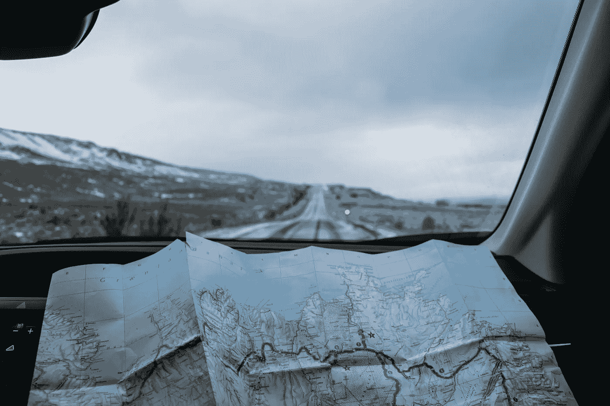

# 机器人如何在不断变化的世界中“找到”自己？

> 原文：<https://towardsdatascience.com/how-do-robots-find-themselves-in-an-ever-changing-world-19eda1956c56?source=collection_archive---------50----------------------->

## 机器人位置识别的 ELI5 介绍

由 [Unsplash](/s/photos/map?utm_source=unsplash&utm_medium=referral&utm_content=creditCopyText) 上的 [Tabea Damm](https://unsplash.com/@tabeadamm?utm_source=unsplash&utm_medium=referral&utm_content=creditCopyText) 拍摄的照片

想象一下这样的场景:你和一个从印度旅行回来的朋友在一起。你游遍了印度，并推荐你的朋友去那里度假。当你们见面时，你的朋友告诉你曾在一座寺庙前看到一只戴着红帽子的猴子。你记得几年前见过那只猴子！你拿出手机寻找照片作为证据。接下来几分钟的对话听起来可能是这样的:“我知道它就在这里的某个地方！不，不。那是在我们参观瀑布之前。嗯。那是在海滩之后，我很确定……”令人沮丧，对吗？

假期通常持续一到两周，包括连续的假期快照。在你的手机上找到一段时间前拍摄的一张照片可能会很棘手。这可能令人沮丧，但并非不可能。我们直观地回放一系列的心理图像，这些图像提供了我们在任何一个时间点的位置信息。

# 地点识别

这种对先前看到的信息的*识别和回忆*构成了**位置识别**的问题。在你的手机上找到一张*一只猴子戴着红帽子*的假日照片也涉及同样的精神导航。当你翻阅图片时，你的大脑会回到过去，在脑海中回放假期的持续时间，定位你何时何地看到了这只猴子。

这是另一种解释。当你给某人指路时，通常会说这样的话:“一直往前走，直到你看到著名的汉堡店，向左转，然后你会看到一家药店就在你面前。”。在那里向右转…。如果他们无法将所见与你描述的相匹配，所有这些信息都是无用的。

# 在更大的范围内

现在，想象一下，如果你的手机日夜不停地捕捉图像。浏览所有内容，从几个月或几年前拍摄的一系列假日快照中找到一张戴着红帽子的猴子图片，几乎是不可能的。这恰恰是自动驾驶汽车要解决的问题。代替手机上的照片，这些机器人必须能够理解在其整个运行寿命中运动时捕获的连续视频序列流(相当于数百万张图像)。

对于机器人来说，大规模观测的成功定位是通过**可扩展地点识别**的过程实现的。

# **机器人像人类一样解决问题**

作为人类，我们无时无刻不在脑海中带着世界的图像*。自动驾驶汽车也是类似的情况。为了在旅途中做出有效的决策，自动驾驶汽车必须尽快理解永无止境的图像序列*。**

人类和机器人也共享以 GPS 导航/定位工具的形式获得外部帮助的能力。然而，GPS 并不能在所有情况下对所有任务都足够精确——水下、地下、火星！当谈到自动驾驶汽车的可靠性及其做出准确、实时决策的能力时，这是一个问题。幸运的是，如果机器人，包括自动驾驶汽车，以前看到过一些东西，这些信息应该有助于自我定位。

回想一下你在一个新城市迷路的时候。随意走了一圈，突然看到一个你之前注意到的建筑，可能是因为颜色或者大小。多亏了你头脑中运行的地点识别算法，你可以计算出这座建筑相对于你的酒店的位置，让你安全返回。我们不考虑一个单一的图像或场景来识别我们在哪里。我们通过回放一系列相连的图像(和记忆)来理解事物，从而导航回您的酒店。

作为澳大利亚机器人视觉中心的一部分，我们已经将同样的“人类”策略应用于机器人。我们使用可扩展的地点识别来匹配机器人主动看到的与数百万先前观察到的图像。单个图像可能不足以提供定位信息。然而，从每幅图像中收集一点一滴的证据，并利用这些证据对序列进行推理，已经显示出定位的巨大前景，即使当图像的外观由于天气、一天中的时间等而改变时。

# 机器学习拯救世界？

虽然机器学习被用来解决机器人领域的大多数问题，但我们对顺序推理的关注采取了一种稍微过时的路线。正如[我们在 2019 年 ICCV](https://openaccess.thecvf.com/content_ICCV_2019/papers/Doan_Scalable_Place_Recognition_Under_Appearance_Change_for_Autonomous_Driving_ICCV_2019_paper.pdf) 上的工作所示，好消息是，顺序推理优于基于定制深度学习的方法来解决机器人的可扩展地点识别问题。这也让我们大吃一惊！

当前深度学习方法的一个很大的局限性是它们无法推广到看不见的场景。相比之下，我们已经证明了我们的方法在各种不同的测试环境中“开箱即用”。此外，因为在顺序推理中没有学习到的成分，我们的方法不受范围的限制，并且可以通过数百万个图像来了解它们。

# **前进的道路:接下来的步骤和挑战**

自动驾驶汽车将很快在我们的道路上成为现实。为了安全导航，这些未来的机器人每次在道路上行驶时，都需要看到并理解无数的图像。

仍然有挑战需要克服。例如，作为人类，即使在变化的条件下，我们也很容易找到自己的位置。在黑暗或暴风雨的条件下，我们仍然可以在暴风雨的黑夜里看着我们的车窗外，仍然能够确定我们在哪里。然而，当一个位置的外观由于外部/环境因素(光线、天气、障碍物等)而改变时，机器人仍然很难解释图像。

一个更迫切需要克服的问题是**的储存**。自动驾驶车辆看到的所有图像都需要存储在内存中，以便能够对它们进行顺序推理。

我们目前面临的挑战是提出一种“**终身地点识别**方法，这种方法将在任何可以想象的情况下——无论天气或时间——大规模地持续运行。我们想结合我们目前对自己位置的了解来**预测**我们在下一个瞬间的位置。利用这些信息，我们可以限制我们需要推理的图像集。背后的推理是这样的。如果我知道我在阿德莱德中央商务区的某个地方，那么在下一个时刻，我很可能(实际上，在没有传送的情况下是不可能的)会发现自己在珀斯的某个地方。因此，让我们只查看靠近我当前位置的图像，并将其他所有内容标记为“不太可能”。

我们希望通过将**顺序分析**与内存管理结合起来，我们将能够实现一种方法，使自动驾驶汽车能够在任意大的图像集合中定位自己。

想象一下这个未来场景:自动驾驶汽车可以协同工作，捕捉世界在任何给定时刻的实时快照，以及世界每天是如何变化的。**这种大规模的地点识别方法可以通过所有汽车的组合眼睛来观察世界，从而为每辆自动驾驶汽车实现精确定位。**

激动人心的时刻，的确！