# 我们如何描述数据？

> 原文：<https://towardsdatascience.com/how-do-we-describe-data-9ce688943c8e?source=collection_archive---------5----------------------->

描述性来自单词“describe ”,所以它通常意味着描述某事。描述统计学本质上是通过图形表示、集中趋势测量和可变性测量等方法来描述数据。它以一种有意义的方式总结数据，使我们能够从中获得深刻的见解。

# 数据类型

数据可以是定量的，也可以是定性的。定量数据是数字形式的，可以是包括有限数值的离散数据，也可以是除有限数值之外还包括小数值的连续数据。例如，一个班的女生人数只能取有限的值，所以它是一个离散变量，而产品的成本是一个连续变量。

定性数据不是数字，而是基于面试、考试成绩等方法。它可以是名义数据和顺序数据，其中名义数据不包含任何顺序，如性别、婚姻状况，而顺序数据有特定的顺序，如电影的评级、衬衫的尺寸。

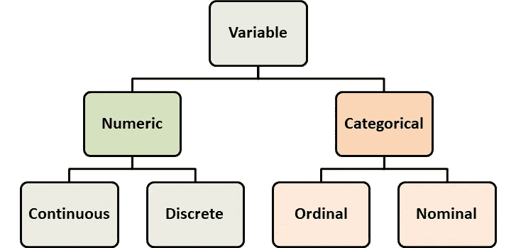

**作者照片**

# 我们如何描述数据？

为了描述和分析数据，我们需要了解数据的性质，因为数据的类型会影响可以对其执行的统计分析的类型。

# 频数分布

它测量观察在数据中出现的次数。例如，包含班级学生性别的定性数据，描述的合适方法是男性和女性的频率。或者，对于关于人的年龄的数据，我们可能想要知道各种年龄组的频率，我们可以将数据分类为连续数据，以构建如下所示的频率分布。

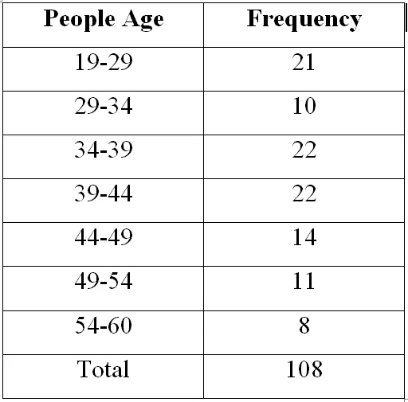

**作者照片**

# 相对频率分布

有时，频率并不能给我们一个清晰的数据图像。假设您想知道哪个州的大多数学生注册了数据科学的在线项目。绝对数字可能给出模糊的观点，但是如果你用绝对数字除以注册学生总数，你会得到我们所说的相对频率。所以如果你读到有 200 名学生从班加罗尔市入学，你不知道这个数字是否很高。但是如果你被告知相对频率是 0.8，这意味着 80%的学生来自班加罗尔，你可能会认为这个城市的学生比其他城市的学生更倾向于数据科学。

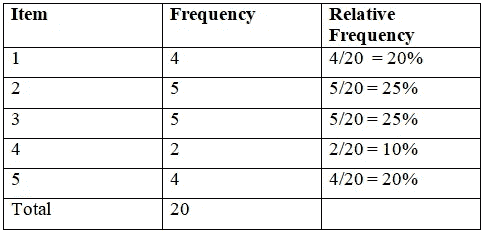

**作者照片**

# 条形图

我们可以将频率分布以条形图的形式可视化，该图以高度或条与它们所代表的值成比例的方式绘制分类数据。我们还可以构建一个分组频率条形图来比较不同年份的不同数据集。这可以帮助我们了解数据中是否存在模式。

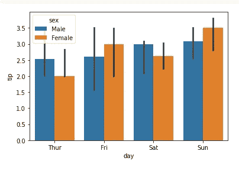

**作者照片**

# 柱状图

有时，通过取一系列值而不是每个单独的值来表示数据更好。假设我们想看看汽车在城市中行驶的速度。绘制每个速度单位没有意义，比如 60.2 km/h 或 74.3 km/h。因此，我们使用 50-60km/h 等范围来绘制直方图，直方图也使用条形图来以图形方式表示数据，但这里每个条形组都是一个范围。较高的柱表示更多的观察值落入该范围。我们可以通过直方图了解连续数据的形状和分布。比方说，我们想了解某个特定国家(比如印度)多年来的 GDP 变化。下图显示了印度的国内生产总值在过去十年中持续增长。

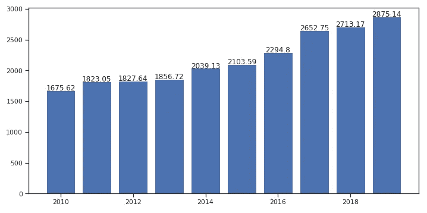

**印度历年 GDP(以十亿美元计)，作者照片**

请注意，每个条形是一个描述年份的范围，比如 2010 年将涵盖从 2010 年 1 月到 2010 年 12 月的数据。因为它表示范围，所以它隐藏了特定月份的 GDP 等细节。在构建直方图时，必须选择适当的容器大小(也称为类间隔)。就像这里的框大小是一年，我们也可以选择一个季度或一个月。容器越大，容器就越小，分析的粒度就越小，因为它代表的细节就越少。

因此，一个 5 年的范围可能无法提供关于 GDP 在 10 年内如何变化的更深刻的见解。而月度范围将包含更多细节，但分析起来可能会很麻烦。然而，如果我们有数据显示工程师的工资范围，我们想知道有多少工程师属于这个范围。在这种情况下，bin 代表薪金，这是一个很大的数字，因此在这种情况下，bin 的大小越大越有意义，比如$50，000 或$100，000。您可以通过调整参数来绘制一些图表，看看哪一个给出的分析最好。理想的箱尺寸既不隐藏太多细节也不暴露太多细节。

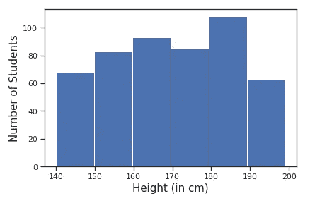

**作者照片**

现在让我们假设我们想知道哪个国家的失业率更高。X 轴将列出国家和失业人口的绝对数量；然而，绝对数字也取决于该国的人口。像中国和印度是人口最多的国家，因此它们的绝对数字要大得多。因此，我们可以取失业人口的百分比，这将给出一个国家的失业人口比例，这在与其他国家的失业情况进行比较时更有意义。作为一名分析师，尝试分析直方图，看看其中是否有趋势。检查哪个区域的数据更集中，或者哪个区域的值很少或没有值。检查数据的偏斜度，是左偏斜还是右偏斜，即更多的条形分别向左或向右，这可能是得出结论的基本要素。

# 线形图

连线图是一种图形表示，用于理解分布的形状或趋势。它是通过连接柱状图箱的中点并用线将它们连接起来而构建的。

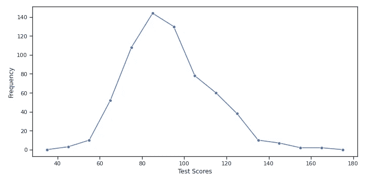

**作者照片**

使用线形图优于直方图的一个优点是，很容易在同一个图上比较不同的分布，而使用直方图可能会非常拥挤。图形表示可以帮助分析师做出决定，如是否在机器学习算法中包含一个变量。如下图所示，是学生前测和后测成绩的对比曲线图。它表明，与没有参加测试的学生组相比，如果他们的测试是以前进行的，较少的学生取得了较低的分数，而较多的学生取得了较高的分数。这意味着预先进行测试是提高课堂表现的一个重要因素。

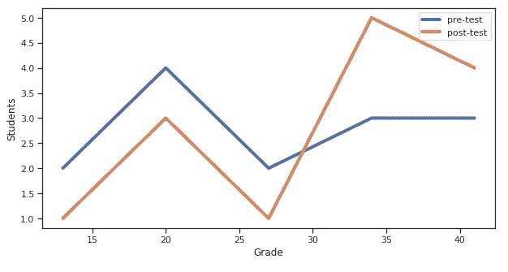

**作者照片**

我们还可以构建显示累积频率的线图。基本上，频率或相对频率从左到右相加得到累积频率。这在执行一些不能仅通过频率执行的分析时非常有用，例如，如果我们比较两个部分的分数，累积频率可以显示 173，即 16%的学生分数小于或等于 75。

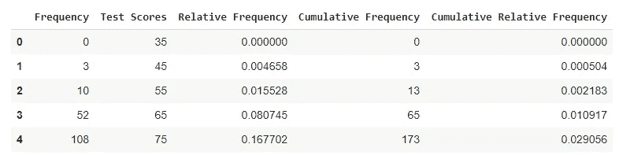

**作者照片**

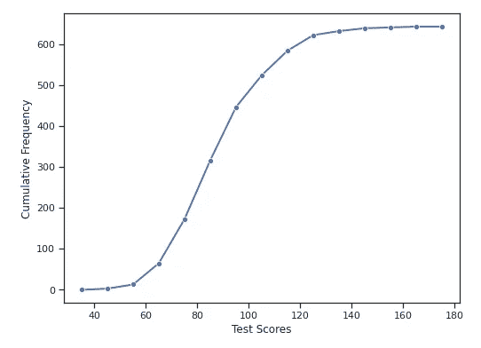

**作者照片**

# 散点图

到目前为止，我们看到了如何使用变量在数据中出现的次数来描述变量。但是，如果我们想描述两个变量，以便检查它们之间是否有关系呢？散点图是一种非常基本和必要的方法。它使用点绘制两个不同变量的值，其中每个点代表一个特定的数据点。散点图可以让我们了解数据中是否存在模式；积极的趋势表明，随着 x 变量的增加，y 变量也增加，反之亦然。如果数据分布不均匀，这可能意味着变量不相关，所以我们可以在 ML 算法中删除它们。

在某些图中，变量可以如此正相关，看起来几乎是线性关系。在某些情况下，它可以是指数的，这传达了 y 变量随着 x 的增加而快速增加。散点图对于获得能够帮助我们做出关键决策的洞察力非常重要。假设我们构建了一个特定地区的农业用地面积和粮食产量的散点图。这通常会给我们一个正的关系，如果有极端的数据点，即土地面积较大但产量较低，这可能意味着这些土地面积没有得到充分利用，因此可以在这方面采取必要的行动。

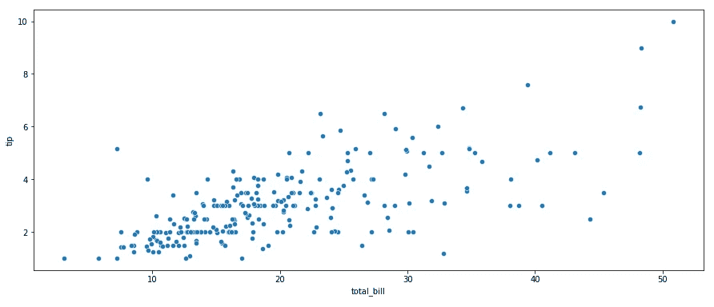

**作者照片**

这些是我们描述数据的一些方法。我希望这篇文章对你有所帮助。感谢阅读！

数据科学课程—【https://padhai.onefourthlabs.in/courses/data-science 