# 你如何从数据中做出统计推断？

> 原文：<https://towardsdatascience.com/how-do-you-make-statistical-inferences-from-data-962a7d9f3870?source=collection_archive---------17----------------------->

戴维·特拉维斯在 [Unsplash](https://unsplash.com?utm_source=medium&utm_medium=referral) 上拍摄的照片

## 运用推断统计学调查女性工资低于男性的说法

你知道美国人的平均年龄是多少吗？你不用去谷歌。我已经在下面为你做了，

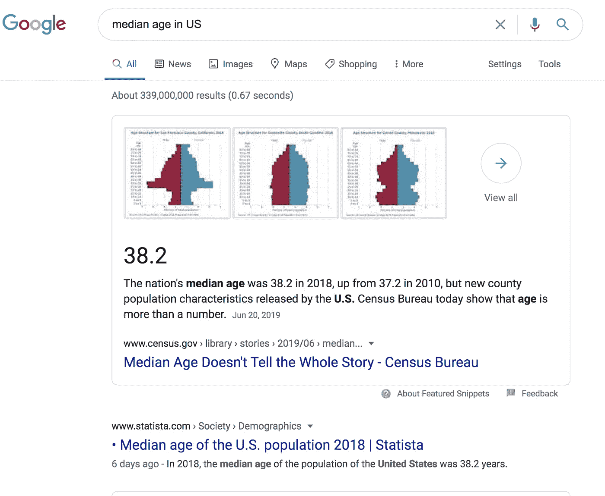

截图来自谷歌搜索

快速的谷歌搜索显示，美国人的平均年龄是 38 岁。你有没有想过人口普查局的统计人员是如何得出这个数字的？你认为他们会亲自或通过邮件去问每个人吗？不是因为仅仅为了找到一些统计数据并把它们大胆地放在他们网站上，这纯粹是浪费时间、金钱和资源。

那么他们是怎么做到的呢？他们使用推断统计学的一些基本原理。

好的，那么在这篇文章中，我们将使用统计推断来寻找以下问题的答案。

> 女性的工资比男性低吗？

在深入案例研究之前，让我们先了解一下推论统计学的一些皮毛。

# 推断统计学的一些背景知识

***总体:*** 包含我们实验空间中所有数据点的集合。人口数量用 *N* 表示。

***样本:*** 它是从总体中随机选择的一个子集——样本量用 *n* 表示。

***分布:*** It 描述了数据/总体/样本范围以及数据在该范围内是如何分布的。

***意思是:*** 来自你所在人群或样本的所有数据的平均值。这对于群体用表示，对于样本用 *x̄* 表示。

***标准差*** 是一个衡量你的人口分布情况的指标——用 *σ* 表示(适马)。

***正态分布:*** 当你的总体围绕均值以σ标准差完美对称分布时，得到如下钟形曲线。

***中心极限定理***

> 来自维基百科:
> 
> 在概率论中，**中心极限定理** ( **CLT** )确立了，在某些情况下，当添加独立的随机变量时，它们的适当归一化和趋向于正态分布(非正式地为*钟形曲线*)，即使原始变量本身不是正态分布。

下面的视频对中心极限定理有一个非常直观的解释

换句话说，这个定理表明，无论初始总体的形状如何，抽样分布总是接近正态分布。

***标准差*** 是样本均值偏离总体均值多少的度量。

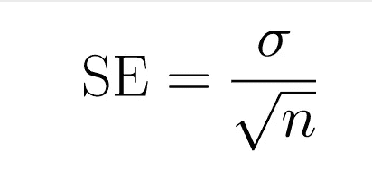

标准误差公式，其中σ是标准偏差，n 是样本量。

***【样本量(n)*** 是样本总体的大小。下图显示了样本大小和标准误差之间的关系。随着样本量的增加，标准误差减小。

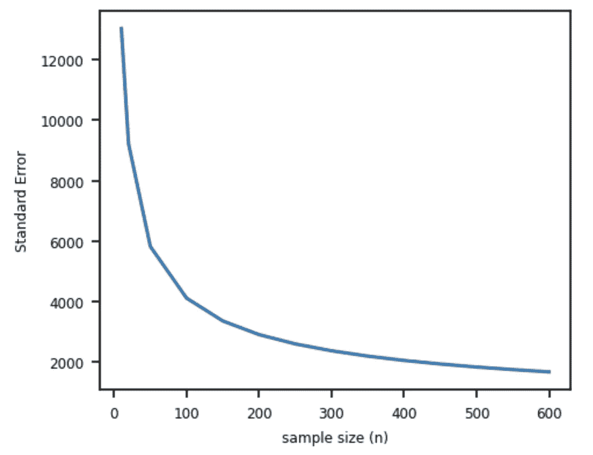

虽然选择一个大的样本大小没有问题，但是，这在大多数现实世界的复杂问题中是不可行的。因此，需要一个最佳的样本量。

***置信区间*** 代表我们相当确信我们的总体意味着谎言的值的范围。在下图中，下限和上限都代表置信区间。置信区间之间的区域称为接受区域，而置信区间之外的区域称为拒绝区域。

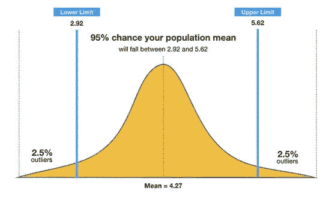

***p 值*** 是检测结果偶然发生的概率。换句话说，就是我们的总体均值落在拒绝区域的概率。p 值越低，表明测试结果的可信度越高。

***显著性水平(α)*** 是设定的阈值 p 值，用于决定测试结果是否**具有统计显著性**。显著性水平通常设置为 0.05、0.01 或 0.001。如果测试结果的 p 值小于显著性水平(α)，那么我们可以得出结论，所获得的测试结果在统计上是显著的，并且它们不是由随机机会或噪声引起的。

# 案例研究的数据收集

为了我们的分析，我们将使用从[综合社会调查(GSS)](https://gssdataexplorer.norc.org/) 收集的数据，该调查自 1972 年以来主要通过面对面的访谈对美国公众进行年度调查。下面是他们网站上的描述。

> GSS 旨在收集当代美国社会的数据，以监测和解释态度、行为和属性的趋势和常数；审查整个社会的结构和功能，以及相关小组发挥的作用；将美国与其他社会进行比较，以便将美国社会置于比较的视角中，并发展人类社会的跨国模式；让学者、学生、政策制定者和其他人能够以最少的成本和等待轻松获取高质量的数据。

GSS 的样本是使用区域概率设计抽取的，该设计从全国城市、郊区和农村的混合地理区域中随机选择家庭受访者。因为使用了随机抽样，所以数据代表了美国人口的整体情况。

好了，现在我们已经准备好了数据，让我们深入案例研究并寻找答案。

# 案例研究:女性工资比男性低吗？

## 动机

这是我们社会中一个非常基本的问题。在这个案例研究中，我们将调查这种说法是否站得住脚，或者只是社会上的另一种看法。

## 数据

对于我们的分析，我们将使用最新的可用调查数据(2018 年)。

我们将使用以下变量进行分析:

1.  **性别:**这是参加调查的受访者自我报告的性别。
2.  **conrinc** :这是回答者经通胀调整后的年收入。
3.  **年龄**:回答者的年龄。
4.  **种族**:这是回答者自述的种族。
5.  **uscitzn** :此字段标识被调查人是否为 a)美国公民或 b)非美国公民或 c)出生在波多黎各、美属维尔京群岛或北马里亚纳群岛的美国公民或 d)在美国境外出生，父母当时是美国公民或 e)不知道。

我们执行以下数据清理来最终确定数据集:

*   年龄的最大值被设置为 89，因为我们有“89 及以上”这样的字段，这给我们的分析带来了困难。
*   我们创建了一个指标 ***uscitzn_ind*** ，如果回答者是美国公民(无论他们出生在美国境内还是境外),则取 1；如果回答者不是美国公民，则取 0；如果源字段中有无效值，则取-1。
*   我们注意到一些受访者报告他们的年收入为 0 美元。他们要么不工作，要么休息，要么呆在家里。因此，我们将从我们的分析中删除这些数据点。

## 探索性数据分析

让我们看看最终数据集的形状:

*   我们总共有 1363 个数据点。
*   我们有 646 名男性和 717 名女性。

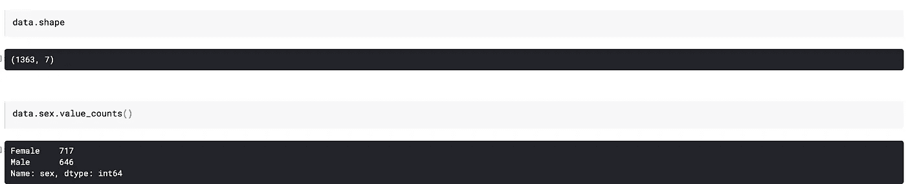

让我们把数据分成两组；A 组有男性，B 组有女性。这是我们初始人口的分布。

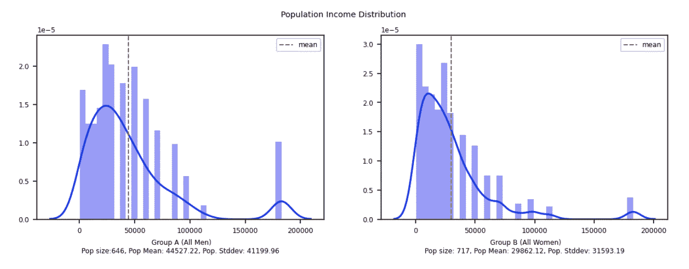

男女人口分布

我们可以从初始人口分布中得出以下结论:

*   两组都是右偏分布，因此不是完美的正态分布。
*   男性人口平均数为 44K，女性人口平均数为 29K。

## 推理

我们首先定义我们的假设:

*   ***H0(零假设):*** 男女的平均差异为零。
*   ***H1(交替假设):*** 男女之间的平均差异大于零。

首先，我们需要为每组得出一个理想的样本量。使用下面的代码，我们计算两组的样本大小。

对于 95%的置信区间和 5%的误差，我们计算出 A 组(男性)的理想样本量为 242，B 组(女性)的理想样本量为 251。这是期望的置信度和误差规格所需的最小样本量。

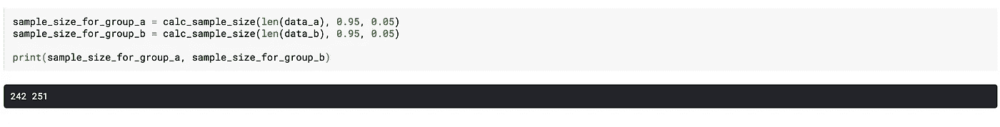

使用下面的代码，我们将为两个组创建抽样分布:

这是两组的样本分布结构:

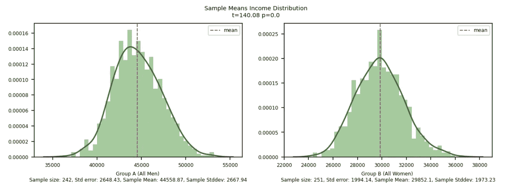

男性和女性的抽样分布

这些现在是完美的正态分布！由于中心极限定理，任何总体的抽样分布都呈正态分布。

> 不管总体分布的初始形状如何，抽样分布将接近正态分布。随着样本量的增加，抽样分布将变得更窄且更正态。

从抽样分布中，我们观察到男性的平均收入大于女性的平均收入。同样，它们的平均值之差为 14706.00。这是否意味着我们证明了这一说法？还没有，因为我们还不能确定从样本中获得的结果不是偶然的。

因此，为了确定我们的说法，我们对两个独立的样本比例进行了单侧 t 检验。t 检验需要以下检查条件:

*   ***独立性条件:*** GSS 数据基于随机抽样，因此我们确保两个样本组相互独立。
*   ***样本量条件:*** 每个样本量至少需要 30 个服从正态分布。我们确保我们两个组的样本量都远远超过 30。此外，我们确认我们的样本分布都是完全正态的。

使用下面的代码，我们计算 t 统计，自由度，临界值，p 值。

我们可以从 t 检验结果中做出以下解释:

*   较大的 t 值表明两组的均值差异较大。
*   每个 t 分数都有一个 p 值，p 值是样本数据结果偶然出现的概率。由于 p 值远小于我们期望的显著性水平α=0.05，因此测试结果具有统计学显著性，我们可以拒绝两组平均值相等的无效假设。因此，我们可以接受另一个假设。

> 有显著的统计证据表明，女性的收入低于男性。在显著性水平为 0.05 时，我们可以确定测试结果不是随机的。

## 置信区间

此外，我们可以使用以下公式计算均值差异的置信区间:

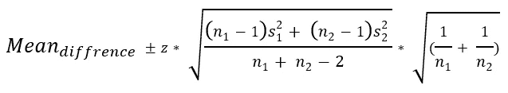

这里，s1 和 s2 是两个样本组的标准误差，n1 和 n2 是两个组的样本量。

使用下面的代码，我们计算 95%置信水平的置信区间。

我们观察到两组的均值差异很好地落在这个置信区间内。

# 更多有趣的见解

通过对不同的横截面组重复相同的分析，我们可以得出以下观察结果:

***白人男女:*** 一般来说，白人女性的平均收入是白人男性的 65%左右。139 的 t 值也表明了巨大的差异。

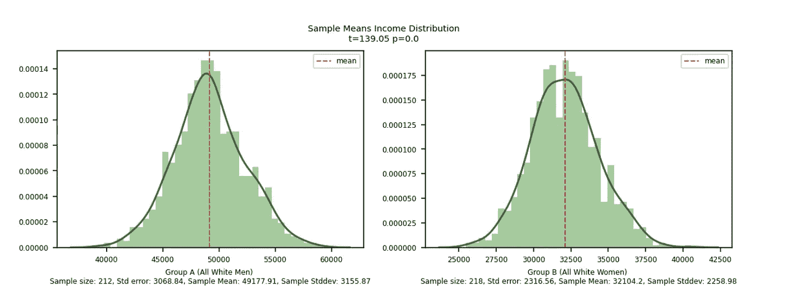

***黑人男女:*** 性别薪酬差距在黑人人口中并不十分显著。一般来说，黑人女性高达黑人男性的 95%。

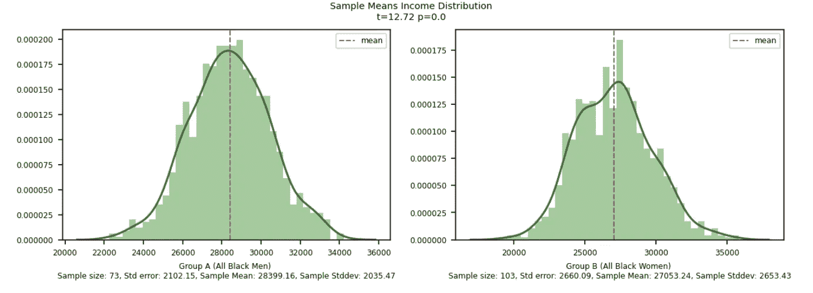

***移民男女:*** 对于移民人口来说，这种差别更大。一般来说，移民女性的收入只有移民男性的 48%。

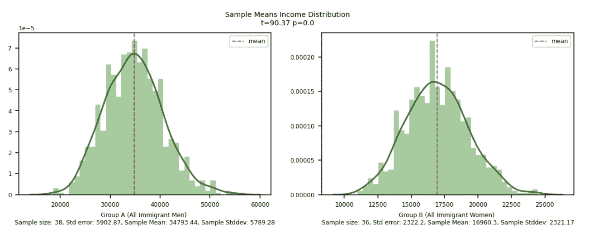

***千禧一代男女:*** 千禧一代女性的收入高达千禧一代男性的 69%。

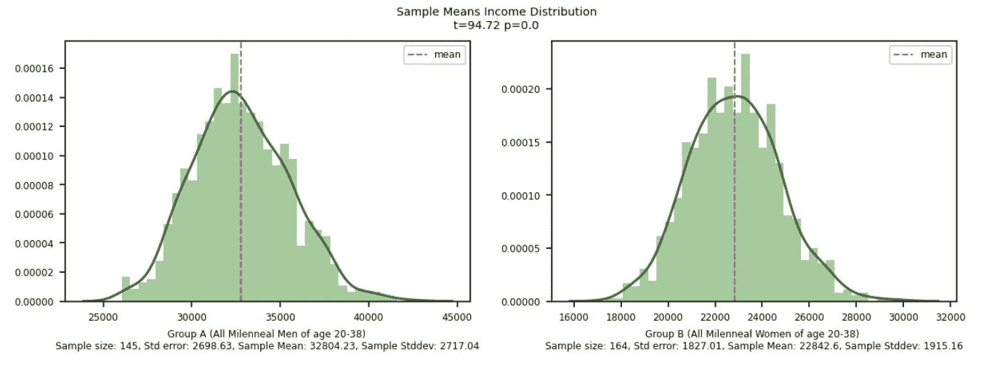

***中年男女:*** 区别对于中年人群来说还不算太差。中年女性的收入高达中年男性的 72%。

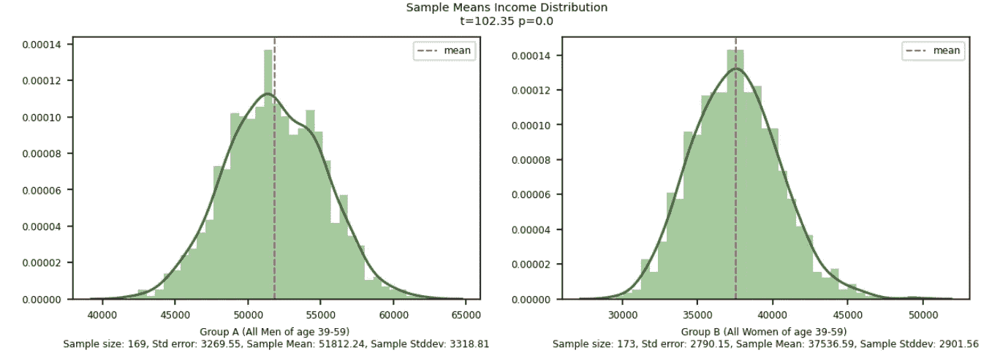

***老年男女:*** 这种差别对于老年成年人、退休人口来说又变得更糟了。一个老年女性的收入只有老年男性的 58%。

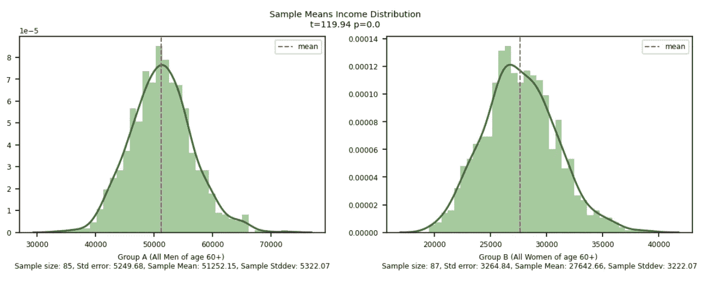

# 结论

根据我们的研究结果，有显著的统计证据表明，女性的收入低于男性。

用于分析的所有代码和数据都可以从 GitHub 库下载。