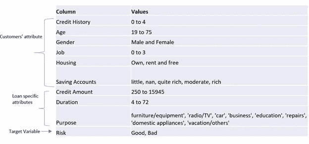
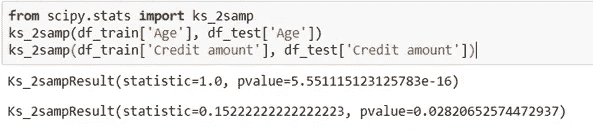
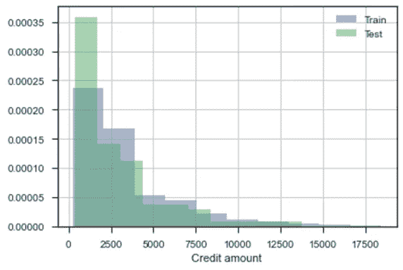
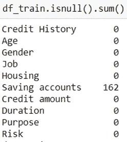
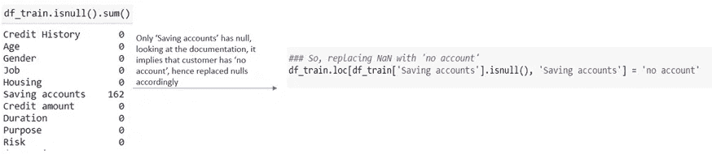
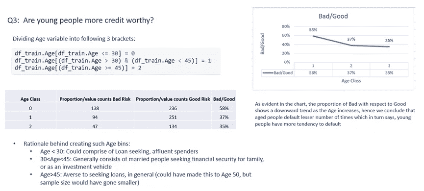
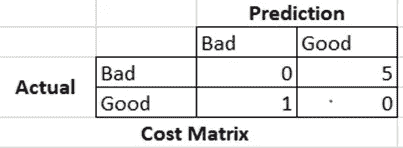
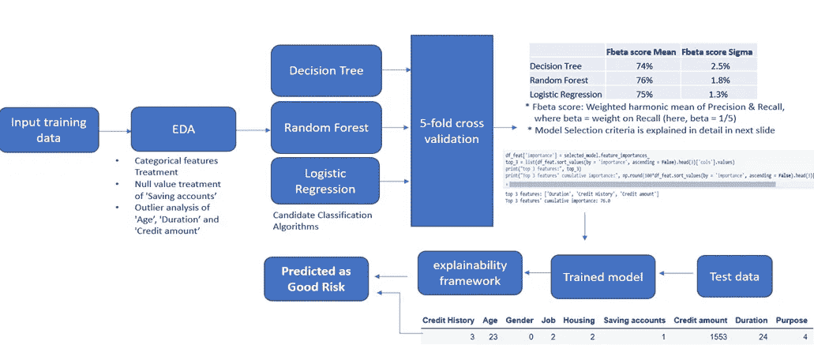

# 您如何展示您的数据科学解决方案？

> 原文：<https://towardsdatascience.com/how-do-you-present-your-data-science-solution-961c1d1d8dec?source=collection_archive---------28----------------------->

## **如何通过机器学习准备信用风险建模报告的示例**

纽约公共图书馆在 [Unsplash](https://unsplash.com/s/photos/credit-risk?utm_source=unsplash&utm_medium=referral&utm_content=creditCopyText) 上由[拍摄的照片](https://unsplash.com/@nypl?utm_source=unsplash&utm_medium=referral&utm_content=creditCopyText)

周末是尝试机器学习新事物的时间，让这段时间变得有价值。记录机器学习方法和解决方案并与利益相关者分享是很重要的，就像最初设计它一样重要。

在今天的帖子中，我们将创建一个关于“信用风险建模”的 ML 解决方案的报告(这里领域偏好是明显的)。

让我们试一试。

第一步也是最重要的一步是**彻底理解业务目标**。对 ML 解决方案的期望是什么？

## **初步问题集:**

有多少数据可用，有什么模式吗，在预测目标变量时是否足够？在现实生活中，是否有其他变量在决策中起着重要作用，但却不是可用数据集的一部分？可以找到它的来源吗？或者有没有一种方法可以代理这些信息？ML 算法可用的数据是否类似于生成预测的生产数据？换句话说，训练和测试数据是否来自相似的分布，从而能够很好地学习依赖关系，以预测看不见的实例？还有更多…

当我们着手解决这个问题时，我们会试着涵盖所有这些问题，所以请关注:

## **目标:**

了解历史上不同借款人的特征和属性与其还款状态之间的关联，即其是否会导致好的风险或坏的风险。

## **信用风险的定义:**

这是目睹债务违约的风险，可能是由于借款人未能支付所需款项而产生的。

## **目标变量**:

良好(1 级，信誉良好)与不良(0 级，信誉不佳)风险。

## **数据描述:**

包含 10 个变量的 1000 条记录

数据描述

理解数据是关键，确保理解每个变量的描述，例如:

*   “信用记录”有 5 个值(0 到 4)，但是它的普通性与信用风险有什么关系。值为 0 是否意味着信用记录较差，而值为 4 是否意味着信用记录较好？这类问题应该尽早提出，因为它们在进行探索性数据分析时设定了前提。
*   另一个快速浏览的数据总结告诉我们,“储蓄账户”有一个类别是 Nan。调查 Nan 意味着什么-缺少值或真正的数据条目。此处，“南”条目对应于“无储蓄账户”。

## 检查训练和测试数据分布:

ML 数据建模中最关键的假设之一是**训练和测试数据集属于相似分布**，如下图所示。请注意，列车数据用作估计客户未来信用价值的参考，因此 ML 解决方案是概率性的，不能基于过去的数据得到保证。这强调了**ML 解的推广性质**

*   **K-S 统计量**是一个数值度量，用于检查两个分布是否相同的零假设。小于 p 值的 K-S 统计值表明我们不能拒绝两个分布相同的零假设。

K-S 统计量

“年龄”变量

'贷方金额'

蓝色直方图来自训练数据，绿色直方图来自测试数据，来自两个分布的直方图彼此有明显的重叠，意味着没有明显的漂移(或者换句话说，它们来自相似的分布)。

## **探索性数据分析:**

让我们看看有多少缺失的记录:

空值

只有“储蓄账户”变量有 Nan 条目，我们最初的数据挖掘在这里很方便，我们能够通过用另一个类别“无账户”替换它们来处理这些 Nan。

此外，在撰写报告时，尝试创造性和创新性的方法来呈现分析，报告很有可能会被各种类型的受众(利益相关者)接受。

> 由于我们可能事先不知道报告的最终用户，因此在不丢失核心分析的情况下，尽可能简单地解释 ML 解决方案工作流程是很好的。

**为此，我尝试如下:**

*   在初始幻灯片中设置正确的上下文，这样就不会出现空白。
*   随着您在报告中的进展，逐渐增加复杂程度(也称为技术细节)。
*   它有双重好处——读者对最初幻灯片中相对较少的复杂细节感到自信，并能够根据初步理解从接下来的幻灯片中挑选相关信息。
*   此外，尽可能用可视化来帮助分析。

将分析放入报告的方法

> 重点应该是写一份简明的报告，同时不遗漏任何技术细节。

## **假设:**

> 在你的分析中总会有一个点，在那里你需要打个电话来做出一些适合 ML 建模的假设。

总是强调这些假设背后的基本原理。如果它也呼应了业务同意，它会变得更令人满意。

例如，我们想检查年轻人是否更有信用。一种可能的方法是将变量“年龄”分为 3 类，如下所示。从 ML 建模的角度提供基本原理也让企业从技术的角度瞥一眼他们的数据。

在这里，我选择了 45 年来标记第二个 bin 的截止时间，很可能是 50 年(因为 50 年听起来更合理地假设人们厌恶贷款)，但趋势分析没有足够的样本量来得出结论。因此，我倾向于采取中间立场，以 45 岁为年龄界限来对变量进行分类。

报告中的 EDA 快照

## **交叉验证:**

通常，在验证数据上检查从训练数据学习的依赖性，以基于预先决定的评估度量来选择模型。然后，部署选定的模型，对测试数据进行预测。交叉验证将训练数据迭代地分成多个折叠，并保留一个折叠用于验证，我在分析中使用 5 折叠 CV。

## **决定评估指标:**

它具有巨大的意义，需要一开始就与业务部门进行讨论。例如，在信用风险预测中，业务要求是如果客户被分类为好风险，则对预测给予更多惩罚，而实际上他们带来了坏风险。

业务案例的成本矩阵如下所示:

请介绍一下您的背景，所有指标都适用于这个问题:

在查全率和查准率没有偏好的情况下，一般采用 f 分值作为评价度量:2PR/(P+R)，其中

*   p:精度:专注于减少假阳性(FP)
*   r:召回:专注于减少假阴性(FN)

在环境设置之后，解释您缩小范围的最终评估指标，并解释这种选择背后的原因。我使用**Fβ分数作为评估指标**，其中β表示回忆的权重。F1 分数与 Fβ分数相同，β= 1。

*   如上所述，当客户是坏风险时，将他们分类为好风险是有成本的，即预测好风险(第 1 类，正类)时，如果它是假的，即假阳性(FP)会根据我们的业务目标受到严厉处罚
*   精度= TP/(TP+FP)，所以我们的目标是优先考虑精度，这转化为减少 FP。因此，我们需要更加重视从β< 1 获得的精度。

随意提供一些额外的知识(这没什么坏处),这些知识可能不是来自于商业，但却是值得讨论的。

*   如果目标是在预测不良风险是良好风险时给予惩罚，那么基于这样的 ML 建议，我们将能够避免因限制贷款而造成潜在的业务损失。
*   在这种情况下，重点将放在假阴性(FN)上，即当客户处于良好风险类别时，您预测的是不良风险(0 级，负级)。因此，我们预测了负的错误，这意味着更多的重点应该放在减少 FN 上，这反过来会导致更多的回忆权重(TP/TP+FN)

## **管道流量:**

从原始输入数据通过数据处理管道到模型选择再到预测，直观地呈现您所采取的所有步骤的摘要被认为是很好的。这一步将所有组件连接在一起是我个人最喜欢的，因为它带来了一个抽象层次，并给出了完成最终预测所做的事情的清晰画面

ML 管道流量

## 解释预测:

最后，这一切都归结于你如何解释这些预测。在给出你选择的模型“可解释性框架”的背景后，给出解释“为什么”的描述:

模型可解释性

请注意，没有一种方法可以接近 ML 解决方案，因此，即使是制作报告，这也是我提出解决方案的方法。希望它对你有一些价值。

我愿意与读者交流，从他们的经历中学习，这是交流结果和方法的更好、更有效的方式。

报告和 Jupyter 笔记本放在[这里](https://github.com/vidhi-am/tds_articles/tree/master/Case%20study)。

到那时，快乐阅读，快乐学习！！！