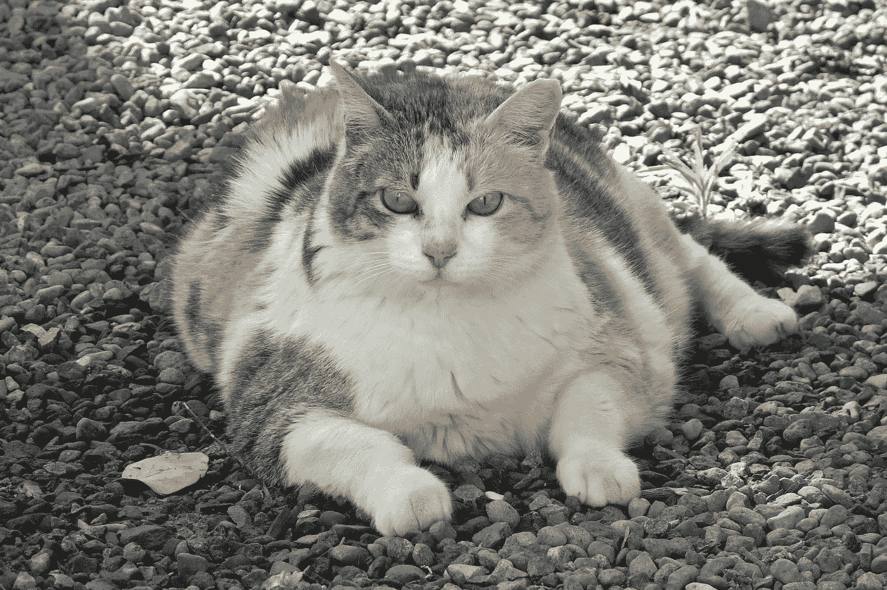
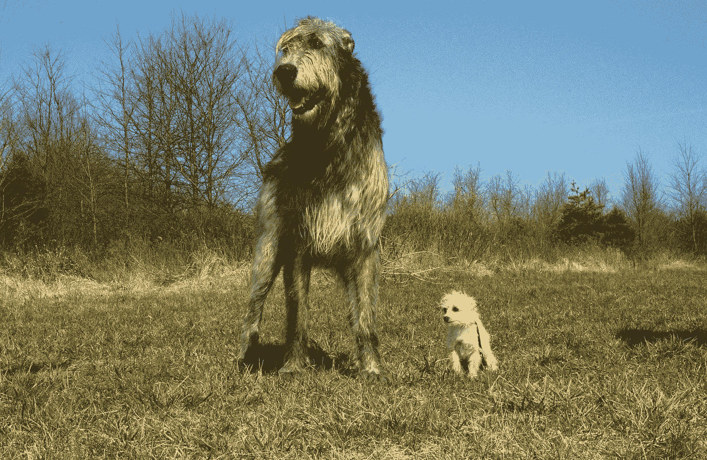

# 哪些比较重？狗还是猫？

> 原文：<https://towardsdatascience.com/how-do-you-statistically-prove-that-dogs-are-heavier-than-cats-380d23b12b76?source=collection_archive---------43----------------------->

## 机器学习的应用统计学

图片由来自 [Pixabay](https://pixabay.com/) 的 [Michal Jarmoluk](https://pixabay.com/users/jarmoluk-143740/?utm_source=link-attribution&utm_medium=referral&utm_campaign=image&utm_content=624952) 拍摄

狗比猫重吗？如果你认为答案是肯定的，你将如何从统计学上证明它？

如果你不熟悉科学过程，这个问题对你来说可能看起来很简单。你可能会想到称 20 只狗和 20 只猫的体重，计算狗和猫体重的平均值，然后简单地比较结果。如果猫的平均数是 9 磅，狗的平均数是 18 磅，你可以说:“狗比猫重。”当事情明朗时，这种方法可能会奏效。但是如果猫的平均值是 9，狗的平均值是 10，你能确定狗比猫重吗？如果你在比较 9.1 的平均值和 9.2 的平均值呢？

案例并不总是像比较狗和猫那样简单。科学过程有许多重要的应用。假设您正在研究一种针对癌症患者的新开发的治疗方法，并且结果彼此非常接近，您将确定一个阈值来决定这种治疗方法是否在统计学上显著减少了癌细胞。你不会期望发现治疗癌症的奇迹。你只是期望病人的情况有显著的改善。

让我们回到我们可爱的狗和猫身边。

来源[吉菲作者 M](https://media.giphy.com/media/dC8jdwiSuBiet1SVgD/giphy.gif) OODMAN

# 统计分析

我们的问题是:狗比猫重吗？我们回答这个问题是在做哪种分析？

统计学中有两种分析。

## 描述性分析

描述性分析给出以某种方式描述数据的信息。我们以更有意义的方式呈现数据，并对数据进行更简单的解读。

我们使用两种主要的测量方法来描述数据:

*   集中趋势的测量:平均值、中间值和众数。
*   传播的测量:标准偏差，绝对偏差，方差，范围和四分位数。

## 推理分析

推理分析是从一个样本中了解一个群体的情况。它允许我们从数据中做出推论。我们从样本中获取数据，并对总体进行归纳。

在推断统计学中，我们无法证明某些东西，因为我们没有总体数据，但我们可以通过展示样本数据中的一个例外来反驳某些东西。

*   估计参数:我们从样本中提取一个统计量并预测一个总体参数。
*   假设检验:我们提出一个无效假设和一个替代假设，并使用样本数据来回答总体问题。

我们在回答猫狗问题的同时，也在做推理分析。因为我们试图通过对两个样本的描述性统计数据进行概化来对所有狗和所有猫的种群参数进行推断。

# 假设检验:

一个假设可以被认为是我们正在测试的一个想法。假设总是关于总体参数，而不是样本统计。

我们试图证明狗比猫重，我们以这种方式设定假设。

## 虚假设

零假设是我们正在测试的想法。

"狗没有猫重."

“狗和猫的平均体重*与*相等”

"猫和狗的平均体重没有*差异."*

## 替代假设

另一个假设是我们正在测试的想法。

"狗比猫重。"

“狗的平均体重比猫多

*"猫和狗的平均体重有显著的差异."*

# *抽样*

## *确定样本量*

*说到样本量，我们说“样本越多，结果越好”。但是更多的样本意味着更复杂的研究、更多的钱和更多的时间来完成我们的研究。*

*因此，我们确定置信水平、误差幅度和人口规模，并计算最小样本量来完成我们的研究。*

*[这里的](https://www.calculator.net/sample-size-calculator.html)是一个在线样本量计算器，用于计算统计推断的最小样本数。*

## *有偏样本*

*当总体中的一个或多个部分比其他部分更有可能在样本中被选中时，就会出现有偏样本。无偏的样本必须能代表整个总体。*

**

*图片来自 [Pixabay](https://pixabay.com/?utm_source=link-attribution&utm_medium=referral&utm_campaign=image&utm_content=5085971) 的 [Petr Ganaj](https://pixabay.com/users/petrganaj-16058207/?utm_source=link-attribution&utm_medium=referral&utm_campaign=image&utm_content=5085971)*

*如果选择不同国家的宠物猫和流浪狗，决定猫比狗重也不是不可能。*

**

*图片来自 [Pixabay](https://pixabay.com/?utm_source=link-attribution&utm_medium=referral&utm_campaign=image&utm_content=1196761) 的 [Andreas Almstedt](https://pixabay.com/users/almi-205352/?utm_source=link-attribution&utm_medium=referral&utm_campaign=image&utm_content=1196761)*

## *猫和狗的品种*

*品种呢？猫的体重没有很大的差异(5 磅到 15 磅)，但是对于狗来说，体重可以从吉娃娃的 3 到 6 磅变化到爱尔兰猎狼犬的 180 磅。*

**

*爱尔兰猎狼犬和吉娃娃，图片来自[的](https://pixabay.com/?utm_source=link-attribution&utm_medium=referral&utm_campaign=image&utm_content=85578)[大卫·马克](https://pixabay.com/users/12019-12019/?utm_source=link-attribution&utm_medium=referral&utm_campaign=image&utm_content=85578)*

## *男性和女性重量*

*男性的体重比女性重。我们需要对我们人口中的亚群体保持谨慎。*

# *取样方法*

## *简单随机抽样*

*简单随机抽样是一种方法，在这种方法中，人口中的每个成员都有平等的机会被选中。SRS 是理想的抽样方法，但是由于许多原因，我们有时不能从总体中进行随机抽样。*

*对于狗和猫的情况，我们可以使用随机抽样，但我们需要确保我们有足够的所有品种的样本。*

## *分层抽样*

*我们把人口分成类似的阶层。在每一层中，我们取一个 SRS 并组合 SRS 以得到完整的样本。*

*在猫狗分析中，分层抽样是一种易于实现的解决方案。我们的阶层是猫狗品种。我们从每个品种中随机选择足够数量的狗和猫。*

*我们也需要划分女性和男性阶层。如果世界上有相同数量的雄性和雌性狗和猫，我们就取相同数量的雌性和雄性动物作为样本。世界上雌雄猫或狗的数量相等吗？这是另一个统计分析的主题。*

## *巢式抽样法*

*集群是一组有共同之处的主题。在整群抽样中，我们将人口分成自然群体。我们假设这些群体代表了人口。我们可以根据它们的位置创建集群，并执行 SRS。整群抽样是高效且经济的，但是该群可能不代表总体，这可能导致较高的抽样误差。*

*在猫和狗的情况下，我们可以选择一个邮政编码，找到这个邮政编码中的兽医诊所，并找到来到这些兽医诊所的猫和狗的体重。这比在世界各地寻找随机的兽医诊所容易，但是不同的品种和体重会导致抽样偏差。有必要找到尽可能多的集群(邮政编码)。*

## *系统抽样*

*我们不是完全随机选择，而是按顺序选择。*

*在我们的例子中，我们可以在以零结尾的邮政编码中选择宠物商店，并从那里获取样本。*

## *方便性选样*

*方便抽样也称为随机抽样、机会抽样或偶然抽样。你选择最简单的方法来获取你的样本。*

*在我们的例子中，如果我们去最近的宠物店、兽医诊所或动物收容所，并获得猫和狗的重量，我们就做了方便取样。很容易获得样本，但获得有偏差样本的可能性很高。*

# *抽样误差*

*抽样误差是样本和总体之间的差异。即使我们使用最好的抽样方法，也可能出现抽样误差。为了减少抽样误差，我们应该尽可能地增加样本量和随机化选择。*

# *非抽样误差*

*非抽样误差是除抽样误差之外的所有形式误差的总和。*

*在计算动物的重量时，我们可以计算出*测量误差*。我们甚至可以在数据输入期间制造*处理错误*。*

*我们可以在数据清理过程中进行*调整误差*。例如，来自美国以外国家的动物的重量单位将会是公斤。我们在把千克换算成磅时可能会出错。*

# *误差概率*

*在科学过程中，你可以得出一个结果，但你需要澄清偶然得出这个结论的概率。*

## *显著性水平*

*显著性水平(Alpha 阈值)是当零假设为真(I 型错误)时，您认为它是错误的概率。alpha 值为 0.05 表示当您拒绝零假设时，您愿意接受 5%的出错几率。*

# *汇总统计数据*

## *集中趋势*

*我们通过计算平均值、中值和众数来总结数据的位置。在每种情况下，我们都应该决定哪些汇总值最能代表分布。*

*在猫狗问题中，计算平均值似乎是最合适的统计。*

# *传播的度量(变化)*

*传播的度量告诉我们数据是如何在中间传播的。均值、中值和众数如何表示数据？*

## *范围*

*该范围采用数据集中的最小数字，并从数据集中的最大数字中减去该数字。这个范围给了我们两个极端之间的距离。范围越大，数据越分散。*

*在我们的例子中，狗的体重范围大于猫的体重范围。*

## *四分位数间距(IQR)*

*IQR 查看中间 50%数据的分布，并给出核心值的概念。IQR 是第一和第三个四分位数之间的差值。*

*我们可以使用[在线计算器](https://www.statisticshowto.com/calculators/interquartile-range-calculator/)来计算我们的狗和猫体重的 IQR。*

## *差异*

*方差衡量数据点围绕其平均值的离差。*

*样本方差等于观察值和样本平均值之间的平方距离之和除以观察总数减 1。*

*数据点越接近平均值，我们获得的方差就越低。正如我们上面提到的，狗的方差会比猫的方差大。*

## *标准偏差*

*标准差是方差的平方根。这是数据集可变性中最常见的可变性。*

*在大多数统计中，标准差比方差更有意义。因为方差有平方单位，结果不如标准差有意义。*

*在猫和狗的例子中，我们的方差单位是磅平方，标准差单位是磅。因此，标准差告诉我们更多关于数据在可解释单元中的分布。*

## *变异系数(相对标准偏差)*

*变异系数等于标准偏差除以平均值。我们需要相对标准差来比较两个不同数据集的方差。*

*在我们的案例中，我们使用相对标准偏差来比较猫和狗体重的变化。*

# *选择正确的统计检验*

*有大量的统计测试，其中一些是学生的 t 检验，曼惠特尼 U 检验，卡方检验，相关性检验， [K-S 检验](https://seymatas.medium.com/kolmogorov-smirnov-k-s-test-5e1bf3b0ab2d)，和[方差分析](https://seymatas.medium.com/understanding-anova-4d1cf79f78c9)。*

*我们通过问这些问题来选择正确的测试:*

*   *数据是名义的(分类的)，顺序的还是数量的(区间比)？*
*   *我们有多少样品？*
*   *我们想证明什么？我们分析的目的是什么？*

*在我们的例子中，重量是定量数据。因此，如果我们有超过 30 个样本，我们使用学生的 t 检验，如果我们有少于 30 个样本，我们使用 Mann- Whitney-U 检验。(这个有争议！)*

*t 值用于测量平均值相对于样本数据变化的差异大小。*

*当因变量是连续的，但*不是正态分布时，Mann-Whitney-U 检验比较两个独立组之间的差异。**

## *神奇的数字:*

*为什么我们要根据一个数字来选择考试？t 检验假设数据具有正态分布。但是，如果样本容量小于 30，我们就不能检验正态性。*

# *解释结果*

*找到 t 统计量和 p 值后，我们将 p 值与我们在分析开始时确定的阈值进行比较。*

*p 值是犯第一类错误的概率。p 值告诉我们，如果零假设为真，得到这样一个结果的概率。例如，如果 p 值为 0.01，这意味着即使假设为真，也有 1%的几率拒绝零假设。*

*如果 p 值小于阈值，我们能够拒绝零假设。*

*如果 p 值大于阈值，我们不能拒绝零假设。*

# *结论*

*你读了一篇关于数据分析的应用统计学评论。我们问了一个非常简单的问题，并概述了数据科学中使用的许多统计概念。*

*狗比猫重吗？我们还没拿到数据呢！我要去最近的动物收容所给猫狗称重。*

*你应该对我说:“住手！你犯了一个方便的错误！”*