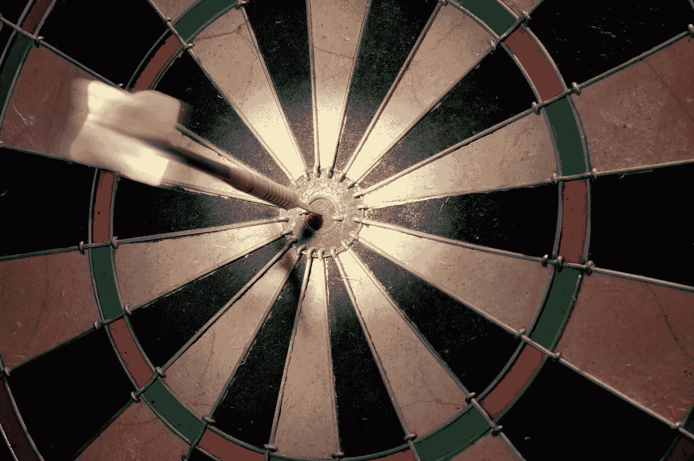
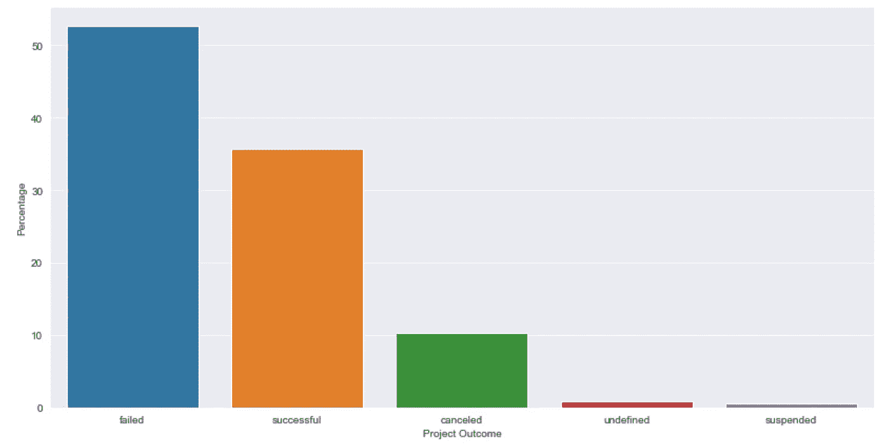
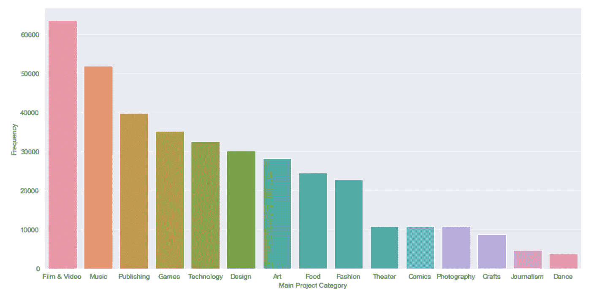
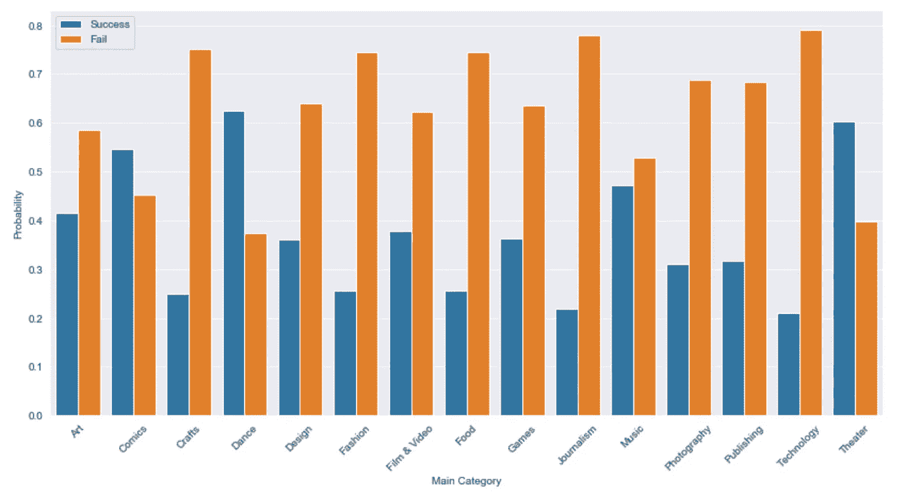
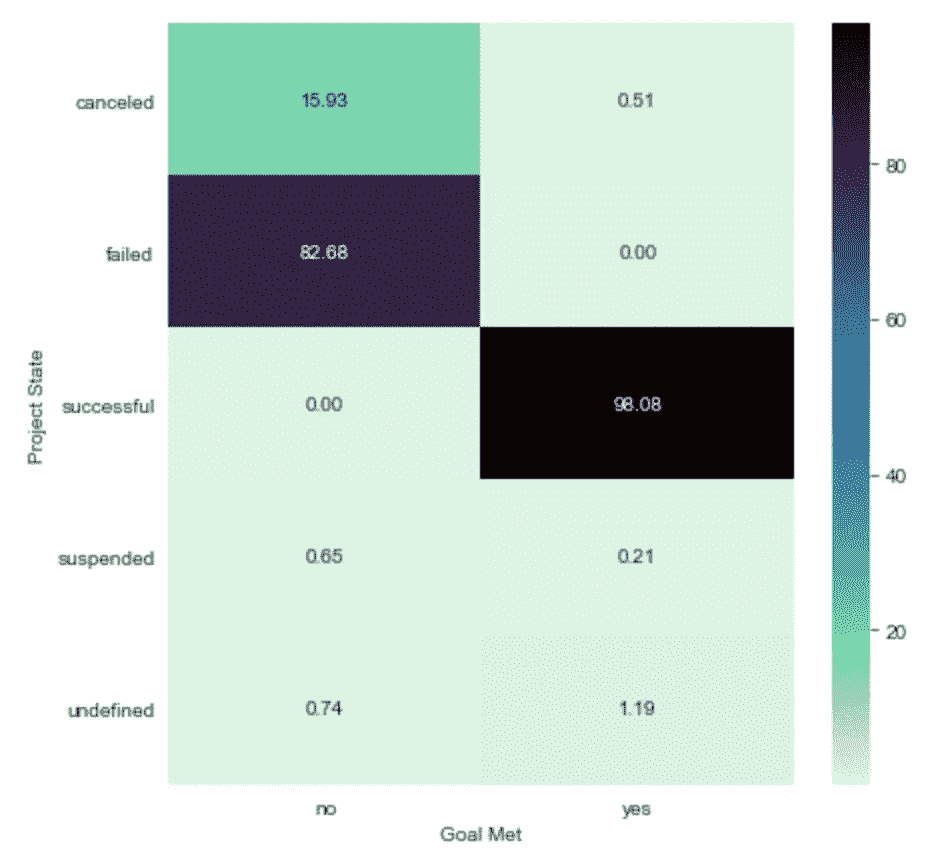
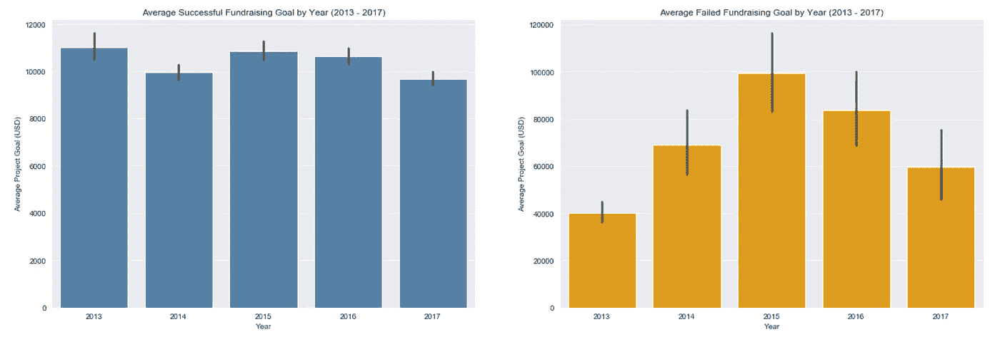
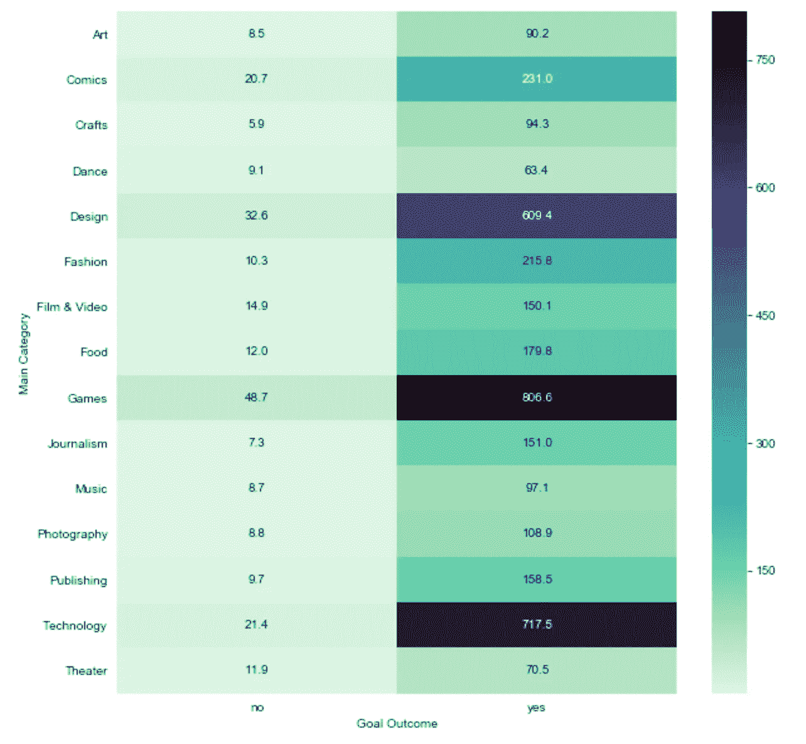
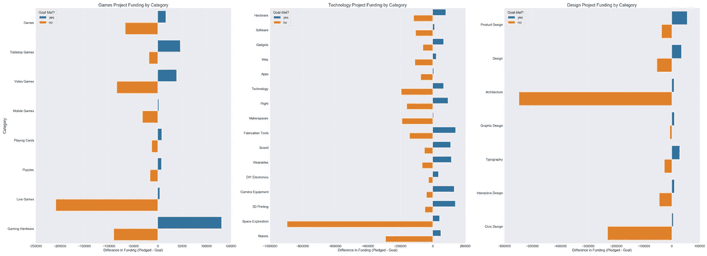

# 你是如何在 Kickstarter 上成功的？

> 原文：<https://towardsdatascience.com/how-do-you-succeed-on-kickstarter-c047c60085cf?source=collection_archive---------36----------------------->

## 项目成功的探索性数据分析

图片由 Immo Wgmann 提供

**简介**

你是否在计划一个特别的项目，比如一部电影、一张专辑、一部戏剧，甚至一家餐馆？如果是这样，那么在一个融资平台上展示你的想法可以增加你实现想法的机会。Kickstarter 就是这样一个平台，在这里，富有想象力、创新性和雄心勃勃的项目通过其他人的支持得以实现，这些人被称为支持者。

支持者承诺通过资助项目，不仅帮助他们实现，而且支持一个创造性的过程。项目创建者通过提供独特的奖励来感谢支持者的支持，奖励包括将项目的一部分分享给支持者社区，如限量版或折扣。

我第一次听说这个平台是在我点击一个名为 MagicLingua 的未来语言学习应用的广告时。这个链接把我带到了这个应用的 [Kickstarter 页面](https://www.kickstarter.com/projects/1427862973/start-speaking-your-new-language-from-day-1-magicl)，其中包括通过说而不是打字来学习外语。不管怎样，在它启动的时候，420 个支持者承诺€53051 来帮助实现这个项目。这款应用在应用商店有售，并且有一个[网站](https://www.magiclingua.com/)。现在我正在通过这个应用程序学习德语，我有点希望我是一个支持者。

图像由 MagicLingua 提供

虽然许多项目看起来令人兴奋，但也有一些项目最终没有实现。总的来说，令人惊讶的是，Kickstarter 项目失败的比成功的多。为什么？一些原因包括:他们没有达到他们的目标，他们没有达到他们的目标，他们没有获得他们前进所需的资金。这并不一定意味着你的想法最终会失败。从好的一面来看，达到目标的项目筹集到了几百到几千甚至几百万美元的资金。此外，只要你从其他成功或失败的人那里学习，你就可以开展一项运动，为你带来成功。

图 1 —项目成果的相对频率(图片由作者提供)

为了了解 Kickstarter 项目的结果，我使用了该平台的项目数据来探索对支持者和项目目标的影响。本次分析使用的数据涵盖了 2009 年至 2018 年的 378661 个项目和 19 个变量。这些变量包括项目名称、主要类别、次要类别、国家、截止日期、启动日期、承诺金额、支持者数量、项目状态(结果)、目标和国家。本帖将重点讨论以下问题:

1—哪些项目类别更有可能成功？

2—项目结果和筹款目标之间有什么联系？

3-哪些类别在支持者中很受欢迎，其中哪些子类别远远落后于他们的目标？

第 1 部分:哪些项目类别更有可能成功？

数据有两个类别变量—主要类别和次要类别。对于这一部分，我将把重点放在主类别上，因为它的层次较少。最常见的类别是电影&视频、音乐、出版、游戏和技术。

图 2 —根据数据显示的主要类别频率(图片由作者提供)

鉴于项目成功的频率较低，有一些类别的成功频率较高。这些主要类别是漫画、戏剧和舞蹈项目。漫画的成功概率是 0.53，舞蹈项目是 0.61，戏剧项目是 0.6。如果你的项目想法属于这三类，你可能会有好运气。另一方面，其他类别失败的几率要高得多，尤其是新闻、技术和食品项目。

图 3 —按主要类别划分的成功/失败概率(按作者划分的图片)

回头看图 2，漫画、戏剧和舞蹈项目是 Kickstarter 数据中出现频率最低的项目，这很好地解释了为什么这些类别具有较高的成功概率。此外，更频繁的类别最终的成功概率明显更低还有其他原因。未来将探讨的因素包括项目筹资目标、支持者人数等。

**第二部分:筹款目标如何促成项目成功？**

Kickstarter 项目失败的一个最常见的原因是他们的融资目标太高。该平台的融资流程由一个要么全有要么全无的模式组成——如果一个项目没有达到目标，资金既不会被收取，也不会从支持者的银行账户转移。这便于支持者在确信项目会成功的情况下为项目认捐资金。

因此，如果承诺的金额超过了目标，那么它很可能成功了。否则，它很可能不会前进。根据 Kickstarter 的数据，从 2009 年到 2017 年，大约 36%的项目达到了筹款目标。

图 4——与项目状态相比，按目标划分的项目成果(图片由作者提供)

对于达到目标的项目，98%成功了，1.2%未定义，不到 1%被取消或暂停。另一方面，对于没有这样做的项目，16%被取消，82.7%失败，不到 1%被暂停或未定义。因此，我们可以看到，与承诺金额相比，目标金额也是项目成功的一个指标。这个变量可以被称为“目标结果”现在，让我们来看看这两种结果在目标金额方面是如何比较的。

根据图 5，左边的条形图表明成功的项目往往有稳定的年平均值，每个条形图顶部的置信区间较小，这表明估计值的可变性很小。这些估计还意味着，要想成功，创作者往往会设定目标，不仅给观众灵感，还能让他们相信目标是可以实现的。

另一方面，不成功的项目包含反映钟形曲线的年平均值。右边的图表包含了更宽的置信区间，不像左边的图表。按年度细分，年度目标往往显示出更高的可变性，这意味着这些目标的变化很大，从接近零到数千到数百万到数亿美元。考虑到这一点，当一个成功项目的最高目标仅仅是 200 万美元时，有多少人会承诺一个成本超过 1 亿美元的项目呢？

图 5 —按年份划分的平均筹款目标(2013–2017 年)(图片由作者提供)

根据上面的图表，项目成功的概率随着资金目标的增加而降低。因此，无论你的项目看起来多么令人兴奋，你都希望在规划阶段接触尽可能多的人，尤其是如果你必须筹集近 100 万美元的资金。如果你有良好的进展，支持者愿意承诺，这取决于你的最后期限。

第 3 部分:哪些类别在支持者中很受欢迎，其中哪些子类别远远落后于他们的目标？

项目成功的另一个主要因素是支持者的数量。支持者承诺为项目做贡献有几个原因，包括支持朋友的项目，支持他们钦佩的人的新努力，受项目想法的启发，以及项目奖励的激励。支持一个项目不像购买一个产品，而是承诺支持他们希望在现实世界中实现的创意。

当谈到目标结果时，项目类别显示不同的支持者分布，其中较成功的项目比不太成功的项目有更多的支持者。具体来说，我们可以在下面的热图中看到一些成功的类别中的黑点。

图 6 —热图:按项目类别和项目成果划分的平均支持者(图片由作者提供)

相对而言，游戏项目通常平均有 807 名支持者，此外还有 716 名技术支持者和 609 名设计支持者。更有趣的是，这种类别顺序在失败的项目中几乎相同，游戏项目除了设计方面的 33 个以外，平均有 47 个支持者，技术项目有 21 个。

承诺的金额与支持者的数量有很强的线性关系——支持者越多，承诺的金额越高。因此，一个有趣的后续问题是:在三个主要类别中，子类别在多大程度上偏离或超过了它们的目标？换句话说，相对于项目子类别，承诺金额和目标金额之间的资金差异如何？资金差额的计算方法是从承诺金额中减去项目目标金额(承诺金额-目标金额)。这种差异对于不成功的项目是负的，对于成功的项目是正的。此外，这些方法根据项目的结果来衡量项目错过或超过目标的程度。

看看游戏、技术和设计类别，下面的条形图按子类别和目标结果显示了平均资金差异。对于游戏项目，八个子类别中有四个非常突出。平均而言，直播游戏未能实现其目标约 208，969 美元，而游戏硬件和视频游戏分别未能实现约 90，062 美元和 83，939 美元。另一方面，游戏硬件超出目标 130，492 美元，因为桌面游戏和视频游戏分别超出目标 45854 美元和 38552 美元。

对于技术子类别，最有趣的是太空探索，它落后于其目标 895，744 美元，因为机器人仅落后 109，043 美元。从积极的方面来看，超出目标最多的子类别包括 3D 打印、相机设备、制造工具、可穿戴设备和声音项目。

对于设计项目来说，最落后于目标的两个子类别是建筑和市政设计项目。建筑项目平均落后 547，242 美元，而市政设计项目落后 229，955 美元。似乎超出他们目标的子类别是产品设计、一般设计和印刷项目。

图 7-游戏、技术和设计 Kickstarter 项目的子类别资金差异(图片由作者提供)

平均超出或下降的金额让我们了解子类别在财务上的表现以及这些项目的成本。此外，该分析将目标、支持者和承诺金额放在一起。所以，如果你的项目涉及太空探索，要小心达到你的目标会非常困难。然而，如果你的项目是建筑、市政设计或现场游戏，难度会小一些。由于游戏项目是最受欢迎的，游戏硬件和桌面游戏在 Kickstarter 上展示会非常酷。

**结论**

在这篇文章中，我们通过对 Kickstarter 历史项目的数据分析，从三个不同的方面考察了 Kickstarter 项目的成功。

1.  成功概率最高的主要类别是舞蹈、戏剧和漫画项目，尽管它们属于最不常见的类别。
2.  项目目标在项目成功中起着重要作用。每年，成功的项目与不成功的项目相比，目标金额的差异要小得多。这表明每个创造者必须设定一个目标，让支持者对他们的成功充满信心。
3.  最后，我们发现在游戏、设计和技术项目中，哪些子类别落后于或超过了它们的目标。这向我们展示了哪些项目子类别的财务表现。

这些观察结果可以让你对 Kickstarter 如何工作有一个基本的了解，以及你脑海中的潜在想法是否能在这个平台上成功。

用于此分析的代码可以在[这里](https://github.com/juliang94/Kickstarter-Analysis)找到。