# 神经网络是如何学习的？

> 原文：<https://towardsdatascience.com/how-does-a-neural-network-learn-f33bcff61026?source=collection_archive---------28----------------------->

## 在本系列的第二部分中，我们将讨论神经网络如何通过向前和向后传播来更新权重和偏差，以适应训练数据。这些可以用来预测未来的数据，这是以前没有过的。

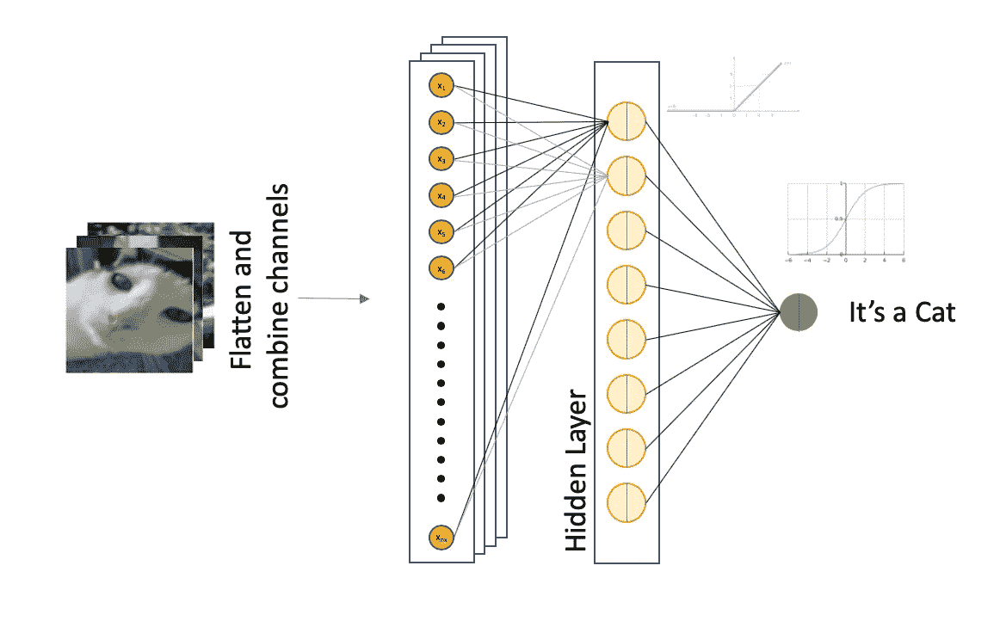

在 [*第 1 部分——为你的神经网络*](/using-the-right-dimensions-for-your-neural-network-2d864824d0df) 使用正确的维度中，我们讨论了如何为你的神经网络架构中的向量和矩阵形状选择一致的约定。虽然不同的软件实现可能使用不同的约定，但是有了坚实的理解，就很容易知道需要什么样的预处理来适应模块设计。

[](/using-the-right-dimensions-for-your-neural-network-2d864824d0df) [## 为你的神经网络使用正确的维度

### 当建立你的人工神经网络时，一个令人沮丧的错误是得到向量的形状和…

towardsdatascience.com](/using-the-right-dimensions-for-your-neural-network-2d864824d0df) 

在这一部分，我们将扩展我们的知识，以了解神经网络如何通过提供的训练集进行学习。我们将在本文中使用单隐层神经网络来说明下面的关键概念:

*   线性函数和非线性激活函数
*   使用权重和偏差的随机初始化开始滚球
*   使用正向传播来计算预测
*   使用损失函数来计算我们离地面真相有多远
*   使用反向传播使每个权重和偏差更接近事实
*   冲洗并重复——就这么简单！

在本文中，我们将构建一个简单的二进制分类器架构来预测图像显示的是猫还是非猫(出于某些原因，几年前开始 ML 的人一定喜欢猫——你看到的许多例子都涉及这些可爱的动物！)

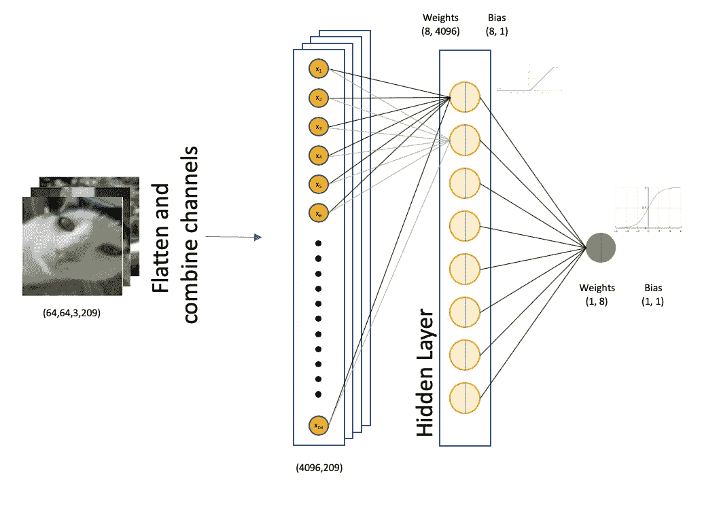

整体单层架构

# 架构快速概述

训练集的原始形状是`(209, 64, 64, 3)`，代表猫和非猫的 3 通道 64 乘 64 图像。探索数据的 Google Colab 脚本可以在下面找到，尽管本文不会深入研究构建前馈神经网络的完整代码。我们将在下一篇文章中讨论代码实现。

阅读并探索训练数据集

在最后两个代码块中，我们将维度减少到一个黑白通道，以保持简单。在未来的文章中，我们将探索卷积神经网络(CNN)如何更好地完成图像识别任务，因为它保留了图像二维中的像素关系。现在，我们将在训练集中展平图像，得到一个形状为`(64*64, 209)`的输入矩阵。

**可训练参数的数量**

对于每个训练示例，输入包括 4096 个特征，每个特征表示原始图片中的一个像素。

隐藏层由 8 个神经元组成。回想一下我们在第 1 部分中的约定，权重矩阵的形状为`(8, 4096)`，偏差向量的形状为`(8, 1)`。总之，这个简单神经网络的隐藏层总共有`(8 * 4096) + 8 = 32,776`个可训练参数。

输出层包括单个节点，因此输出节点的权重矩阵具有`(1, 8)`的形状，产生 9 个可训练参数(8 个权重和 1 个偏差)。

因此，该模型总共有可以训练的`32776 + 9 = 32,785`参数。

每个神经元都有一个形式为`z = wᵢxᵢ + b`的线性函数，在上面的例子中 *i* 代表从 1 到 4096 的值。然后，将每个结果传递给非线性激活函数`g(z)`。

在我们的例子中，这会产生一个形状为`(8, 209)`的矢量，它将被输入到输出层。我们示例中的输出层是一个执行二元分类的单个节点。

现在，让我们浏览一下关键概念，以了解神经网络如何通过这种架构进行学习。

## 线性函数和非线性激活函数

如果我们观察每个神经元，我们会发现既有由`z = wx + b`表示的线性函数，也有非线性激活函数。这种简单的设置允许非线性拟合，同时保持功能简单。

正如您将在稍后讨论反向传播时看到的，我们使用导数来最小化预测损失，并相应地调整权重和偏差。线性和非线性函数的这种简单使用允许我们实现期望的非线性，同时保留使用链式法则来容易地计算导数的能力。但我们稍后会谈到这一点。

我们在第 1 部分讨论了使用 sigmoid 函数作为激活函数。该功能定义为:

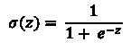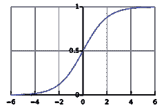

Sigmoid 函数

sigmoid 函数不常使用，因为使用 ReLU(整流线性单元)有更有效的实现方式，我们将在后面介绍。然而，由于其输出被限制在 0 和 1 之间的性质，它对于二进制分类任务仍然是有用的。

像这样的函数也会遇到通常所说的 ***消失渐变问题*** 。在输入值的极值处，函数的斜率接近 0。如果您还记得，我们将在反向传播过程中使用导数来最小化损耗参数。当输入值较大时，这些激活函数会带来挑战，导致导数(斜率)接近于零。这导致非常小的增量，意味着*非常慢的*学习！

这也是我们通常将输入标准化为通常在-1 和 1 之间的值的部分原因。当我第一次开始学习这个话题时，我不知道为什么需要这个…数字就是数字，对吗？大多数文献仅指出，当输入被缩放到-1 和 1 之间或 0 和 1 之间的一个数时，网络将表现得更好，这取决于场景。

> 理解消失梯度问题让我们对为什么建议标准化输入有了一些了解。

如今更常用的激活函数是整流线性单元(ReLU)。数学上，ReLU 可以定义为:

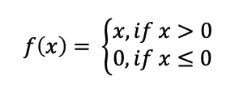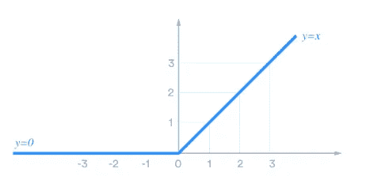

整流线性单元

> 有趣的事实:从技术上讲，当 x 正好等于零时，梯度是不存在的。但是这种情况发生的概率非常小，如果发生这种情况，你可以通过编程将梯度设置为 0。不是真正的实际问题。

通过编程，可以很容易地将它定义为 0 和输入值的最大值。

```
g(z) = max(0, input)
```

该激活函数在反向传播期间的另一个附带好处是，对于任何非零值，该函数的斜率简单地为`1`。尽管对于正值可以避免消失梯度问题，但如果其中一个神经元上存在较大的负偏置(实际上，该神经元将停留在负侧，并始终输出值 0)，它仍会导致所谓的“死亡 ReLU”。这个神经元实际上是“死亡”的，因为它不再在拟合过程中起作用。

一些实现使用称为泄漏 ReLU 的混合方法来解决这个问题，其中:

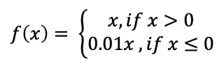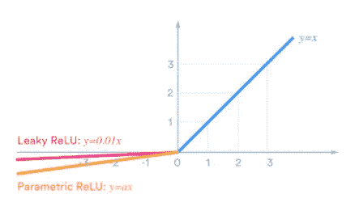

泄漏 ReLU

对于本系列，我们将只对隐藏层使用 ReLU，对输出节点使用 sigmoid 函数(同样，只是因为我们正在进行二进制分类)。如果你有兴趣阅读更多关于其他混合 ReLU 激活功能的信息，下面是刘丹青的一篇有趣的文章:

[](https://medium.com/@danqing/a-practical-guide-to-relu-b83ca804f1f7) [## ReLU 实用指南

### 开始使用和理解 ReLU，没有 BS 或花哨的方程式

medium.com](https://medium.com/@danqing/a-practical-guide-to-relu-b83ca804f1f7) 

## 网络的首次尝试

在第一次训练运行之前，权重矩阵被初始化为一个 ***非常小的随机数*** 。

重要的是权重从一个小的随机数开始。如果所有的权重都初始化为零，那么由于`z = wx + b`，所有的输出都将为零。具有相等的权重不会像反向传播的误差都相等那样有效，从而导致所有权重被更新相同的量。

第一次运行时，偏置向量可以初始化为 0。

显然，网络的第一次尝试真的只不过是一个随机的猜测！

## 正向传播

前向传播是采用输入、权重、偏差和激活函数来计算每个阶段的值的过程。例如，在我们的单层架构中，计算将按以下顺序进行:

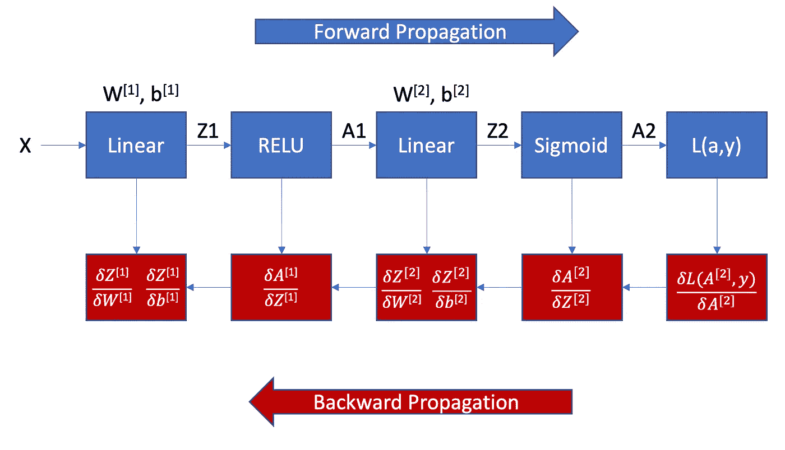

显示正向和反向传播的框图

*   **计算 Z1**
    记住`z = wx + b`，我们本质上会做以下矩阵乘法。下面的等式显示了一个训练示例的矩阵乘法，但是在应用整个训练集之后，`Z`将是具有形状`(8, 209)`的矩阵。

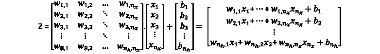

*   **计算 A1(激活函数)**
    我们在隐藏层上使用 ReLU，因此 A1 将简单地计算为 0 的最大值和 Z1 的当前值(即任何负数都变成 0)。
*   **将 A1 送入输出层**
    矩阵 A1(也具有`(8, 209)`的形状)现在将作为输入送入输出层。
*   **计算 Z[L]**
    在这个最终输出层中，权重矩阵具有`(1, 8)`的形状。另一个矩阵乘法将产生一个形状为`(1, 209)`的最终输出，然后将其传递给一个 sigmoid 函数。
*   **计算 A[L](最终预测)**
    我们将计算出的值传递给 sigmoid 函数，这将导致返回一个介于 0 和 1 之间的值。

## 计算损失函数

此次运行的预测基于模型的权重和偏差，对于此二元分类示例，输出为 1 或 0。这与我们作为训练集的一部分提取的标签中的基本事实进行比较(读入`train_set_y`变量)。

对于二进制分类，损失函数用于每个训练的例子如下。

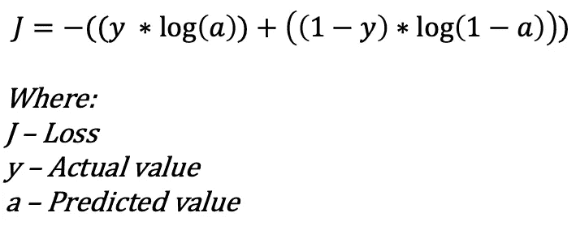

损失函数—二元分类

直观地，你可以看到这是如何实现我们所需要的，对于基本事实，y = 0 或 1 的情况。记住对数曲线在`x = 1`处切割 x 轴是有帮助的。

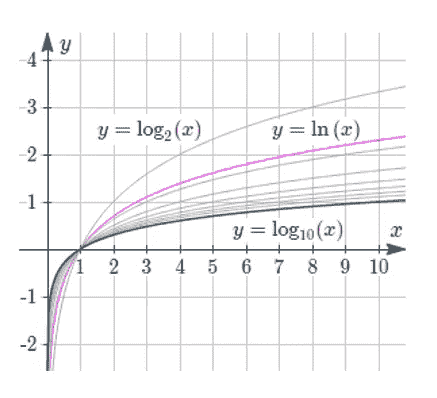

对数函数

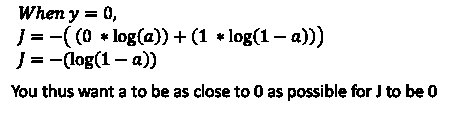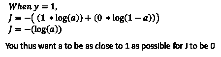

损失函数的直观解释

**成本函数**是训练集上所有损失的平均值，这是我们想要最小化的等式(即，对其他参数求导)。

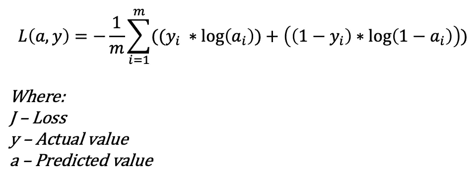

成本函数—二元分类

## 使用反向传播来调整权重和偏差

网络将使用反向传播的概念来调整权重和偏差。为了直观地理解这一点，你需要考虑这一点。

*   我们希望最小化关于可训练参数的成本函数，即 W 和 b 应该调整到什么？此图显示了正向传播中使用的函数以及相应的导数。


显示正向和反向传播的框图

*   为了最小化一个参数，我们进行求导，在这种情况下，这意味着我们希望获得以下结果:

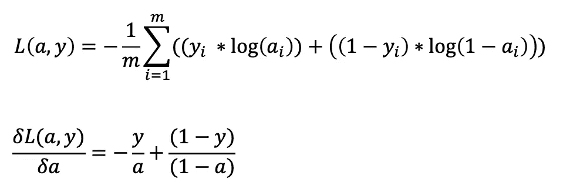

对成本函数 wrt a 求导

这个导数的证明超出了本文的范围，尽管其他一些作者已经就此写了一篇完整的文章。我很喜欢阅读 Patrick David 在本文中提供的推导细节:

[](https://medium.com/@pdquant/all-the-backpropagation-derivatives-d5275f727f60) [## 所有的反向传播导数

### 你已经完成了吴恩达在 Coursera 上的深度学习课程…

medium.com](https://medium.com/@pdquant/all-the-backpropagation-derivatives-d5275f727f60) 

*   我们使用衍生产品的链式法则来计算以下内容:

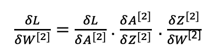

计算成本函数权重导数的链式规则

*   然后，我们更新这些权重和偏差:

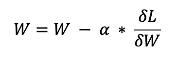

其中，α是学习率的超参数。我们将单独讨论细节，但是它定义了微调的程度。太小，学习过程会很慢。太大，你可能会超过当地的最小值。调音是一门艺术和科学。

## 重复

然后，上面的过程会重复您定义的迭代次数。这个变量被称为模型的超参数，类似于你在上面遇到的学习率。这些是不可训练的参数，调整这些超参数是一门艺术也是一门科学。我们将在以后的文章中对此进行更多的讨论。

## 结论

这是一个非常沉重的话题，但我希望它在高层次上强调了神经网络如何通过前向传播进行学习，并随后通过对反向传播中的成本函数求方程的导数来推动权重和偏差。

主要是通过这种反向传播，权重和偏差被缓慢地推到一个使成本最小化的值，这有效地使精度最大化。这就是为什么你总是听到人们说训练神经网络是为了最小化成本，而不是为了最大化精度。

如果你第一次没有理解这些概念，不要绝望。我花了一段时间来理解反向传播，我必须承认，在写这篇文章的时候，我仍然在发现新的东西。

写这些文章帮助我巩固了我的理解，我希望你能从中有所收获。

我再次尽一切努力检查工作。如果我的理解有错误，请告诉我！

下一篇文章将介绍一些代码来实现我们已经讨论过的概念。