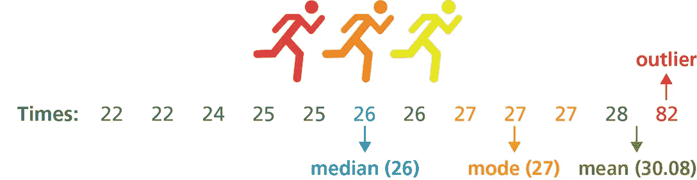
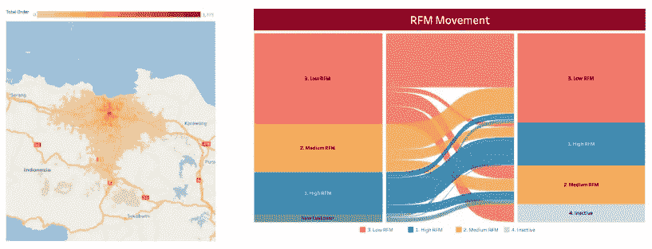
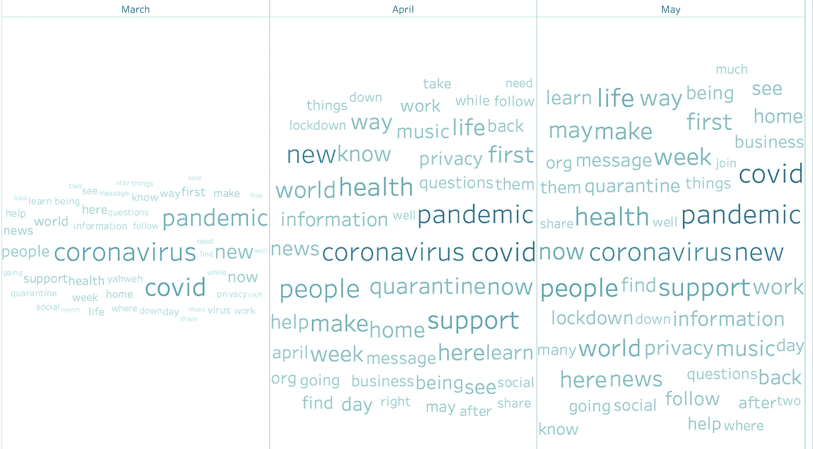

# 成为卓越数据分析师的追求

> 原文：<https://towardsdatascience.com/how-does-a-remarkable-data-analyst-look-like-dd0e4326c670?source=collection_archive---------27----------------------->

[活动发起人](https://unsplash.com/@campaign_creators?utm_source=medium&utm_medium=referral)在 [Unsplash](https://unsplash.com?utm_source=medium&utm_medium=referral) 上的照片

## 超越原始查询，深入洞察交付

我看到过很多文章谈论如何成为一名优秀的数据科学家。不过这并不奇怪，因为在这个[蓬勃发展的 HBR 邮报](https://hbr.org/2012/10/data-scientist-the-sexiest-job-of-the-21st-century)之后，越来越多的人想成为数据科学家。但是我们亲爱的数据分析师呢？

如果你是一家科技公司的早期数据分析师，你可能看不到自己在未来 5-10 年内做这个角色。你打算只做这份工作 2-3 年，然后再考虑转到数据科学家的兄弟角色，或者转到产品管理、业务战略或人员管理角色。这可能只是因为你看不到这个角色的晋升途径，因为你的日常工作(*和你周围的分析师*)只围绕着 ***查询-报告-重复*** 。

我也去过。也差点辞职和转移。但后来我四处探索，遇到了已经做了 5-10 年分析工作的人，在网上发表文章、演讲和播客，最终发现:

> 是的，数据分析实际上是一个先进的领域，我还有很多方法可以在这里发展
> 
> 不，不仅仅是通过承担更大的项目范围或成为初级数据科学家。

在这里，我总结了一系列我的发现，关于分析师如何提升自己的技能，成为一名 ***卓越的数据分析师！***

# 首先最重要的是——基础

这些就是你的[卫生因素](https://en.wikipedia.org/wiki/Two-factor_theory)。这些的存在并不会让你成为一名高级分析师，但是这些的不存在会降低你作为数据分析师专业人士的可信度。

1.  **商业语境。**了解组织的业务流程是必须的。了解业务目标以及组织如何实现这些目标。这些知识将帮助你对 ***框架和相关问题*** 进行分析，以得到利益相关者的启发。
2.  **解决问题和批判性思维**。这是每个专业人士都需要的技能。但是在数据分析环境中，需要**确定分析方法**，这将导致支持数据的想法被探索。此外，这项技能将帮助你计算出什么时候**调整和修改方法**，如果在这个过程中发现新的发现。
3.  **查询**。根据上下文并从上面的技能组合中找出要做的事情，这一个涵盖了如何实际工作。这是您进入数据库/数据仓库并将数据转换成可处理格式以供分析的地方。根据组织环境(MySQL、PostgreSQL、Google BigQuery)的不同，需要了解**SQL 和相关函数**，以实现向利益相关者展示相关数据的目标。

# 进入下一阶段

## 描述和推断统计

数据分析与统计学交织在一起。为了从您收集的数据点中获得一些有意义的东西，需要一些分析技术。

最常用的(也是最简单的)方法是描述性统计。描述性统计使我们能够获得**概括的特征和数据点的数量分布**，并了解我们在我们探索的那些特定指标上的位置。即使有其他可用的高级技术，高级浏览仍然需要理解描述性统计数据(均值、中值、众数、标准差、偏斜度等)的能力，甚至更需要验证*收集的数据中是否有错误——异常值检测、测量误差等*。

图片来源:新南威尔士州教与学的有效实践(教育部)，2019。([链接](https://www.cese.nsw.gov.au/effective-practices/using-data-with-confidence-main/outliers))

有时候，描述性统计是不够的。高增长的初创企业通常会做大量的产品和市场实验，这些实验只够试水。在这些实验中，理想的分析师将与产品经理一起设计实验，到实验完成时，他们将进行统计推断，以**量化实验结果在现实世界中发生的可能性**。它们就像是对围绕企业运转的假设的科学验证。它们对于确保我们不会突然从数据点中得出结论非常重要。

## 数据通信

下一个非常重要但经常被忽视的是数据通信。它不仅包括可视化部分——创建图表，还包括**区分要突出显示、显示或放入附录**部分的信息。一个伟大的数据分析师会找到呈现数据的方法，并从中讲述一个故事，这个故事会让 ***记住并激励*预期的接收者**。

一个好的数据展示是**简洁的**——包含相关的图表和解释，**在点**上回答构建的目标或假设，**容易被目标受众理解**。

一个理想的图表会让观众一眼就抓住洞察力。不同的图表服务于不同的目的，并帮助理解不同的可能的可视化。常规的条形图、折线图、散点图甚至文本可能已经满足了您的需求。但是你有没有考虑过使用热图、树状图、小提琴图或桑基图？

不确定使用哪个图表？在这里探索。

不同的图表服务于不同的目的。了解每一个的使用案例！(*作者图片*)

此外，分析师需要像设计师一样思考。可以做的一些其他事情是消除混乱(即不相关的数据点和不需要的文本)，在保持美观(整洁和简单)的同时吸引注意力(围绕大小、颜色、位置等)。

## 机器学习

接下来是一个百万美元的问题。我是数据分析师(又不是数据科学家)，为什么要做数据建模，要了解机器学习？我的回答是:

> 嗯，作为一名分析师，你的工作是提取信息和见解。大多数时候它来自**大规模数据**，很多时候它以**非结构化数据**(文本、图像、语音)的形式出现。仅凭描述性统计数据，很难从中获得有意义的新见解。

分析角色所需的机器学习技能与数据科学家所需的机器学习完全不同。虽然数据科学家更关注产品集成的预测或规定方面，但数据分析师的机器学习纯粹是为了提取洞察力。不同数据处理算法的知识很重要，但是我们很少关注建模效率和工程架构。

数据分析师的机器学习的示例应用包括用于分类的聚类、用于加权重要变量的回归、用于情感总结的文本挖掘。简单说说，没有自然语言处理技术和建模，怎么分析客服投诉？要不要把几百万的投诉一条一条看完，分类？

N-gram 单词云，有助于收集见解

# 用一种态度来平衡它

我们已经涵盖了优秀数据分析师的大部分技能。然而，有时仅仅拥有这些技能是不够的，因为一个人还需要体现出必要的态度来使事情运转起来。这里有一些从一个伟大的分析师到一个卓越的分析师的态度和精神。

*   好奇心和速度的完美结合。人们期望数据分析师负责战术洞察，带来速度和灵感，作为分析师与其他数据团队的区别。分析师需要有足够的好奇心来探索数据点并根据发现采取行动，同时牢记交付的目标和时间敏感性。
*   **坚持事实** **(不是假设)来自数据**。沿着这条路走下去，尤其是当你在同样的环境下工作了足够长的时间，你会倾向于*确认偏差*。鉴于你过去做过类似的分析，并且了解你的东西，你对你将要探索的数据进行假设，并找到一种方法来验证它们。这就是你需要小心的地方，在做解释时坚持事实，而不是从数据集中得出结论。
*   **学习和适应技术和行业**。和其他工作一样，如果你想成长，你必须不断学习。虽然数百年来统计理论一直是相同的，但处理和呈现数据的算法和底层技术一直在不断更新。保持渴望，热衷于探索与数据分析相关的新工具和技术。
*   **思考下一步后分析**。从分析中可能会做出什么决定，对组织的其他部分会有什么影响，将来有没有可能重做这个分析？即使对其他分析师来说，也要做好记录和重现。

# 最后的想法

卓越的数据分析师不仅仅是查询和提供原始数据。他们有能力探索不同的统计技术、工具和机器学习算法，以从数据集产生新的见解。他们了解业务目标和利益相关者的需求，因此能够以及时和简洁的方式呈现与他们相关的信息。

最终，有了这些品质，他们就能通过 ***传递真知灼见，激励利益相关者为业务做出决策*** ，使 ***成为利益相关者的思想伙伴*** 。