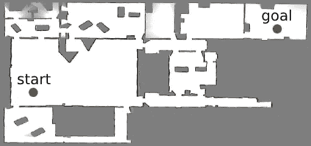
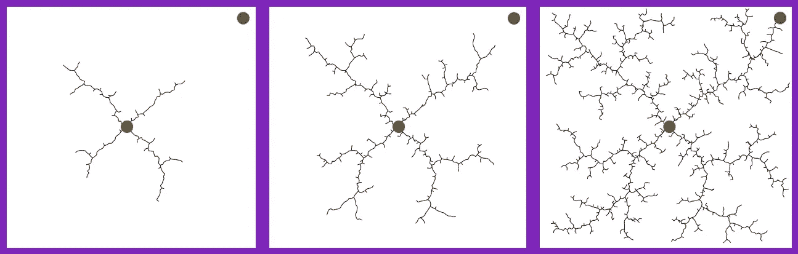
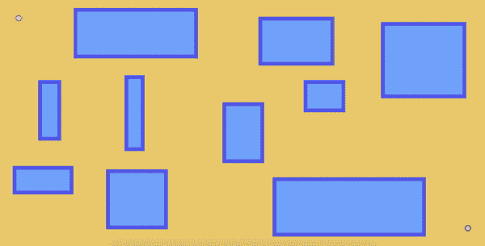
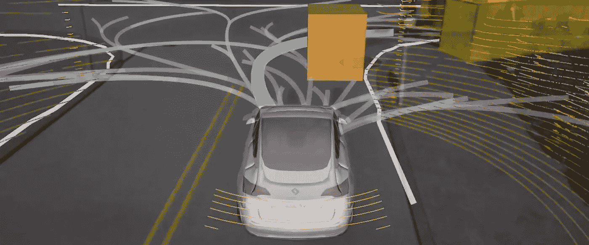

# 机器人如何利用 RRT 规划路径？

> 原文：<https://towardsdatascience.com/how-does-a-robot-plan-a-path-in-its-environment-b8e9519c738b?source=collection_archive---------20----------------------->

最近，我和一名硕士生在我的研究实验室里研究我自己的移动机器人、*南瓜*。由于我们试图替换我的机器人从库 [ROS](https://www.ros.org/) 中使用的一些默认包，我们已经学习了在一个典型的机器人堆栈中使用的不同算法。作为一个从事规划和强化学习的人，但显然不是机器人学的人，对我来说有一个很大的学习曲线。一个机器人必须知道如何[在它的环境](https://en.wikipedia.org/wiki/Monte_Carlo_localization)中定位自己——或者计算出它在哪里，[如果它还没有地图的话，在飞行中建立它的环境的地图](https://en.wikipedia.org/wiki/Simultaneous_localization_and_mapping)，[避开可能随机出现的障碍物](https://en.wikipedia.org/wiki/Obstacle_avoidance)，[控制它的马达](https://en.wikipedia.org/wiki/Control_theory)以改变它的速度或方向，[想出解决任务的计划](https://en.wikipedia.org/wiki/Automated_planning_and_scheduling)，等等。


我的机器人*南瓜*

正如你所猜想的，机器人的一个真正重要的部分是它能够根据给定的环境地图规划从一个地方到另一个地方的路径。它为什么要这么做？也许它需要穿过房间去送包裹，或者护送一个人去某栋大楼。在任何情况下，每当机器人必须从开始位置到目标位置去完成任务时，它必须想出一个**路径计划**来如何在它的环境中移动。在机器人论文中，你经常会看到一张类似下图的地图，上面有起点和终点。这是移动机器人学中的经典问题的一个很好的可视化，我们通常称之为**路径规划。换句话说，机器人如何找到一条从起点到终点的路径？**



来源:[安德鲁·霍华德、高拉夫·苏哈特姆和林恩·帕克的机器人论文](https://www.researchgate.net/publication/2873269_The_SDR_Experience_Experiments_with_a_Large-Scale_Heterogeneous_Mobile_Robot_Team)

**免责声明:**在过去，我写过几篇有彩色图表和冗长解释的帖子。不可否认的是，因为像这样的帖子需要大量的工作，所以我最终没有发布任何东西。展望未来，我打算写一些不加修饰的帖子，稍微粗糙和随意一些。为什么？嗯，这不仅让我更容易写文章来加强我对一个概念的理解，而且我也非常肯定它们可以像我的其他文章一样没有华而不实的内容。现在回到我们定期安排的节目…

然而，和往常一样，我们必须记住一些微妙之处:

1.  **路径规划实际上应该适用于机器人。**如果路径规划使机器人在锐角处转弯，但机器人不能在锐角处移动(如汽车)，则该路径规划不应被允许。
2.  **路径规划应该尽可能接近最优。**尽管找到任何能让机器人从起点到达目的地的路径规划都很好，但不幸的是，这还不够。我们想要有点效率的东西。它不仅能帮助机器人尽快完成任务，还能节省宝贵的电池寿命。
3.  **路径规划应避免碰撞墙壁。**这显然不言而喻。机器人可能非常昂贵，而且崩溃从来都不是一件好事。光是我的小机器人就花了我一千多美元。

试图满足这些条件的最流行的路径规划算法之一叫做**快速探索随机树(RRT)** 。由于一张图片胜过千言万语，请查看下图。让我们假设机器人必须在没有任何障碍的简单地图中从起点位置(红色*点*点)到达目标位置(绿色*点*)。基本上，我们将从一棵树开始，它的根节点代表机器人的起始位置。之后，我们将逐步建立树。怎么会？我们将从地图中随机抽取一些样本，为每个随机样本创建一个新节点，然后以某种方式将每个新节点插入到树中。一旦树中有一个节点足够接近机器人的目标位置，我们就完成了。



来源:[原 RRT 论文](http://msl.cs.illinois.edu/~lavalle/papers/Lav98c.pdf)作者[史蒂文·拉瓦尔](http://lavalle.pl/)

因为我知道这看起来很模糊，让我们给这个粗略的想法添加一些细节。首先，让我们检查一下将发送给 RRT 的每个参数。

*   **地图:**划分为*障碍区*和*无障碍区*的环境地图。它看起来就像我贴在上面的地图，障碍区域是灰色的，无障碍区域是白色的。
*   **开始位置:**机器人在其环境中的开始位置。这只是地图上的红点。
*   **目标区域:**机器人在其环境中的目标区域。这只是地图上的绿点。
*   **迭代次数:**RRT 执行的迭代次数。

让我们看看 RRT 的每一步。首先，我们将初始化一个空树。接下来，我们将把代表开始位置的根节点插入到树中。在这一点上，我们将有一个树，它只有一个节点代表开始位置。最后，我们将重复这些步骤，直到达到迭代次数或达到目标，无论哪一个先出现。

1.  **从地图的无障碍区域中随机抽取一个位置**。
2.  **创建**一个与随机位置相关联的节点。
3.  **找到**已经在树中最接近随机位置的节点。
4.  **计算**从随机位置到节点*位置的路径，该路径在机器人*上实际可行。
5.  **如果路径与某物冲突，继续**进行下一次迭代。
6.  **将与随机位置相关的节点插入到以该节点(离其最近的节点)为父节点的树中。**
7.  **一旦随机位置在目标位置的一定距离内，返回树。**

作为提醒，如果树在我们达到迭代次数时没有接近目标区域，我们将返回到目前为止已经构建的树。



来源:[mjbkaufer](https://www.reddit.com/user/mjkaufer/)通过 [Reddit](https://www.reddit.com/r/visualizedmath/comments/955m27/rapidly_exploring_random_trees/)

但是一旦我们建立了树，我们如何得到从起点到终点的路径呢？我们所要做的就是从代表目标位置的节点开始，沿着树向上返回，直到到达代表开始位置的节点。这将为我们提供机器人从起点到终点的路径。简单。

在同一个地图中，新的目标位置可以重复使用这棵树吗？当然！如果树中已经有一个节点在新的目标位置附近，我们就可以开始了。然而，如果在新的目标位置附近还没有任何东西，我们可以继续采样，直到找到一个靠近它的节点。只要环境没有改变，你可以继续在同一棵树上建造任何新的目标位置。



来源:[实时机器人](https://rtr.ai/)

事不宜迟，这里是 RRT 算法的粗略版本！

```
**function** RRT(*map*, *startPosition*, *goalRegion*, *numIterations*):
    *tree* = initializeEmptyTree()

    insertRootNode(*tree*, *startPosition*) **for** *i* = 1 **to** *numIterations*:
        *randomPosition* = sample(*map*) *randomNode* = createNode(*tree*, *randomPosition*)
        *nearestNode* = findNearestNode(*tree,* *randomPosition*) *path* = calculatePath(*nearestNode*, *randomNode*) **if** (hasCollision(*map*, *path*)):
            **continue** insertNewNode(*tree*, *nearestNode, randomNode*) **if** (*randomPosition* **is within** *goalRegion*): 
            **return** *tree***return** *tree*
```

还有一件重要的事情需要注意！早些时候，我提到我们正在寻找一条适用于真实机器人的最佳路径，并且要避开障碍物。*虽然这条路径可以在真实的机器人上工作并避开障碍物，但它是最优的吗？*不幸的是，事实证明 RRT 并不能保证产生最优路径。在以后的博客文章中，我将讨论 [RRT*](https://ttic.edu/ripl/publications/karaman11.pdf) ，RRT 的一个更好的版本，它最终生成最优路径*。但那是下次的事了。*