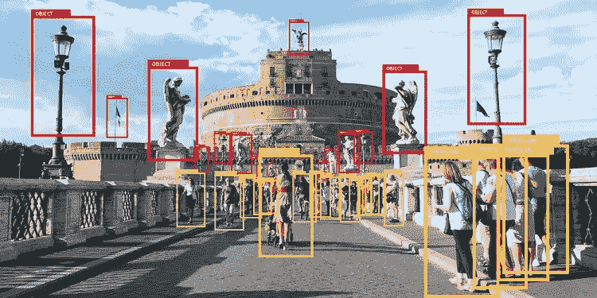
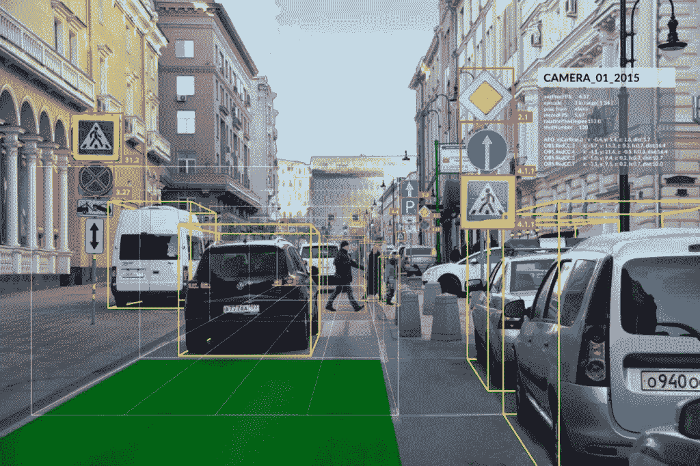
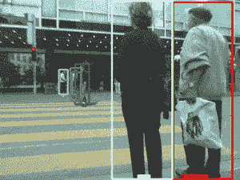
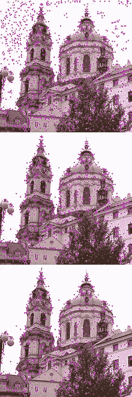
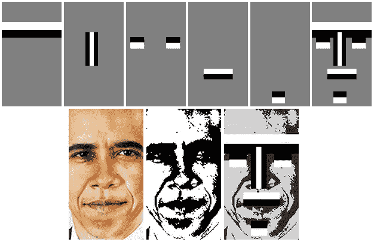
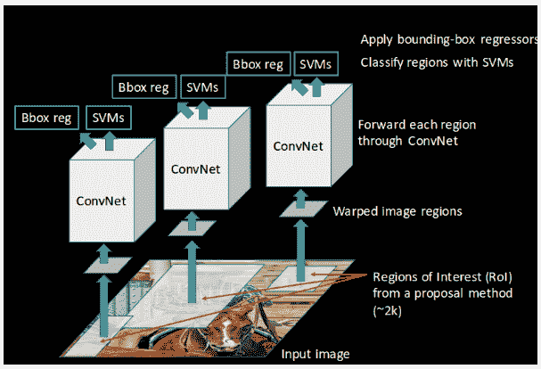
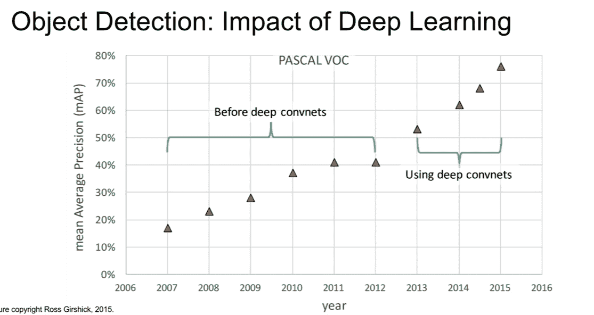

# AI 如何检测物体？(技术)

> 原文：<https://towardsdatascience.com/how-does-ai-detect-objects-technical-d8d63fc12881?source=collection_archive---------3----------------------->

## 了解如何使用机器和深度学习技术应用和实现对象检测

# 介绍

计算机视觉是包含在更广泛的人工智能研究范围内的一个领域。计算机视觉涉及处理数字图像和视频，以推断出对这些图像和视频中的内容的一些理解。

图片来自 https://www.bulletproof.co.uk/blog/bot-or-not

对象检测与计算机视觉相关联，并且描述了一种可以识别图像中期望的对象或身体的存在和位置的系统。请注意，要检测的对象可能出现一次或多次。

对象检测过程的输出是一个图像，在感兴趣的对象周围有边界框，并指示单个对象的类实例，见上图。

> 本文将探索对象检测以及使用机器和深度学习技术实现对象检测的各种方法。

# 应用程序

物体检测最明显的用例之一是在自动驾驶汽车中。

**自动驾驶汽车**有一个嵌入式系统，可以实时进行多类物体检测，然后根据检测结果采取行动。

例如，自动驾驶汽车的系统可以检测到一个人形物体穿过道路，并继续执行一个程序，使汽车在接触到检测到的物体之前停下几英尺。

图片来自[https://www.autonomousvehicleinternational.com/](https://www.autonomousvehicleinternational.com/)

物体检测的其他应用有:

*   **人脸检测**:这个术语指的是实现可以自动识别和定位图像和视频中人脸的系统的任务。面部检测存在于与面部识别、摄影和动作捕捉相关联的应用中。
*   **姿势估计**:从提供的数字资产，如图像、视频或图像序列中推断身体主要关节位置的过程。姿态估计的形式存在于诸如动作识别、人类交互、虚拟现实和 3D 图形游戏的资产创建、机器人等应用中
*   **物体识别:**识别与 a 类目标物体相关的过程。对象识别和检测是具有相似最终结果和实现方法的技术。尽管在各种系统和算法中识别过程先于检测步骤。
*   **跟踪:**一种在一段时间内在一系列图像中识别、检测和跟踪感兴趣的物体的方法。在许多监控摄像机和交通监控设备中可以找到系统内跟踪的应用。

来自 cv-tricks.com 的物体跟踪 GIF

# 机器学习方法

存在用于检测图像中的对象的机器学习技术，并且这些技术是手动实现的算法，因此它们不是学习系统。

诸如大约在 2005 年引入的**方向梯度直方图(HOG)** 的方法使用组合 HOG/SIFT(尺度不变特征变换)来基于图像梯度的归一化局部直方图识别图像内的兴趣点。

该方法基于这样的直觉，即感兴趣的对象具有一组独特的特征，这些特征可以在每个窗口的基础上通过梯度的局部强度和边缘方向来识别。其结果是生成一个 HOG 描述符，该描述符是**仿射不变量**，并在引入了 **SVM(支持向量机)**的检测链中使用，以基于 HOG 描述符检测感兴趣的对象。这种技术对于一般的检测场景，例如行人检测，工作得相对较好。

> 生成仿射不变的 HOG 特征意味着如果特征被移动、缩放或旋转，则描述符中使用的特征将总是呈现相同的描述符

以下是用于对象检测的更多机器学习技术的快速概述:

## 尺度不变特征变换

用于检测的目标对象需要具有独特的方法，以便能够跨图像进行识别；这种新方法类似于获取图像中物体的指纹。

SIFT 是一种计算机视觉算法，它识别并封装图像中局部兴趣点(特征)的信息，以基于提取的特征来描述图像中的对象。

对于 SIFT 算法来说，为了创建对图像内的对象的充分描述，当图像中存在诸如噪声、尺度变化和方向之类的不一致时，所收集的兴趣点需要能够进行检测。满足对适当描述符的要求的图像区域的一个例子是图像内的边缘信息。

圣尼古拉斯教堂(starém sto)图像

 [## 尺度不变特征变换

### 尺度不变特征变换(SIFT)是一种图像描述符，用于基于图像的匹配和识别

www.scholarpedia.org](http://www.scholarpedia.org/article/Scale_Invariant_Feature_Transform) 

## 基于哈尔特征的目标检测

类哈尔特征是对象内的标识符，可用于对象识别和检测。

通过比较两个相邻矩形区域的像素强度并找出总和之间的差异，可以捕获图像部分的特征。差异的结果本质上是我们对于图像的特定部分的描述符。

在实际场景中，haar-like 特征可以用于人脸检测。人脸(例如眼睛)的像素强度存在差异。与邻近区域相比，眼睛区域具有较暗的阴影。

图片来自[https://www.researchgate.net/](https://www.researchgate.net/)

# 深度学习方法

当利用深度学习技术时，有两种主要的对象检测方法，第一种是从头开始设计和训练网络架构，包括层的结构和权重参数值的初始化。第二种方法是利用 [**迁移学习**](https://en.wikipedia.org/wiki/Transfer_learning) 的概念，并在开始对定制数据集进行专门训练之前，利用在大型数据集上训练的预训练网络。

> 迁移学习是一种重用从解决问题中获得的知识，并将获得的知识应用于相关但独立的问题的方法

第二种方法消除了第一种方法所伴随的时间过长的缺点，即与采用已经训练好的网络相比，从头训练网络所花费的时间要长得多，并且需要付出更多的努力。

下面是一些用于目标检测的**卷积神经网络(CNN)** 模型的快速概述

## 基于区域的卷积神经网络及其变体

RCNN 是一种用于解决对象检测和分割的深度学习方法。该技术于 2014 年推出，提出了基于区域的卷积神经网络(简称 RCNN)的概念。

RCNN 利用选择性搜索算法来建议图像中的感兴趣区域，然后使用卷积神经网络来检测建议区域中感兴趣对象的存在。

RCNN 利用 CNN 进行特征提取，利用 [**二进制 SVM**](https://uk.mathworks.com/help/stats/support-vector-machines-for-binary-classification.html) 进行对象分类。尽管 RCNNs 确实包含了一种手动技术来提议感兴趣区域，因此它并不是真正的端到端可学习的解决方案。

图片来自[https://cv-tricks . com/object-detection/faster-r-CNN-yolo-SSD/](https://cv-tricks.com/object-detection/faster-r-cnn-yolo-ssd/)

RCNN 的计算开销很大，平均需要 40-50 秒来完成对每幅图像的预测。它的后继者， [**Fast-RCNN 和 Fast-RCNN**](https://uk.mathworks.com/help/vision/ug/getting-started-with-r-cnn-fast-r-cnn-and-faster-r-cnn.html)**，**解决了 RCNN 中普遍存在的一些性能和效率问题。此外，由于对图像进行和完成预测需要时间，RCNN 不能用于实时应用。

## 你只看一次(YOLO)

YOLO 是替代对象检测技术使用的标准对象检测范例的重新定义。RCNN 等流行技术利用基于区域的分类器，并通过网络传递图像数千次来获得预测。此外，RCNN 是一个两阶段的过程，第一阶段生成建议的区域，第二阶段是对象检测发生的地方。

另一方面，YOLO 是用于对象检测的一步过程。它也是一种神经网络模型，只需要图像通过其网络一次就可以进行对象检测。一个明显的好处是，与 RCNNs 相比，YOLO 提出了更高的效率。

YOLO 的工作原理是在图像上叠加网格，网格中的每个细胞扮演两个角色:

1.  每个单元预测边界框，并为每个边界框分配一个置信度值。置信度值是网格内容包含对象的概率的表示。因此，低置信度值被分配给没有任何对象的图像区域。
2.  每个单元格还产生一个分类概率结果。分类概率表示如果网格包含对象，则该对象可能是具有最高概率的类的可能性。

使用 YOLO 进行物体检测有几个好处，主要是它可以用于实时应用，例如嵌入在自动车辆系统中的物体检测系统。

下面是一段视频，包含了更多关于 YOLO 的信息:

# 结论

最后，我们看看对象检测技术的进展和成功，包括机器学习和深度学习方法。

下图直观地描绘了在 Pascal VOC 数据集上进行评估时，从 2006 年到 2016 年的十年间，****[**Jonathan Hui**](https://medium.com/u/bd51f1a63813?source=post_page-----d8d63fc12881--------------------------------)**解释了对象检测技术的地图得分 **)** 的增加。******

********

******Ross Girshick (2015)，深度学习的影响:对象检测******

****2006 年至 2011 年期间显示了利用传统的机器学习技术进行物体检测；我们可以在 2010-2012 年间观察到一些停滞。这种停滞趋势随着 convnet(卷积神经网络)的出现而改变，我们看到 mAP 得分在 2015 年增加到略高于 75%。****

****下面的链接提供了一些信息，以获得当前技术状态的概述。****

 ****[## PASCAL VOC 2007 上最先进的物体检测表

### 24 种方法的性能比较。

paperswithcode.com](https://paperswithcode.com/sota/object-detection-on-pascal-voc-2007)**** 

****希望通过这篇文章，您对对象检测和技术有了更多的了解，这些技术可以用来在各种应用程序中实现对象检测。****

******如果你喜欢这篇文章，并想阅读更多，给我一个关注。******