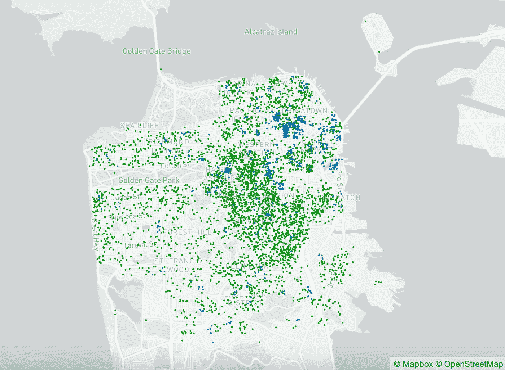
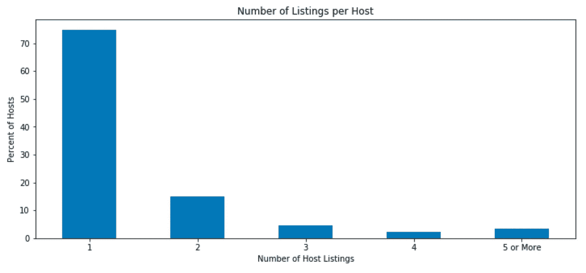
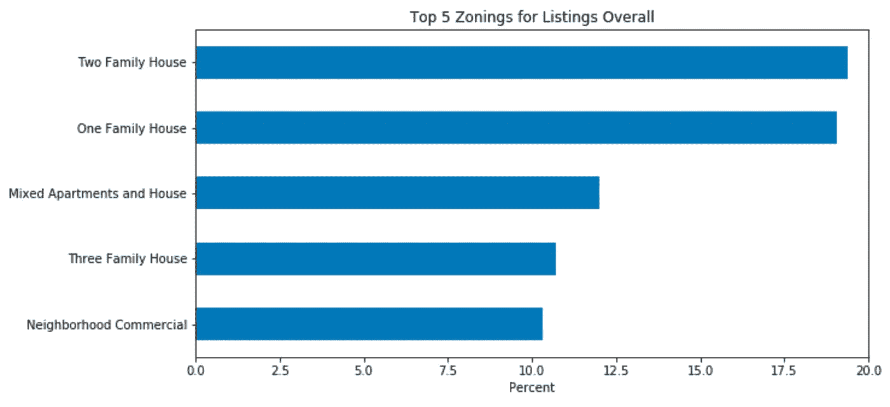

# Airbnb 如何影响旧金山的住房？分析和数据。

> 原文：<https://towardsdatascience.com/how-does-airbnb-impact-housing-in-san-francisco-analysis-and-data-d702ea6db73c?source=collection_archive---------33----------------------->

## 使用数据探索短期租赁如何影响旧金山的住房市场。

一些研究声称，短期租赁推高了当地居民的价格，因为 Airbnb 等服务“吃掉”了本可以流向长期租户的住房供应[1]。事实上，这些平台已经激起了激烈的争论，比如旧金山颁布了相关法规。与此同时，如果有很多因素影响着住房市场，从当地的价格趋势到历史上的不平等，那么像 Airbnb 这样的公司又有多少责任呢？利用数据，本文考察了这些平台如何影响旧金山住房市场，并探讨了监管如何塑造这些趋势。

显示两种列表位置的地图。首先，那些来自“可能的本地”主机，很少有(1-2 个)绿色列表。第二，“潜在缺席”主机，许多列表(3 个或更多)以蓝色显示。下面将进一步讨论这些组。 [Mapbox](https://www.mapbox.com/about/maps/) 和 [OpenStreetMap](https://www.openstreetmap.org/copyright) 。有些位置是近似的。谢谢，[酿酒师](http://colorbrewer2.org/#type=qualitative&scheme=Paired&n=4)。

请注意，这是一个数据和政策交叉的主题，因此本文讨论一些法规的影响。*请理解，此处提供的信息不构成也无意构成法律建议。所有内容仅供参考，不提供任何担保。在未首先寻求相关司法管辖区的专业法律意见之前，不要对该信息采取行动或不采取行动*【5】*。*

**首先，我们需要定义旧金山的“短期租赁市场”。**该分析使用了 Airbnb 内部[2019 年 12 月 4 日的数据，因此这些结果仅适用于当时 Airbnb 上列出的房产【6】。记住这个例子，这篇文章排除了酒店/旅馆(8%的列表)。此外，由于 SF Airbnb 市场有许多只允许长期租赁的物业，那些最短停留时间超过 30 天的(4%的房源)也被忽略，因为它们可能不受与短期租赁相同的监管[7]。](http://insideairbnb.com/index.html)

考虑到这些定义，谁在 Airbnb 上出租空间？**普遍的担忧是，拥有多处房产网络的房东将大量住房从当地长期租赁市场转移到短期租赁市场，而不是当地人出租多余的房间[8]。然而，数据表明大多数主机不符合这个定义:75%的主机只有一个 SF 列表，极少数(3%)有五个或更多*。此外，89%的旧金山寄宿者报告居住在加州，这一发现并不令人惊讶，因为旧金山法规要求寄宿者“每年至少在他们租用的单元中度过 275 个夜晚”[7]。因此，考虑到所有这些，数据表明，大多数主机可能居住在加州，只有一个或两个上市。**

****

**大多数主机只有一个列表。**

****尽管大多数房东都是本地人，只有少量房源，但这并不是说找不到潜在的“不在”房东。**考虑到 11%的主机报告他们的位置不是加利福尼亚。此外，这一“偏远”群体比那些据报道居住在加利福尼亚的人更有可能拥有三个或更多的 SF 清单，而不是只有一个或两个(p < 0.05)**。综合这些指标，拥有许多(≥3 个)房源的“远程”房东负责 10 个房源中的 1 个(11%)，但他们仅占旧金山 50 个主机中的 1 个(2%)。事实上，这些主机的影响可能是广泛的:19 个这样的“潜在远程”主机每个都有 10 个或更多的列表。这表明，许多房东确实在他们居住的房产中租赁了多余的空间，但可能有少数不在的房东有不成比例的大量供应。**

**在继续之前，值得一提的是，这篇文章并不一定声称所有这些租赁都是非法的。网上的信息可能已经过时，一个人可能有很多房间，等等。同样值得强调的是，上述 2%之外的一些人也可能是非法的。**

****不管怎样，要知道大多数 Airbnb 的房东可能都是本地人，只有一两个房源，但也有一些“潜在的偏远”房东有很多房源，Airbnb 需要什么样的房源呢？**了解 Airbnb 使用的房屋类型，以确定长期租赁市场中流失的供应类型，这一点很重要。因此，使用来自城市的数据，每个列表的分区可以大致确定[9]。多数人(49%)居住在住宅区或“RH”分区(RH 1-3)* * *中的一至三个家庭。这与公寓等高密度住宅形成对比，后者在相对湿度区内不太可能出现。事实上，由于一些非相对湿度地区包含房屋和其他建筑的混合物，49%可能是一个低估的数字。这意味着大约一半的房源是出租的，这使得它很容易成为最常见的房产类型。**

****

**许多主人从他们的 1 到 3 个家庭的房子中租用。**

**再说一次，你会想对此有所保留。旧金山的分区法律极其复杂，可用于租赁的公共位置数据并不总是精确的，因此这一发现应被视为近似的。**

**然而，所有类型的主人都有可能在他们一到三个家庭的房子里租用空间，这是真的吗？即使考虑到这种相对湿度的多元性，不同主机类型的分区使用也不一致，进一步挖掘发现，相对湿度分区中的房源不太可能来自拥有 3 个或更多房源的“远程”房东(p < 0.05)。事实上，与其他主机的 52%相比，来自那些潜在缺席主机的列表(具有≥ 3 个列表)中只有 24%在 RH 中。这一重要结果意味着，RH 区主机可能更有可能实际居住在他们的空间，而具有列表网络的“远程”主机更有可能活跃在其他类型的分区中，如更高密度的公寓。**

****

**与其他主机不同，具有≥ 3 个属性的潜在“远程”主机不太可能使用 RH 1–3。有关 RH 区外住宅的更多详细信息，请参见分区定义[10]。**

****知道“本地”主机比“远程”主机更可能使用 RH 分区，Airbnb 对 SF 住房市场做了什么？**之前的研究似乎是正确的，因为一些 Airbnb 主机可能会通过减少供应来推高价格，特别是少数拥有许多房源的“远程”主机，他们更有可能在 RH 分区之外(如高密度公寓)[1]。然而，当主人真的住在这个单元时，结果就不那么简单了，尤其是对于那些不清楚如果 Airbnb 消失了，那些多余的房间是否会成为长期住房供应的房产。考虑一下，在 RH 区列表中，39%是单家庭住宅(没有附属单元)，并且仅用于一个“家庭”和一个“居住单元”[11]。虽然有可能将这些空间长期出租给非亲属，但他们不可能像普通公寓一样进入长期市场，这似乎是合理的。这是因为居住者仅限于那些符合“家庭”定义的人，并且由于 RH-1 不能有一个以上的厨房，所以空间通常无法与典型公寓的特征相匹配[10][11]。这意味着 Airbnb 可能具有减少某些类型住房(特别是高密度住房)供应的双重效应，但 Airbnb 等平台也可能释放市场其他地方未使用的空间(特别是 RH 独栋房屋)。**

**SF 应该如何看待这些结果？围绕短期租赁的争论需要细致入微，因为像 Airbnb 这样的服务可能会使一种类型的房屋更实惠、更具生产力，同时增加另一种类型的成本。如果没有 Airbnb 这样的服务，对于在自己居住的房子里出租多余房间的当地人来说，由于分区限制，许多房间可能根本就不会被使用。事实上，失去 Airbnb 可能不仅会导致这些空间的经济生产力损失，而且可能会使旧金山的房屋所有权变得更加昂贵和难以获得，因为考虑到分区限制，一些低收入业主可能更难以建立长期租赁来抵消他们的房屋成本。然而，这种越来越多的人拥有住房的影响被潜在的缺席者抵消了，他们有许多房源，可能会提高租房者的成本。当然，如果法律的精神在旧金山被严格遵循，这样的单元确实需要被他们的主人占用，这可能不是一个问题。或者，如果分区更加宽松，RH-1 供应可能对长期租赁更有用。不过，从整体来看，11%的房源来自拥有三套或三套以上房产的偏远房东，但 19%的房源是有这些限制的单户住宅(不包括那些有附属单元的)。因此，即使有少量的坏演员，短期租赁也有很多好处。最终，由读者来决定这种交换是否值得。**

**Github 上的代码、数据、注释和引用的作品[。](https://github.com/sampottinger/short-term-rental-sf-analysis)**

**想要更多数据、设计和系统交叉的实验吗？ [*关注我获取更多*](https://tinyletter.com/SamPottinger) *！***