# 构建基于记忆的协同过滤推荐器

> 原文：<https://towardsdatascience.com/how-does-collaborative-filtering-work-da56ea94e331?source=collection_archive---------7----------------------->

## 基于记忆的协同过滤技术综述及电影推荐器的实现


弗洛伦西亚·维亚达纳在 [Unsplash](https://unsplash.com/s/photos/vynil?utm_source=unsplash&utm_medium=referral&utm_content=creditCopyText) 上拍摄的照片

在上一篇文章[使用 tf-idf](/content-based-recommender-systems-28a1dbd858f5) 构建基于电影内容的推荐器中，我解释了如何基于流派构建一个简单的电影推荐器。

在本帖中，我们将实现一个基于内存的协同过滤模型，并讨论基于用户和基于项目的方法在概念和实现上的主要区别。

你可以在 jupyter 笔记本[这里](https://github.com/AlexanderNixon/Machine-learning-reads/blob/master/Collaborative-filtering-recommenders.ipynb)找到重现结果的所有代码。

# 介绍

协同过滤是推荐系统中最常见的技术。顾名思义，它是一种以协作方式帮助用户筛选出项目的技术，也就是说，基于相似用户的偏好。

说 Lizzy 刚刚看了《*降临*》和《*银翼杀手 2049* 》，现在想被推荐一些类似的电影，因为她很喜欢这些。

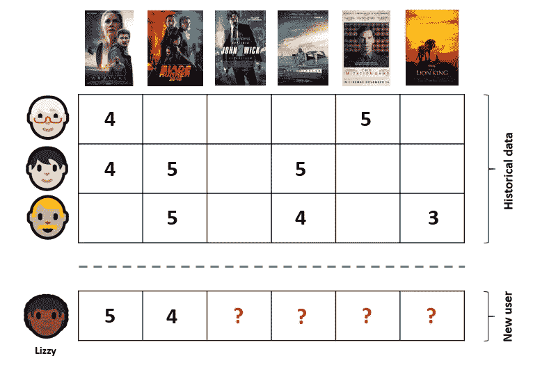

协同过滤(图片由作者提供)

协同过滤方法背后的主要思想是找到也喜欢这些电影的用户，并根据他们的偏好推荐未看过的电影。在这个例子中，模型可能会发现喜欢这些电影的其他用户也喜欢“*星际*”，这可能是对 Lizzy 的一个不错的推荐。

虽然这是主要思想，但有许多方法可以解决这个问题，选择更合适的方法将取决于多种因素，例如我们正在处理的数据集的**大小**及其**稀疏度**。

## 协作过滤方法的类型

如上所述，有许多协同过滤(简称 CF)方法，下面是我们可以找到的主要类型:

*   **基于记忆的**

基于记忆的方法使用用户评级历史数据来计算用户或项目之间的相似性。这些方法背后的思想是定义用户或项目之间的相似性度量，并找到最相似的来推荐未见过的项目。

*   **基于模型的**

基于模型的 CF 使用机器学习算法来预测用户对未评级项目的评级。基于模型的 CF 算法有很多，最常用的有[矩阵分解](https://en.wikipedia.org/wiki/Matrix_factorization_(recommender_systems))模型，如应用 [SVD](https://en.wikipedia.org/wiki/Singular_value_decomposition) 重构评级矩阵，潜在狄利克雷分配或基于马尔可夫决策过程的模型。

*   **杂交**

这些方法旨在结合基于记忆和基于模型的方法。上述方法的主要缺点之一是，你会发现自己必须在**历史用户评级数据** 和**用户或物品属性** *之间做出选择。*混合方法使我们能够利用两者，因此在大多数情况下表现更好。现在最广泛使用的方法是[因式分解机](https://www.csie.ntu.edu.tw/~b97053/paper/Rendle2010FM.pdf)。

现在让我们更深入地研究一下基于内存的方法，因为这是我们将在这篇文章中实现的方法。

## 基于内存的 CF

基于**内存的**协同过滤算法主要有两种类型:**基于用户的**和**基于项目的。**虽然它们的区别很微妙，但在实践中它们会导致非常不同的方法，所以知道哪种方法对每种情况最方便是至关重要的。让我们快速浏览一下这些方法:

*   **基于用户的**

在这里，我们找到了看过/评价过类似内容的用户，并使用他们的偏好来推荐新项目:

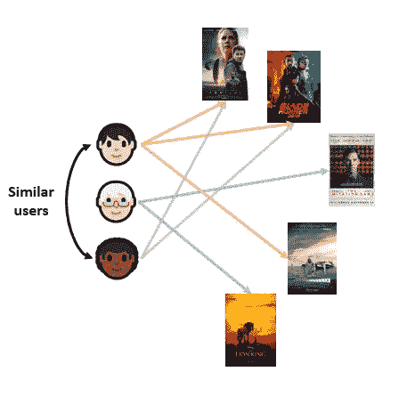

基于用户的协同过滤(图片由作者提供)

一个缺点是，用户往往比项目多得多，这导致更大的用户相似性矩阵(这在下一节可能会很清楚)，从而导致更大数据集上的性能和内存问题，这迫使依赖并行化技术或其他方法。

另一个常见的问题是，我们会遭遇[](https://en.wikipedia.org/wiki/Cold_start_(recommender_systems))****:**可能没有或几乎没有关于新用户偏好的信息，因此没有什么可以比较的。**

*   ****基于项目的****

**想法是相似的，但是相反，从一部给定的电影(或一组电影)开始，我们根据其他用户的偏好找到相似的电影。**

**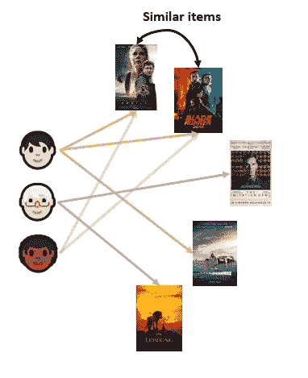**

**基于项目的协同过滤(图片由作者提供)**

**与基于用户的方法相反，项目相似性矩阵往往更小，这将减少在我们的相似性矩阵中寻找邻居的成本。**

**此外，由于一个*单个项目足以*推荐其他类似的项目，这种方法将不会遭受冷启动问题。**

**基于项目的方法的缺点是，与基于用户的 CF 相比，它们在推荐中倾向于较低的多样性。**

# **履行**

## **数据**

**我们将使用与[上一篇](/content-based-recommender-systems-28a1dbd858f5)相同的数据集，即 [MovieLens 数据集](https://grouplens.org/datasets/movielens/)，它包含来自 [MovieLens 网站](http://movielens.org/)的评分数据集。它包含 6000 名 MovieLens 用户制作的约 4000 部电影的 100 万匿名评级，这些电影于 2003 年 2 月上映。**

**我们将和三个人一起工作。csv 文件:**收视率**、**用户**、**电影。** *请查看* [*以前的帖子*](/content-based-recommender-systems-28a1dbd858f5) *了解更多关于数据集的详细信息。***

## **用户-项目矩阵**

**我们需要做的第一件事是创建用户-项目矩阵。这实际上是一个来自评级数据的旋转表，其中行是用户，列是电影，数据框填充了用户给出的评级(如果存在，否则为`0`):**

```
user_item_m = ratings.pivot('user_id','movie_id','rating').fillna(0)
print(f'Shape: {user_item_m.shape}')
> Shape: (29909, 5840)
```

**看起来像这样(我已经加入了电影表，所以标题也可以在这里看到):**

**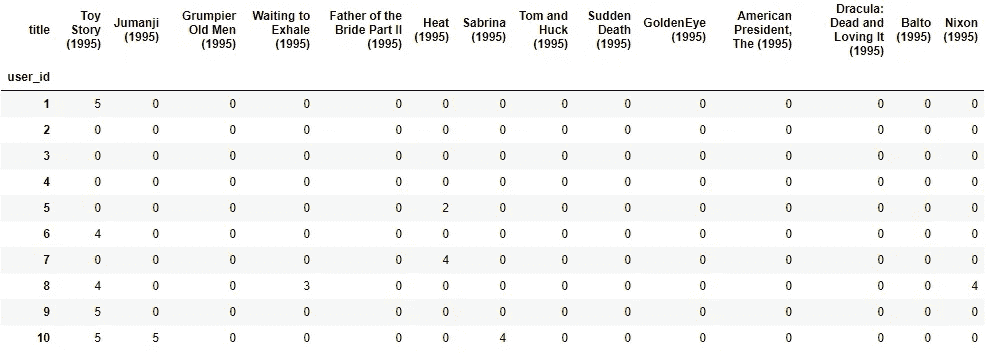**

## **相似矩阵**

**接下来，我们将定义一个**相似度矩阵。**按照上一篇关于基于内容的推荐器的文章的思路，参见章节 [*向量之间的相似性*](/content-based-recommender-systems-28a1dbd858f5) *，*我们想要在用户-项目矩阵*中找到所有用户(或项目)之间的邻近性度量。*常用的度量是[余弦相似度](https://en.wikipedia.org/wiki/Cosine_similarity)。**

**正如我们也看到的，这种相似性度量因其等于被比较的两个向量之间的角度的余弦而得名，在这种情况下，这两个向量是得分的用户(或项目)相似性向量。两个向量之间的角度越小，余弦值就越高，从而产生更高的相似性因子。有关这方面的更多详细信息，请参见前面提到的部分。**

**我们可以使用`sklearn's` `metrics.pairwise`子模块进行成对距离或相似性度量，在这种情况下，我们将使用`cosine_similarity`。**

**请注意，该函数具有签名:**

```
sklearn.metrics.pairwise.**cosine_similarity**(*X*, *Y=None*, *dense_output=True*)
```

**`Y`预计在哪里:**

> ****Y:**n array 或稀疏数组，形状:(n_samples_Y，n_features)。如果`None`，输出将是`X`中所有样本之间的成对相似度。**

**因此，通过仅指定`X`，这将从`X`中的样本生成相似性矩阵:**

```
from sklearn.metrics.pairwise import cosine_similarityX_user = cosine_similarity(user_item_m)
print(X_user.shape)
(6040, 6040)print(X_user)
array([[1\.   , 0.063, 0.127, 0.116, 0.075, 0.15 , 0.035, 0.102],
       [0.063, 1\.   , 0.111, 0.145, 0.107, 0.105, 0.246, 0.161],
       [0.127, 0.111, 1\.   , 0.127, 0.066, 0.036, 0.185, 0.086],
       [0.116, 0.145, 0.127, 1\.   , 0.052, 0.016, 0.1  , 0.072],
       [0.075, 0.107, 0.066, 0.052, 1\.   , 0.052, 0.106, 0.18 ],
       [0.15 , 0.105, 0.036, 0.016, 0.052, 1\.   , 0.067, 0.085],
       [0.035, 0.246, 0.185, 0.1  , 0.106, 0.067, 1\.   , 0.202],
       [0.102, 0.161, 0.086, 0.072, 0.18 , 0.085, 0.202, 1\.   ],
       [0.174, 0.156, 0.1  , 0.092, 0.242, 0.078, 0.125, 0.217],
       [0.209, 0.162, 0.158, 0.096, 0.079, 0.124, 0.091, 0.109]])
```

**这将生成形状为`(n_users, n_users)`的用户相似度矩阵。**

**由于`X`预计为:**

> ****X**:n 数组或稀疏数组，形状:(n_samples_X，n_features)**

**通过转置用户项目矩阵，我们的样本现在将是用户项目矩阵的列，即*电影*。因此，如果我们的原始用户项矩阵的形状是`(n,m)`，通过在转置矩阵上找到余弦相似性，我们将得到一个`(m,m)`矩阵:**

```
X_item = cosine_similarity(user_item_m.T)
X_item.shape
(3706, 3706)
```

**这将表示项目相似性矩阵。**

## **该算法**

**创建了相似性矩阵之后，我们现在可以定义一些逻辑来查找相似的用户。在**基于用户的**推荐的情况下，我们想要找到与我们想要推荐电影的新用户相似的用户，并且因为我们已经有了相似性分数，我们只需要搜索给定用户行中的最高值，并且从那里选择最高的 **k** 。一旦我们有了 **k** 最接近的用户，我们就可以找到该用户还没有看过的评分最高的电影。**

**当然，在这种情况下更简单，因为我们已经计算了所有用户之间的相似性矩阵。在实际场景中，我们必须用新用户更新相似度矩阵，然后*和*找到最相似的用户*。***

**基于**使用的 CF** 的算法可以总结为:**

1.  ***计算新用户与所有其他用户之间的相似性(如果还没有完成)***
2.  ***计算* ***k*** *最相似用户*所有电影的平均评分**
3.  ***推荐其他用户未看过的排名前* ***n*** *的电影***

**下面是一个逐步解释的实现基于用户的 CF 推荐器的功能:**

**如前所述，基于用户和基于项目的 CF 系统之间的实现差异非常小。因此，将这两种方法包装在一个类中可能是一个好主意，一旦实例化，我们将使用该类向给定用户推荐电影或项目:**

**在用一些例子测试推荐器之前，定义一个函数来查看用户的偏好以了解推荐是否有意义可能是有用的。在这里，我对用户观看的电影进行分级，取前 10 名:**

## **测试推荐器**

**测试一个推荐者实际上比看起来更难。在 movielens 数据集中，许多用户将会看到*所有的东西，*在某种意义上，他们可能会给多种类型的电影很高的评级，而不仅仅是他们最喜欢的。**

**测试该模型的一个有用的方法是找到一些具有特定品味的用户的具体例子，例如，对一两个流派有明确的偏好。我所做的是找到已经看过几部电影的用户，但这些电影的类型很少，这意味着他们显然对这些电影有偏好。因此，推荐器被期望推荐来自相同类型的电影。**

*   **让我们从一些基于**用户的**建议开始:**

**让我们试试一个似乎偏爱《T4》剧的用户:**

```
rec = CfRec(user_item_m, X_user, movies)
because_user_liked(user_item_m, movies, ratings, 69)
```

**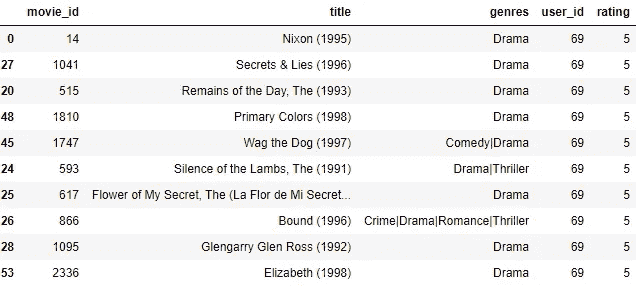**

**我们可以看到该用户评价最高的电影是*剧情*电影。让我们看看推荐者的建议:**

```
rec.recommend_user_based(69)
```

**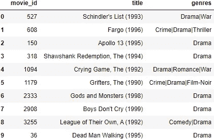**

**推荐看起来不错！很难说用户是否会完全同意特定的电影，但是用户的类型偏好清楚地反映在推荐中。**

**现在让我们和一个恐怖电影的粉丝一起试试:**

```
because_user_liked(user_item_m, movies, ratings, 2155)
```

**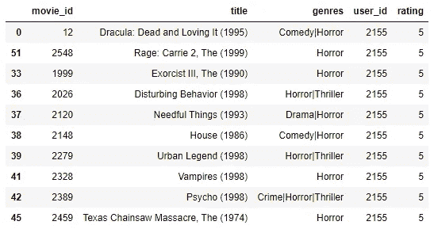**

```
rec.recommend_user_based(2155)
```

**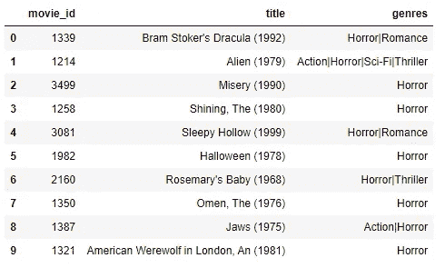**

***《闪灵》*，*《异形》* …听起来这个用户错过了这些恐怖经典！**

*   **现在让我们尝试一些基于**项目的**建议**

**我们要做的第一件事是创建该类的另一个实例，但是这次使用项目相似性矩阵作为相似性矩阵:**

```
rec = CfRec(user_item_m, X_item, movies)
```

**如前所述，这里的逻辑是根据其他电影推荐电影。来看看推荐者给喜欢科幻经典 ***沙丘* :** 的用户什么建议**

```
rec.recommend_item_based(2021)
>> Because you liked **Dune (1984)**, we'd recommend you to watch:
```

**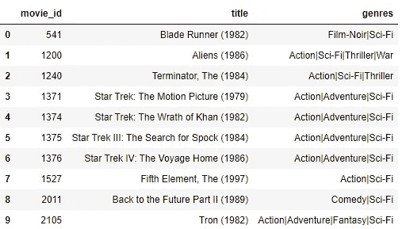**

**我们可以看到，所有推荐的电影都来自同一类型，看起来都是不错的建议。**

**如果我们喜欢 ***Se7en*** ，一部*犯罪*和*惊悚*电影*，*我们会被推荐去看 *:***

```
rec.recommend_item_based(47)
>> Because you liked **(Se7en) (1995)**, we'd recommend you to watch:
```

**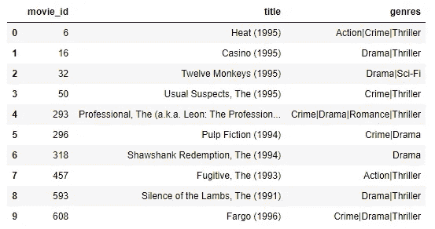**

**最后，对于一部经典的*动画*电影， ***斑比*** :**

```
rec.recommend_item_based(2018)
>> Because you liked Bambi (1942), we'd recommend you to watch:
```

**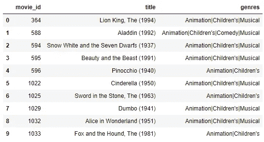**

**所以在这两种情况下，实现的协同过滤模型似乎提供了很好的推荐。**

**有许多可以改进的地方。例如，我们可以考虑这样一个事实，即在给电影分级时，用户可以表现得非常不同。一些用户可能对所有电影评价很高，而其他用户可能更挑剔。这可以通过减去每个用户的平均分来完成，然后我们就有了每个用户的标准化分数。**

**无论如何，我希望这个例子能够说明协同过滤方法是如何工作的。我鼓励你把它作为一个起点，也许可以稍微调整一下或者增加一些改进。**

**非常感谢你花时间阅读这篇文章，希望你喜欢:)**