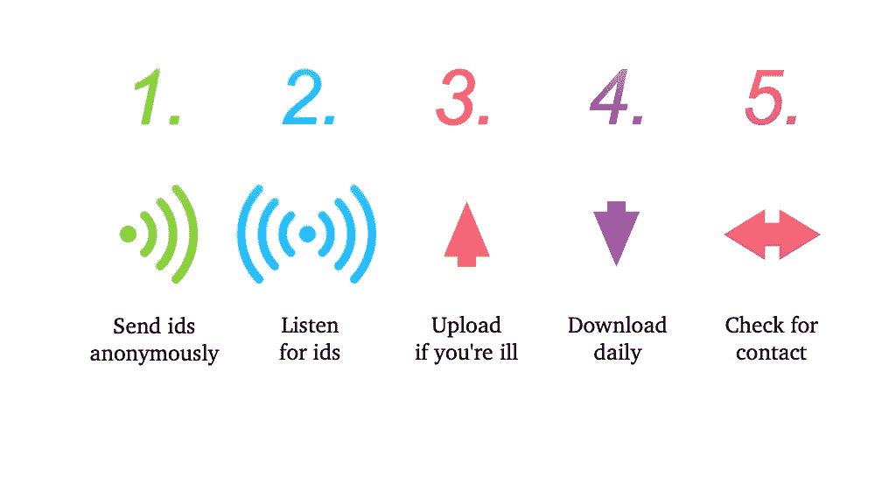

# 联系人追踪是如何工作的？

> 原文：<https://towardsdatascience.com/how-does-contact-tracing-work-bff0bc4c5a25?source=collection_archive---------81----------------------->

## 我们在保护隐私的同时阻止新冠肺炎病毒传播的最好办法

通过[像素点](https://pixabay.com/)上的[动画](https://pixabay.com/users/AhmadArdity-3112014/)

接触追踪，作为一个概念，自艾滋病危机以来已经存在了几十年[1]。接触者追踪的基本原则包括确定可能有患病风险的人，并通知他们接受检测(如艾滋病)或自我隔离(如新冠肺炎)。

我们将考虑开发[分散隐私保护邻近追踪(DP-3T)](https://github.com/DP-3T/documents/blob/master/DP3T%20White%20Paper.pdf) 的团队提出的世界版本。还有其他关于如何进行联系人追踪的提议，比如苹果和谷歌提出的那些提议，但同样的基本概念仍然适用。我们将看看该协议是如何工作的，以及它是如何被设计来保护每个人的隐私的。

## DP-3T 是如何工作的？

5 步追踪联系人

基本算法可以分为 5 个步骤:

1.  每隔 x 分钟从你的手机发送一个随机代码。
2.  收听附近的电话发送给你的其他代码。
3.  如果你的疾病检测呈阳性，然后(只有在那时)将你发送的随机代码上传到一个安全的中央数据库。
4.  从中央数据库下载代码，并测试是否有与您已收听的代码相匹配的代码。
5.  如果找到匹配，则通知用户他们有感染疾病的风险。

## 发送随机代码

在算法设计者发表的白皮书[中，随机码被称为短暂标识符或`EphIds`。作者解释说，在每天开始的时候，手机应该产生`(60*24)/l`个不同的伪随机码`EphIds`。`l`是一个可配置的参数，代表每个 EmpId 被广播的分钟数——对于本文，我们假设它是 1。这些`Ephids`通过蓝牙低能量发送给周围的手机。旋转提高了隐私性，因为它使跟踪个人的运动变得更加困难。](https://github.com/DP-3T/documents/blob/master/DP3T%20White%20Paper.pdf)

如果您有兴趣了解更多信息，白皮书中会详细解释这些信息是如何生成的。值得一提的是，创建`EphIds`的方法对每个用户来说是确定的，但看起来是随机的——这种设计决策的原因将在后面变得清楚。

## 监听代码

除了发送`EphIds`之外，你的手机还需要监听并记录来自附近手机的所有 Ephids 列表。id 和日期一起安全地存储在设备中。`EphIds`只需要储存 14 天，为新冠肺炎的最大孵化时间。

## 上传 EphIds

该论文的作者建议，当一个人进行测试时，应该给他们一个访问代码，以便在需要时将他们的结果上传到中央数据库。该代码仅在患者测试呈阳性时激活。然后，个人可以选择指示应用程序从第一天开始上传第一个`Ephid`，它们具有传染性(在出现症状[【2】](https://www.who.int/docs/default-source/coronaviruse/situation-reports/20200402-sitrep-73-covid-19.pdf?sfvrsn=5ae25bc7_6)之前平均 5-6 天)。

只有来自个体传染期的第一个`Ephid`需要被上传，因为，如上所述，由于`Ephids`的创建是确定性的，所有其他的`Ephids`可以被用户重新创建。

## 正在检查匹配

每天你的手机都可以从中央数据库下载一份`Ephids`列表以及它们被传送的日期。您的手机可以在传染期间重建完整的`Ephids`系列，并与您的手机在同一时间段听到的`Ephids`进行交叉引用。如果找到匹配项，则会记录下来，并根据匹配项的数量和找到这些匹配项的时间来计算自定义风险分值。风险评分由当地卫生当局设计，是与中央数据库匹配的`Ephids`数量的函数。

## 隐私

像这样的算法的优雅之处在于，它们从不需要知道个人的位置，也不需要访问 GPS 数据。它也不知道个人的日常习惯是什么，或者他们是否遵守锁定策略。使用该协议的应用程序只关心用户的安全。

## 结论

DP-3T 联系追踪是一种隐私转发、轻量级和安全的联系追踪方法。如果实施得好，它有机会大大减少新冠肺炎的传播，并有助于拯救生命。

[1] Ramstedt K，Hallhagen G，Lundin BI 等.人类免疫缺陷病毒(HIV)感染的接触追踪.*性传播疾病*。1990;17(1):37‐41.

[2][https://www . who . int/docs/default-source/coronavirus/situation-reports/2020 04 02-sit rep-73-covid-19 . pdf？sfvrsn=5ae25bc7_6](https://www.who.int/docs/default-source/coronaviruse/situation-reports/20200402-sitrep-73-covid-19.pdf?sfvrsn=5ae25bc7_6)