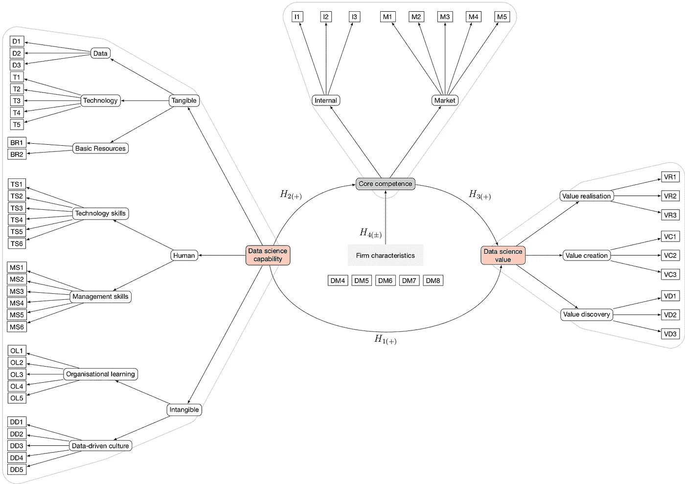
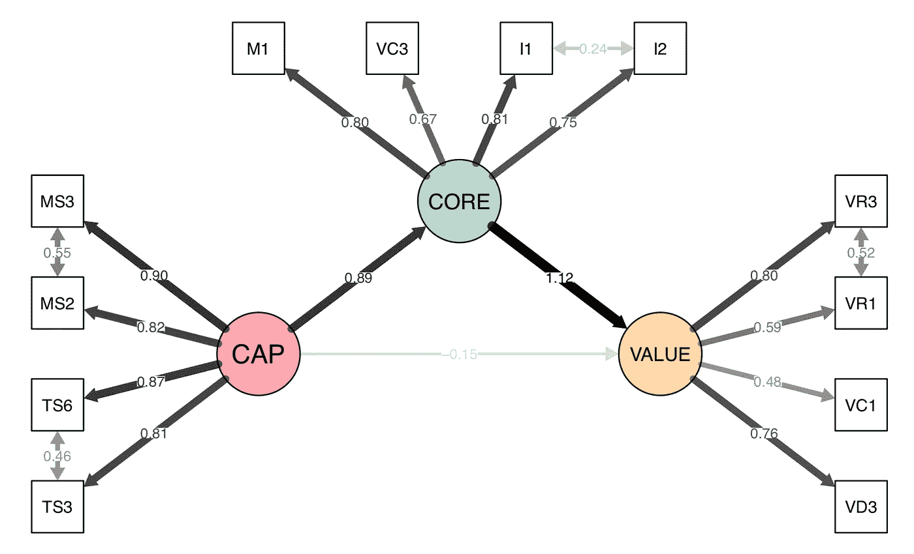
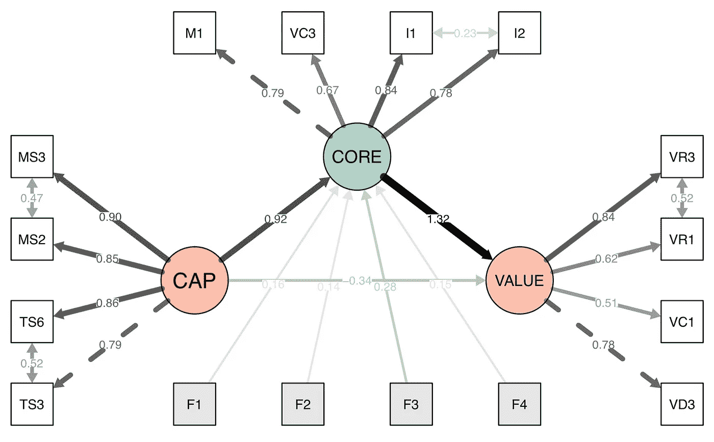
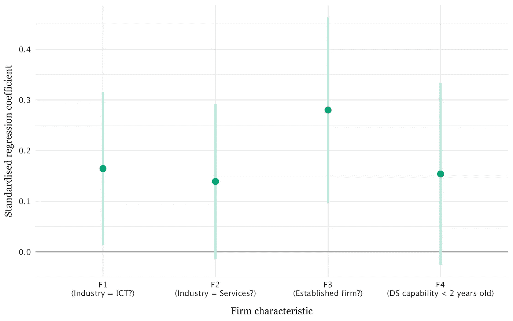
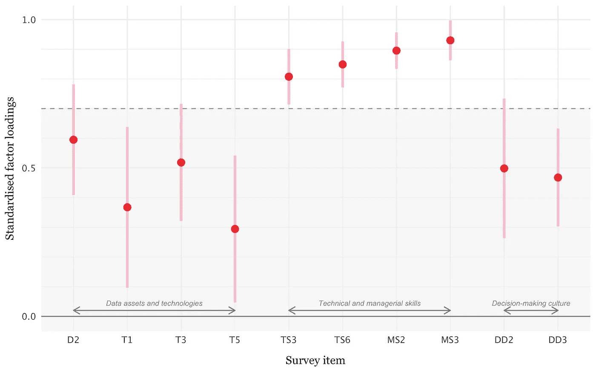

# 数据科学如何为企业创造价值？

> 原文：<https://towardsdatascience.com/how-does-data-science-create-value-for-firms-a3e3e5ca86e3?source=collection_archive---------31----------------------->

## 不要关注技术、角色和组织结构图。相反，请考虑如何让数据科学成为您组织的核心竞争力。

马林·斯特兰德瓦尔在 [Unsplash](https://unsplash.com?utm_source=medium&utm_medium=referral) 上拍摄的照片

W 我们都读到过数据是“未来的燃料”，听说过数据科学家拥有“21 世纪最性感的工作”，也看到过商业智能和分析行业惊人同比增长的[预测](https://www.gartner.com/en/documents/3906894/market-share-analytics-and-business-intelligence-worldwi)。但是，随着多达 85%的大数据项目失败，显然许多公司难以实现数据和人工智能的承诺收益。以我作为数据科学顾问的经验来看，这通常会让公司问这样的问题:

*   我们应该使用什么技术和方法来存储、分析和共享我们的数据？
*   我们的数据科学团队需要哪些技能和角色？
*   我们应该如何在组织中定位我们的数据科学团队？
*   我们能像传统项目一样计划和管理数据科学项目吗？
*   我听说行业中的公司*x*y 和 *z* 取得了巨大的成功。这适用于我的情况吗？

虽然这些都是重要的考虑因素，但我认为它们都是同一个基本问题的不同版本:

> *数据科学如何为企业创造价值？*

我最近在华威大学的 MBA 论文中研究了这个问题，在这篇文章中，我将给出一个研究的总结。在这个过程中，我将根据我作为一名实践数据科学家和顾问的工作描述一些经验和建议。附加的注释和参考资料可以在最后找到。

## 关键要点

*   公司的数据科学功能可以被认为是一组可以协调成能力的资源。理想情况下，这些能力应该支持公司的总体战略目标，并创造可持续的竞争优势。
*   数据科学能力创造的价值取决于它在多大程度上是公司的核心竞争力。数据科学家和云计算自己什么都不做；当这些资源和能力与公司的战略目标相一致并帮助公司应对动态竞争环境时，价值就被创造出来了。
*   这种关系因行业和公司类型而异。虽然结果并不支持一个确定的答案，但在快速变化的竞争环境中的行业(如 it 或服务)的公司最有可能拥有强大的数据科学核心能力。成熟的公司和那些具有较新的数据科学能力的公司也更有可能在数据科学方面拥有强大的核心竞争力。
*   企业可以从他们的数据科学能力中提高竞争优势，例如，通过强调数据科学管理技能的发展；通过选择符合核心战略目标并需要跨职能团队的项目；通过确保数据科学能力对于公司所在行业的变化步伐足够敏捷；以及在个人、操作和战略层面上规划潜在的冲突。

# 资源、能力和核心竞争力

企业的基本目标是发展和保持市场竞争优势。为了理解数据科学对这一目标的潜在贡献，有必要回顾一下战略管理文献中的两个关键概念:基于资源的企业观和动态能力。

战略优势的资源基础理论(RBT)是“理解组织的最突出和最有力的理论之一”(Barney，Ketchen 和 Wright，2011: 1299)。简而言之，该理论认为企业由以下部分组成:

*   资源:由企业控制的生产投入(Grant，1991)或“任何可以被认为是优势或劣势的东西”(Wernerfelt，1984: 172)。
*   *能力*:“一组资源执行某项任务或活动的能力”(Grant，1991: 119)。对于数据科学而言，相关能力可能包括收集和处理运营数据、构建预测模型以及向利益相关者和决策者传达由此产生的见解的能力。

虽然 RBT 可以有力地解释为什么企业目前具有竞争优势，但它在解释这些职位是如何在动态竞争环境中创造和保持的方面却不太有效。为此，我们转向*动态能力*，“企业整合、建立和重新配置内部和外部能力以应对快速变化的环境的能力”，例如，通过感知市场机会和威胁，抓住这些机会，并转变企业资产以保持竞争力(Teece，2007)。

关于管理信息系统的文献，特别是数据分析，强调了两个值得注意的动态能力。第一种观点认为，信息技术系统的利益取决于其与公司战略目标的*一致性*，以及其日常运营和文化(例如，Venkatraman，1993；Krishnamoorthi &马修，2018)。传统上，这种一致性可能是通过过程标准化和瀑布式项目管理来实现的；相比之下，数据科学活动通常是探索性的，这意味着通过敏捷开发方法更有可能实现一致性。

第二，IT 系统可以提高组织的 a *gility* ，即其“快速识别并有效应对威胁和机遇”的能力(Ghasemaghaei，Hassanein and Turel，2017: 95)。一项针对 3，500 多名企业高管的关于数字技术挑战的调查表明，这种灵活性对于企业长期应对快速变化的环境至关重要。正如一位受访者所说，一家公司可以在短期内积极推广某项特定能力，但在十年的时间框架内，“我们正在被我们的客户、技术和全球化所牵引”(Buckley and Natasha，2017: 5)。

在下面的分析中，我将市场整合和内部敏捷性作为企业“核心竞争力”的要素；也就是说，战略能力是企业绩效的基础，是创造价值的多种来源的基础(Prahalad 和 Hamel，1990)。最近，关于“大数据分析能力”的文献(如 Mikalef *等人*，2018)提出了数据科学在多大程度上可以成为这样的核心竞争力，我的假设是，数据科学通过支撑多种组织能力为公司创造价值；这种关系如图 1 所示。

**图一。**数据科学如何为企业创造价值的提议模型。尽管之前的研究( [1](https://doi.org/10.1016/j.ijpe.2016.08.018) 、 [2](https://doi.org/10.1016/j.dss.2017.06.004) 、 [3](https://doi.org/10.1016/j.jbusres.2016.08.011) )已经强调了核心能力结构对于数据科学价值创造的重要性，但他们设想核心能力结构独立于公司的数据科学能力。通过将其建模为*中介—* 而非*调节—* 关系，本研究能够更好地评估数据科学能力是否仅通过培养支持企业更广泛目标和动态能力的核心数据科学能力来创造价值。潜在结构显示在圆角矩形中，测量项目显示在矩形中。在本文的结尾可以找到所用项目的列表。

# 数据收集

关于这一主题的大多数文献都使用了验证性因素分析和结构方程模型来检验假设，我在这里也采用了同样的方法。为了收集所需的数据，我设计了一个封闭式调查，询问受访者以下问题:

*   他们的人口统计数据、数据科学经验和公司属性；
*   组织内数据科学资源的性质；
*   数据科学功能与公司整体战略目标的整合程度；和
*   他们对数据科学在其公司创造的价值的看法。我测量的价值是对数据科学帮助被调查者的公司发现、创造和实现价值的方式的主观评估(Sheng *et al.* ，2007)；成本和收益的货币评估(如 Vidgen *等人*，2017)被排除，因为调查受访者是未知行业的代表，也可能无法获得这些信息。

在对调查进行试点和修订后，该调查于 2019 年 5 月通过 LinkedIn、社交媒体、专业人士和校友网络上的数据科学小组进行了分发。图 2 总结了 50 名有效回答者的主要特征。

**图二。**调查对象的选定特征。受访者来自 ICT、医疗保健、专业服务和零售等行业。

有关如何检查调查工具的有效性以及研究限制的详细信息，请参见技术说明。

# 主要发现

## 发现 1:拥有数据科学能力是不够的

为了从数据科学能力中创造价值，仅仅雇用数据科学家并让他们通过一些机器学习算法来运行您的数据是不够的。如图 2 所示，当数据科学能力成为公司核心竞争力时，价值就被创造出来了；也就是说，它使组织能够在多个市场上竞争，它协调整个组织的技能，它被认为是创造客户价值不可或缺的一部分。

**图 3。**数据科学能力(CAP)创造价值，但主要是当该能力被整合为公司的核心竞争力时。边缘权重显示来自结构方程模型的标准化负荷，除了 CAP → VALUE (p = 0.71)，潜在结构之间的路径在 p ≤ 0.01 时显著。为清晰起见，未显示剩余差异。

在实践中，这一结果对于刚开始数据科学之旅的组织来说可能是最重要的。在 [DAIN 工作室](https://dainstudios.com/)，我们与之前进行数据科学试点研究的客户合作，但他们对这些项目没有对他们的业务产生[变革性影响感到失望。小项目本质上没有错——它们是在组织内建立能力和信任的好方法——但是它们需要有助于可持续的核心竞争力。我们的顶级技巧包括:](https://dainstudios.com/2019/08/05/how-to-define-and-execute-your-data-and-ai-strategy/)

*   试点研究团队应该是跨职能团队。不要只是将大量数据导出给数据科学团队，然后期望他们带着成品回来。合作有助于组织协调利益和工作流程，从而为更轻松地部署数据科学见解奠定基础。
*   选择试点研究，开发与战略目标一致的新能力。例如，如果公司的总体目标是通过 *x%* 增加收入，一个合适的试点研究可能涉及整合两个以前不相关的数据源，这些数据源提供了关于您的客户以及什么类型的优惠可能会吸引他们的更多见解。拥有一个分析路线图也是很有帮助的，它描绘了单个项目如何共同促进所需功能的开发，例如数据存储基础设施、算法开发或可视化。

## 发现 2:快速发展行业的公司更有可能拥有强大的 DS 核心竞争力

对于不同的企业类型，上述关系如何变化？先前的研究表明，企业特征对企业的敏捷性影响很小，甚至没有影响(见图 1 标题中的参考文献)；然而，目前的结果突出了两个重要的特点:一个公司的整个行业和它的个人历史(图 4 和图 5)。

**图 4。**公司特征—如行业(F1:行业= ICT？F2:工业=服务业？)、规模(F3)及其数据科学能力的年龄(F4) —被发现对数据科学成为核心竞争力的程度有显著影响。边缘权重显示了来自结构方程模型的标准化负荷，除了 CAP → VALUE (p = 0.392)，潜在结构之间的路径在 p ≤ 0.01 时显著。为了清楚起见，没有显示残差方差和外生协方差。

**图五。**公司特征会影响数据科学成为核心能力的程度。所有特征都被建模为虚拟变量。老牌公司是那些超过 25 年或拥有 1000 多名员工的公司。线条表示 95%置信区间，F1 和 F3 在 p < 0.05 显著(F2 → CORE，p = 0.075F4 →核心，p = 0.093)。

先说行业。相对于所有其他行业，ICT 和服务行业的公司在数据科学方面拥有最强的核心竞争力。*环境速度*的概念有助于解释为什么会出现这种情况(McCarthy *等人*、2010)。企业竞争环境的变化速度——例如，企业使用的基础技术、产品供应、客户需求等——在塑造企业为保持竞争力而必须拥有的资源和能力方面起着重要作用。现代市场是充分开放和动态的，企业至少需要某种程度的动态能力才能生存，但在高速环境中，竞争优势的持续时间是不确定的，可用于决策的时间是有限的，动态能力本身是不稳定的(Eisenhardt 和 Martin，2000)。出于这个原因，Schilke (2014)认为，当环境变化的方向和幅度大致可以预测，并且开发这种能力的成本可以在一定程度上收回时，动态能力对竞争优势的贡献最大。随着行业的成熟以及所需资源和能力变得更加广泛可用和标准化，这种“适度”的环境速度似乎适用于数据科学和分析(Ransbotham *et al.* ，2016)。

对于大多数公司来说，数据科学只是公司整体能力的一部分，因此母行业的发展速度仍然很重要。例如，ICT 行业是由快速的外生技术发展推动的，因此我们希望这些公司拥有整合数据科学能力的经验和能力，无论数据科学是否代表另一波重大创新，或者只是“新瓶装旧酒”。类似地，服务公司的创新周期更短，更容易试验和适应新技术。相比之下，医疗保健、制造或其他行业的公司可能更习惯于由监管变化或有限竞争等因素驱动的较慢的环境速度。

因此，企业应该密切关注其行业的环境速度。如果变革的步伐缓慢，那么可能会有更多的时间来开发数据科学能力。然而，如果变革的速度更快，那么企业需要更加积极主动。这凸显了那些习惯于较慢变革速度、但现在面临新进入者破坏的公司面临的特殊风险；事实上，许多医疗保健公司已经开始认识到将数据科学和人工智能引入其价值链所带来的战略威胁( [1](https://www.fiercepharma.com/pharma/amazon-finally-moved-into-healthcare-but-its-pharma-ambitions-are-still-far-from-clear) 、 [2](https://www.mckinsey.com/industries/pharmaceuticals-and-medical-products/our-insights/how-pharma-can-accelerate-business-impact-from-advanced-analytics) )。

## 发现 3:公司历史影响数据科学核心竞争力的强度，但关系是复杂的

上述回归结果还包括公司历史的属性，即它是否是一家老牌公司(超过 25 年或超过 1000 名员工)以及它的数据科学能力是超过还是少于两年。然而，鉴于这项研究中有限的数据，这个故事仍然不清楚。

拥有年轻数据科学能力的公司似乎拥有更强的核心竞争力。这可能是因为这些公司本质上是数据科学的后期采用者，并且能够从他人的经验中学习。例如，最近的报告( [1](https://www.pwc.de/de/digitale-transformation/kuenstliche-intelligenz/studie-kuenstliche-intelligenz-in-unternehmen.pdf) ， [2](https://www.handelsblatt.com/today/opinion/not-getting-it-why-german-companies-fail-at-digital-innovation/23581568.html?ticket=ST-365634-ihBuGTpmoUpLNXQRs2Sh-ap3) )表明，德国公司在更普遍地采用数据科学和数字技术方面落后于国际同行。作为一家拥有德国和芬兰共同传统的公司，DAIN 工作室通过安排“体验之旅”，展示在数据和人工智能方面拥有核心竞争力意味着什么，帮助客户克服了一些障碍。

更大、更成熟的组织似乎也具有更强的核心竞争力，而人们可能会认为这些公司很难将新的数据科学技术应用到现有流程中。一种可能的解释是，这些公司只是将现有能力重命名为“数据科学”，例如，通过更名“商业智能”功能或将数据科学嵌入业务部门。或者，成熟企业的持久成功可以建立在敏捷性能力的基础上，这种能力允许几乎任何新的能力一旦被认为与公司的总体方向有很强的一致性，就可以被迅速采用。

需要做更多的研究来更好地理解这些影响。然而，在实践中，人们应该意识到公司内部的潜在冲突，这些冲突可能会阻止数据科学能力成为核心竞争力。这些可以用三个尺度来描述:

*   *个人*:保险行业报告称，由于“[墨守成规的传统主义者和危险的牛仔](http://iireporter.com/from-conflict-to-coexistence-reconciling-actuarial-and-data-science/)”之间的冲突，很难调和现有的分析能力和新的数据科学家。
*   *运营*:数据科学和 IT 职能部门之间经常发生冲突。例如，现有的 IT 采购和安全政策可能会限制数据科学团队开展工作的能力。这里的关键是区分实验和生产；这两个活动之间显然存在依赖关系，但是风险在于，过于关注生产系统的约束会抑制生产性实验。这种运营冲突更有可能发生在具有风险规避文化的公司中。
*   *战略*:在成熟的公司中，数据科学项目和能力通常在高层管理人员的支持下启动，希望数据科学能够为公司带来重大价值。因此，可以理解的是，现有的 It 职能部门可能会认为数据科学团队侵入了他们的地盘，并声称现有的 IT 活动也是“数据科学”。这可能会在组织内部造成[政治冲突](https://www.rdisorder.eu/2017/09/13/most-difficult-thing-data-science-politics/)，再次阻碍数据科学成为核心竞争力。

这些障碍没有简单的解决办法。但是仔细考虑一个组织的历史并识别潜在的冲突来源有助于顺利采用数据科学。

## 发现 4:所有数据科学能力都很重要，但有些能力比其他能力更重要。

研究结果 1 表明，企业的数据科学能力通过数据科学核心能力间接影响其从数据科学中创造价值的能力。但是，我们所说的数据科学能力是什么意思呢？

根据文献(如 Gupta 和 George，2016)，数据科学能力可分为三个部分:

*   技术资源，如数据源和数据处理技术；
*   人的技能，包括技术和管理技能；和
*   无形资源，例如组织学习和数据在决策文化中的作用。

目前的问卷采用了同样的模式，但验证性因素分析发现，并非所有这些组成部分都同等重要(图 6)。

**图六。**验证性因素分析表明，公司数据科学能力的最重要元素是其员工的技术和管理技能。数据资产、技术和决策文化不太重要，在最终模型中被忽略了。

有形的数据科学资源，如数据和技术，在该分析中的负载相对较低。这与以前关于信息技术战略管理的文献一致，这些文献认为，当这些资产可以在公开市场上容易地获得时，它们提供的竞争优势很小(例如，Powell 和 Dent-mical lef，1997)。可以说，许多数据科学技术正在被类似地商品化；例如，本次调查中使用的调查项目最初是在 2016 年编写的，涉及 Hadoop 和 NoSQL，这些技术现在被许多数据科学家视为标准(甚至[过时](https://www.google.com/search?q=is+hadoop+dead))。

这意味着数据科学能力的战略优势主要来自那些难以在企业间复制的因素:即，人力技能和无形资源。虽然人们可能希望在本次调查中看到数据驱动的决策文化项目的更高负载，但技术和管理技能被确认为整体数据科学能力的最佳反映。随着时间的推移，这种情况会如何变化还不确定。一些评论家认为，目前由[数据科学家完成的](https://www.forbes.com/sites/forbestechcouncil/2019/02/04/why-there-will-be-no-data-science-job-titles-by-2029/)[许多任务](/is-the-job-of-data-scientist-at-risk-of-being-automated-60583e96670f)将在不久的将来实现自动化，这意味着技术技能在组织之间可能变得不那么独特。

这些发现在实践中意味着什么？

*   仔细思考外包的技术技巧。公司可以在技能获取的“做”和“买”两种模式上取得成功，但它们也可能在两种模式上挣扎。一个有用的启发是问自己，这种技术技能在多大程度上促进了我们客户产品的核心部分？如果答案是“不太多”，那么外包可能是好的。但是，如果你的整个企业会因为关键技术人员的离开而受到威胁，那么最好将这些技能留在公司内部。正如普拉哈拉德和哈默尔指出的:

> “在我们看来，太多公司在削减内部投资时，无意中放弃了核心竞争力，他们错误地认为内部投资只是为了外部供应商的‘成本中心’。”(第 7 页)

*   成功建立和管理数据科学团队是另一个话题，但在最近的一篇[斯隆管理评论文章](https://sloanreview.mit.edu/article/why-managing-data-scientists-is-different/)中，Roger Stein 强调了教育的重要性。组织(尤其是大型组织)中的数据科学家需要与其他业务部门合作，以增加他们对业务领域的了解，了解业务文化中的本地差异，并解释数据科学项目可能与成熟的工作实践有何不同。特别是如果你是一名数据科学经理，这些任务应该像代码审查和技术讨论一样成为你日常工作的一部分。

# 摘要

数据科学作为一种职业正在走向成熟，它已经成为许多现代组织中的一项重要职能。然而，企业仍然面临着从数据科学能力中提取价值的真正挑战。这项研究证实，仅仅购买“一公斤艾”是不够的；组织还必须努力使这种能力成为公司的核心竞争力，对多种资源和能力、多种产品和服务产生影响。这一挑战的规模似乎取决于公司及其行业的属性。虽然可以采取具体步骤来促进这种关系，但没有简单的解决办法。开发为您的公司创造价值的数据科学能力需要时间和精力。

# 技术札记

理论模型(图 1)描述了三个潜在结构之间的关系:数据科学能力(CAP)、数据科学核心能力(core)和数据科学价值(value)。由于这些结构不能直接测量，回答者被问了一系列关于整体结构的具体元素的问题。潜在结构不是由这些项目分数的组合形成的，而是被设计成在测量项目中反映的 T2。例如，数据科学能力的总体水平反映在关于数据科学技术使用、技术和管理技能水平以及数据驱动文化方面的具体问题的答案中。

每个潜在的结构都是基于先前发布的调查工具(CAP 和 CORE)或在试点研究中评估的(VALUE)。在拟合整体模型之前，用验证性因子分析检查每个结构。由于没有足够的数据来支持更复杂模型(如 CAP)的拟合，因此必须简化一些结构。对于其他结构，内部有效性和一致性检查表明，可用的数据不支持提出的理论模型，项目要么被分配到其他结构或完全从模型中删除。

这项研究有两个主要的局限性。第一个是相对较小的样本量，[，这是 SEM 研究中的一个常见问题](https://doi.org/10.1016/j.elerap.2010.07.003)，它实际上限制了可评估模型的复杂性。但此外，样本是异质的，包含了来自不同国家、行业和职业经历的受访者；未来的研究最好侧重于数据科学界的特定领域，或者在数据收集方面投入更多资金。

# 问卷项目

*   DM1:性别
*   DM2:你住在哪里？
*   DM3:你有多少年的职业经验？
*   DM4:你从事什么行业？
*   DM5:你的组织有多少员工？
*   DM6:你的组织的主要收入来源是什么？
*   DM7:你的组织有多老了？
*   DM8:贵组织的数据科学能力有多强？
*   D2:我们将来自多个内部来源的数据整合到一个数据仓库或数据集市中，以便于访问。
*   T1:我们已经探索或采用了并行计算方法(如 Hadoop)来处理大数据。
*   T3:我们已经探索或采用了基于云的服务来处理数据和进行分析。
*   T5:我们探索或采用了新形式的数据库，如用于存储数据的 NoSQL。
*   TS3:我们的数据科学员工拥有成功完成工作所需的技能。
*   TS4:我们的数据科学员工接受过适当的教育，能够成功完成他们的工作。
*   TS6:我们的数据科学员工训练有素。
*   MS2:我们的数据科学经理能够与职能经理、供应商和客户合作，确定数据科学可能给我们的业务带来的机会。
*   MS3:我们的数据科学经理能够以支持其他职能经理、供应商和客户的方式协调数据科学相关活动。
*   MS4:我们的数据科学经理能够预测职能经理、供应商和客户的未来业务需求。
*   MS5:我们的数据科学经理非常清楚在哪里应用数据科学。
*   DD2:我们的决定是基于数据而不是直觉。
*   DD3:当数据与我们的观点相矛盾时，我们愿意超越自己的直觉。
*   DD4:我们不断评估和改进业务规则，以响应从数据中提取的洞察力。
*   DD5:我们不断指导员工根据数据做出决策。
*   M1:我们的数据科学能力使我们能够在多个产品或服务市场上竞争。
*   M2:我们的数据科学能力对我们最终产品或服务的感知客户利益做出了重大贡献。
*   M3:竞争对手很难模仿我们的数据科学能力。
*   M5:如果没有我们的数据科学能力，我们将面临错失未来增长机会的风险。
*   I1:我们的数据科学能力协调整个企业的各种技能、数据和技术。
*   I2:数据科学是我们组织最重要的能力之一。
*   VD1:我们组织的数据科学计划与组织的使命、目标、目的和战略相一致。
*   VD3:我们根据对业务绩效的预期影响来确定数据科学投资的优先级
*   VC1:数据科学在多大程度上被用于支持内部运营，例如改善生产和运营流程、提高生产率、提高灵活性和设备利用率、简化运营
*   VC3:数据科学在多大程度上被用于支持创造客户价值，例如提高产品/服务质量，更好地响应客户需求，更好的售后服务和支持，提高客户忠诚度
*   VR1:我们比竞争对手更快地进入新市场。
*   VR3:总的来说，我们比竞争对手更成功。

# 参考

Barney，J. B .，Ketchen，D. J .和 Wright，M. (2011)“资源基础理论的未来:复兴还是衰落？”，*管理学杂志*。由 J. B. Barney、D. J. Ketchen 和 M. Wright 编辑，37(5)，第 1299-1315 页。doi:[10.1177/0149206310391805](https://journals.sagepub.com/doi/10.1177/0149206310391805)。

Buckley，D. P .，Gerald C. Kane 和 Natasha (2017)“实现数字化成熟”，*麻省理工斯隆管理评论*。可在:[https://Sloan review . MIT . edu/projects/achieving-digital-maturity/。](https://sloanreview.mit.edu/projects/achieving-digital-maturity/.)

艾森哈特，K. M .和马丁，J. A. (2000)“动态能力:它们是什么？”，*战略管理杂志；芝加哥*，21(10/11)，第 1105–1121 页。

Ghasemaghaei，m .，Hassanein，k .和 Turel，O. (2017)“通过使用数据分析提高企业敏捷性:fit 的作用”，*决策支持系统*，101，第 95–105 页。doi:[10.1016/j . DSS . 2017 . 06 . 004](https://doi.org/10.1016/j.dss.2017.06.004)。

Grant，R. M. (1991)“基于资源的竞争优势理论:对战略制定的影响”，*加利福尼亚管理评论；伯克利*，第 33 卷第 3 期，第 114 页。

Gupta，m .和 George，J. F. (2016)“发展大数据分析能力”，*信息&管理*，53(8)，第 1049–1064 页。doi:[10.1016/j . im . 2016 . 07 . 004](https://doi.org/10.1016/j.im.2016.07.004)。

Krishnamoorthi，s .和 Mathew，S. K. (2018)“商业分析和商业价值:比较案例研究”，*信息&管理*，55(5)，第 643–666 页。doi:[10.1016/j . im . 2018 . 01 . 005](https://doi.org/10.1016/j.im.2018.01.005)。

McCarthy，I. P .，Lawrence，T. B .，Wixted，b .和 Gordon，B. R. (2010)“环境速度的多维概念化”，*《管理学会评论》*，35(4)，第 604-626 页。

Mikalef，p .、Pappas，I. O .、Krogstie，j .和 Giannakos，M. (2018)“大数据分析能力:系统性文献综述和研究议程”，*信息系统和电子商务管理*，16(3)，第 547-578 页。doi:[10.1007/s 10257-017-0362-y](https://doi.org/10.1007/s10257-017-0362-y)。

t . c . Powell 和 Dent-mical lef，A. (1997)“作为竞争优势的信息技术:人力、业务和技术资源的作用”，*《战略管理杂志*，第 18 卷第 5 期，第 375-405 页。

Prahalad，C. K .和 Hamel，G. (1990)“企业的核心竞争力”，*《哈佛商业评论》*，68(3)，第 79-93 页。

Ransbotham，s .、Kiron，d .和 Prentice，p . k .(2016)‘超越宣传:分析成功背后的辛勤工作’，*麻省理工学院斯隆管理评论*，57(3)，第 3-16 页。

Schilke，O. (2014)“论竞争优势动态能力的权变价值:环境动态性的非线性调节效应”，*战略管理杂志*，35(2)，第 179–203 页。doi: [10.1002/smj.2099](https://doi.org/10.1002/smj.2099) 。

Sheng，j .、Amankwah-Amoah，j .和 Wang，X. (2017)“大数据在管理研究中的多学科视角”，*《国际生产经济学杂志》*，191，第 97–112 页。doi:[10.1016/j . ijpe . 2017 . 06 . 006](https://doi.org/10.1016/j.ijpe.2017.06.006)。

Teece，D. J. (2007)“阐明动态能力:(可持续)企业绩效的本质和微观基础”，*战略管理杂志*，28(13)，第 1319-1350 页。doi: [10.1002/smj.640](https://doi.org/10.1002/smj.640) 。

n .文卡特拉曼、J. C .亨德森和 s .奥达赫(1993)“持续战略联盟:利用信息技术能力取得竞争成功”，*《欧洲管理杂志》*，11(2)，第 139-149 页。doi:[10.1016/0263–2373(93)90037-I](https://doi.org/10.1016/0263–2373(93)90037-I)。

Vidgen，r .，Shaw，s .和 Grant，D. B. (2017)“从业务分析中创造价值的管理挑战”，*欧洲运筹学杂志*，261(2)，第 626–639 页。doi:[10.1016/j . ejor . 2017 . 02 . 023](https://doi.org/10.1016/j.ejor.2017.02.023)。

Wernerfelt，B. (1984)“基于资源的企业观”，*战略管理杂志*，5(2)，第 171-180 页。doi:[10.1002/smj . 4250050207](https://doi.org/10.1002/smj.4250050207)。

我在整篇文章中使用了“公司”一词，但这种分析并不取决于所讨论的组织是否追求利润。

包括政府、金融、专业服务和非营利组织。