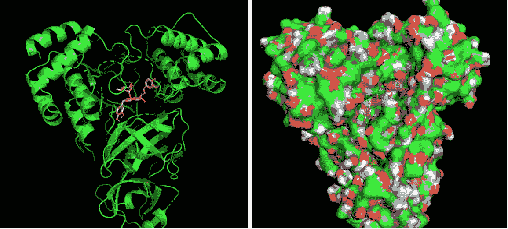
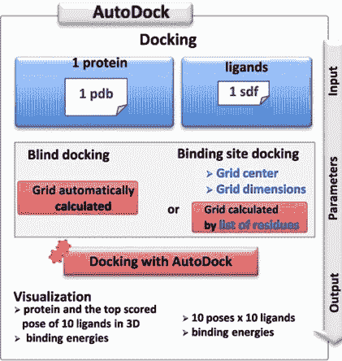
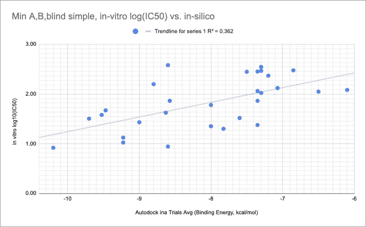
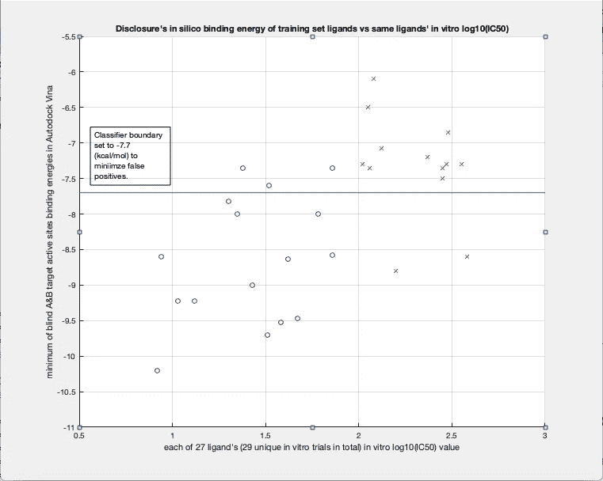
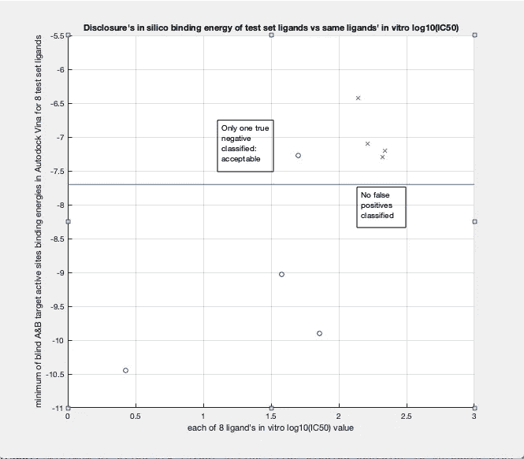

# 候选药物筛选是如何进行的？

> 原文：<https://towardsdatascience.com/how-does-drug-candidate-screening-work-f69ff02db619?source=collection_archive---------47----------------------->

## 数据科学家入门。

**一种化合物(“配体”)停靠在酶蛋白中(左:“卡通”视图，右:“表面”视图)。**资料来源:EMSKE Phytochem，软件:PyMol

当谈到药物试验时，在产生实验室(体外)和临床(体内)试验的额外费用之前，有必要列出高潜力候选人的名单。大多数制药公司在现实世界的试验之前进行“电子”筛选:他们希望尽可能以最少的“错过”成本通过“击中”筛选。

在对我们大多数[最近的](/the-forgotten-legacy-of-traditional-medicine-in-the-age-of-coronavirus-56fc6235b2f5) [关于抗病毒疗效的](/does-madagascars-covid-organics-work-74f577eb415b#adda)的背景研究中，我意识到对于数据科学家观众来说，没有很多药物对接“如何做”。数据科学武库中的这一明显差距让我感到有点难过，因为数据科学家可能是这些工具最高效的用户之一。如果有一代“生化数据科学家”挥舞着生化软件工具来解决人类最大的健康挑战，那就太好了。

如果数据科学家能够克服对使用开源工具的恐惧或不熟悉，这将是可能的。一定要接受你的生物化学家/分子生物学家/病毒学家同事，但不要陷入这样的陷阱，认为你不可能在他们的领域有独特的范围。恰恰相反，这些科学的实践者可以从你的支持中受益匪浅。从经验来看，他们中最聪明的人甚至张开双臂欢迎你。

然后，在这个池塘里放入一块早期的鹅卵石，这是我们为数据科学界准备的关于药物对接的初级读本，通过我们将这些工具应用于一个特定的应用——病毒学——的方法来说明。

## 背景

在 EMSKE，我们开发了一种自动筛选过程，以在计算机上分析新型冠状病毒冠状病毒的主要蛋白酶(“Mpro”)的候选植物化合物。(这种蛋白酶不要与病毒的第二种蛋白酶 PLpro 混淆)。

一个良好的抗病毒筛选释放了对靶向病毒酶进行早期、大量“赞成/反对”指示的能力。为什么针对主要的蛋白酶？只要一种安全的候选药物(在体外证明对这种关键酶具有抑制作用)能够通过人体代谢和跨细胞膜，那么它就可以一次性杀死病毒。当然，这不是唯一值得靶向的病毒蛋白，但它是比尖峰抑制剂更好的选择，在尖峰抑制剂中，你需要处理多个尖峰，才能对其进入细胞产生任何效力。

## 计算机筛选基础

我们的屏幕位于一个名为 [Autodock Vina](http://autodock.scripps.edu/) 的药物对接工具之上。Autodock 和 Autodock Vina 是由斯克里普斯研究所推出的[开源工具。它植根于机器学习，使用](http://vina.scripps.edu/)[梯度下降](https://ml-cheatsheet.readthedocs.io/en/latest/gradient_descent.html#:~:text=Gradient%20descent%20is%20an%20optimization,the%20parameters%20of%20our%20model.)来寻找符合的、极性吸引的候选化合物“姿势”,以符合正在研究的任何蛋白质受体位点。十多年来，Autodock 系列对接软件[已被生命科学研究人员广泛应用于筛选已出版的生物化学文献。Vina 是 Autodock 的成本函数和得分细化，与原始 Autodock 相比，它提高了命中失误的准确性，并显著提高了计算速度。以下是自动对接工具的一般工作流程:](https://en.wikipedia.org/wiki/AutoDock)

自动对接流程图(来源: [MTIOpenScreen](https://bioserv.rpbs.univ-paris-diderot.fr/services/MTiOpenScreen/) ，( [CC BY 4.0](https://creativecommons.org/licenses/by/4.0/legalcode) )修改为通用自动对接)

1.  下载[自动对接 Vina](http://vina.scripps.edu/download.html)
2.  从[蛋白质数据库](https://www.rcsb.org/pdb/static.do?p=general_information/web_links/databases.html)下载(较大的)pdb 文件。
3.  从在线数据库下载 3D SDF 格式的化合物(称为“配体”)，通常是 P [ubChem](https://pubchem.ncbi.nlm.nih.gov/) 或 ZINC。
4.  为了让 Autodock Vina 与它们一起工作，您需要将化合物和配体转换成。pdbqt 格式。转换是通过 Scripps 网站的 [MGLTools 下载页面](https://ccsb.scripps.edu/mgltools/)中的一个工具包完成的(如果你是 Mac 用户，你会希望确保在未升级的 32 位 Mac OS 版本上运行它)。
5.  使用 MGLTools 的 prepare_receptor4.py 将蛋白质 pdb 文件转换为。pdbqt 我们更喜欢使用 obabel(不幸的是，obabel 是它自己的安装成果，但是对于 Mac 用户来说，babel 是一个令人愉快的前端)和 prepare_ligand4.py 的组合来转换。sdf 文件转换成。pdb 以及随后的。pdbqt 分别。

现在你几乎准备好做对接运行！剩下要整理的项目是搜索框。Vina 通过迭代 3D 位置、方向和配体旋转键构象的多维空间进行梯度下降搜索。它在用户以埃为单位指定的三维体积搜索框内搜索。用户还指定搜索的中心。总的来说，这些参数允许选择“盲”搜索，即包含整个蛋白质的搜索体积(我们使用 150 埃)。对于与活性位点的靶向对接，更紧密的搜索体积(我们使用 30 埃)缩小了搜索范围并加快了计算速度。

使用像 [PyMol](https://pymol.org/) 这样的 3D 可视化程序，很容易确定盲对接的坐标(通常是蛋白质的估计几何中心)。对于目标站点，只需打开人类可读的 pdbqt 文件本身，并找到目标站点感兴趣的氨基酸。活性位点的氨基酸是从感兴趣的蛋白质的公开文献中确定的。对于 SARS-CoV 的 Mpro，我们通常查看由 A-组氨酸-41&A-半胱氨酸-145 定义的活性位点。(“A”是指结合形成该酶蛋白整体的两条氨基酸链中的一条)。

根据配体-蛋白质复合物能级定义的成本函数梯度下降，Vina 迭代配体相对于蛋白质表面的位置、旋转和结构姿态。它不是直接考虑配体分子和蛋白质受体表面上相反电荷的吸引力，而是成对地观察配体和受体之间在给定姿势下产生的原子键。Vina 根据-4 到-12 的范围生成结果(形式上:以每摩尔千卡为单位)。换句话说，像 Autodock Vina 这样的对接软件是从最小化一组化学键的“能量水平”的角度来考虑的，这些化学键是由化合物对蛋白质受体位点的姿态决定的。

我们对 Vina 的应用基本上保持了这一规模，但应用了一些基本逻辑，并对蛋白质受体位点的组合进行了适当次数的试验。这样，我们的结果(负数越大，抑制性越强)可能更好地反映了一种化合物击败病毒自我复制能力的倾向，如下图所示。

# 我们如何有效地将这一工具应用于冠状病毒的主要蛋白酶？

当早期的 SARS 病毒在 2003 年首次袭击时，在随后的几年中，研究人员有足够的时间和资金对病毒的主要蛋白酶 Mpro(在早期的 SARS 文献中通常称为 3CLpro)进行体外抑制研究。研究人员正在研究确定哪些化合物可以抑制这种蛋白酶在培养皿中的生长(称为体外*)。*

*为什么以蛋白酶为目标？因为它能一次性杀死病毒。蛋白酶作为靶标的功效已经得到了很好的确立，特别是得益于 20 世纪 90 年代出现的 HIV 蛋白酶抑制剂。*

*关键的是，SARS 2003 冠状病毒与目前的 2019 冠状病毒非常非常相似。这两种病毒的主要蛋白酶在氨基酸序列上有 95%的同一性，主要区别在于它们的三维折叠结构。*

*将体外结果视为我们的“真理来源”,我们将我们对 2003 年 SARS Mpro 的 Autodock 研究结果与自该流行病以来 16 年间研究人员的体外结果进行了逐个化合物的比较。然而，很难知道在现实生活中，体外研究人员设法将他们的抑制化合物结合到哪个目标位点。就像一种真正的化合物可以结合到不同的位点并有可能抑制一样，我们也可以在不同的位点靶向自动对接。*

*因此，我们必须探索自动对接目标结果的不同组合。通过比较盲法、A 和 B 对接研究的组合结果(首先是单独的，然后是彼此不同的组合)并与相同化合物的真实体外数据进行比较，我们得出了以下与真实数据相关性最高的组合:*

**

*经处理的 Autodock 结果与体外研究的相关性*

*我们获得了 0.362 的 R，这是一个对于生化病毒学研究来说并非非典型的[值。](https://pubmed.ncbi.nlm.nih.gov/20504163/#&gid=article-figures&pid=figure-1-uid-0)*

# *形成分类器的时间*

*有了相关性，我们现在可以开发一个[分类器](https://en.wikipedia.org/wiki/Statistical_classification#:~:text=In%20the%20terminology%20of%20machine,correctly%20identified%20observations%20is%20available.&text=An%20algorithm%20that%20implements%20classification,is%20known%20as%20a%20classifier.)，用于将抑制性的‘命中’配体与无价值的‘缺失’配体分开。*

*体外研究人员将任何抑制浓度为 100 uM(微摩尔)或更低的化合物视为体外“命中”的低端截止值。这相当于 log10 值为 2.0。因此，我们通过将模拟的 27 种化合物针对相似的原始 SARS (2003)冠状病毒 Mpro 的多个活性位点的 Autodock Vina 结果与相同化合物的那些实际的体外实验室抑制结果进行比较，来训练我们的分类器。我们对几个活跃网站的 Vina 结果进行了最符合实际的表述，得出了以下命中失误图表:*

**

*Autodock Vina 结果的 ML 分类器的 27 种化合物训练集适用于 SARS-2003 化合物*

*受益于这个训练集，我们分析了我们的 Vina 结果公式对一个额外的 8 化合物测试集。分类器证明，任何具有 **-7.7 千卡/摩尔分数**或以上的物质都应被归类为“击中”。*

**

*我们的 ML 分类器对另外 8 种化合物的测试结果，也是基于 SARS-2003。*

*我们的 ML 分类器对另外 8 种化合物的测试结果，也是基于 SARS-2003。*

*基于测试集，我们的分类器显示了 87.5% 的分类准确率**。***

## *离别的思绪*

*请考虑鼓励你自己准备好工具，在家尝试你自己的对接研究。在野外有许多感兴趣的病毒酶(和正常的生化过程蛋白),人们可以尝试与之对接。如上所述，通过将结果与已公布的真实体外研究结果进行比较，确保你的模拟是有根据的。你想把假阳性和真阴性保持在最低限度，但是谦逊要求你接受即使这样也会有一些假阳性和真阴性。*

*正如本文开头提到的，即使你有了体外 hits，仍然需要对摄入的任何物质应用整个药代动力学建模过程(这被称为 [ADME 建模](https://en.wikipedia.org/wiki/ADME#:~:text=ADME%20is%20an%20abbreviation%20in,pharmaceutical%20compound%20within%20an%20organism.&text=Sometimes%2C%20liberation%20and%2For%20toxicity,LADME%2C%20ADMET%2C%20or%20LADMET.))，以及细胞膜进入建模，以防你的候选药物需要进入细胞内部。甚至还有[药物相互作用模型](https://www.nature.com/articles/d42473-019-00099-3)来避免药物在人体内的意外后果。这些工具比药物对接处于更早的成熟水平，但也许配备生化设备的数据科学家可以帮助这些努力更快地达到成熟。*

*但总的来说，计算机是运行模拟生化分析的一个非常安全的环境。(到了得出结论和开始实验室测试的时候，问题就开始了)。但是在你达到那一点之前，无论如何，D̶o̶n̶'̶t̶在家里试试这个。*

*正如全球毒品码头工人喜欢说的那样— —“对接愉快！”:)*

**作者想要感谢 1 .开源软件 Autodock、Vina、MGLTools 的创始人和贡献者 2 .MTiOS 主持的对接计划；第三。英国剑桥大学蛋白质晶体学博士余伟臣，致力于* [*跨越*](https://www.eurekaselect.com/84945/article/computational-resources-protein-modelling-and-drug-discovery-applications) [*几十年来*](http://scripts.iucr.org/cgi-bin/paper?S0021889895013732) *构建意识的计算药物对接工具。**

**9 月 3 日更新:之前的描述称 Vina 考虑了受体和配体之间原子对的极性。事实上并非如此；相反，Vina 根据两个原子之间形成的键的类型进行评分，但没有执行基于物理学的原子之间的极性模型。这是有意的，因为它* [*比 Vina 开发之前基于物理的模型更好地匹配了真实世界的蛋白质-配体结合亲和力*](http://vina.scripps.edu/manual.html) *。**