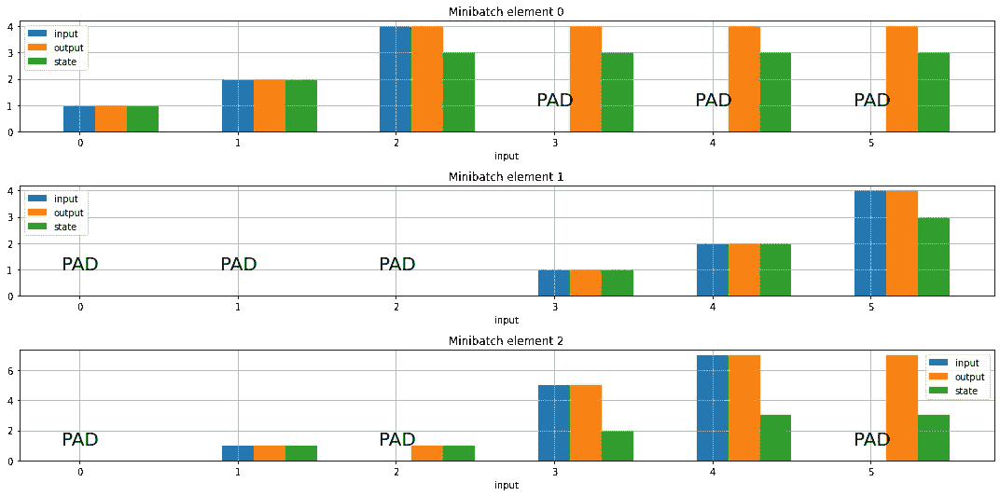

# RNN(及其变体)中的屏蔽是如何工作的，为什么

> 原文：<https://towardsdatascience.com/how-does-masking-work-in-an-rnn-and-variants-and-why-537bf63c306d?source=collection_archive---------30----------------------->

## Keras 有一个掩蔽特性，在 RNNs 中经常提到。在这里，我给出了一个快速的可视化来展示它做了什么，并解释了为什么需要这样做。

如果你正在阅读这篇文章，你可能知道为了计算效率以及减少梯度下降路径中的太多随机性，学习是分批进行的(出于某种原因被命名为小分批)。如果您正在处理序列，那么在大多数情况下，序列的长度不会相同，然后要进行批处理，您需要对序列进行“0 填充”。这可以在序列的开始或结束时完成。

现在，如果你在这样的小批量上学习，你的系统最终会学习忽略 0 填充的条目，但这将浪费学习周期。因此，你应该用这个来帮助你的算法。

在 Keras 中，您可以通过向支持它的层提供遮罩来打开遮罩，嵌入层甚至可以生成这样的遮罩。您可以在[张量流指南](https://www.tensorflow.org/guide/keras/masking_and_padding)中找到详细信息。

在这篇短文中，我将帮助您直观地了解 RNNs 及其变体中掩蔽的作用。

我们认为迷你电池

```
inputs=tf.constant([[1,2,4,0,0,0],
                    [0,0,0,1,2,4],
                    [0,1,0,5,7,0]
                   ])
```

如上所述，第一个元素是“后填充”，第二个是“前填充”，第三个是随机插入 0 的序列。我们将看到掩蔽对这三者的影响。

我们制作一个普通的 RNN 单元，它通过给状态加 1 来修改状态，并输出输入和 new_state 元组。这是非常不现实的，但将有助于我们想象在喀拉什发生了什么

```
class TrivialRNNCell(keras.layers.SimpleRNNCell):
    def call(self,inp,state):
        next_state=state[0]+1.
        return (inp,next_state), next_state
```

最后，我们使用 Keras 的函数式 API 制作了一个非常简单的模型

```
inputs=keras.layers.Input(shape=(None,1))
mask = keras.layers.Lambda(lambda inputs: K.not_equal(inputs,3))(inputs)
seq,state=keras.layers.RNN(TrivialRNNCell(1), return_sequences=True,return_state=True)(inputs,mask=mask)
model=keras.Model(inputs=[inputs],outputs=[seq,state])
```

该模型将小批量作为输入，并将 RNN 输出和状态作为输出。



正如你在上面看到的， ***所有被屏蔽的值都被忽略，那些时间步长的输出和状态只是从最后一个非屏蔽状态复制过来的。***

为什么会有这种行为？对于一个最后被填充的序列，很容易看出我们想要的 RNN 隐藏状态是最后一个有效(非填充)输入步骤的状态。这正是第一个例子中发生的情况。如果我们在开始时填充了一个序列，那么默认状态将继续，直到遇到第一个相关状态，这就是第二个示例中发生的情况。第三个例子在处理缺失数据时可能有用，在这种情况下，插补方法是简单地结转最后的结果(这是与时间序列数据相关的因果插补)。

这部分总结了我想在这里说的，但请阅读张量流指南，看看掩蔽还有什么作用。一般来说，您还希望确保损失函数只考虑实际数据(而不是填充产生的虚假数据)，而掩码对此很有用。此外，在注意机制中，你要注意与此相关的真实数据掩蔽。事实上，我是在全神贯注地为一个编码器-解码器架构编写代码时产生了这篇文章的想法。最后，掩蔽也与[保持因果关系](https://www.tensorflow.org/tutorials/text/transformer)相关。