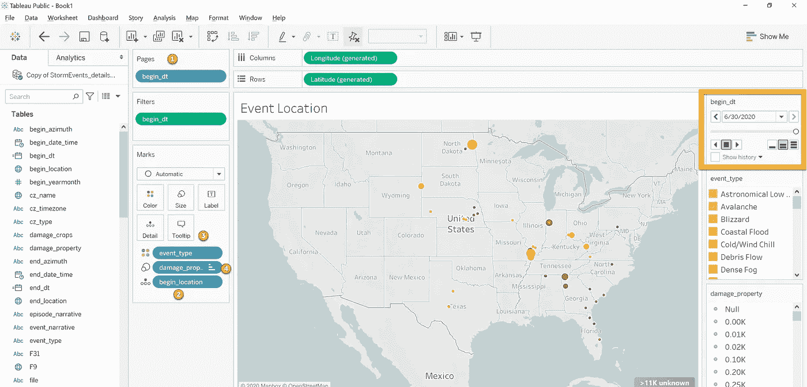
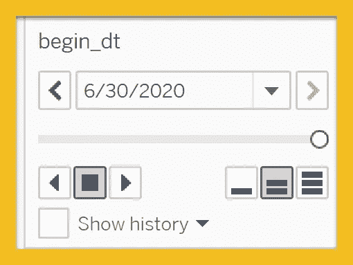
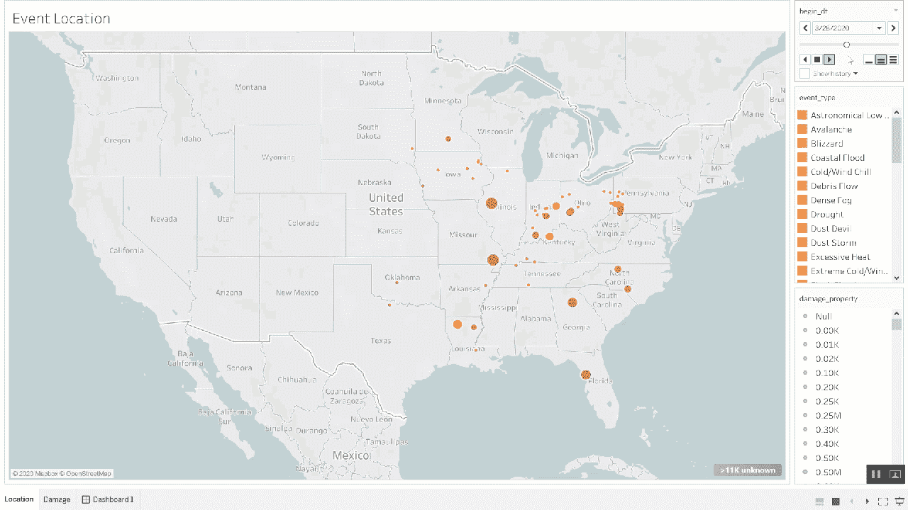

# 恶劣天气如何影响您的客户？

> 原文：<https://towardsdatascience.com/how-does-severe-weather-affect-your-customers-26144b95642c?source=collection_archive---------29----------------------->

## 如何创建风暴事件的动画可视化

图片由 [Free-Photos](https://pixabay.com/photos/?utm_source=link-attribution&utm_medium=referral&utm_campaign=image&utm_content=1245929) 来自 [Pixabay](https://pixabay.com/?utm_source=link-attribution&utm_medium=referral&utm_campaign=image&utm_content=1245929)

我们经常被要求寻找关于客户的新见解。有时我们得到指导，有时我们被告知开发一些“新”的东西。

我想建议把恶劣天气作为一层数据。如果客户所在地区正在经历极端天气事件，他们的行为会发生变化吗？他们会在网上购物、平衡投资资产配置、阅读电子邮件、联系呼叫中心或注册新的数字产品吗？不同的天气事件是否与特定的客户行为相关？您能够根据天气预报预测未来的客户活动吗？这有业务用例吗？

所以你的基础数据就是你的客户业务数据。“Flair”是天气数据。

天气数据可能很难掌握，但我确实有一个对我很有用的来源。国家环境信息中心是一个有用的资源。可以下载。您要分析的时间段的 csv 文件。

 [## 风暴事件数据库

### NCEI >风暴事件数据库批量数据下载该数据库目前包含从 1950 年 1 月到 2020 年 6 月的数据，如…

www.ncdc.noaa.gov](https://www.ncdc.noaa.gov/stormevents/ftp.jsp) 

对于这个例子，我提取了 2020 年的恶劣天气事件细节。

数据字典—作者截图

我将这些信息加载到 Tableau Public 中。Tableau Public 对你我都是免费的！

以下是我制作 viz 动画的一些关键步骤。

如何设置动画—作者截图

1.  在页面架上，放下事件的数据。这将添加一个特殊的动作框，你可以点击播放。添加日期序列将按增量(在本例中为天)遍历数据，显示所请求的数据。
2.  为了激活地图选项，我在图表中添加了 begin_location。该数据将事件的位置放置在地图上。
3.  我对事件类型感兴趣。您还可以将事件类型添加到过滤器架，以关注特定情况，如龙卷风、洪水、飓风或暴风雪。
4.  为了增加一些严重性，我在 size 参数中加入了财产损失。伤害成本越高，圈子越大。

一旦你准备好了，你点击播放按钮，天气就开始变化了。有时候，你可以看到风暴系统从西向东沿着阿巴拉契亚山脉移动。

请随意下载该笔记本，将您的业务数据分层。我把它发表在 Tableau Public:[https://public.tableau.com/profile/dmoyer#!/viz home/2020 weather inmotion/Location](https://public.tableau.com/profile/dmoyer#!/vizhome/2020WeatherinMotion/Location)

尽情享受吧！