# 英国的新冠肺炎应对措施有多有效？

> 原文：<https://towardsdatascience.com/how-effective-is-the-uks-covid-19-response-9de2f270f794?source=collection_archive---------57----------------------->

[图像来源](https://www.cleanpng.com/png-london-skyline-silhouette-royalty-free-black-londo-122031/preview.html)

在英国封锁的第一周，一位同事分享了[这篇来自华盛顿邮报](https://www.washingtonpost.com/graphics/2020/world/corona-simulator/)的文章。我受到了疾病如何传播的伟大模拟和一些社会距离措施如何有助于减少传播的演示的启发。

作为对这篇文章的回应，我决定重新创建这些模拟，并为它们添加更多的细节。在本文中，我将讨论一些有趣的特定场景。相比之下，所有的场景都运行了相同的时间长度，但在某些情况下，这并没有足够的时间让疾病完全发展。

***作者注:*** [***马特·克鲁克斯***](https://medium.com/u/8e483050af3b?source=post_page-----9de2f270f794--------------------------------)**是一位从事数据科学家工作的数学家。他不是健康专家、流行病学家或政府顾问。虽然本文中的模拟旨在展示某些真实现象，但它们并不代表病毒对政府干预的实际反应。想了解更多关于疫情冠状病毒的信息，可以点击* [*这里*](https://www.who.int/emergencies/diseases/novel-coronavirus-2019/situation-reports) *。**

# *无响应场景*

*我看到的第一种情况不涉及政府干预。它还排除了人们产生免疫力的可能性，因此如果他们与感染者接触，可能会再次感染病毒。*

*在下面的动画中，每个点代表一个四处走动和与人交往的人。如果两个人密切接触，感染者(橙色)和健康人(蓝色)之间会发生传播。我给每个点分配了一个年龄，与英国人口的正确比例大致相同。随机应用每个年龄范围的相应恢复率，死亡率随年龄呈指数增长。*

> *我想强调的是，死亡率在模拟中被夸大了*

*在首次出现症状一周后，每个人随机地要么康复(变回蓝色)要么死亡(变红)，其概率基于与年龄相关的恢复率。这里的大部分红点将与更古老的时代联系在一起。*

**

*每个点代表一个人四处走动和与人交往。如果人们密切接触，感染者(橙色)和健康人(蓝色)之间会发生传播。红点表示死亡。*

*下面显示了每个类别中人口的比例，时间沿 x 轴增加(有意模糊，因为它不代表真实时间)。我们可以看到这种疾病传播很快，直到大多数人被感染。尽管在任何特定时间都有一小部分人没有被感染，但这种疾病仍然非常普遍。每一次再感染都有死亡的风险，一次恢复并不意味着长期存活。我们还可以看到模拟早期臭名昭著的指数增长。*

*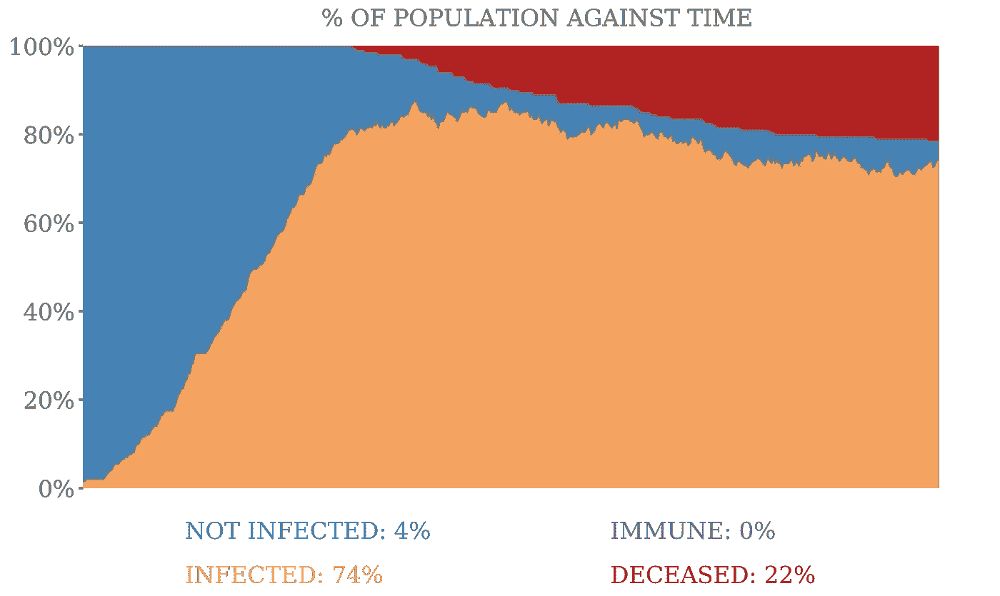*

# *免疫反应情景*

*目前的证据表明，身体*确实*产生了免疫反应，至少在短期内——这表明康复的人不会再次感染。*

*在下面的模拟人中，那些康复的人会变成绿色，并且无法感染其他人。*

*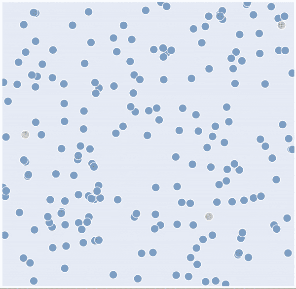*

*从下图中我们可以看到，橙色区域的初始指数增长完全相同，因为我们必须等待人们恢复，然后免疫反应才会发生(绿色区域)。橙色区域显示的是活的感染，是我们听说过的“钟形”曲线。一段时间后，剩余的种群会产生完全的群体免疫。*

*死亡率也显著下降，因为在之前的场景中，每次有人被感染时，死亡的概率*是随机的。在目前的情况下，人们只需要恢复一次就能获得免疫力。**

*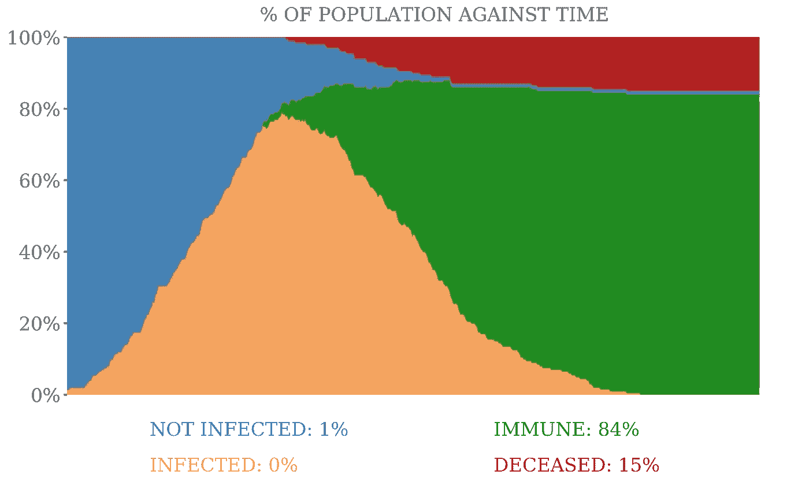*

# *自我隔离*

*英国政府的第一反应是要求出现症状的人留在室内，7 天内不要与任何人接触。这样做的一个问题是，可能需要 [5 天](https://annals.org/aim/fullarticle/2762808/incubation-period-coronavirus-disease-2019-covid-19-from-publicly-reported)症状才会出现，在此期间，这个人可能仍然会感染其他人。*

*下面你会看到人们被感染(变成橙色),然后过一会儿就静止不动了——这是他们自我隔离，在此期间他们不会感染任何人。7 天后，大多数人产生免疫力，变成绿色，并开始再次走动。*

*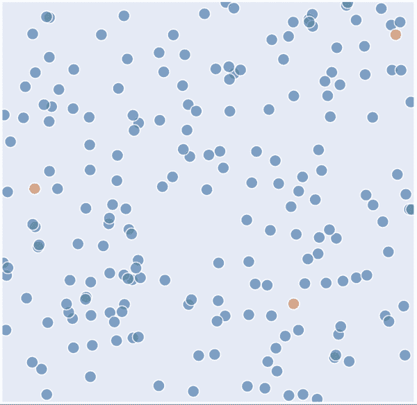*

*至少在这个模拟中，自我隔离只有轻微的影响。这可能是由于早期的快速传播——大多数人在第一次感染出现症状并开始自我隔离之前就得了这种疾病。然而，我们确实看到“钟形曲线”的峰值从 80%的感染率下降到 75%。我们还可以看到尾部向峰顶右侧延伸。*

*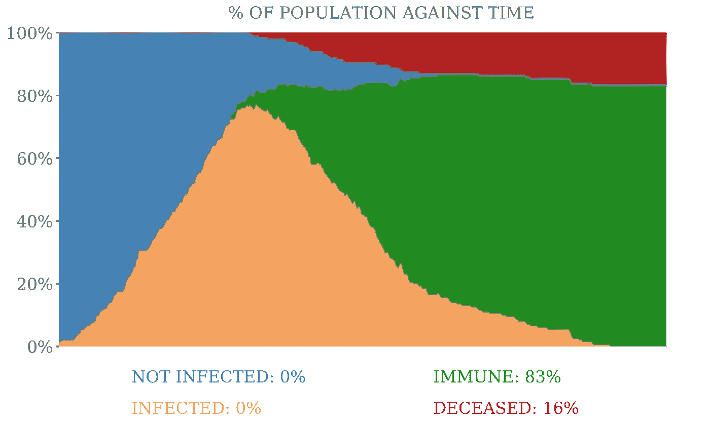*

# *社交距离*

*全球几乎每个国家的关键反应之一是社会距离——让人们保持 2 米的距离以降低传播速度。我们听说过很多关于“拉平曲线”的说法，它指的是加宽和缩短上面的橙色钟形曲线形状。*

*在下面的模拟中，我们看到最初的 3 种感染在很长一段时间内只发展成局部群集，这些群集内的人在疾病变得更广泛传播之前开始康复。*

*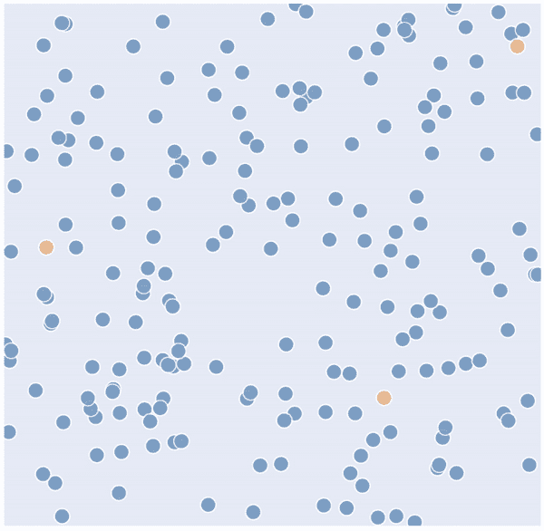*

*下面我们可以看到曲线急剧变平。现在曲线中没有明显的峰值。感染率最高可达 30-40 %,这个数字保持相当稳定——防止 NHS 同时被所有感染淹没。*

*我们也看到一部分人(10%)从未感染过这种病毒。虽然值得注意的是，模拟结束时仍有活感染(12%)。*

*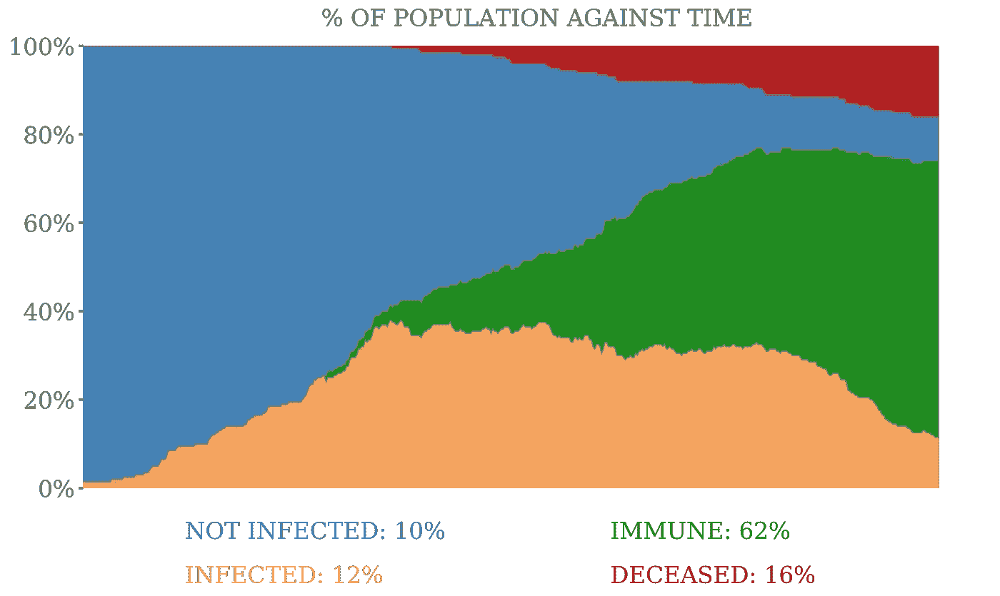*

# *无症状病例*

*事实上，症状出现平均需要 5 天时间，据信有 50%的人根本没有表现出任何症状。这似乎在儿童和年轻人中更为普遍。*

*模拟中的每个年龄都有不同的无症状可能性，老年人都有症状，只有极少数 10 岁以下的人有症状。如果我们考虑到无症状病例，那么我们将开始看到一些受感染的橙色圆点继续四处移动，并感染人们，即使他们已经开始自我隔离。*

*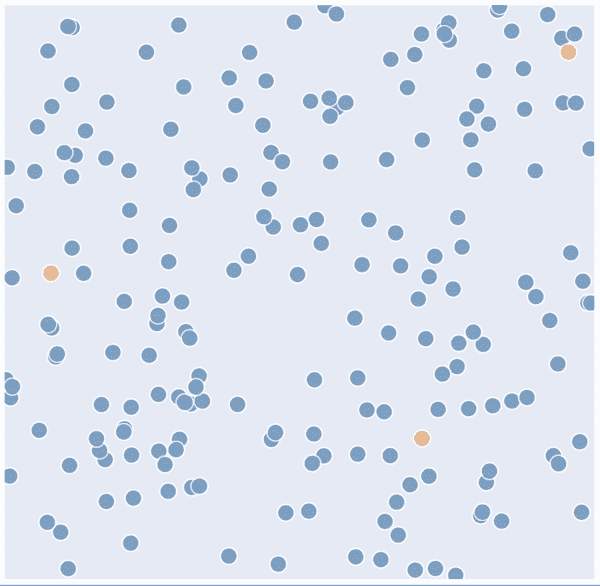*

*我们可以在下面看到，在模拟的中间区域有更多的感染，与逐渐下降到 30%相比，这段时间的感染率更稳定，为 40%。*

*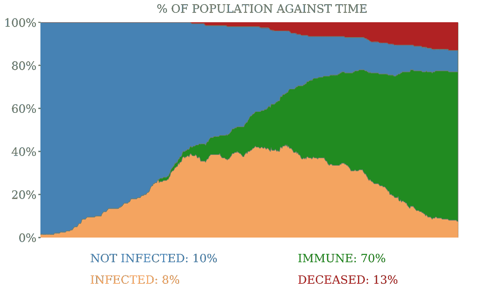*

# *学校关闭*

*学校停课对派对来说太晚了。我在上一节中展示无症状病例的影响的主要原因是，无症状病例在学龄儿童中的比例过高。我们可以通过在模拟中隔离 18 岁以下的学生来模拟学校关闭。这可以防止他们传染给其他人。在下面的模拟中，你会看到一些静止的蓝点，代表留在家中的健康儿童。*

*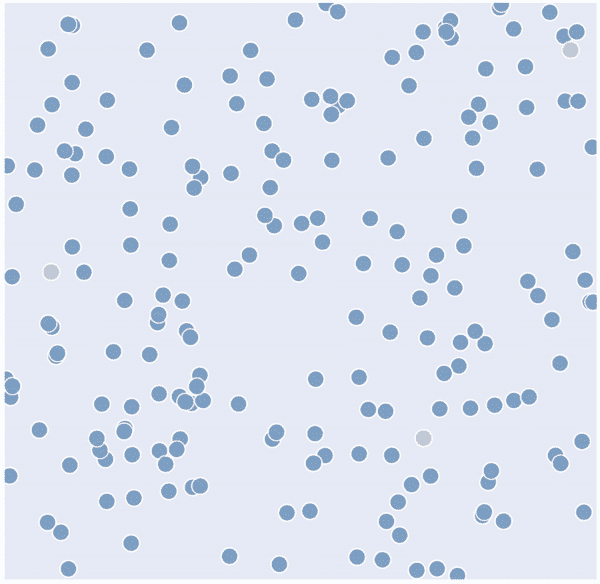*

*我们可以在下面看到，峰值再次下降到 40%以下。我们也看到病例的逐渐增加和急剧下降。这一点在避免被感染的人数中表现得最为明显，如模拟结束时的蓝色区域所示——28%的人口，相比之下，上图中只有 10%(同样，仍有活跃的感染，这可能会减少 28%)。我们还可以看到死亡率显著下降——首次降至 10%以下。*

*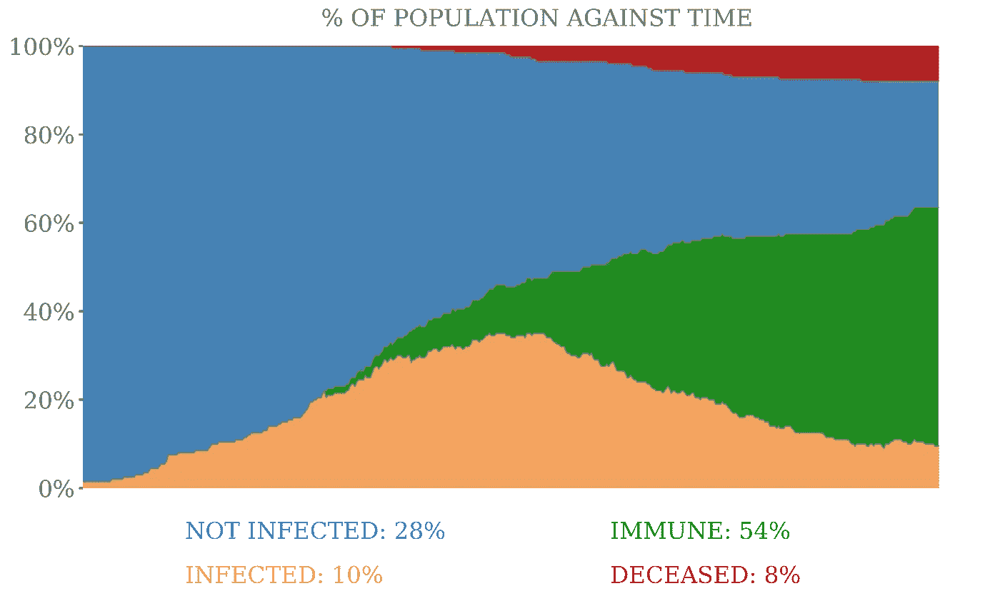*

# *保护弱势群体*

*由于新冠肺炎在社会中最脆弱的人群中引起了更严重的反应，英国政府已经要求那些最危险的人进行防护——避免与他们家以外的其他人进行任何接触。在我们的模拟中，我们可以隔离 70 岁以上的人，防止他们被感染。在模拟中，你会看到很大一部分静止的蓝点，代表 70 岁以上的老人和学生。*

*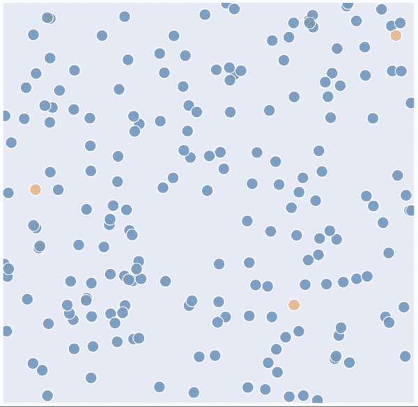*

*通过隔离 70 岁以上的老人，我们减少了四处走动的人数，从而增加了模拟中的社会距离。这将感染的峰值进一步降低到大约 25%。不过，它对死亡率的影响最为显著。通过防止这些人患上这种疾病，我们可以对死亡率产生显著的影响——在模拟中将其降低到大约 3%。*

> *我想再次强调，这些模拟中使用的死亡率是不现实的*

*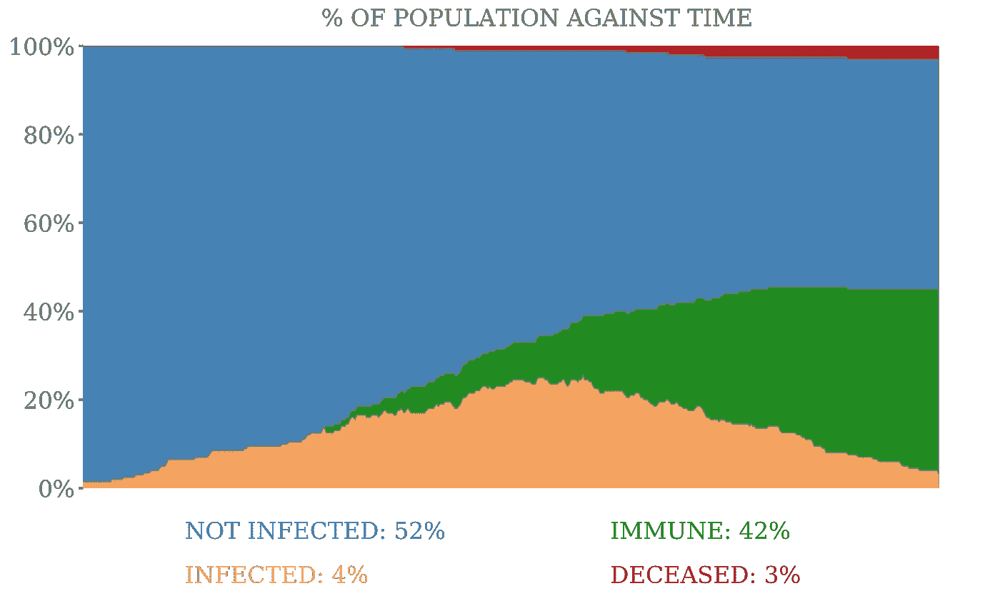*

# *结论*

*虽然这些模拟不是真实生活，但希望你能看到英国政府实施的一些社交距离措施的有效性。*