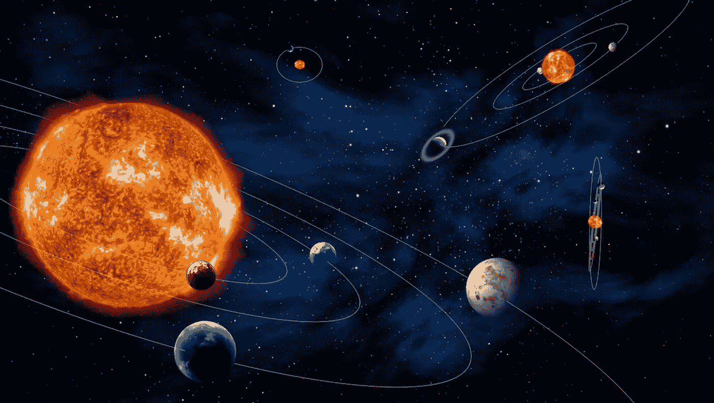
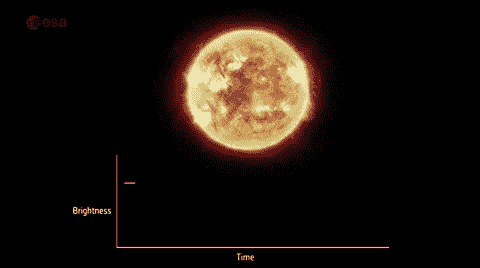
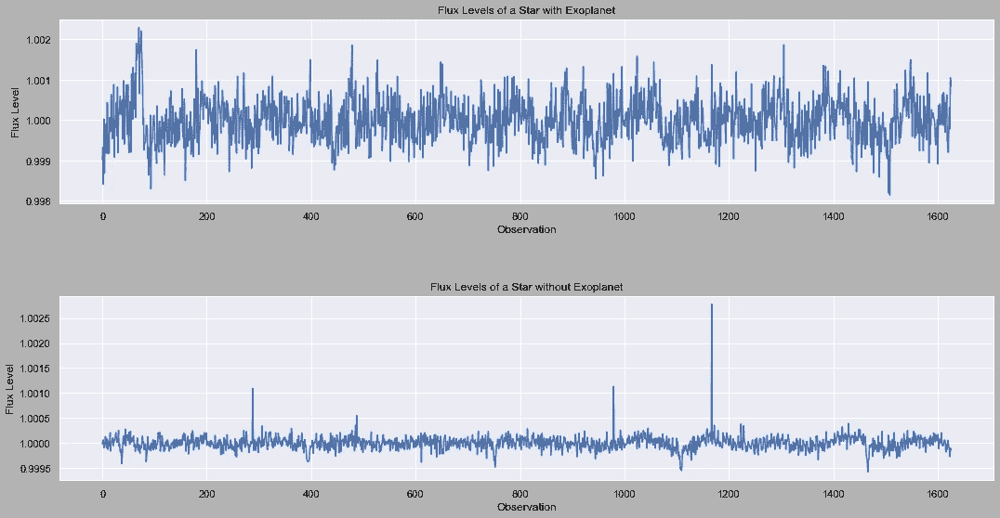
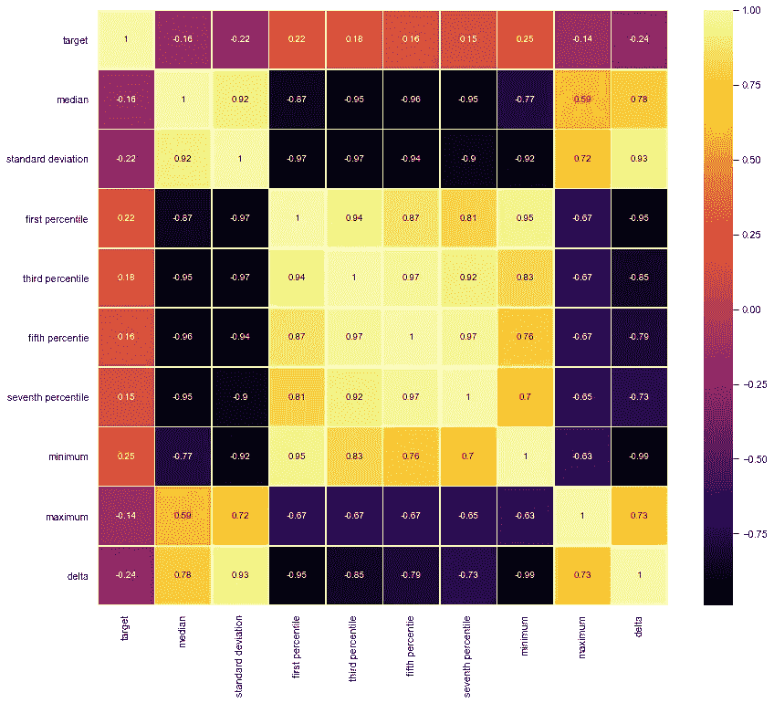
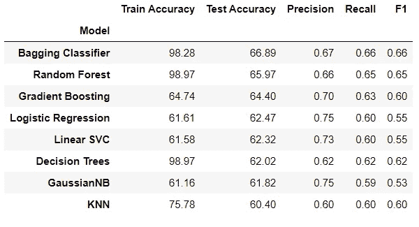
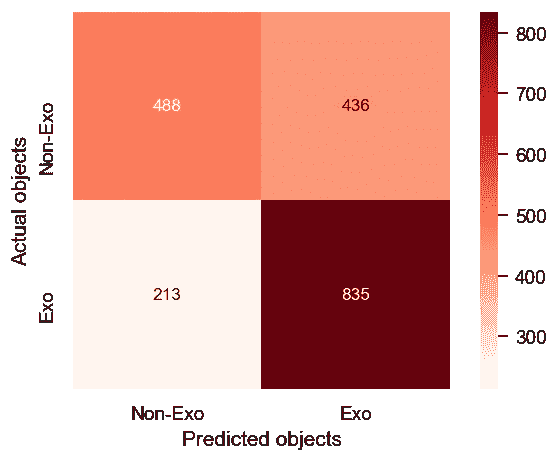

# 机器学习探测系外行星的效率有多高？

> 原文：<https://towardsdatascience.com/how-efficient-is-machine-learning-to-detect-exoplanets-78037f502b73?source=collection_archive---------26----------------------->

> *“在某个地方，一些不可思议的事情正等待被知晓。”卡尔·萨根*


照片由[格雷格·拉科齐](https://unsplash.com/@grakozy?utm_source=medium&utm_medium=referral)在 [Unsplash](https://unsplash.com?utm_source=medium&utm_medium=referral) 上拍摄

我们生活在一个其规模超出我们想象的宇宙中。这个事实让我们质疑我们在宇宙中的位置，很自然地，我们问了这个问题:“我们在宇宙中是孤独的吗？”。它确实是一个大宇宙，只是观测部分覆盖了 10 颗⁴估计的恒星和 50×10 颗与地球相似的行星。

当我看着这些数字时，我会说，“哇，除了我们的星球之外，一定还有生命。”但是，我们没有任何证据来证明这一点，除了最近在金星的大气中发现的磷化氢。尽管如此，它并不是完全可靠的。今天，在望远镜、人造卫星和计算机等技术的帮助下，我们有可能研究其他恒星周围的行星。我们正在努力寻找像我们一样的其他行星和太阳系。



版权所有:欧空局

所以，出于对天文学的好奇，我决定在 [Nasa 的系外行星档案](https://exoplanetarchive.ipac.caltech.edu/)上开发一个机器学习项目。通过这个项目，我的目标是测量 M.L 算法寻找其他行星的效率。

## 什么是系外行星？

系外行星是指在太阳系外围绕恒星运行的行星。搜寻系外行星有两个任务:开普勒，现在已经结束了，还有继续进行的 Tess 任务。这些年来，这些望远镜发现了许多系外行星。因此，我提取了观测恒星的数据集，以便找到系外行星。



版权所有:欧空局

# 第一步:数据知识

提取的 Nasa 数据集包含 9564 行和 141 列，这些列是关于恒星的特征，但我只需要每个恒星的时序通量数据。因此，我使用了`lightkurve`包来维护时序流量数据。

```
#method to gather flux data
def TFsinglestarpipe(kepid):
    try:
        tpf = KeplerTargetPixelFile.from_archive(kepid, quarter = 1)
        lc = tpf.to_lightcurve(aperture_mask=tpf.pipeline_mask)
        flat, trend = lc.flatten(window_length=301, return_trend=True)
        df = flat.to_pandas()df['KeplerID'] = kepid
        df = df.drop(columns = ['time', 
                        'flux_err', 
                        'quality', 
                        'centroid_row', 
                        'centroid_col',
                        'KeplerID'], axis=1)

        df = df.reset_index(drop=True)
        df.index.names = [kepid]
        flux = df['flux']
        array = list(flux)
        return array
    except:
        return None
```

在收集通量数据后，我得到了一个包含 7888 行和 1627 行的数据集——其中一列是 disposition feature，它指示了一颗恒星是否存在系外行星的状态。



有系外行星和无系外行星恒星的归一化通量水平。作者图片

# 步骤 2:特征工程

嗯，我的数据集是时间序列，不太适合机器学习算法，因为它有 1626 列。因此，我决定创建自己的数据集，其中包含更多的特征。
首先，我定义了具有统计显著性的特征:

```
#median flux
medians = []
for i in range(len(df)):
    medians.append(np.median(df_values[i]))
#std
stds = []
for i in range(len(df)):
    stds.append(np.std(df_values[i]))
#min flux
minimum = []
for i in range(len(df)):
    minimum.append(np.amin(df_values[i]))
#max flux
maximum = []
for i in range(len(df)):
    maximum.append(np.amax(df_values[i]))
#first percentile
frst_perc = []
for i in range(len(df)):
    frst_perc.append(np.percentile(df_values[i], 1))#third percentile
thrd_perc = []
for i in range(len(df)):
    thrd_perc.append(np.percentile(df_values[i], 3))#fifth percentile 
fifth_perc = []
for i in range(len(df)):
    fifth_perc.append(np.percentile(df_values[i], 5))  

#seventh percentile
seventh_perc = []
for i in range(len(df)):
    seventh_perc.append(np.percentile(df_values[i], 7))  

#delta
delta = []
for i in range(len(df)):
    delta.append(maximum[i]-minimum[i])
```



新约简数据集的相关矩阵。作者图片

# 步骤 3:分类模型

各种算法可用于分类任务。我从逻辑回归、朴素贝叶斯、SVC 等基本模型开始，然后跳到随机森林等集合模型。



作者图片

我的方法是，在运行完本节中的所有模型后，选择最佳模型进行优化。因此，我用默认参数运行了所有的模型，以查看结果。左图是我分类模型的结果。

我在 Bagging 分类器上得到最好的测试精度，因此我用它进行网格搜索。

```
n_est = [60, 80, 100, 120, 140, 160, 180, 200]
max_features_opt = [0.88, 0.91, 0.93, 0.95, 0.97, 0.99]param_grid = dict(n_estimators = n_est, max_features = max_features_opt)# GridSearchCV on the Bagging Classifier model to make it more robust
# Cross-validation
kf = KFold(n_splits = 10, shuffle = True, random_state = 76)
bag_grid = GridSearchCV(bag, param_grid, cv=kf, scoring='accuracy',
                      n_jobs=-1, verbose=1)
bag_grid.fit(X_train, y_train)
```

于是，我用`GridSearchCV`调了调我的模型的参数，结果得到了 65，8%的准确率分数。以下是优化模型的相关矩阵:



作者图片

# 步骤 4:结论和进一步的工作

*   我通过定义的模型得到的最好结果是大约 67%的测试准确度。
*   我可以说 M.L 模型不太擅长寻找系外行星。但这并不是彻底的失败。
*   根据特征重要性表，确定系外行星候选的最大因素是最小通量。

作为进一步的工作:

*   我计划将 TESS 数据纳入项目中。
*   视觉识别和神经模型可以添加到项目中。

此外，如果你想了解更多，也可以看看我的 [Github](https://github.com/alpercakr/Planet-Hunting-and-Habitability-Detection-with-Machine-Learning) 简介！