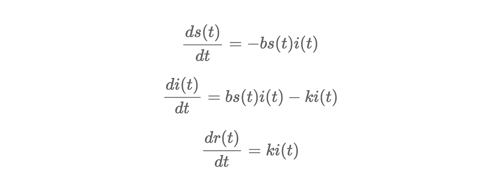
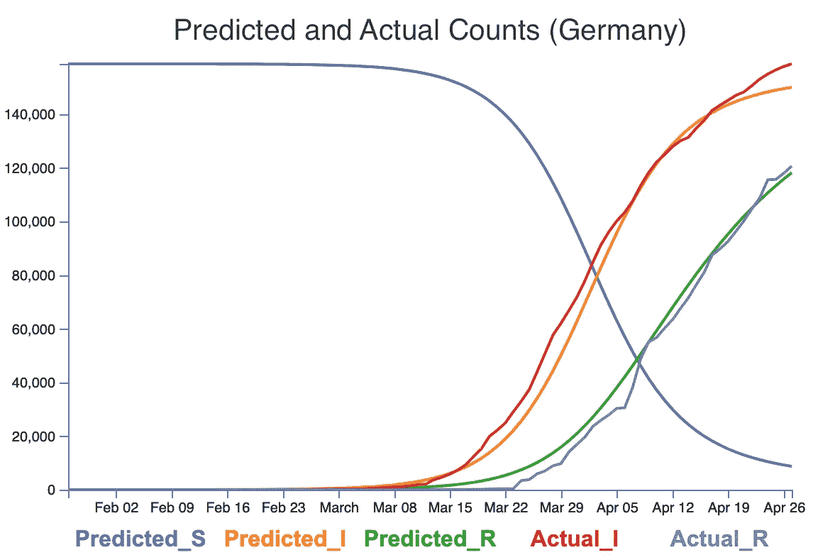
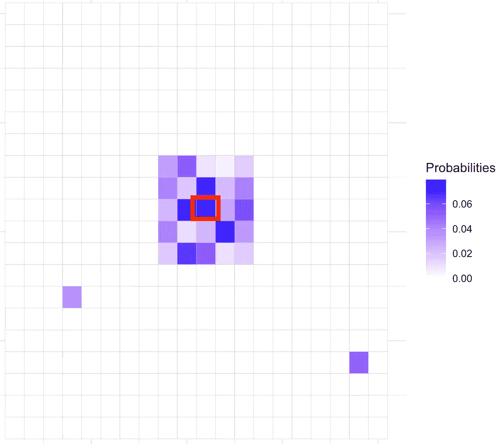
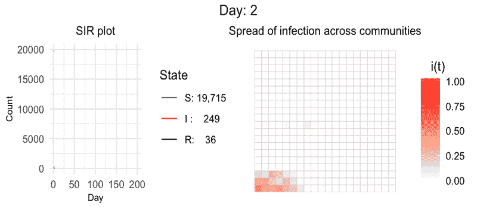
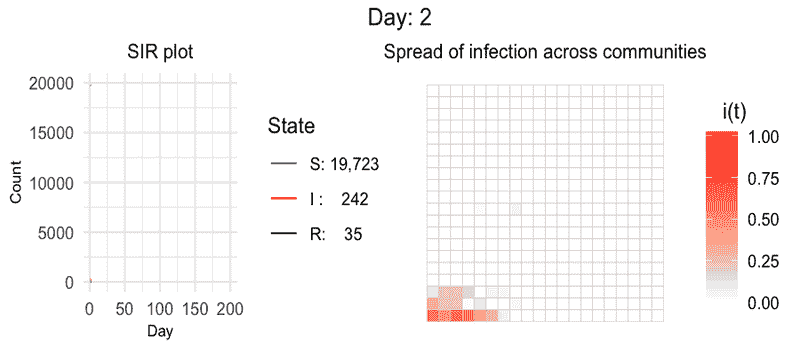
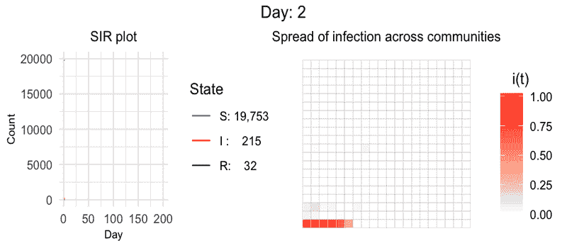
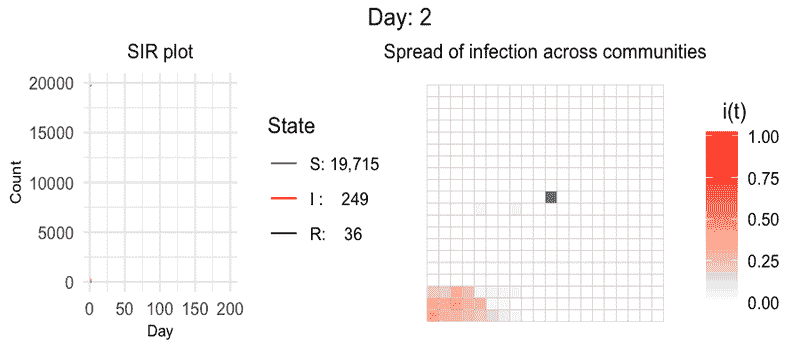
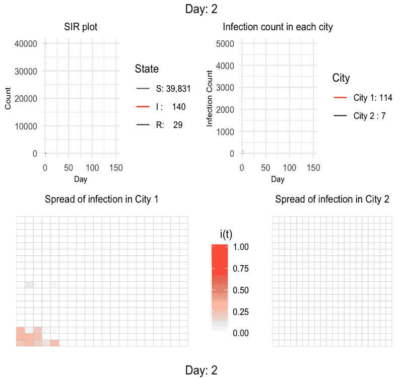
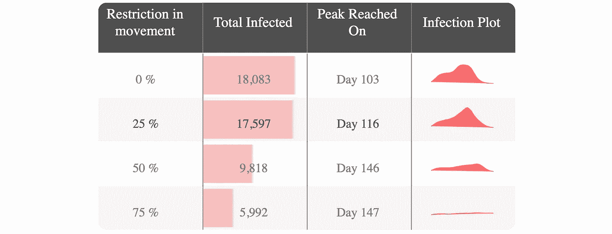

# 流行病如何呈指数传播，社会距离和受欢迎的地方如何影响它？

> 原文：<https://towardsdatascience.com/how-epidemics-spread-exponentially-and-how-social-distancing-and-popular-places-affect-it-5ca79979f988?source=collection_archive---------80----------------------->

## 使用 SIR 模型在 Python 中模拟城市内、城市间的人口流动动态以及热门地点的影响

来源:via [pixabay](https://pixabay.com/photos/test-tube-covid-19-mask-medical-5065426/)

> **免责声明:**我是数据科学家，不是流行病学家。此模拟仅用于教育目的，不用于决策。
> 
> ***编者按:*** [*走向数据科学*](http://towardsdatascience.com/) *是一份以数据科学和机器学习研究为主的中型刊物。我们不是健康专家或流行病学家，本文的观点不应被解释为专业建议。想了解更多关于疫情冠状病毒的信息，可以点击* [*这里*](https://www.who.int/emergencies/diseases/novel-coronavirus-2019/situation-reports) *。*

新型冠状病毒(新冠肺炎)的爆发在不到半年的时间里已经感染了数百万人。始于一座城市的东西被世卫组织宣布为疫情。在没有任何预防措施的情况下，这种病毒以指数方式传播，每隔几天就翻一番。

来源:我们的数据世界

这种指数式的增长是可怕的，但如果人们实行“社交距离”和其他锁定措施，这种增长可以放缓。为了理解这些行动的重要性，这里将模拟这种疾病在一个假设的城市中的传播。疾病的传播将通过 SIR 模型在划分为不同社区的几何区域内进行建模。人们可以在这样的社区之间旅行，他们的移动将使用转移概率矩阵来控制。人员移动的思想基于一阶马尔可夫链，并且移动将仅取决于他们的当前位置。通过更新转移概率，我们将模拟不同的实验。

# 什么是 SIR(易感——传染——去除)模型？

SIR 模型是研究最多和最稳健的房室模型之一，许多模型都是这种基本形式的衍生物。该模型由三个区间组成:***【S(t)】***为易感者数量，*【I(t)*为传染者数量，***【R(t)***为给定时间移除(痊愈、死亡或免疫)个体数量***【t】***。SIR 模型是动态的，因为三种状态下的个体数量随时间而变化。我们将在没有生命动力学的情况下对 SIR 进行建模，即不考虑疾病本身以外的出生或死亡，使总人口保持不变。这背后的一个想法是，像新冠肺炎这样的疾病的动力学比出生和死亡的动力学要快得多。

***S(t) + I(t) + R(t) = N(常数值)***

SIR 模型可以定义为三个常微分方程(ODE)的集合:

其中，***【s(t)******I(t)******r(t)***是在*时刻易感、感染、被清除的一小部分人群。 ***b*** 为感染率 ***k*** 为治愈率。需要注意的一点是，因为我们是在没有生命动力学的情况下建模，所以三个 ODE 的和是 0，表示没有从外部添加或删除新的群体*

**

# *感染率和恢复率的值？*

*在我们继续之前，我们将不得不估计感染率和恢复率的值。我们可以通过对这两个参数进行网格搜索来找到最优值，该最优值最小化感染和去除状态的模拟计数和实际计数之间的 RMSE。让我们先做一些假设:*

1.  *由于我们将 ***R*** 状态视为已恢复和已死亡，我们将死亡和已恢复计数相加为一个值*
2.  *我们将使用德国的数据，因为:*

*   *在撰写本报告时，德国也是检测数量最多的国家之一，并已开始检测和记录第一例患者的数据*
*   *在撰写本文时，德国已经越过了感染高峰期，在过去的一个月中，活跃病例正在下降[1]*

*在计算 RMSE 时，传染状态和恢复状态的误差将被赋予相等的权重*

**

*从上述方法中观察到:*

1.  *参数估计为***b = 0.27******k = 0.07***这意味着患者保持感染状态的平均天数约为 2 周***【1/k】***。这与恢复持续时间的实际范围一致[2]*
2.  *新冠肺炎的 ***R0*** 值或基本再现数为***【b/k】***=***3.9***。而实际期望值为***1.4–5.7***[3]*
3.  *预测计数和实际计数的曲线高度相关，并且彼此一致*

*基于以上几点，我们可以得出结论，我们的研究可以考虑估计的比率。*

# *实验—锁定*

*在下面的实验中，模拟将在一个分成 400 个社区的城市中进行(在 20 * 20 的网格中)。每个个体将属于一个社区(我们可以称之为他的家的位置),并且可以基于一些概率移动到其他社区。这些转移概率将按如下方式计算:*

1.  *对于一个给定的社区 ***i*** ，它的邻居将被存储在一个名为“ ***到*** 的列表中*
2.  *一些非邻居将被随机选择并添加到同一列表'*'中**
3.  **随机概率将被分配给列表'***-*-**'中的每个位置。这些概率将是从社区 ***i*** 移动到列表“*”中的位置的概率***
4.  ***将对所有社区重复步骤 1-3***

***例如，对于生活在社区中的一个人(用红色边框标记)，我们有以下转移概率(每个单元代表一个社区):***

******

## ***实验 1: SIR 模型，人们不受任何限制地跨社区移动。***

***在这个实验中，我们将看到如果不采取预防措施，并且允许所有人不受任何限制地旅行，这种疾病将如何传播。(要了解如何创建下面的动画，请查看下面的文章— [使用 gifski](https://apurvpriyam.github.io/animateplots.html) 制作 R 中的任何图形的动画)***

******

***不受任何限制，*90%的人在 ***200*** 天感染，其中***2437***天 ***103*** 。该图在第 50 天*左右达到第一个平稳期。在第 ***75*** 天之后，斜率再次开始增加，并在第 ***103*** 天达到峰值。在右边的动画中，我们可以看到高感染区域达到了城市网格的对角线，并且在第 ***100*** 天的右下角创建了一个新的感染热点。*****

## **实验二:25%运动限制的 SIR 模型。**

**在这个实验中，人们以 ***0.25*** 的概率留在他们的家乡社区，因此，模拟了*25%的移动受到限制的情况。***

******

***在这种情况下，*88%的人群仍然受到了感染。但是感染高峰在 ***13*** 天之后到达，剧情稍微平缓了一些。****

## **实验三:50%运动限制的 SIR 模型。**

**在这个实验中，人们以***【0.50】***的概率留在他们的家庭社区，因此，模拟了***% 50%***移动受到限制的情况。**

****

**随着 50%的封锁，我们能够减少疾病的影响，只有 49%的人口在 200 天内受到感染。一天中的最大活跃病例也减少到只有***1053***，并且发生在第 ***146*** 天(而在实验 1 中它发生在第 ***103*** )。我们可以说，限制运动一半，大大有助于“拉平曲线”。**

## **实验 4:75%运动限制的 SIR 模型。**

**在这个实验中，人们以 0.75*的概率留在他们的家庭社区中，因此，模拟了一种***【75%】***运动受到限制的情况。***

****

*****75%*** 一级防范禁闭大大减少了疾病的传播。在 200 天内只有 ***30%*** 人群感染，感染高峰值仅在**第 147 天(比未封锁病例晚 44 天)。我们还可以在热图动画中看到，传播非常缓慢。与没有封锁的第 100 天相比，75%的封锁在第 100 天几乎没有扩散，感染局限在中左部分的一小块区域。由于 100%的完全锁定是不可能的，我们可以在 75%时停止锁定分析。****

***有了这个分析，我们可以得出结论:少量的锁定 **( *25%)*** 只会少量的减少疾病的影响。但是，当我们将锁定增加到高于 ***50%*** 时，曲线变平的效果将非常显著。***

# **实验——增加一个受欢迎的位置，如超市**

## **实验五:在市中心有热门场所的 SIR 模型。**

**在这个实验中，我们将看到超市、商场等受欢迎场所的存在。影响疾病的传播。我们将在市中心增加一个这样的地方，每个人每周都会去一次。**

****

**有一个人人都去的受欢迎的地方使得病毒很容易传播到城市的各个地方。正因为如此，感染高峰出现得更早(在 ***第 66***天)，活跃病例数更高，为*3，255 例(对于实验 1，高峰出现在*第 102 天，活跃病例数为*2，437 例)。*****

***在右边的热图中，我们还可以看到中心社区(有受欢迎的地方)在一开始就被突出显示，这有助于将病毒传播到不同的部分。在 ***第 100***天，传播穿过了城市的对角线部分(而在之前的所有实验中，传播从未在第 100 天穿过对角线)。***

## **实验六:锁定热门地点后的 SIR 模型。**

**在这个实验中，我们将把受欢迎的地方(这有助于传播疾病)封锁起来，看看它如何影响传播。这意味着不允许任何人去受欢迎的地方。否则，所有人都可以自由迁移到其他社区。**

****

**中间的灰色单元格显示了这三个州中任何一个州的 0 人口的热门地点。结果几乎与实验 1 的结果相似，总感染数略有减少。**

## **实验 7: SIR 模型，热门地点是唯一允许去的地方。**

**在这个实验中，我们将只允许人们参观受欢迎的地方，其他所有活动都受到限制。**

****

**这次感染率非常低。由于每个人只被允许移动到一个地方，即使概率很低，这种疾病也得到了很好的控制。**

# **实验——双城动态**

## **实验八:两个城市之间的建模。**

**在本实验中，两个城市通过一条路线连接。感染始于 1 号城市，慢慢蔓延到 2 号城市。转移概率矩阵创建如下:**

1.  **为两个城市(TM_1 和 TM_2)随机创建转移矩阵**
2.  **两个城市的中心位置被选为他们的机场**
3.  **一个城市中所有个人去机场的概率改为 ***1/14*** (期望人们两周去一次另一个城市)**
4.  **转移矩阵按行标准化，使概率之和为 1**

****

**我们从城市 1 开始感染，然后蔓延到城市 2。我们可以看到，城市 1 的感染高峰更早，活跃病例数最高***4786***。城市 2 在城市 1 之后 40 天达到高峰，因为病毒到达那里需要一些时间。疾病的严重程度也较低，城市 2 的曲线更平坦，传播更平缓。由于在城市 2 中有单一的疾病来源，并且它与城市的所有部分相连，因此与城市 1 相比，疾病在整个城市中的传播更加均匀，这显示了类似“波浪”的现象。**

# **结论**

**我们没有要求建立准确的流行病模型，我们的目的是深入了解不同的措施和人员流动如何影响像新冠肺炎这样的传染病的传播。虽然小规模的旅行限制没有带来很多好处，但 50%及以上的限制显著减缓了传播速度，使曲线变得更平坦。这意味着，如果任何人感染了新冠肺炎病毒，需要住院治疗，将有机会获得床位和适当的治疗。在实施更持久的解决方案时，这可以是遏制疫情的一项临时措施。**

****

**不同实验的高峰日**

**[源代码可以在我的 Github 里找到](https://github.com/apxr/COVID-19Sim)**

# **参考资料:**

1.  **[世界计量仪:德国](https://www.worldometers.info/coronavirus/country/germany/)**
2.  **[WebMD:冠状病毒恢复](https://www.webmd.com/lung/covid-recovery-overview#2-4)**
3.  **[维基百科:基本繁殖数](https://en.wikipedia.org/wiki/Basic_reproduction_number)**
4.  **[如何制作剧情动画](https://apurv.page/animateplots.html)**

***原载于* [https://apurv.page](https://apurv.page/covid-19.html)**