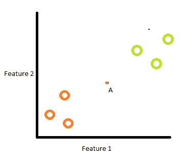
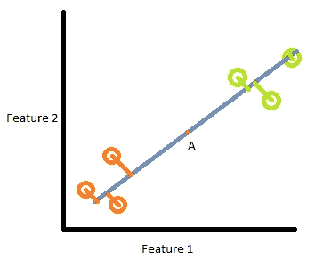
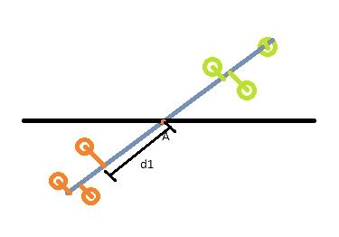
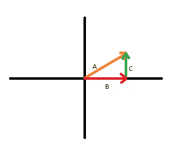
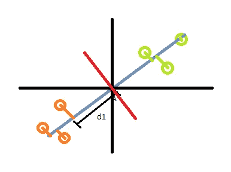

# PCA 到底是怎么工作的？

> 原文：<https://towardsdatascience.com/how-exactly-does-pca-work-5c342c3077fe?source=collection_archive---------10----------------------->

## 最简单的 PCA 指南。

照片由 [Unsplash](https://unsplash.com?utm_source=medium&utm_medium=referral) 上的 [Pritesh Sudra](https://unsplash.com/@pritesh557?utm_source=medium&utm_medium=referral) 拍摄

> 主成分分析是将大量数据压缩成抓住数据本质的东西的过程。

## 直觉

**PCA** (主成分分析)是一种在数据中寻找主要*模式*进行*降维*的技术。第一次读到这一行可能会引发几个问题:

这些图案是什么？

如何找到这些模式？

什么是降维？

维度到底是什么？

为什么要减少它们？

让我们一个一个地去看看他们。

假设我们有一个数据集，比如说，有 300 列。所以我们的数据集有 300 个维度**。干净利落。但是我们真的需要这么多维度吗？我们可以。但大多数时候，我们没有。因此，我们需要找到一种快速简单的方法，不仅删除一定数量的特征，而且在更少数量的*转换的*维度中捕获 300 个维度的数据的本质。**

## **差异**

**这 300 个特征中的每一个都有一定量的变化，即整个值的变化。如果一个特征描述了特定建筑物 200 天的楼层数，那么它的方差将为 0。因为它的值始终没有变化。方差为 0 的特征是没有用的，因为它们不提供洞察力。所以，方差的确是我们的朋友！这就是我之前提到的模式。**

**差异越大，该特性的重要性就越大。因为它包含更多的“信息”。方差为 0 的变量包含 0 个信息。不要混淆方差和相关性！方差与数据的目标变量无关。它只是陈述特定特性的值在整个数据中是如何变化的。**

## **主成分**

**现在我们知道了方差，我们需要找到一组新的转换特征集，它可以更好地解释方差。原始的 300 个特征被用来进行特征的线性组合，以便将所有的变化推入几个变换的特征中。这些变换后的特征称为主成分。**

**主要部件现在与原始特征无关。我们将从 300 个特征中得到 300 个主成分。现在 PCA 的妙处来了——新形成的变换特征集或主成分将具有第一个 PC 中解释的最大方差。第二台 PC 将具有第二高的方差，依此类推。**

**例如，如果第一个 PC 解释了数据中总方差的 68%,第二个特征解释了总方差的 15%,接下来的 4 个特征总共包含 14%的方差。所以你有 97%的方差*可以用 6 个主成分来解释*！现在，假设接下来的 100 个特征总共解释了总方差的另外 1%。现在，仅仅为了增加一个百分比的方差而增加 100 个维度已经没有什么意义了。通过只取前 6 个主成分，我们将维数从 300 减少到仅仅 6！**

## **特征向量和特征值**

**现在让我们考虑一个更简单的例子，它只有两个特征，更容易理解。下图是我们用特征 2 绘制特征 1 的情况。**

****

**PCA(具有 [SVD](/svd-8c2f72e264f) 的)所做的是，它为这些数据点找到最佳拟合线，该最佳拟合线使**最小化**数据点与其在最佳拟合线上的投影之间的距离。现在，考虑特征 1 和特征 2 的数据点的平均值。它将在 a 附近的某个地方。因此，同样地，PCA 也可以**最大化**最佳拟合线上的投影点与点 a 的距离。**

****

**移动直线，使 A 点与原点重合，这样更容易观察。**

****

**距离 d1 是点 1 相对于原点的距离。类似地，d2、d3、d4、d5、d6 将是投影点离原点的相应距离。最佳拟合线将具有最大的距离平方和。假设直线的斜率为 0.25。这意味着该线由要素 1 的 4 部分和要素 2 的 1 部分组成。这将类似于:**

****

**其中 B=4 & C=1。因此，我们可以很容易地通过毕达哥拉斯定理找到 A，结果是 4.12。PCA 缩放这些值，使得向量 A 为单位长度。因此 A=1，B=4/4.12 = 0.97 & C=1/4.12 = 0.242。这个单位向量 A 就是**特征向量！**距离 d1、d2、d3、d4、d5、d6 的平方和为**特征值。**相当直接！这就是我前面说的特征 1 和特征 2 的**线性组合**。这告诉我们，对于 PC1，功能 1 的重要性几乎是功能 2 的 4 倍，或者说，它包含的数据分布(变化)几乎是功能 2 的 4 倍。**

**现在，主分量 2 将是与 PC1 正交的向量，因为主分量之间具有 0 相关性。这就像红线一样:**

****

**根据类似的理解，PC2 将具有特征 1 的-0.242 份和特征 2 的 0.97 份。这告诉我们，对于 PC2 来说，特性 2 的重要性几乎是特性 1 的 4 倍。对于 PC2，可以类似地计算特征向量和特征值。所以我们终于找到了我们的主要成分！**

## **解释方差**

**我们计算了两个主成分的距离平方和。如果我们将这些值除以 n-1(其中 n 是样本大小)，我们将得到相应主成分的方差。**

**假设 PC1 的方差为 15，PC2 的方差为 3。因此，围绕两个主成分的总变化是 18。因此，PC1 占 15/18，相当于数据总方差的 0.83 或 83%。PC2 占 3/18，等于数据中总方差的 0.17 或 17%。这就是**解释的方差比**。这表明数据中有多少差异是由特定的主成分解释的。主成分按其解释的方差比排序。如果总的解释方差比率达到足够的值，我们可以选择前 m 个成分。**

**主成分分析降低了维数以克服过拟合。您的模型可能不需要所有的功能来提供良好的性能。它可能会给出很高的训练分数，但测试分数却很低。换句话说，它可能**过度适应**。PCA 不是特征选择或特征消除技术。这更像是一种 T4 特征提取技术。您也可以将它归入特征工程范畴。**

**这就是本文的全部内容。请参考以下优秀资源，了解更多信息:**

*   **[https://sebastianraschka . com/Articles/2014 _ PCA _ step _ by _ step . html](https://sebastianraschka.com/Articles/2014_pca_step_by_step.html)**
*   **[StatQuest:主成分分析(PCA)，逐步](https://www.youtube.com/watch?v=FgakZw6K1QQ)**
*   **[https://towards data science . com/a-一站式主成分分析-5582fb7e0a9c](/a-one-stop-shop-for-principal-component-analysis-5582fb7e0a9c)**