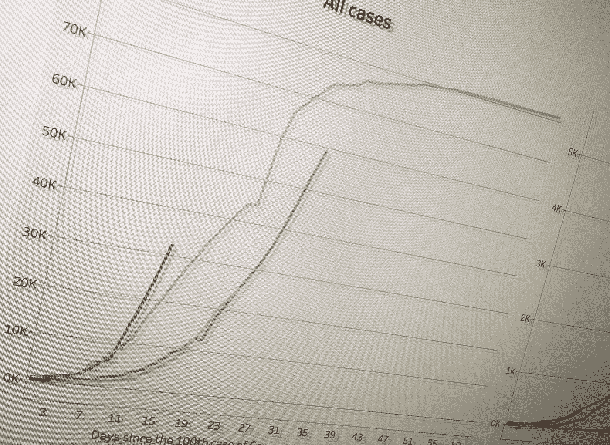
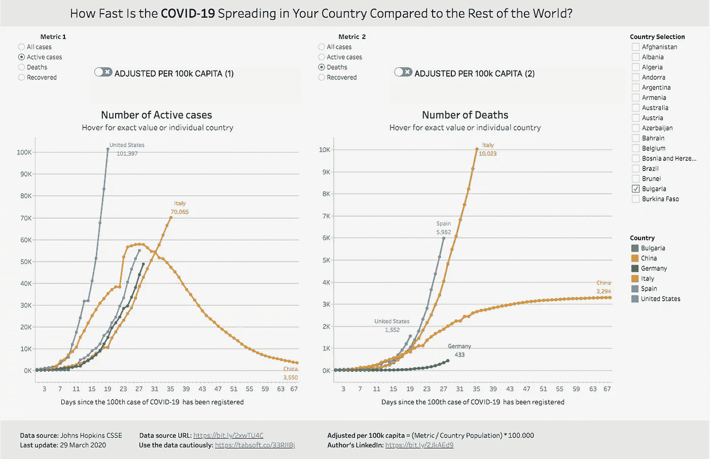
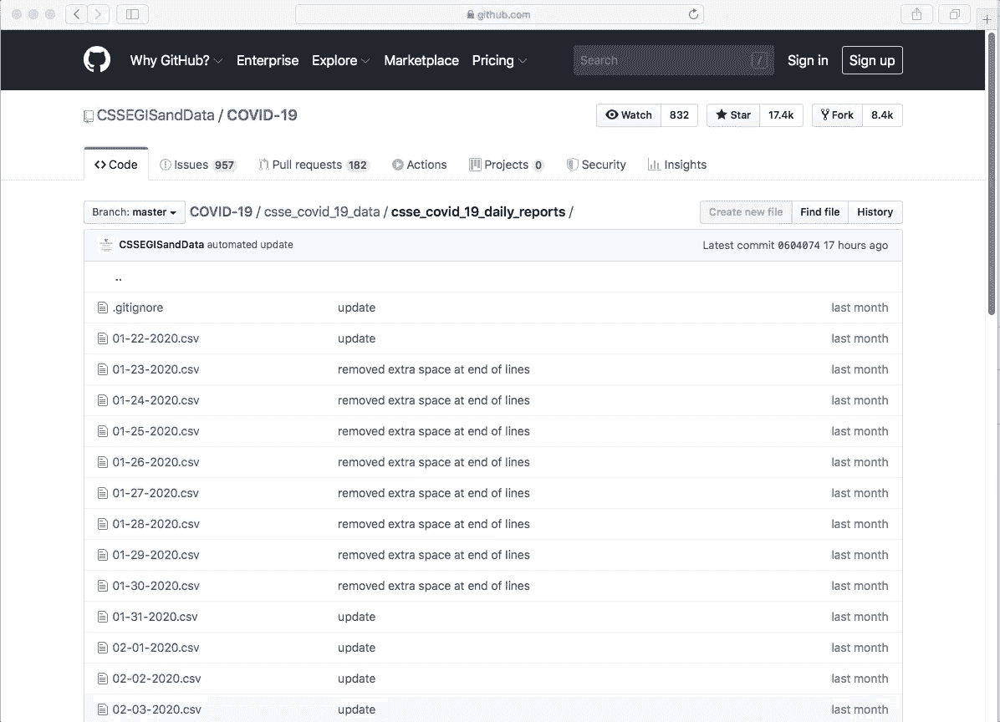
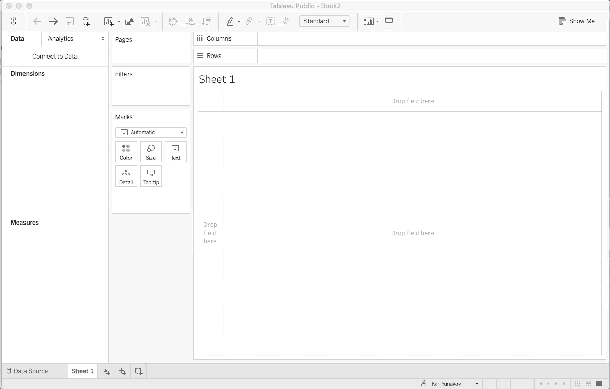
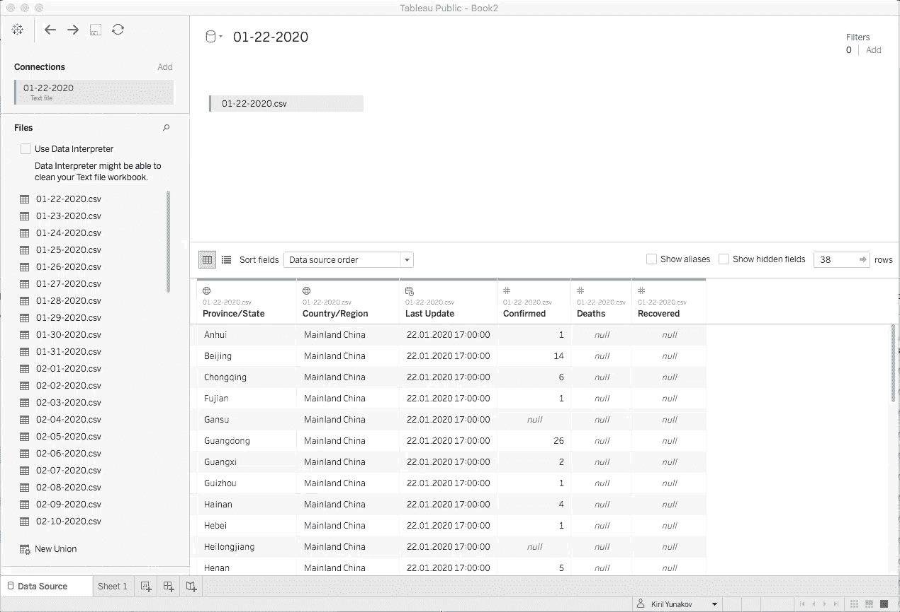
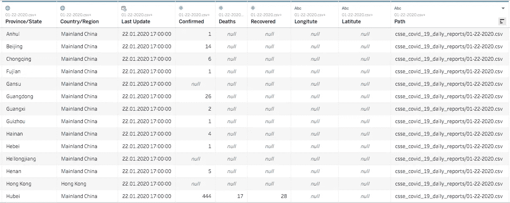
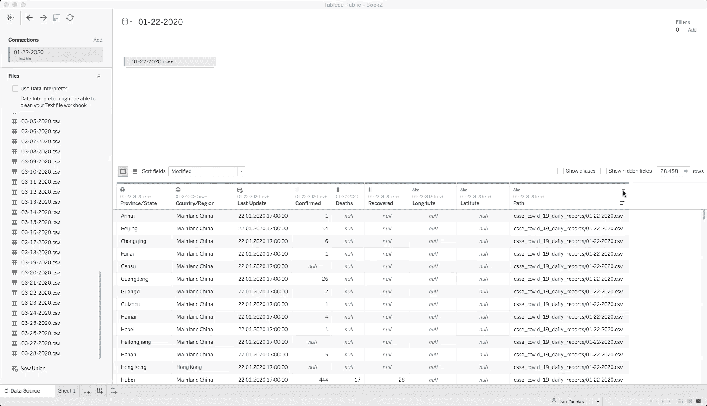
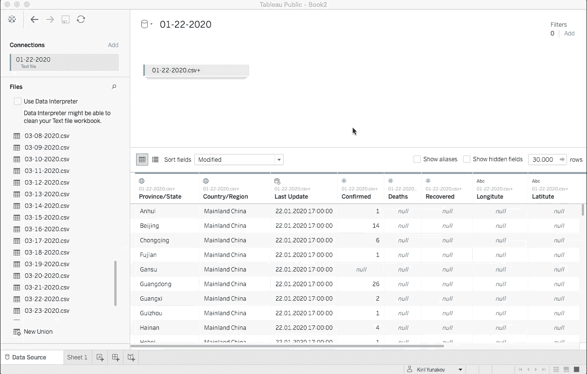
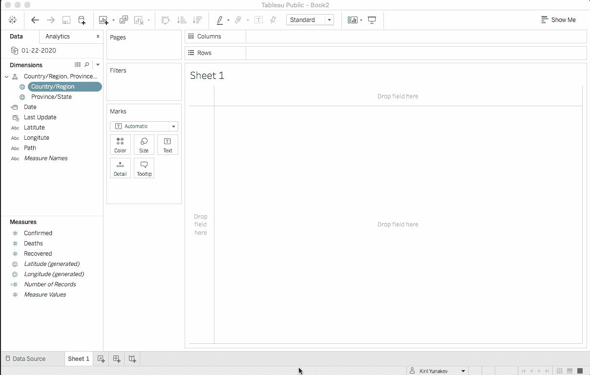
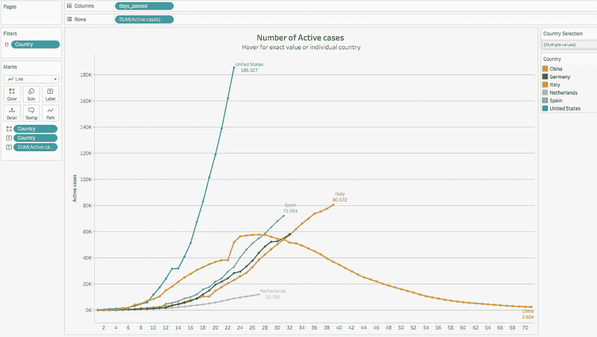

# 与世界其他地区相比，新冠肺炎在你的国家传播的速度有多快？

> 原文：<https://towardsdatascience.com/how-fast-is-the-corona-virus-spreading-in-your-country-compared-to-the-rest-of-the-world-3d22bc79c284?source=collection_archive---------38----------------------->

## Tableau 分步指南



> "与世界其他地区相比，新冠肺炎在你的国家传播的速度有多快？"

这是我几天前问自己的问题，但我找不到以一种漂亮、吸引人的方式呈现的相关信息。对我来说，能够将特定的国家列表与其他国家进行比较真的很重要。因此，我决定建造[这个仪表盘*](https://tabsoft.co/33Y9YIL) 。



基里尔·尤纳科夫的画面是冠状病毒新冠肺炎:[**https://tabsoft.co/33Y9YIL**](https://tabsoft.co/33Y9YIL)

**写完这篇文章后，我可能会改进仪表盘，但本教程的步骤仍然有效且可重复。如果没有，请不要犹豫与我联系。*

*   **复杂程度:**初级/中级
*   **完成时间:** ~10 分钟。
*   **所需软件:** Tableau Desktop ( [免费公版](https://public.tableau.com/en-us/s/))

**重要提示:**在我们进入分步指南之前，请先熟悉这些 [10 注意事项，然后再通过 Tableau 创建另一个关于新冠肺炎](https://www.tableau.com/about/blog/2020/3/ten-considerations-you-create-another-chart-about-covid-19)的图表。

# 第一步。获取数据

您可以通过各种渠道获取这些数据。对我来说，最快最简单的方法是通过 [GitHub 应用](https://desktop.github.com/)，然后连接到[约翰·霍普斯金 GitHub 库](https://github.com/CSSEGISandData/COVID-19)。

您可以在 [Tableau Covid-10 数据中心页面](https://www.tableau.com/covid-19-coronavirus-data-resources)探索其他方法。例如通过一个*。亢奋，*。CSV 文件，网络数据连接器，谷歌表和其他。所有数据源的分步说明可在[这里](https://community.tableau.com/docs/DOC-24246?_ga=2.32163134.1603057028.1584777777-590902995.1584777777)找到。

另一个快速而肮脏的方法是打开约翰·霍普斯金日报回购，直接从[那里](https://github.com/CSSEGISandData/COVID-19/tree/master/csse_covid_19_data/csse_covid_19_daily_reports)下载几个 CSV 文件。对于本教程的目的来说，这也是绝对足够的。



手动下载*。来自约翰·霍普斯金 GitHub 库的 CSV 文件

# 第二步。在 Tableau 中导入数据

*如果您已经建立了与数据源的直接连接，您可以跳过这一步。*一旦我们有了所有需要的文件，我们就可以在 Tableau 中导入它们。为了做到这一点:

1.  打开**的画面**
2.  点击**连接到数据**
3.  通过选择一个文件连接到一个文本文件

****

**在 Tableau 中导入 CSV 文件**

# **第三步。将所有文件合并到一个数据源中**

**一旦我们在 Tableau 中有了所有可用的 CSV 文件，那么我们就可以继续将这些文件合并/组合到一个专用的 **Tableau 数据源**中。换句话说，我们将所有文件的所有行合并到一个文件中。在 Tableau 中，这个操作被称为 **Union** ，它与 SQL 的 [UNION ALL](https://www.techonthenet.com/sql/union_all.php) 完全相同。通常，当我们知道文件中的所有列都具有相同的名称/结构时，就会执行此操作。**

1.  **点击导入的表格并选择**转换为联合**。**
2.  **选择**通配符(自动)，点击**点击**确定****

****

**将所有文件合并到一个数据源中**

# **第四步。数据争论**

## **步骤 4.1 检查数据**

**我们需要知道的第一件事是熟悉数据集。您可以在**数据源**选项卡的表格概览窗格中看到相应列的数据示例。**

****

**数据的样本**

**值得注意的是您可以看到日期数据的两个特殊字段:**

*   ****上次更新** —这是关于上次更新该文件的信息。特别是在新冠肺炎爆发之初，有许多病例被删除或后来被添加。这意味着我们**不能**使用这个字段作为日期字段。**
*   ****路径** —该字段包含文件的路径信息，包括文件名。在这种情况下，它是该报告的创建日期。然而，字段的数据类型不是日期类型，但是我们将使用它来创建一个日期类型。**

## **步骤 4.2 为日期创建计算字段**

**为了基于文本字段路径创建日期字段，我们需要使用函数创建计算字段，使用以下计算:**

```
DATE(DATEPARSE ( "'csse'_'covid'_HH_'daily'_'reports'/MM-dd-yyyy.'csv'", TRIM([Path]) ))
```

****

**为日期创建计算字段**

## **步骤 4.3 创建起点**

**现在，有一个日期字段是伟大的，是时候创建我们的锚点。因为我们想比较不同的国家，所以为每个国家创建一个共同的起点是有意义的。在我们的案例中，我们将使用数据集中任意一行的第 100 个注册案例作为起点。**

1.  **转到**过滤器****
2.  ****添加**一个过滤器用于**确认****
3.  **选择**至少**并将其设置为 **100，OK****

****

**创造一个起点**

## **步骤 4.4 **分组** **国家**名称和**重命名****

**在这一步，我们只是对几个国家不同的命名惯例进行简单的分组，例如**

> **中国(中国；中国内地)、伊朗(伊朗；伊朗伊斯兰共和国)、韩国(韩国；韩国、韩国)、英国(英国；英国)、美国(美国；美国)等。**

1.  **转到**工作表**标签**
2.  **右击**国家/地区**维度**
3.  ****创建**，然后**组……****
4.  **将此维度命名为**国家****
5.  **执行分组，好吗**

****

**将国家分组**

## **步骤 4.5 创建天数的计算字段**

**在横坐标上，我们希望显示每个国家自第 100 例登记病例以来的天数。为了做到这一点，我使用了以下计算方法:**

```
DATEDIFF(‘day’, {FIXED [Country]: MIN([Date]) }, {FIXED [Date]: max([Date]) } )+1
```

**这里，我们取每个国家数据集中的最小日期，实际上是第 100 个病例的日期(因为我们已经对此进行了过滤)。然后，我们估计该日期与该行级别上表示的日期之间的差异。我已经将这个字段命名为: **days_passed****

> **注意:确保将该字段创建为一个**尺寸**，而不是一个**尺寸**。**

## **步骤 4.6 为活动案例创建计算字段**

**一个非常有用的衡量标准是活动案例的数量。我们可以使用下面的计算和命名措施**活动案例**轻松实现这一点:**

```
ZN([Confirmed])-ZN([Deaths])-ZN([Recovered])
```

**为了安全起见，我们使用 ZN()函数来防止数据集中出现空值。**

## **步骤 5:创建视觉效果**

**现在是有趣的时候了。**

1.  **将**天已过**拖放到**列****
2.  **将**活动案例**拖放到**行****
3.  **将**国家**拖放到**过滤器**架上**
4.  **选择您想要比较的国家**
5.  **将**国家**从**标志**架拖放到**颜色**功能**

**现在，您可以通过添加标签、工具提示、附加过滤器等进行试验。**

****

**冠状病毒 COVID-10 传播的可视化实例**

```
***Part 2 for creating the dashboard —*** [***click here.***](/how-fast-is-the-corona-virus-spreading-in-your-country-compared-to-the-rest-of-the-world-7f8585e77095)The final dashboard can be found here: [https://tabsoft.co/33Y9YIL](https://tabsoft.co/33Y9YIL)
```

> **如果你觉得这篇文章有用，你不同意其中的一些观点，有问题或建议，请在下面给我留言。非常感谢您的反馈！**
> 
> *****领英:*** [*基里尔·尤纳科夫*](https://www.linkedin.com/in/kyunakov/)**

**从世卫组织获得关于新冠肺炎冠状病毒的最新信息:[世卫组织](https://www.who.int/emergencies/diseases/novel-coronavirus-2019)**